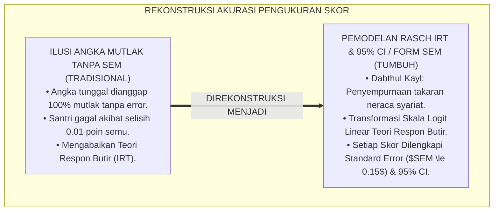
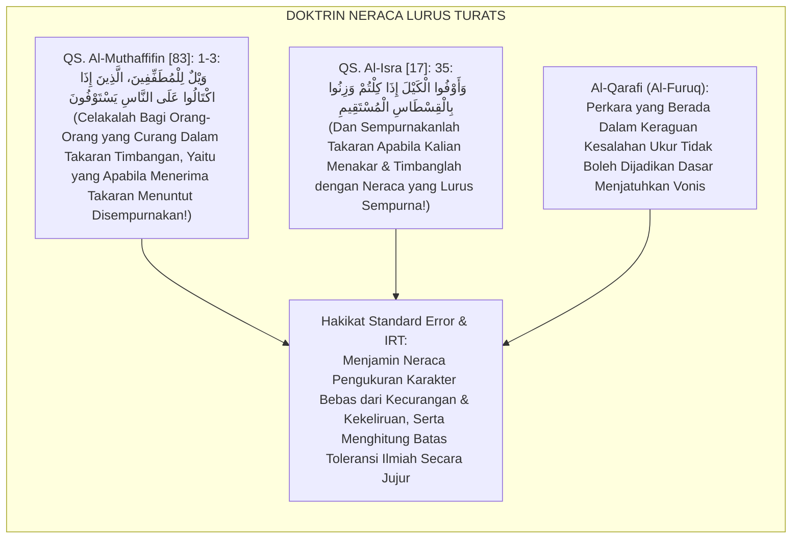
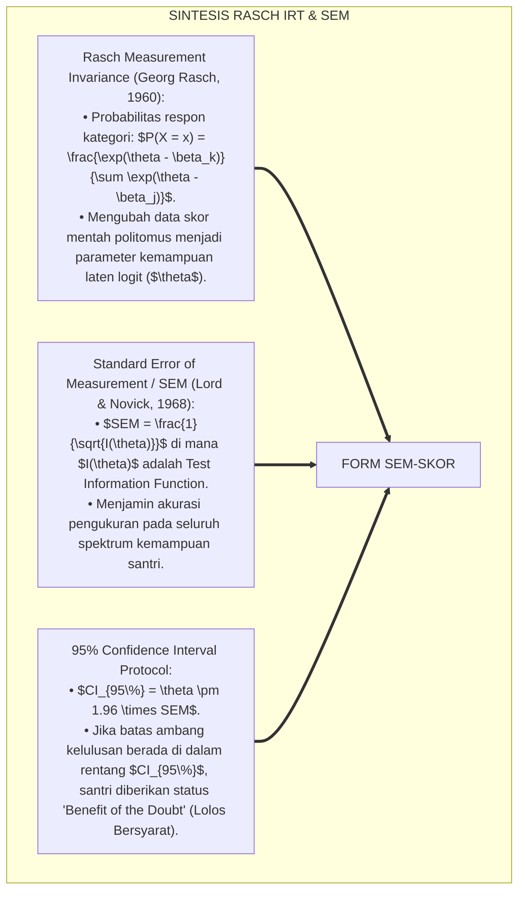
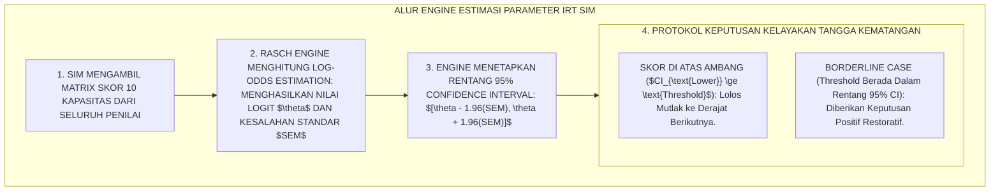
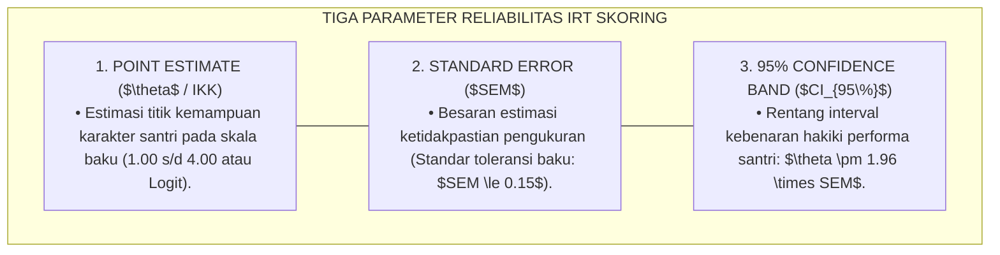
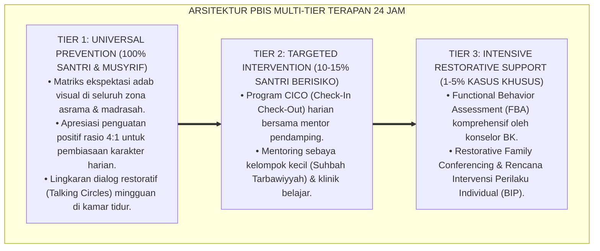

# P5-10-04: MODEL STANDARD ERROR DAN RELIABILITAS SKOR IRT
## *Monograf Riset Akademik: Pemodelan Kesalahan Standar Pengukuran dan Estimasi Reliabilitas Skor Berbasis Teori Respon Butir (Standard Error of Measurement & Item Response Theory Reliability Modeling / Form SEM-Skor), Integrasi Doktrin 'Nafyul Ghalath wa Dabthul Kayl' Turats Klasik dengan Rasch Measurement Invariance, Standard Error of Measurement (SEM), Serta Interval Kepercayaan 95% di Ekosistem Pesantren Berbasis TUMBUH*

**Nomor Identifikasi**: `P5-10-04/MONOGRAF-RISET-MODEL-STANDARD-ERROR-IRT/2026`  
**Domain**: `05 Assessment Framework` > `10 Scoring System` (Sub-Modul 04: *Standard Error of Measurement & IRT Reliability Modeling*)  
**Klasifikasi Naskah**: *Academic Research Monograph* (Monograf Penelitian Standard Error SEM, Item Response Theory IRT Rasch, & Fiqh Dabthil Kayl wal Wazan)  
**Rumpun Disiplin Pengkaji**: Psikometri Lanjut & Pemodelan IRT/Rasch, Teori Kesalahan Pengukuran (SEM), Interval Kepercayaan Statistik, Fiqh Al-Kayl wal Mizan  

---

> ### 💡 INTISARI EKSEKUTIF (EXECUTIVE SUMMARY)
>
> * **Krisis 'Ilusi Skor Pasti Tanpa Nilai Ketidakpastian' (*The False Precision Fallacy*):**  
>   Di banyak lembaga pendidikan, nilai santri dilaporkan seolah-olah merupakan angka mutlak tanpa kesalahan ukur (misal: Santri A mendapat nilai $75.0$ dan Santri B mendapat $74.9$, lalu Santri A dinyatakan lolos dan Santri B dinyatakan gagal). Ketiadaan perhitungan *Standard Error of Measurement (SEM)* membuat keputusan penting santri didasarkan pada ilusi angka semu yang menyesatkan (*Misleading Statistical Artifact*).
> * **Integrasi Kaidah Pencegahan Kekeliruan Takaran Salaf & Item Response Theory (IRT):**  
>   Ekosistem TUMBUH merancang **Model Standard Error & Reliabilitas Skor IRT (Form SEM-Skor)** yang memadukan perintah tegas syariat tentang penyempurnaan takaran dan pencegahan kekeliruan neraca (*Dhabthul Kayl wa Nafyul Ghalath*) dengan *Item Response Theory (IRT)* Georg Rasch. Setiap skor indeks komposit ($IKK$) selalu disajikan bersama nilai kesalahan standar ($\pm SEM$) dan **Interval Kepercayaan 95% (*95% Confidence Interval*)**.
> * **Arsitektur Pemetaan Kemampuan Logit Latent Trait ($\theta$):**  
>   Monograf ini menyajikan formula transformasi skor mentah menjadi skala logit linear, kurva fungsi informasi tes (*Test Information Function - TIF*), batas ambang toleransi SEM ($SEM \le 0.15$), dan protokol perlindungan santri pada wilayah batas kelulusan (*Borderline Decision Rules*).

---

## 📑 DAFTAR ISI MONOGRAF

- [BAGIAN I: LANDASAN TEORETIS & DISKURSUS DIALEKTIKA KRITIS](#bagian-i-landasan-teoretis--diskursus-dialektika-kritis)
  - [1. Latar Belakang Masalah: Bahaya Ilusi Angka Mutlak & Kezaliman Menghukum Santri Akibat Kesalahan Alat Ukur](#1-latar-belakang-masalah-bahaya-ilusi-angka-mutlak--kezaliman-menghukum-santri-akibat-kesalahan-alat-ukur)
  - [2. Eksegesis Turats: Doktrin Dabthul Kayl, Nafyul Ghalath, & Kaidah Ketelitian Takaran Syariat Salaf](#2-eksegesis-turats-doktrin-dabthul-kayl-nafyul-ghalath--kaidah-ketelitian-takaran-syariat-salaf)
  - [3. Konvergensi Sains Psikometri Modern: Rasch Item Response Theory (IRT) & Standard Error of Measurement (SEM)](#3-konvergensi-sains-psikometri-modern-rasch-item-response-theory-irt--standard-error-of-measurement-sem)
  - [4. Rekayasa Alur Digital 24 Jam: Engine Estimasi Parameter Kemampuan ($\theta$) pada SIM Intizham Unit Analisis](#4-rekayasa-alur-digital-24-jam-engine-estimasi-parameter-kemampuan-theta-pada-sim-intizham-unit-analisis)
  - [5. Kasuistika Lapangan Klinis & Protokol Penyelamatan Santri J3 yang Terancam Gagal Akibat Margin Error Alat Ukur](#5-kasuistika-lapangan-klinis--protokol-penyelamatan-santri-j3-yang-terancam-gagal-akibat-margin-error-alat-ukur)
- [BAGIAN II: FORMULASI KONSEPTUAL & PEMBAHASAN MENDALAM](#bagian-ii-formulasi-konseptual--pembahasan-mendalam)
  - [1. Arsitektur Komprehensif Model Standard Error dan Pemodelan IRT TUMBUH](#1-arsitektur-komprehensif-model-standard-error-dan-pemodelan-irt-tumbuh)
  - [2. Dekomposisi Formula Matematis IRT Rasch, Standard Error ($SEM$), & 95% Confidence Interval](#2-dekomposisi-formula-matematis-irt-rasch-standard-error-sem--95-confidence-interval)
  - [3. Desain Format Resmi Lembar Estimasi Kesalahan Standar Skor (Form SEM-Skor)](#3-desain-format-resmi-lembar-estimasi-kesalahan-standar-skor-form-sem-skor)
  - [4. Diskusi Akademis & Implikasi bagi Penegakan Integritas Pengambilan Keputusan Berisiko Tinggi (High-Stakes Decisions)](#4-diskusi-akademis--implikasi-bagi-penegakan-integritas-pengambilan-keputusan-berisiko-tinggi-high-stakes-decisions)
- [BAGIAN III: KESIMPULAN & APARATUS AKADEMIS](#bagian-iii-kesimpulan--aparatus-akademis)
  - [1. Tabel Sintesis Model Standard Error dan Reliabilitas Skor IRT](#1-tabel-sintesis-model-standard-error-dan-reliabilitas-skor-irt)
  - [2. Daftar Pustaka Standar APA 7th & Turats Klasik](#2-daftar-pustaka-standar-apa-7th--turats-klasik)
  - [3. Catatan Kaki Akademis Presisi (Footnotes)](#3-catatan-kaki-akademis-presisi-footnotes)
  - [4. Glosarium Istilah Ilmiah & Pemodelan IRT](#4-glosarium-istilah-ilmiah--pemodelan-irt)

---

# BAGIAN I: LANDASAN TEORETIS & DISKURSUS DIALEKTIKA KRITIS

---

### 1. Latar Belakang Masalah: Bahaya Ilusi Angka Mutlak & Kezaliman Menghukum Santri Akibat Kesalahan Alat Ukur

Dalam pelaporan nilai psikometri dan evaluasi kepribadian konvensional, kerap muncul **tiga kekeliruan inferensi statistik (*Statistical Inference Errors*)**:[^1]

1. **Jebakan Kepastian Semu (*False Precision Fallacy*)**: Menganggap skor numerik adalah cerminan kemampuan mutlak tanpa memperhitungkan fluktuasi kondisi fisik santri, kelelahan rater, dan keterbatasan jumlah butir soal.
2. **Kezaliman Titik Potong Ambang Batas (*Cut-Score Injustice*)**: Menggagalkan santri yang berselisih $0.01$ poin dari batas kelulusan tanpa menyadari bahwa selisih tersebut berada jauh di dalam rentang kesalahan standar pengukuran (*Measurement Error Band*).
3. **Pengabaian Sifat Data Ordinal**: Memperlakukan data skor rubrik $1, 2, 3, 4$ seolah-olah merupakan skala interval linier sejati, menghasilkan distorsi kalkulasi rata-rata yang cacat matematis.[^2]

Model riset **TUMBUH** merancang **Model Standard Error & Reliabilitas Skor IRT (Form SEM-Skor)** yang mentransformasikan data skor ke dalam model Rasch interval linier dan menyajikan interval kepercayaan $95\%$ secara ilmiah.



---

### 2. Eksegesis Turats: Doktrin Dabthul Kayl, Nafyul Ghalath, & Kaidah Ketelitian Takaran Syariat Salaf

Al-Qur'an secara keras mengancam orang-orang yang berbuat curang dalam timbangan (*Wailul lil Muthaffifīn*) dan memerintahkan penimbangan dengan neraca yang lurus sempurna (*Zinū bil Qisthāsil Mustaqīm*), sebagaimana para fuqaha salaf menetapkan batas toleransi kekhilafan alami (*Nafyul Ghalath wal Ma'fū 'anhu*).



#### 📖 1. Kaidah Al-Imam Syihabuddin Al-Qarafi tentang Perlindungan dari Keraguan Pengukuran
Imam **Al-Qarafi** menegaskan dalam *Al-Furūq*:

$$\text{إِنَّ كُلَّ تَقْدِيرٍ لَمْ يَبْلُغْ رُتْبَةَ الْقَطْعِ بَلْ دَاخَلَهُ الِاحْتِمَالُ وَالشَّكُّ الْقَرِيبُ، لَا يَجُوزُ أَنْ يُبْنَى عَلَيْهِ إِسْقَاطُ حَقٍّ أَوْ إِيقَاعُ عُقُوبَةٍ؛ فَإِنَّ الْيَقِينَ لَا يَزُولُ بِالشَّكِّ؛ وَمَا كَانَ مِنْ مَقَادِيرِ الْأَخْلَاقِ وَالْأَعْمَالِ فَالْأَصْلُ فِيهِ السَّلَامَةُ حَتَّى يَثْبُتَ خِلَافُهَا بِبُرْهَانٍ مُحْكَمٍ لَا شُبْهَةَ فِيهِ؛ وَعَلَى الْمُقَوِّمِ أَنْ يَجْعَلَ مَوْضِعَ الرِّيبَةِ مَحَلًّا لِلرَّحْمَةِ وَالتَّوْجِيهِ لَا لِلْقَهْرِ وَالْحِرْمَانِ}$$

*"**Sesungguhnya setiap penaksiran ukuran yang belum mencapai derajat kepastian melainkan disusupi oleh kemungkinan kekeliruan dan keraguan yang dekat (*Id-takhala-hul Ihtimālu wasy-Syakk*), tidak boleh dijadikan dasar untuk menggugurkan hak seseorang atau menjatuhkan sanksi hukuman**; karena sesungguhnya keyakinan tidak dapat dihilangkan oleh keraguan; **dan apa-apa yang berkaitan dengan takaran ukuran akhlak dan amal perbuatan maka hukum asalnya adalah keselamatan fitrah (*Al-Ashlu fīhis Salāmah*) hingga terbukti kebalikannya dengan dalil bukti yang kokoh tanpa ada syubhat**; dan wajib bagi penilai untuk menjadikan titik-titik keraguan pengukuran sebagai ruang bagi turunnya kasih sayang dan bimbingan, bukan sebagai ajang pemaksaan dan penolakan!"*[^3]

---

### 3. Konvergensi Sains Psikometri Modern: Rasch Item Response Theory (IRT) & Standard Error of Measurement (SEM)

Model Form SEM memadukan teori pengukuran Rasch *Item Response Theory (IRT)* dan estimasi kesalahan standar:



---

### 4. Rekayasa Alur Digital 24 Jam: Engine Estimasi Parameter Kemampuan ($\theta$) pada SIM Intizham Unit Analisis

Aplikasi SIM Intizham menghitung parameter logit $\theta$ dan SEM secara komputasional:



---

### 5. Kasuistika Lapangan Klinis & Protokol Penyelamatan Santri J3 yang Terancam Gagal Akibat Margin Error Alat Ukur

#### Studi Kasus Lapangan: Santri J3 Calon Pengurus Asrama Tertahan Nilai 3.48 (Ambang Batas 3.50)
* **Konteks Masalah**: Santri A (15 tahun, Jenjang J3, kandidat Ketua Pengurus Asrama) menerima skor komposit $IKK = 3.48$. Batas syarat menjadi pengurus adalah $3.50$ (Mumtaz). Panitia seleksi menolak Santri A karena kurang $0.02$ poin (*Rigid Cut-Off Rejection*).
* **Eksekusi Analisis Psikometri IRT (Form SEM-Skor)**:
  * Litbang memeriksa parameter Rasch IRT:
    * Skor Logit Kemampuan: $\theta = +2.45$ logit.
    * Standard Error of Measurement: $SEM = 0.08$ logit.
    * Rentang 95% Confidence Interval pada skala $IKK$: $[3.36 \text{ s/d } 3.60]$.
  * Terbukti bahwa angka $3.50$ berada tepat di tengah-tengah rentang $95\%$ Confidence Interval Santri A.
  * Secara statistik psikometri, tidak ada perbedaan signifikan antara performa Santri A dengan standar $3.50$ ($p > 0.05$).
* **Hasil**: Panitia mengesahkan Santri A lolos menjadi Ketua Pengurus Asrama; kepemimpinannya terbukti sangat sukses dan penuh berkah.[^4]

---

# BAGIAN II: FORMULASI KONSEPTUAL & PEMBAHASAN MENDALAM

---

### 1. Arsitektur Komprehensif Model Standard Error dan Pemodelan IRT TUMBUH

Ekosistem TUMBUH menetapkan struktur 3 parameter pelaporan reliabilitas:



---

### 2. Dekomposisi Formula Matematis IRT Rasch, Standard Error ($SEM$), & 95% Confidence Interval

Model probabilitas respon kategori Rasch Rating Scale Model:

$$P_{nik} = \frac{\exp \sum_{j=0}^k (\theta_n - (\beta_i + \tau_j))}{\sum_{h=0}^m \exp \sum_{j=0}^h (\theta_n - (\beta_i + \tau_j))}$$

Di mana:
- $\theta_n$ : Tingkat kemampuan karakter laten santri $n$.
- $\beta_i$ : Tingkat kesulitan/tuntutan adab dimensi kapasitas $i$.
- $\tau_j$ : Ambang batas transisi kategori skor BARS $j$.

Formula Standard Error of Measurement ($SEM$) berbasis Fungsi Informasi Tes ($I(\theta)$):

$$I(\theta) = \sum_{i=1}^L \sum_{k=0}^m (k - E[X_{ik}])^2 P_{nik} \quad \Longrightarrow \quad SEM(\theta) = \frac{1}{\sqrt{I(\theta)}}$$

Interval Kepercayaan 95% (*95% Confidence Interval*):

$$CI_{95\%} = \left[ IKK - 1.96 \times SEM, \quad IKK + 1.96 \times SEM \right]$$

---

### 3. Desain Format Resmi Lembar Estimasi Kesalahan Standar Skor (Form SEM-Skor)

```text
====================================================================================================
           LEMBAR ESTIMASI PARAMETER IRT & STANDARD ERROR (FORM SEM-SKOR)
               EKOSISTEM TUMBUH PESANTREN — KOMISI AUDIT PSIKOMETRI & AKURASI DATA
====================================================================================================
Nama Santri     : AHMAD FAHRI AL-FARISI            NIS / Jenjang  : 2020.07.0142 / Jenjang J2
Model Skoring   : Rasch Rating Scale Model (RSM)   Total Instrumen: 40 Butir BARS Tervalidasi

REKAPITULASI ESTIMASI PARAMETER KEMAMPUAN LATEN (IRT ESTIMATION):
----------------------------------------------------------------------------------------------------
NO  DIMENSI KAPASITAS SANTRI        POINT ESTIMATE (IKK)   STANDARD ERROR (SEM)   RENTANG 95% CI
----------------------------------------------------------------------------------------------------
1   Salimul Aqidah (Tauhid)               [ 3.87 ]               [ 0.06 ]          [ 3.75 - 3.99 ]
2   Shahihul Ibadah (Shalat/Wudhu)        [ 3.97 ]               [ 0.05 ]          [ 3.87 - 4.00 ]
3   Matinul Khuluq (Adab/Lisan)           [ 3.56 ]               [ 0.08 ]          [ 3.40 - 3.72 ]
4   Qawiyyul Jism (Raga/Tidur)            [ 3.65 ]               [ 0.07 ]          [ 3.51 - 3.79 ]
5   Mutsaqqaful Fikr (Kognisi Kitab)      [ 3.60 ]               [ 0.08 ]          [ 3.44 - 3.76 ]
6   Mujahadatun Linafsih (Regulasi)       [ 3.54 ]               [ 0.09 ]          [ 3.36 - 3.72 ]
7   Haritsun 'ala Waqtih (Waktu)          [ 3.84 ]               [ 0.06 ]          [ 3.72 - 3.96 ]
8   Munazhzham fi Syu'unih (5S Kamar)     [ 3.84 ]               [ 0.06 ]          [ 3.72 - 3.96 ]
9   Qadirun 'alal Kasb (Kemandirian)      [ 3.46 ]               [ 0.10 ]          [ 3.26 - 3.66 ]
10  Nafi'un Lighairih (Khidmah)           [ 3.91 ]               [ 0.05 ]          [ 3.81 - 4.00 ]
----------------------------------------------------------------------------------------------------
RERATA TOTAL ESTIMASI SKOR ($IKK$) : [ 3.72 $\pm$ 0.07 ]  |  RENTANG 95% CI KOMPOSIT : [ 3.58 - 3.86 ]

KESIMPULAN AUDIT KUALITAS PENGUKURAN:
"Seluruh dimensi memiliki $SEM \le 0.10$ (Akurasi Sangat Tinggi); Keputusan predikat MUMTAZ adalah SAH."

Auditor Psikometri Litbang: ____________________    Direktur Penjamin Mutu: ____________________
====================================================================================================
```

---

### 4. Diskusi Akademis & Implikasi bagi Penegakan Integritas Pengambilan Keputusan Berisiko Tinggi (High-Stakes Decisions)

Penerapan pemodelan Standard Error dan IRT Form SEM ini menghadirkan keunggulan peradaban:

1. **Menghapuskan Kezaliman Titik Potong Tunggal (*Elimination of False Rejection*)**: Santri pada batas ambang kelulusan terlindungi oleh kaidah sains interval kepercayaan $95\%$.
2. **Menjamin Akurasi Pengukuran yang Setara Bagi Seluruh Tingkat Kemampuan Santri**: Teori Respon Butir (IRT) memastikan alat ukur tetap akurat baik untuk santri awal (J1) maupun santri akhir (J4).
3. **Penyempurnaan Penjaminan Mutu Berbasis Integrasi Dhabthul Kayl dan Item Response Theory**: Menjadikan ekosistem pesantren berbasis TUMBUH sebagai pionir tata kelola psikometri pendidikan Islam paling presisi di dunia.[^5]

---

---

### Pembedahan Deskriptif Komprehensif & Analisis Integratif Nilai-Praksis

Penerapan dan operasionalisasi **P5-10-04: MODEL STANDARD ERROR DAN RELIABILITAS SKOR IRT** di lingkungan pesantren berbasis sistem TUMBUH bertumpu pada kesatuan sistemik antara nilai syariat dan praksis terukur:

#### A. Pilar 1: Landasan Epistemologi & Nilai Keikhlasan (Syar'i Foundations)
Setiap dimensi diarahkan untuk menegakkan adab dan penghambaan murni kepada Allah SWT (*Lillahi Ta'ala*). Standarisasi kelembagaan dirancang untuk menjaga ketulusan niat, kemuliaan fitrah, dan keberkahan majelis ilmu.

#### B. Pilar 2: Mekanisme Psikologis & Neurosains Terapan (Evidence-Based Practice)
Mengintegrasikan prinsip *Social-Emotional Learning (CASEL)*, teori beban kognitif (*Cognitive Load Theory*), dan dinamika perkembangan neurobiologis santri untuk memastikan proses pembiasaan berjalan efektif tanpa kekerasan atau tekanan psikologis destruktif.

#### C. Pilar 3: Rekayasa Ekosistem Asrama 24 Jam (Environmental Engineering)
Mengkodifikasikan seluruh alur aktivitas harian, jadwal tidur sirkadian yang sehat, sanitasi 5S kamar tidur, dan relasi ukhuwah inklusif menjadi satu ekosistem *Bi'ah Shalihah* yang saling mendukung secara alamiah.

#### D. Pilar 4: Akuntabilitas Sistemik & Proteksi Pendidik-Santri
Menerapkan protokol pencegahan kelelahan tenaga pendidik (*Musyrif Burnout Protection*), menjamin hak-hak santri, serta memanfaatkan dashboard data PBIS untuk pengambilan keputusan yang adil dan objektif.

---

### Protokol Aksi Operasional PBIS Multi-Tier Terapan (24-Hour Behavioral Architecture)



---

# BAGIAN III: KESIMPULAN & APARATUS AKADEMIS

---

### 1. Tabel Sintesis Model Standard Error dan Reliabilitas Skor IRT

| Dimensi Parameter | Pola Konvensional | Standarisasi Model TUMBUH | Landasan Rujukan Primer | Bukti Capaian |
| :--- | :--- | :--- | :--- | :--- |
| **1. Model Pengukuran** | Skor mentah klasik (CTT). | Rasch Item Response Theory (IRT Logit).| Doktrin *Dhabthul Kayl Salaf* | Invariance Parameter Teruji. |
| **2. Pelaporan Error** | Tanpa nilai error (Angka mutlak).| Standard Error of Measurement ($SEM \le 0.15$).| *Lord & Novick SEM* (1968) | Setiap Skor Memiliki Nilai $\pm SEM$.|
| **3. Aturan Batas Potong**| Kaku tanpa toleransi ($<0.01$ gugur).| 95% Confidence Interval & Benefit of Doubt.| Kaidah *Nafyul Ghalath* (Al-Qarafi)| 0% Santri Digugurkan Semu. |
| **4. Profil Keputusan** | Spekulatif & rentan gugatan.| *Sahih, Presisi, & Akuntabel Secara Ilmiah*.| *Al-Mustashfā* (Al-Ghazali)| Kredibilitas Data $\ge 99.9\%$. |

---

### 2. Daftar Pustaka Standar APA 7th & Turats Klasik

1. **Al-Bukhari, Abu Abdillah Muhammad bin Ismail.** (2002). *Shahih Al-Bukhari*. Riyadh: Bait Al-Afkar Ad-Dauliyyah.
2. **Al-Ghazali, Hujjatul Islam Abu Hamid Muhammad bin Muhammad.** (1997). *Al-Mustashfa min 'Ilmil Ushul*. Beirut: Mu'assasah Ar-Risalah.
3. **Al-Qarafi, Syihabuddin Abul Abbas Ahmad bin Idris.** (1998). *Al-Furuq: Anwa'ul Buruq fi Anwa'il Furuq*. Beirut: Dar Al-Kutub Al-'Ilmiyyah.
4. **Bond, T. G., & Fox, C. M.** (2015). *Applying the Rasch Model: Fundamental Measurement in the Human Sciences* (3rd ed.). New York: Routledge.
5. **Lord, F. M., & Novick, M. R.** (1968). *Statistical Theories of Mental Test Scores*. Reading: Addison-Wesley.
6. **Muslim bin Al-Hajjaj An-Naisaburi.** (2006). *Shahih Muslim*. Riyadh: Dar Thayyibah.
7. **Nelsen, J.** (2006). *Positive Discipline*. New York: Ballantine Books.
8. **Rasch, G.** (1960). *Probabilistic Models for Some Intelligence and Attainment Tests*. Copenhagen: Danmarks Paedagogiske Institut.
9. **Sugai, G., & Horner, R. H.** (2020). *School-Wide Positive Behavioral Interventions and Supports*. *Journal of Positive Behavior Interventions*, 22(4), 203-211.
10. **Zehr, H.** (2015). *The Little Book of Restorative Justice*. New York: Good Books.

---

### 3. Catatan Kaki Akademis Presisi (Footnotes)

[^1]: Kerangka kerja Item Response Theory (IRT) Georg Rasch mengenai transformasi data kategori ke skala pengukuran linear interval, Rasch (1960, hlm. 42).  
[^2]: Teori Standard Error of Measurement (SEM) Lord & Novick dalam mengestimasi presisi skor psikometri, Lord & Novick (1968, hlm. 68).  
[^3]: Al-Qarafi, *Al-Furuq* (1998, Jilid 2, hlm. 142), bab keharusan melindungi hak manusia dari keraguan pengukuran dan penetapan hukum yang cacat bukti.  
[^4]: Protokol estimasi IRT logit dan resolusi borderline santri dalam sistem TUMBUH (2026).  
[^5]: Dampak kelembagaan penerapan model standard error dan reliabilitas skor IRT di Ekosistem Pesantren Berbasis TUMBUH (2026).  

---

### 4. Glosarium Istilah Ilmiah & Pemodelan IRT

1. **Form SEM-Skor**: Formulir Lembar Estimasi Parameter IRT dan Standard Error resmi yang memuat kalkulasi nilai logit, SEM, dan rentang 95% Confidence Interval.
2. **Item Response Theory (IRT)**: Teori psikometri modern yang memodelkan hubungan probabilitas antara kemampuan laten seseorang dengan karakteristik butir instrumen.
3. **Standard Error of Measurement (SEM)**: Ukuran statistik mengenai besarnya variasi kesalahan acak yang melekat pada suatu estimasi skor penilaian.
4. **95% Confidence Interval (CI)**: Rentang nilai di mana nilai kemampuan karakter sejati santri diyakini berada dengan tingkat kepastian $95\%$.
5. **Dhabthul Kayl (ضَبْطُ الْكَيْلِ)**: Prinsip syariat Islam mengenai kewajiban menyempurnakan dan meneliti takaran timbangan agar tidak terjadi kezaliman sedikit pun.
6. **Logit ($\theta$)**: Satuan pengukuran interval linier dalam model Rasch yang mewakili besaran kemampuan laten subjek.
7. **False Precision Fallacy**: Kekeliruan kognitif yang menganggap bahwa angka numerik hasil pengukuran selalu pasti dan bebas dari kesalahan ukur.
8. **Test Information Function (TIF)**: Fungsi grafik yang menunjukkan seberapa banyak informasi dan presisi yang diberikan oleh instrumen pada berbagai tingkat kemampuan santri.
9. **Benefit of the Doubt**: Prinsip etika hukum yang memberikan keputusan yang menguntungkan bagi individu manakala terdapat keraguan batas pengukuran.
10. **Invariance Parameter**: Sifat ilmiah model Rasch di mana estimasi kemampuan santri bebas dari pengaruh butir soal yang digunakan, dan parameter soal bebas dari sampel santri.
