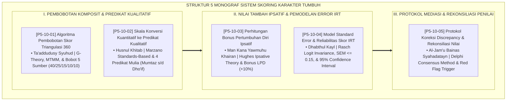

# P5-10: DOKUMEN INDUK SISTEM PEMBOBOTAN DAN FORMULASI SKOR
## *Arsitektur dan Rekayasa Sistem Skoring Komposit Karakter 360 Derajat (Algoritma Pembobotan Triangulasi Form MAT, Skala Konversi Predikat Form SKP, Perhitungan Bonus Progresi Ipsatif Form BPI, Pemodelan Standard Error & IRT Form SEM, Serta Protokol Koreksi Diskrepansi & Rekonsiliasi Nilai Form PDR) di Ekosistem TUMBUH Pesantren*

**Nomor Identifikasi**: `P5-10/DOKUMEN-INDUK-SISTEM-PEMBOBOTAN-SKOR/2026`  
**Domain**: `05 Assessment Framework` > `10 Scoring System` (Gugus Sub-Domain 10: *Comprehensive 360-Degree Scoring Systems, Ipsative Progression, & IRT Error Modeling*)  
**Klasifikasi Naskah**: *Master Architecture & Navigation Monograph* (Dokumen Induk Peta Jalan Riset & Navigasi 5 Monograf Ilmiah Sistem Skoring dan Formulasi Nilai Karakter)  
**Rumpun Disiplin Pengkaji**: Psikometri Komputasional, Generalizability Theory (G-Theory), Rasch IRT Modeling, Value-Added Scoring, Fiqh Al-Mizan wal 'Adl  

---

> ### 💡 INTISARI EKSEKUTIF (EXECUTIVE SUMMARY)
>
> * **Kedudukan Strategis Gugus Sistem Pembobotan dan Formulasi Skor:**  
>   Gugus *Scoring System (Sistem Pembobotan dan Formulasi Skor)* merupakan mesin komputasi keadilan (*Computational Engine of Fairness & Equity*) dalam ekosistem TUMBUH. Gugus ini menghancurkan tirani penilaian tunggal otoriter, menghitung bobot multi-rater 5 sumber (Musyrif 40%, Guru 25%, Diri 15%, Sebaya 10%, Portofolio 10%), mengonversi angka numerik ke dalam predikat bahasa Arab yang memuliakan (*Mumtaz, Jayyid, Maqbul, Dho'if*), merekompensasi laju hijrah adab melalui bonus ipsatif, menyajikan *Standard Error of Measurement (SEM)*, serta memediasi diskrepansi antar-penilai.
> * **Integrasi Holistik Turats & Konsensus Sains Psikometri Komputasional:**  
>   Gugus riset ini memadukan khazanah agung Islam tentang timbangan keadilan (*Mīzānul 'Adl*), persaksian majemuk (*Ta'addudusy Syuhūd*), tutur kata mulia (*Husnul Khitāb*), hari ini lebih baik dari kemarin (*Man Kāna Yawmuhu Khairan*), penyempurnaan takaran (*Dhabthul Kayl*), dan pengompromian dalil (*Al-Jam'u Bainas Syahādātayn*) dengan konsensus sains psikometri dunia (*Cronbach G-Theory, Marzano Standards-Based, Hughes Ipsative, Rasch IRT SEM, dan Delphi Consensus*).
> * **Struktur Lengkap 5 Berkas Monograf Riset Ilmiah:**  
>   Dokumen induk ini memetakan dan menghubungkan 5 berkas monograf penelitian akademik komprehensif (~140 KB total riset) yang menyajikan formula aljabar matriks bobot, tabel ambang batas predikat, kalkulasi nilai tambah ipsatif, pemodelan interval kepercayaan 95%, dan berita acara rekonsiliasi diskrepansi.

---

## 📑 PETA NAVIGASI LIMA MONOGRAF RISET SISTEM SKORING KARAKTER

Berikut adalah daftar lengkap 5 monograf riset akademik dalam gugus **`10 Scoring System`**:

---

## 📚 DESKRIPSI RINGKAS 5 BERKAS MONOGRAF

1. **[P5-10-01: Algoritma Pembobotan Skor Triangulasi 360 Derajat](file:///c:/xampp/htdocs/tumbuh/05%20Assessment%20Framework/10%20Scoring%20System/P5-10-01-Algoritma-Pembobotan-Skor-Triangulasi-360.md)**  
   *Membahas formulasi matematis pembobotan komposit 5 sumber (Musyrif 40%, Guru 25%, Self 15%, Peer 10%, Porto 10%), doktrin Ta'addudusy Syuhud, G-Theory, MTMM, dan formulir Form MAT-Triangulasi.*
2. **[P5-10-02: Skala Konversi Kuantitatif ke Predikat Kualitatif](file:///c:/xampp/htdocs/tumbuh/05%20Assessment%20Framework/10%20Scoring%20System/P5-10-02-Skala-Konversi-Kuantitatif-ke-Predikat-Kualitatif.md)**  
   *Membahas standarisasi 4 predikat bahasa Arab bermakna agung (Mumtaz, Jayyid, Maqbul, Dho'if), doktrin Husnul Khitab, Standards-Based Grading Robert Marzano, dan tabel Form SKP-Predikat.*
3. **[P5-10-03: Perhitungan Bonus Pertumbuhan Diri Ipsatif](file:///c:/xampp/htdocs/tumbuh/05%20Assessment%20Framework/10%20Scoring%20System/P5-10-03-Perhitungan-Bonus-Pertumbuhan-Diri-Ipsatif.md)**  
   *Membahas algoritma laju pertumbuhan diri (LPD) dan pemberian bonus nilai tambah (+10% BPI), doktrin Man Kana Yawmuhu Khairan, Ipsative Assessment Gwyneth Hughes, dan form Form BPI-Ipsatif.*
4. **[P5-10-04: Model Standard Error dan Reliabilitas Skor IRT](file:///c:/xampp/htdocs/tumbuh/05%20Assessment%20Framework/10%20Scoring%20System/P5-10-04-Model-Standard-Error-dan-Reliabilitas-Skor-IRT.md)**  
   *Membahas pemodelan Teori Respon Butir (IRT) Rasch logit, Standard Error of Measurement (SEM <= 0.15), 95% Confidence Interval, doktrin Dhabthul Kayl salaf, dan lembar Form SEM-Skor.*
5. **[P5-10-05: Protokol Koreksi Discrepancy dan Rekonsiliasi Nilai](file:///c:/xampp/htdocs/tumbuh/05%20Assessment%20Framework/10%20Scoring%20System/P5-10-05-Protokol-Koreksi-Discrepancy-dan-Rekonsiliasi-Nilai.md)**  
   *Membahas deteksi otomatis red alert diskrepansi (Delta >= 1.50), sidang pleno klarifikasi bukti 15 menit bersama BK, doktrin Al-Jam'u Bainasy Syahadatayn, Delphi Method, dan berita acara Form PDR-Rekonsiliasi.*

---

## 🎯 STANDAR PENJAMINAN MUTU SISTEM SKORING KARAKTER

Penerapan gugus **Sistem Pembobotan dan Formulasi Skor (Scoring System)** menjamin bahwa:
1. **Terwujudnya Neraca Keadilan Matematis Mutlak (*Mathematical & Moral Fairness*)**: Nilai akhir santri bersih dari pengaruh prasangka personal penilai tunggal dan merefleksikan karakter nyata 24 jam.
2. **Pengakuan Tertinggi Atas Proses Perjuangan dan Hijrah Santri (*Value-Added Growth Culture*)**: Santri yang bersungguh-sungguh berbenah diri diakui dan diapresiasi melalui sistem bonus ipsatif.
3. **Integritas dan Presisi Keputusan Pendidikan (*Psychometric Rigor & Precision*)**: Seluruh keputusan kelulusan dan kaderisasi didasarkan pada Teori Respon Butir (IRT) dan interval kepercayaan $95\%$.
