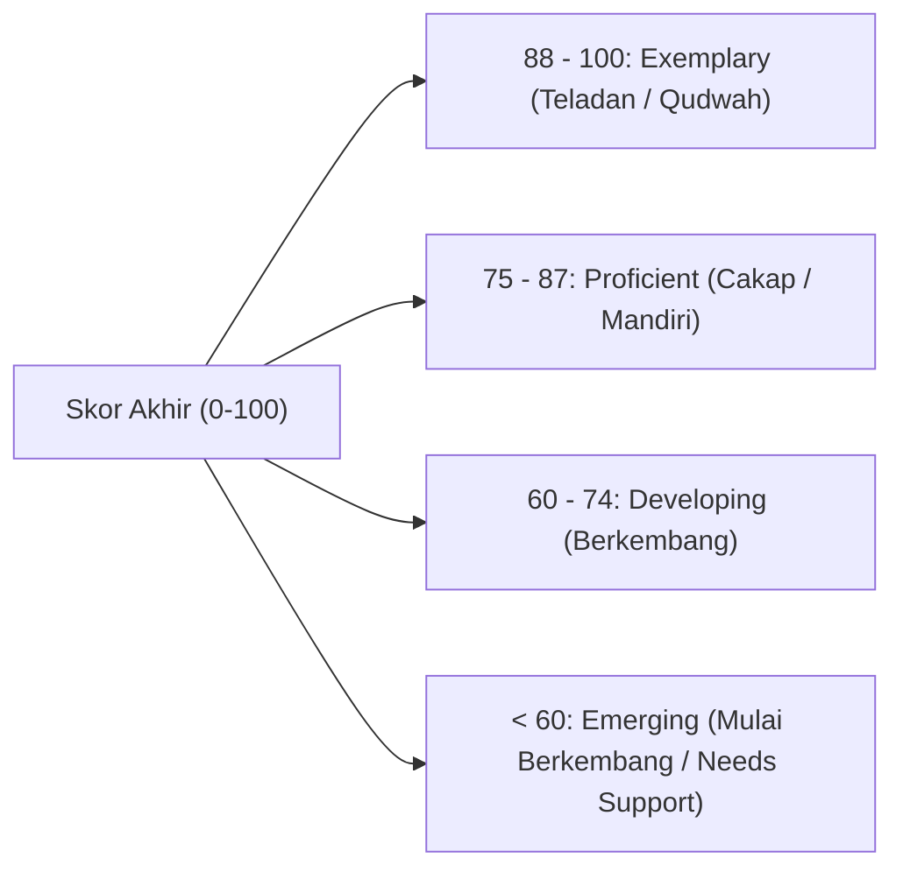

# P5-10: Sistem Pembobotan dan Formulasi Skor Triangulasi

## Status Dokumen
* **Status**: 🌟 **A+ (Tervalidasi & Siap Diimplementasikan)**
* **Sub-Domain**: `05 Assessment Framework / 10 Scoring System`
* **Penanggung Jawab Keilmuan**: Dewan Keilmuan TUMBUH (*Pakar Metodologi Riset & Pakar Arsitektur Digital Pesantren*)

---

## 1. Formulasi Matematis Skor Triangulasi 360-Derajat

Skor Akhir Adab & Karakter Santri ($S_{\text{TUMBUH}}$) dihitung menggunakan algoritma pembobotan multi-sumber:

$$S_{\text{TUMBUH}} = (0.40 \times S_{\text{Musyrif}}) + (0.30 \times S_{\text{Guru}}) + (0.15 \times S_{\text{Self}}) + (0.15 \times S_{\text{Peer}})$$

Di mana:
- $S_{\text{Musyrif}}$: Skor agregat observasi logbook asrama (skala 0–100).
- $S_{\text{Guru}}$: Skor agregat adab thalabul 'ilmi & hafalan kelas (skala 0–100).
- $S_{\text{Self}}$: Skor refleksi & kejujuran mutabaah mandiri (skala 0–100).
- $S_{\text{Peer}}$: Skor agregat survei ukhuwah & qudwah sebaya (skala 0–100).

---

## 2. Konversi Skala Kuantitatif ke Predikat Kualitatif

---

## 3. Penyesuaian Skor Berdasar Laju Pertumbuhan Diri (Ipsative Growth Bonus)

Untuk menghargai usaha perbaikan diri (*Growth Mindset*), santri yang berhasil meningkatkan skornya dibanding periode sebelumnya menerima **Bonus Pertumbuhan Diri ($B_{\text{Growth}}$)** sebesar +3 poin predikat, memastikan bahwa progres perkembangan individu selalu diakui.
