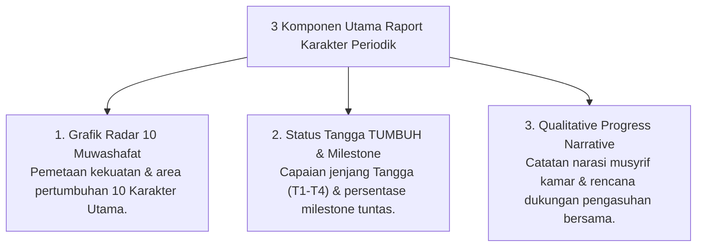

# P5-11-01: Spesifikasi Raport Karakter Periodik PBIS

## Status Dokumen
* **Status**: 🌟 **A+ (Tervalidasi & Siap Diimplementasikan)**
* **Sub-Domain**: `05 Assessment Framework / 11 Reporting`
* **Penanggung Jawab Keilmuan**: Dewan Keilmuan TUMBUH (*Pakar Arsitektur Digital Pesantren & Pakar Desain Kurikulum Adab*)

---

## 1. Spesifikasi Tampilan & Lay-Out Raport Karakter

Raport Karakter Periodik diterbitkan setiap akhir semester yang menyajikan visualisasi grafis dan deskripsi naratif pertumbuhan santri:

---

## 2. Fitur Rekomendasi Pembiasaan Rumah

Raport menyertakan panduan bagi orang tua mengenai aktivitas pembiasaan adab dan ibadah yang direkomendasikan saat santri berada di rumah selama masa liburan.
