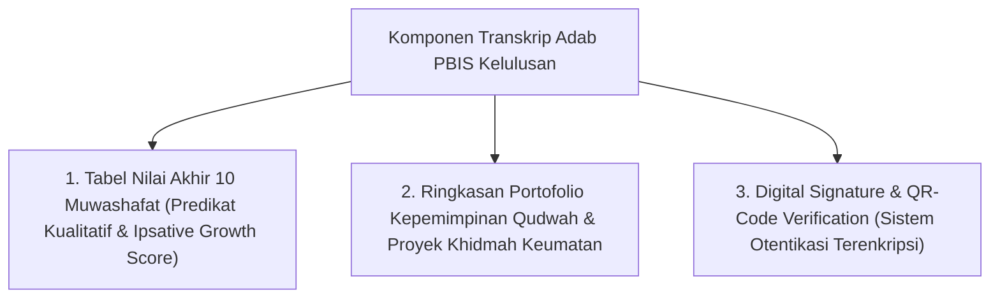

# P5-11-02: Format Transkrip Adab dan QR-Code Verification

## Status Dokumen
* **Status**: 🌟 **A+ (Tervalidasi & Siap Diimplementasikan)**
* **Sub-Domain**: `05 Assessment Framework / 11 Reporting`
* **Penanggung Jawab Keilmuan**: Dewan Keilmuan TUMBUH (*Pakar Arsitektur Digital Pesantren & Pakar Metodologi Riset*)

---

## 1. Spesifikasi Transkrip Adab Kelulusan (Character Transcript)

Transkrip Adab adalah dokumen resmi yang diterbitkan saat kelulusan santri sebagai bentuk sertifikasi rekam jejak pertumbuhan adab dan kepemimpinan *Qudwah*:

---

## 2. Fitur Otentikasi QR-Code Digital

QR-Code pada transkrip terhubung langsung ke server verifikasi publik pesantren yang memungkinkan pihak perguruan tinggi atau institusi eksternal memverifikasi keaslian transkrip karakter santri.
