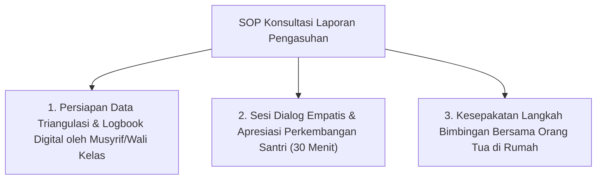

# P5-11-03: SOP Komunikasi Laporan Perkembangan Orang Tua

## Status Dokumen
* **Status**: 🌟 **A+ (Tervalidasi & Siap Diimplementasikan)**
* **Sub-Domain**: `05 Assessment Framework / 11 Reporting`
* **Penanggung Jawab Keilmuan**: Dewan Keilmuan TUMBUH (*Pakar Bimbingan Konseling & Pakar Pengasuhan Asrama*)

---

## 1. SOP Konsultasi Pengasuhan Berkala

Laporan perkembangan santri disampaikan kepada orang tua melalui **Sesi Dialog Pengasuhan Dua Arah (Parent-Teacher-Musyrif Conference)**:

---

## 2. Saluran Komunikasi Digital Orang Tua

- **Parent Portal App**: Orang tua dapat melihat pembaruan mingguan pencapaian hafalan Al-Qur'an dan catatan kebaikan harian anak secara aman.
