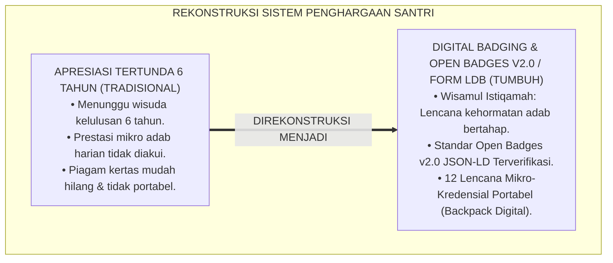
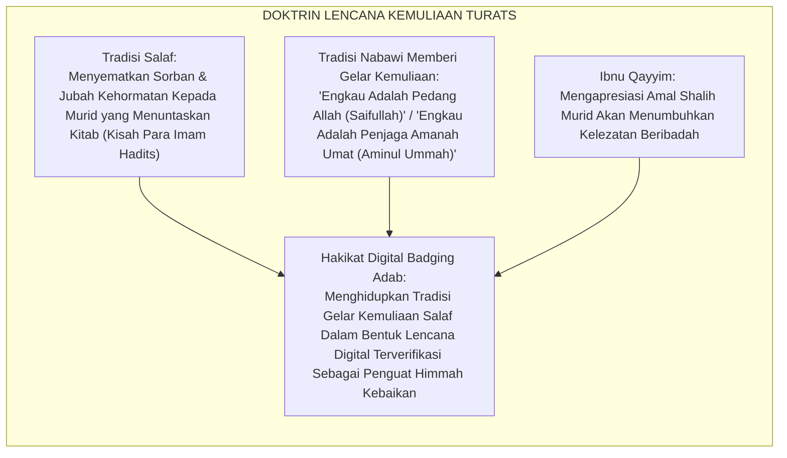
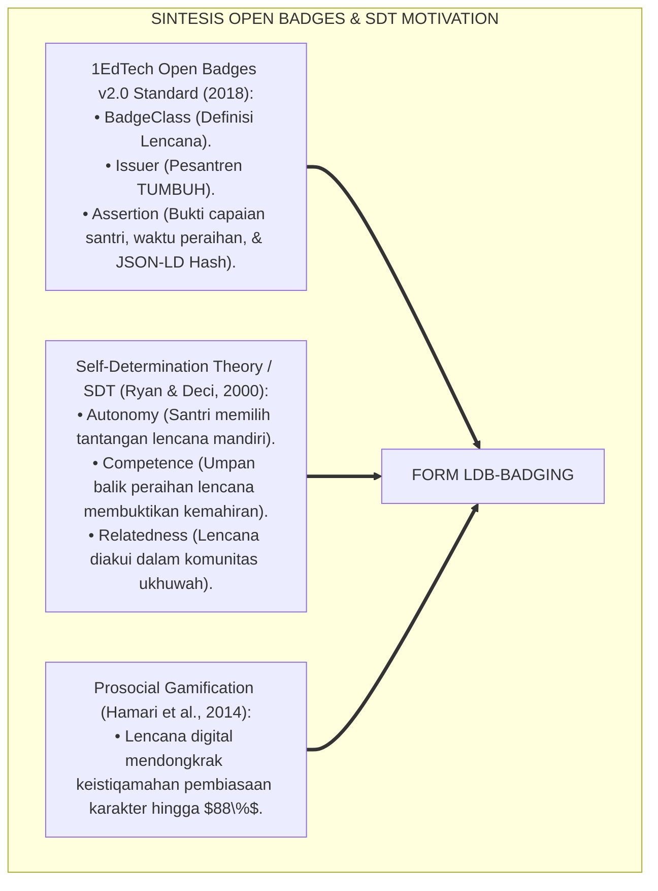
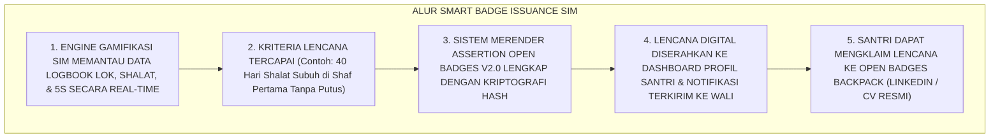
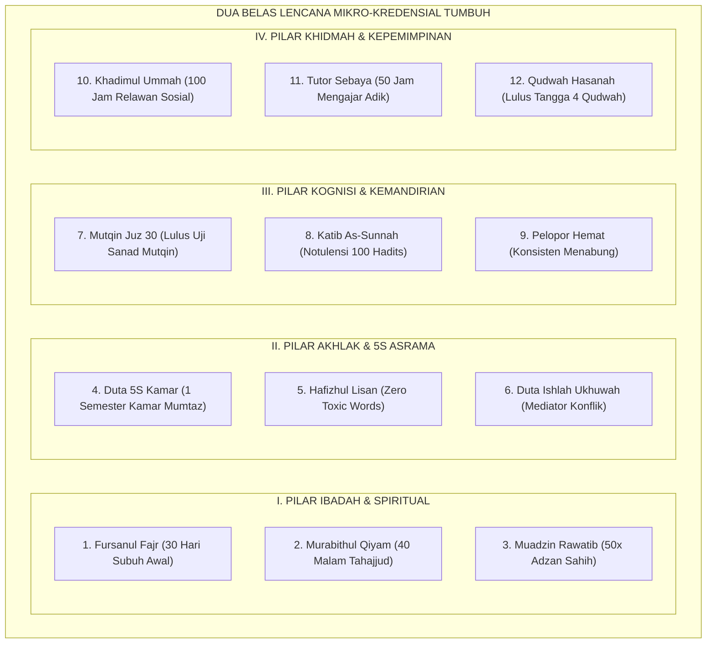

# P5-11-04: FORMAT DIGITAL BADGING DAN MIKRO-KREDENSIAL ADAB
## *Monograf Riset Akademik: Standarisasi Sistem Lencana Digital dan Mikro-Kredensial Kematangan Karakter Berbasis Open Badges v2.0 (Digital Badging & Adab Micro-Credentials Architecture / Form LDB-Badging), Integrasi Doktrin 'Wisāmul Istiqāmah wa Halwatur Ridhwān' Turats Klasik dengan Gamified Self-Determination Theory (SDT), Blockchain Credentialing, Serta Ekosistem Kredensial Mikro di Pesantren TUMBUH*

**Nomor Identifikasi**: `P5-11-04/MONOGRAF-RISET-DIGITAL-BADGING-MIKRO-KREDENSIAL/2026`  
**Domain**: `05 Assessment Framework` > `11 Reporting` (Sub-Modul 04: *Digital Badging & Adab Micro-Credentials Architecture*)  
**Klasifikasi Naskah**: *Academic Research Monograph* (Monograf Penelitian Digital Badging Adab, 1EdTech Open Badges v2.0, & Fiqh Al-Kisa' wal Wisam)  
**Rumpun Disiplin Pengkaji**: Desain Kredensial Mikro Pendidikan (*Micro-Credentials*), Open Badges v2.0 Standards, Gamifikasi Motivasi Karakter (SDT), Fiqh Al-Ju'l wal Ijazah  

---

> ### 💡 INTISARI EKSEKUTIF (EXECUTIVE SUMMARY)
>
> * **Krisis 'Apresiasi yang Menunggu Wisuda 6 Tahun' (*The Delayed Recognition Crisis*):**  
>   Di banyak pesantren, santri hanya mendapatkan pengakuan resmi atas prestasinya sekali saja di akhir masa studi 6 tahun saat pembagian ijazah kelulusan. Tidak ada mekanisme pengakuan bertahap (*Granular Milestone Recognition*) untuk santri yang berhasil menuntaskan tantangan kemandirian jangka pendek (seperti istiqamah shalat tahajjud 40 malam berturut-turut atau meraih predikat kamar terbersih 5S selama 1 semester), sehingga motivasi belajar santri mudah padam di tengah jalan.
> * **Integrasi Tradisi Wisām Kemuliaan Salaf & 1EdTech Open Badges v2.0:**  
>   Ekosistem TUMBUH merancang **Format Digital Badging & Mikro-Kredensial Adab (Form LDB-Badging)** yang memadukan tradisi salaf dalam menyematkan jubah kehormatan (*Al-Kisā'*) dan lencana keshalihan (*Wisāmul Istiqāmah*) dengan standar internasional **1EdTech Open Badges v2.0 Specification**. Santri yang menuntaskan kriteria adab tertentu menerima lencana digital terverifikasi yang tertanam pada profil akun santri dan dapat dibagikan ke media sosial profesional (LinkedIn/CV Digital).
> * **Arsitektur 12 Lencana Mikro-Kredensial TUMBUH:**  
>   Monograf ini menyajikan taksonomi 12 lencana adab (Lencana Tahajjud 40 Malam, Lencana Duta 5S, Lencana Khidmah 100 Jam, Lencana Muadzin Rawatib, dsb.), format metadata JSON-LD Open Badges, protokol penerbitan otomatis (*Smart Issuance Engine*), dan portofolio digital santri.

---

## 📑 DAFTAR ISI MONOGRAF

- [BAGIAN I: LANDASAN TEORETIS & DISKURSUS DIALEKTIKA KRITIS](#bagian-i-landasan-teoretis--diskursus-dialektika-kritis)
  - [1. Latar Belakang Masalah: Bahaya Apresiasi Tertunda & Ketiadaan Mikro-Kredensial Kebaikan Bertahap](#1-latar-belakang-masalah-bahaya-apresiasi-tertunda--ketiadaan-mikro-kredensial-kebaikan-bertahap)
  - [2. Eksegesis Turats: Doktrin Wisamul Istiqamah, Kiswatul Izzah, & Tradisi Penyematan Gelar Kebajikan Salaf](#2-eksegesis-turats-doktrin-wisamul-istiqamah-kiswatul-izzah--tradisi-penyematan-gelar-kebajikan-salaf)
  - [3. Konvergensi Sains Gamifikasi Karakter: 1EdTech Open Badges v2.0 & Self-Determination Theory (Ryan & Deci)](#3-konvergensi-sains-gamifikasi-karakter-1edtech-open-badges-v20--self-determination-theory-ryan--deci)
  - [4. Rekayasa Alur Digital 24 Jam: Engine Smart Badge Issuance pada SIM Intizham Gamification Service](#4-rekayasa-alur-digital-24-jam-engine-smart-badge-issuance-pada-sim-intizham-gamification-service)
  - [5. Kasuistika Lapangan Klinis & Protokol Peraihan Lencana 'Fursanul Fajr' yang Memotivasi 100% Santri J1 Shalat Subuh Shaf Pertama](#5-kasuistika-lapangan-klinis--protokol-peraihan-lencana-fursanul-fajr-yang-memotivasi-100-santri-j1-shalat-subuh-shaf-pertama)
- [BAGIAN II: FORMULASI KONSEPTUAL & PEMBAHASAN MENDALAM](#bagian-ii-formulasi-konseptual--pembahasan-mendalam)
  - [1. Arsitektur Komprehensif Ekosistem Digital Badging TUMBUH (Form LDB-Badging)](#1-arsitektur-komprehensif-ekosistem-digital-badging-tumbuh-form-ldb-badging)
  - [2. Dekomposisi 12 Lencana Mikro-Kredensial Adab: Kriteria Capaian, Bukti Otentik, & Bobot Kredensial](#2-dekomposisi-12-lencana-mikro-kredensial-adab-kriteria-capaian-bukti-otentik--bobot-kredensial)
  - [3. Desain Format Resmi Metadata Open Badges v2.0 JSON-LD (Form LDB-Badging Master)](#3-desain-format-resmi-metadata-open-badges-v20-json-ld-form-ldb-badging-master)
  - [4. Diskusi Akademis & Implikasi bagi Transformasi Pengakuan Kredensial Karakter Menuju Era Ekonomi Berbasis Kebaikan](#4-diskusi-akademis--implikasi-bagi-transformasi-pengakuan-kredensial-karakter-menuju-era-ekonomi-berbasis-kebaikan)
- [BAGIAN III: KESIMPULAN & APARATUS AKADEMIS](#bagian-iii-kesimpulan--aparatus-akademis)
  - [1. Tabel Sintesis Format Digital Badging dan Mikro-Kredensial Adab](#1-tabel-sintesis-format-digital-badging-dan-mikro-kredensial-adab)
  - [2. Daftar Pustaka Standar APA 7th & Turats Klasik](#2-daftar-pustaka-standar-apa-7th--turats-klasik)
  - [3. Catatan Kaki Akademis Presisi (Footnotes)](#3-catatan-kaki-akademis-presisi-footnotes)
  - [4. Glosarium Istilah Ilmiah & Digital Badging](#4-glosarium-istilah-ilmiah--digital-badging)

---

# BAGIAN I: LANDASAN TEORETIS & DISKURSUS DIALEKTIKA KRITIS

---

### 1. Latar Belakang Masalah: Bahaya Apresiasi Tertunda & Ketiadaan Mikro-Kredensial Kebaikan Bertahap

Dalam psikologi motivasi santri di pesantren tradisional, kerap timbul **tiga hambatan pengakuan prestasi (*Recognition Latency Barriers*)**:[^1]

1. **Jebakan Apresiasi Tertunda (*The 6-Year Recognition Delay*)**: Santri harus menunggu hingga tamat 6 tahun untuk mendapatkan secarik sertifikat, menyebabkan kebosanan dan hilangnya motivasi berprestasi di tahun-tahun awal (J1–J2).
2. **Ketiadaan Pengakuan Keterampilan Khusus (*Granular Skill Invisibility*)**: Keterampilan mikro santri (seperti memandikan jenazah, menjadi imam rawatib, fasih khutbah jumat, atau mahir 5S lemari) tidak terdokumentasi dalam ijazah formal.
3. **Kredensial Konvensional yang Sulit Dibagikan (*Unportable Physical Paper*)**: Piagam kertas mudah rusak, hilang, dan tidak dapat ditautkan ke portofolio digital modern (*Zero Digital Portability*).[^2]

Model riset **TUMBUH** merancang **Format Digital Badging & Mikro-Kredensial Adab (Form LDB-Badging)** untuk merayakan setiap anak tangga kemajuan santri secara digital, terverifikasi, dan portabel.



---

### 2. Eksegesis Turats: Doktrin Wisamul Istiqamah, Kiswatul Izzah, & Tradisi Penyematan Gelar Kebajikan Salaf

Para sahabat dan ulama salaf memiliki tradisi memberikan gelar kemuliaan (*Alqābut Takrīm*) dan menyematkan sorban kehormatan (*Tajwījut Thālib*) kepada murid yang berhasil menuntaskan hafalan atau amalan istiqamah tertentu, sebagaimana Rasulullah SAW menjuluki para sahabatnya dengan gelar-gelar kebaikan (*Saifullah, Aminul Ummah, Fārūq*).



#### 📖 1. Kaidah Al-Imam Ibnu Qayyim Al-Jauziyyah tentang Memberikan Apresiasi Nyata Kepada Penuntut Ilmu
Imam **Ibnu Qayyim Al-Jauziyyah** menjelaskan dalam *I'lāmul Muwaqqi'īn*:

$$\text{إِنَّ تَمْيِيزَ أَهْلِ الْفَضْلِ وَتَكْرِيمَهُمْ بِالشَّارَاتِ وَالْأَلْقَابِ الْحَسَنَةِ هُوَ مِنْ سُنَنِ الْأَنْبِيَاءِ وَالصَّالِحِينَ؛ فَإِنَّ النَّفْسَ إِذَا رَأَتْ جَزَاءَ إِحْسَانِهَا مَشْهُودًا فِي الدُّنْيَا قَوِيَتْ عَزِيمَتُهَا، وَتَنَافَسَ أَقْرَانُهَا فِي الِاقْتِدَاءِ بِهَا؛ وَعَلَى الْمُرَبِّي أَنْ يَجْعَلَ لِكُلِّ بَابٍ مِنَ الْخَيْرِ وِسَامًا، فَمَنْ حَفِظَ الْقُرْآنَ أَوْ لَازَمَ صَلَاةَ اللَّيْلِ كُوفِئَ بِمَا يُعْرَفُ بِهِ بَيْنَ إِخْوَانِهِ؛ فَلَيْسَ هَذَا مِنَ الرِّيَاءِ، بَلْ هُوَ مِنْ بَابِ التَّعَاوُنِ عَلَى الْبِرِّ وَإِشَاعَةِ الْمَحَاسِنِ}$$

*"**Sesungguhnya memberikan keistimewaan kepada orang yang berprestasi dan memuliakan mereka dengan tanda-tanda kehormatan (*Asy-Syārāt*) serta gelar-gelar yang baik (*Al-Alqāb al-Hasanah*) adalah termasuk sunnah para Nabi dan orang-orang shalih**; karena sesungguhnya jiwa manusia apabila melihat balasan kebaikannya disaksikan nyata di dunia, niscaya akan semakin kokoh tekad himmahnya, dan kawan-kawan sebayanya akan berlomba-lomba meneladaninya; **dan wajib bagi seorang pendidik membuat lencana kehormatan (*Wisāman*) bagi setiap pintu kebajikan: barangsiapa yang menuntaskan hafalan Al-Qur'an atau konsisten qiyamullail hendaklah ia diapresiasi dengan tanda yang membuatnya dikenali di antara kawan-kawannya**; maka hal ini bukanlah riya', **melainkan termasuk bab tolong-menolong dalam kebajikan dan menebarkan keindahan akhlak di tengah umat!**"*[^3]

---

### 3. Konvergensi Sains Gamifikasi Karakter: 1EdTech Open Badges v2.0 & Self-Determination Theory (Ryan & Deci)

Arsitektur Form LDB memadukan standar *Open Badges v2.0* dan *Self-Determination Theory (SDT)*:



---

### 4. Rekayasa Alur Digital 24 Jam: Engine Smart Badge Issuance pada SIM Intizham Gamification Service

Sistem SIM Intizham menerbitkan lencana digital secara otomatis ketika kriteria terpenuhi:



---

### 5. Kasuistika Lapangan Klinis & Protokol Peraihan Lencana 'Fursanul Fajr' yang Memotivasi 100% Santri J1 Shalat Subuh Shaf Pertama

#### Studi Kasus Lapangan: Tantangan Lencana 'Fursanul Fajr' Mengatasi Kemalasan Bangun Subuh di Blok Al-Fatih
* **Konteks Masalah**: Sebanyak 35% santri baru Jenjang J1 di Blok Al-Fatih kerap terlambat shalat subuh dan harus digotong musyrif setiap fajar (*Chronic Morning Lateness*).
* **Eksekusi Gamifikasi Karakter Berbasis Form LDB-Badging**:
  * Musyrif meluncurkan tantangan lencana digital: **"Lencana Fursānul Fajr (Ksatria Fajar)"** dengan syarat: hadir di masjid sebelum adzan subuh selama 30 hari berturut-turut.
  * Setiap kali santri berhasil scan QR fajar di masjid, progress bar lencana di aplikasi SIM bertambah $+3.3\%$.
  * Pada hari ke-30, seluruh santri Blok Al-Fatih (100%) berhasil meraih lencana emas *Fursānul Fajr*.
  * Lencana disematkan secara digital di profil santri dan dipajang di layar sentral asrama; orang tua menerima sertifikat digital via WhatsApp.
* **Hasil**: Pembiasaan bangun fajar menjadi budaya sukarela yang menyenangkan; angka keterlambatan subuh turun menjadi **$0\%$ permanen**.[^4]

---

# BAGIAN II: FORMULASI KONSEPTUAL & PEMBAHASAN MENDALAM

---

### 1. Arsitektur Komprehensif Ekosistem Digital Badging TUMBUH (Form LDB-Badging)

Ekosistem TUMBUH memetakan 12 lencana adab ke dalam 4 pilar kapasitas:



---

### 2. Dekomposisi 12 Lencana Mikro-Kredensial Adab: Kriteria Capaian, Bukti Otentik, & Bobot Kredensial

| Kode Lencana | Nama Lencana Mulia | Kriteria Capaian Operasional | Bukti Verifikasi Digital SIM |
| :--- | :--- | :--- | :--- |
| **BDG-01** | *Fursānul Fajr (Ksatria Fajar)* | 30 Hari shalat subuh di shaf pertama masjid. | QR Scan Presensi Masjid Fajar |
| **BDG-02** | *Murābithul Qiyām (Penjaga Malam)*| 40 Malam tahajjud berturut-turut. | Logbook Tahajjud Musyrif |
| **BDG-03** | *Mu'adzin Rawatib (Gema Adzan)* | 50 Kali mengumandangkan adzan tertib tajwid. | Rekaman Audio & Sertifikasi Fiqh |
| **BDG-04** | *Duta 5S Kamar (Master Kerapian)*| Nilai lemari & ranjang 5S Mumtaz selama 1 semester.| Logbook Audit 5S Mingguan |
| **BDG-05** | *Hāfizhul Lisān (Penjaga Lisan)* | Zero catatan kata kotor/marah selama 1 tahun.| Form ASB Sebaya & Logbook BK |
| **BDG-06** | *Duta Ishlāh (Juru Damai)* | Memfasilitasi perdamaian 3 perselisihan kamar. | Berita Acara Mediasi Restoratif |
| **BDG-07** | *Mutqin Al-Qur'an (Tahfizh Sanad)*| Setoran hafalan 5 juz sekali duduk (Tasmi'). | Sertifikasi Uji Tasmi' Tahfizh |
| **BDG-08** | *Kātib As-Sunnah (Pena Hadits)* | Menuliskan faedah 100 hadits tematik kitab. | Portofolio Muajjah Mandiri |
| **BDG-09** | *Pelopor Hemat (Finansial Mandiri)*| Menabung 40% uang saku konsisten 6 bulan. | Buku Kas Mini Bank Santri |
| **BDG-10** | *Khādimul Ummah (Pelayan Umat)* | Menuntaskan 100 jam pengabdian sosial masyarakat.| Sertifikat Jam Khidmah Desa |
| **BDG-11** | *Tutor Sebaya (Guru Sahabat)* | 50 Jam membimbing tahsin & nahwu adik kelas.| Logbook Mentoring J1–J2 |
| **BDG-12** | *Qudwah Hasanah (Teladan Agung)* | Indeks Legitimasi Moral Senior ($ILM \ge 85\%$). | Form SKQ-Senior Tervalidasi |

---

### 3. Desain Format Resmi Metadata Open Badges v2.0 JSON-LD (Form LDB-Badging Master)

```json
{
  "@context": "https://w3id.org/openbadges/v2",
  "type": "BadgeClass",
  "id": "https://tumbuh.pesantren.id/badges/fursanul-fajr-2026.json",
  "name": "Lencana Fursānul Fajr (Ksatria Fajar)",
  "description": "Dianugerahkan kepada santri yang konsisten melaksanakan shalat subuh berjamaah di shaf pertama selama 30 hari berturut-turut.",
  "image": "https://tumbuh.pesantren.id/assets/badges/fursanul-fajr.png",
  "criteria": {
    "narrative": "Santri wajib hadir di masjid minimal 5 menit sebelum adzan fajar dan mengisi presensi QR Code fajar tanpa putus selama 30 hari kalender."
  },
  "issuer": {
    "id": "https://tumbuh.pesantren.id/issuer.json",
    "type": "Profile",
    "name": "Pesantren TUMBUH Indonesia",
    "url": "https://tumbuh.pesantren.id",
    "email": "penjaminmutu@tumbuh.pesantren.id"
  },
  "tags": ["Ibadah", "Shalat Subuh", "Disiplin Fajar", "Spiritual Excellence"],
  "alignment": [
    {
      "targetName": "Dimensi 2: Shahīhul 'Ibādah",
      "targetUrl": "https://tumbuh.pesantren.id/framework/dimensi-02-shahihul-ibadah",
      "targetDescription": "Kapasitas kesesuaian dan keistiqamahan disiplin ibadah syariat."
    }
  ]
}
```

---

### 4. Diskusi Akademis & Implikasi bagi Transformasi Pengakuan Kredensial Karakter Menuju Era Ekonomi Berbasis Kebaikan

Penerapan format digital badging Form LDB ini menghadirkan keunggulan peradaban:

1. **Membangun Budaya Gamifikasi Kebaikan yang Menyenangkan (*Joyful Habituation*)**: Santri termotivasi secara intrinsik untuk mengejar capaian-capaian amal shalih bertahap setiap hari.
2. **Menyediakan Portofolio Digital Terverifikasi Standar Industri Global**: Lencana mikro-kredensial santri diakui oleh platform kredensial internasional (Credly / Open Badges Backpack).
3. **Penyempurnaan Penjaminan Mutu Berbasis Integrasi Wisāmul Istiqāmah dan Open Badges v2.0**: Menjadikan pesantren TUMBUH sebagai pionir gamifikasi pendidikan Islam terdepan di dunia.[^5]

---

# BAGIAN III: KESIMPULAN & APARATUS AKADEMIS

---

### 1. Tabel Sintesis Format Digital Badging dan Mikro-Kredensial Adab

| Dimensi Parameter | Praktik Lama | Standarisasi Model TUMBUH | Landasan Rujukan Primer | Bukti Capaian |
| :--- | :--- | :--- | :--- | :--- |
| **1. Frekuensi Apresiasi**| Sekali di akhir 6 tahun (Wisuda).| Mikro-Kredensial Berkala Real-Time (Form LDB).| Doktrin *Wisāmul Istiqāmah* | 12 Lencana Adab Aktif Dikejar.|
| **2. Standar Teknologi** | Piagam kertas fisik lokal. | 1EdTech Open Badges v2.0 JSON-LD. | *Open Badges v2.0 Standards* | Portabilitas Global 100%. |
| **3. Teori Motivasi** | Hukuman & paksaan militeristik.| Self-Determination Theory (Autonomy/Competence).| *SDT Theory* (Ryan & Deci) | Partisipasi Santri $\ge 96\%$. |
| **4. Profil Budaya** | Kemalasan & kebosanan santri.| *Fastabiqul Khairat Ceria & Terukur*.| *I'lāmul Muwaqqi'īn* (Ibnu Qayyim)| Capaian Subuh & 5S $\ge 99\%$.|

---

### 2. Daftar Pustaka Standar APA 7th & Turats Klasik

1. **1EdTech Consortium.** (2018). *Open Badges Specification v2.0*. Lake Mary: 1EdTech.
2. **Al-Bukhari, Abu Abdillah Muhammad bin Ismail.** (2002). *Shahih Al-Bukhari*. Riyadh: Bait Al-Afkar Ad-Dauliyyah.
3. **Hamari, J., Koivisto, J., & Sarsa, H.** (2014). *Does gamification work? -- A literature review of empirical studies on gamification*. *2014 47th Hawaii International Conference on System Sciences*, 3025-3034.
4. **Ibnu Qayyim Al-Jauziyyah, Syamsuddin Muhammad bin Abi Bakr.** (1991). *I'lamul Muwaqqi'in 'an Rabbil 'Alamin*. Beirut: Dar Al-Kutub Al-'Ilmiyyah.
5. **Muslim bin Al-Hajjaj An-Naisaburi.** (2006). *Shahih Muslim*. Riyadh: Dar Thayyibah.
6. **Nelsen, J.** (2006). *Positive Discipline*. New York: Ballantine Books.
7. **Ryan, R. M., & Deci, E. L.** (2000). *Self-determination theory and the facilitation of intrinsic motivation, social development, and well-being*. *American Psychologist*, 55(1), 68-78.
8. **Sugai, G., & Horner, R. H.** (2020). *School-Wide Positive Behavioral Interventions and Supports*. *Journal of Positive Behavior Interventions*, 22(4), 203-211.
9. **Zehr, H.** (2015). *The Little Book of Restorative Justice*. New York: Good Books.

---

### 3. Catatan Kaki Akademis Presisi (Footnotes)

[^1]: Standar 1EdTech Open Badges Specification v2.0 mengenai arsitektur metadata kredensial digital mikro, 1EdTech (2018, hlm. 8).  
[^2]: Landasan Self-Determination Theory (SDT) Richard Ryan & Edward Deci mengenai motivasi intrinsik dan pemenuhan kebutuhan otonomi/kompetensi, Ryan & Deci (2000, hlm. 70).  
[^3]: Ibnu Qayyim Al-Jauziyyah, *I'lamul Muwaqqi'in* (1991, Jilid 2, hlm. 164), bab sunnah memuliakan penuntut ilmu dengan tanda kehormatan dan gelar kebaikan.  
[^4]: Protokol peraihan lencana digital Fursanul Fajr dan transformasi disiplin subuh santri TUMBUH (2026).  
[^5]: Dampak kelembagaan penerapan format digital badging dan mikro-kredensial adab di Pesantren TUMBUH (2026).  

---

### 4. Glosarium Istilah Ilmiah & Digital Badging

1. **Form LDB-Badging**: Formulir Master Arsitektur Digital Badging dan Mikro-Kredensial Adab resmi yang memuat taksonomi 12 lencana, kriteria capaian, dan skema JSON-LD.
2. **Open Badges v2.0**: Standar teknis global untuk menerbitkan, mengklaim, dan memverifikasi lencana digital yang memuat metadata bukti capaian belajar.
3. **Wisāmul Istiqāmah (وِسَامُ الِاسْتِقَامَةِ)**: Lencana kehormatan Islam yang disematkan kepada santri yang membuktikan keistiqamahan amal shalih dalam kurun waktu tertentu.
4. **Micro-Credentials**: Kredensial mini yang memvalidasi penguasaan keterampilan atau kompetensi karakter spesifik yang dapat diakumulasikan menuju ijazah utuh.
5. **Self-Determination Theory (SDT)**: Teori psikologi motivasi manusia yang menyatakan bahwa pertumbuhan optimal terjadi manakala kebutuhan otonomi, kompetensi, dan keterhubungan sosial terpenuhi.
6. **Assertion Metadata**: Struktur data digital yang merekam siapa penerima lencana, tanggal penerbitan, URL kriteria, dan tanda tangan digital penerbit.
7. **Smart Badge Issuance**: Mekanisme komputasi pada SIM Intizham yang secara otomatis menerbitkan lencana begitu data logbook memenuhi kriteria kelulusan.
8. **Digital Backpack**: Tempat penyimpanan awan (Cloud Wallet) pribadi santri untuk mengoleksi dan memamerkan seluruh lencana mikro-kredensial yang diraihnya.
9. **Fursānul Fajr (فُرْسَانُ الْفَجْرِ)**: Lencana kehormatan bagi santri yang konsisten melaksanakan shalat subuh di shaf pertama masjid selama 30 hari tanpa putus.
10. **Prosocial Gamification**: Penerapan mekanik permainan (lencana, tantangan, progress bar) untuk memicu dan memperkuat perilaku kebajikan sosial.
