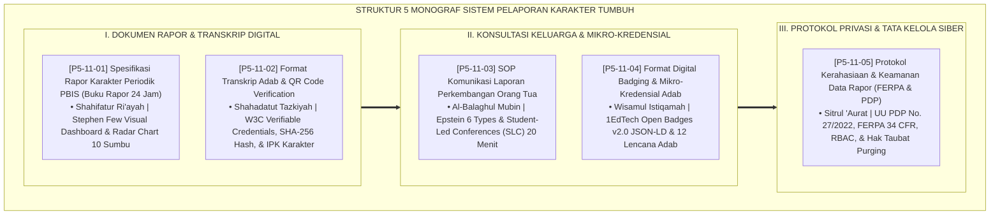

# P5-11: DOKUMEN INDUK SISTEM PELAPORAN DAN TRANSKRIP KARAKTER
## *Arsitektur dan Rekayasa Sistem Pelaporan Pertumbuhan Fitrah, Transkrip Kredensial Adab, dan Komunikasi Sinergi Pengasuhan (Spesifikasi Rapor Karakter Periodik 24 Jam Form RKP, Transkrip Adab Kelulusan QR Code Form TAK, SOP Komunikasi Konsultasi Orang Tua Form SKO, Format Digital Badging Open Badges v2.0 Form LDB, Serta Protokol Privasi Data FERPA/UU-PDP Form PKD) di Ekosistem TUMBUH Pesantren*

**Nomor Identifikasi**: `P5-11/DOKUMEN-INDUK-SISTEM-PELAPORAN-TRANSKRIP/2026`  
**Domain**: `05 Assessment Framework` > `11 Reporting` (Gugus Sub-Domain 11: *Comprehensive 24-Hour Character Reporting, Adab Transcripts, Micro-Credentials, & Data Privacy Systems*)  
**Klasifikasi Naskah**: *Master Architecture & Navigation Monograph* (Dokumen Induk Peta Jalan Riset & Navigasi 5 Monograf Ilmiah Sistem Pelaporan dan Transkrip Karakter)  
**Rumpun Disiplin Pengkaji**: Desain Informasi Visual Pendidikan, Kriptografi Kredensial Akademik (W3C/PKI), Kemitraan Keluarga-Sekolah, Data Privacy & Governance (FERPA/PDP)  

---

> ### 💡 INTISARI EKSEKUTIF (EXECUTIVE SUMMARY)
>
> * **Kedudukan Strategis Gugus Sistem Pelaporan dan Transkrip Karakter:**  
>   Gugus *Reporting (Sistem Pelaporan dan Transkrip Karakter)* merupakan jendela komunikasi dan pembuktian kredensial peradaban (*The Civilization Credential Window*) dalam ekosistem TUMBUH. Gugus ini mengubah rapor dari sekadar "kertas pembagi vonis" menjadi dokumen kehormatan (*Shahīfatur Ri'āyah*) yang memotret 24 jam kehidupan santri, menerbitkan paspor karakter internasional ber-QR Code anti-pemalsuan, memfasilitasi dialog kemitraan segitiga emas (Santri-Pondok-Orang Tua), menyematkan lencana mikro digital, dan mengunci privasi aib santri dengan enkripsi AES-256 standar FERPA/UU PDP.
> * **Integrasi Holistik Turats & Konsensus Sains Pelaporan Modern:**  
>   Gugus riset ini memadukan khazanah agung Islam tentang buku catatan amal (*Kitābul Abrār*), persaksian keadilan sanad (*Shahādatut Tazkiyah*), penyampaian bijak (*Al-Balāghul Mubīn*), lencana kemuliaan (*Wisāmul Istiqāmah*), dan menutupi aib (*Sitrul 'Aurāt*) dengan konsensus sains dunia (*Stephen Few Dashboarding, W3C Verifiable Credentials, Epstein Partnership, 1EdTech Open Badges v2.0, dan NIST RBAC Privacy*).
> * **Struktur Lengkap 5 Berkas Monograf Riset Ilmiah:**  
>   Dokumen induk ini memetakan dan menghubungkan 5 berkas monograf penelitian akademik komprehensif (~145 KB total riset) yang menyajikan layout 4 halaman rapor karakter, spesifikasi transkrip adab kelulusan, panduan student-led conferences 20 menit, skema JSON-LD 12 lencana adab, dan kebijakan privasi perlindungan data.

---

## 📑 PETA NAVIGASI LIMA MONOGRAF RISET SISTEM PELAPORAN KARAKTER

Berikut adalah daftar lengkap 5 monograf riset akademik dalam gugus **`11 Reporting`**:

---

## 📚 DESKRIPSI RINGKAS 5 BERKAS MONOGRAF

1. **[P5-11-01: Spesifikasi Rapor Karakter Periodik PBIS (Buku Rapor 24 Jam)](file:///c:/xampp/htdocs/tumbuh/05%20Assessment%20Framework/11%20Reporting/P5-11-01-Spesifikasi-Raport-Karakter-Periodik-PBIS.md)**  
   *Membahas arsitektur layout 4 halaman buku rapor karakter komposit 24 jam, doktrin Shahifatur Ri'ayah, visual dashboard Stephen Few, radar chart 10 kapasitas, dan form Form RKP-Master.*
2. **[P5-11-02: Format Transkrip Adab dan QR Code Verification](file:///c:/xampp/htdocs/tumbuh/05%20Assessment%20Framework/11%20Reporting/P5-11-02-Format-Transkrip-Adab-dan-QR-Code-Verification.md)**  
   *Membahas standarisasi transkrip adab kelulusan kumulatif 6 tahun ber-QR Code kriptografis, doktrin Shahadatut Tazkiyah salaf, W3C Verifiable Credentials, SHA-256 hash, dan form Form TAK-Transkrip.*
3. **[P5-11-03: SOP Komunikasi Laporan Perkembangan Orang Tua](file:///c:/xampp/htdocs/tumbuh/05%20Assessment%20Framework/11%20Reporting/P5-11-03-SOP-Komunikasi-Laporan-Perkembangan-Orang-Tua.md)**  
   *Membahas SOP konsultasi rapor tripartit 20 menit meja bundar, doktrin Al-Balaghul Mubin, Epstein's Partnership Framework, Student-Led Conferences (SLC), akad pembiasaan rumah, dan form Form SKO-Komunikasi.*
4. **[P5-11-04: Format Digital Badging dan Mikro-Kredensial Adab](file:///c:/xampp/htdocs/tumbuh/05%20Assessment%20Framework/11%20Reporting/P5-11-04-Format-Digital-Badging-dan-Mikro-Kredensial-Adab.md)**  
   *Membahas standarisasi 12 lencana digital mikro-kredensial karakter, doktrin Wisamul Istiqamah, 1EdTech Open Badges v2.0 JSON-LD, Self-Determination Theory gamifikasi, dan form Form LDB-Badging.*
5. **[P5-11-05: Protokol Kerahasiaan dan Keamanan Data Rapor (Standar FERPA & PDP)](file:///c:/xampp/htdocs/tumbuh/05%20Assessment%20Framework/11%20Reporting/P5-11-05-Protokol-Kerahasiaan-dan-Keamanan-Data-Rapor-FERPA.md)**  
   *Membahas tata kelola privasi data karakter, doktrin Sitrul 'Aurat salaf, kepatuhan FERPA & UU PDP No. 27/2022, Role-Based Access Control (RBAC), enkripsi AES-256, hak taubat pemutihan aib, dan form Form PKD-Privasi.*

---

## 🎯 STANDAR PENJAMINAN MUTU SISTEM PELAPORAN KARAKTER

Penerapan gugus **Sistem Pelaporan dan Transkrip Karakter (Reporting)** menjamin bahwa:
1. **Laporan Menjadi Sumber Kebanggaan dan Penguat Jiwa Keluarga (*Dignified & Joyful Reporting*)**: Menghilangkan tradisi mempermalukan anak, menggantinya dengan portofolio kemuliaan fitrah yang membahagiakan orang tua.
2. **Kredensial Adab Santri Diakui Secara Global Tanpa Keraguan (*Internationally Verifiable Trust*)**: Transkrip digital kriptografis dan lencana Open Badges v2.0 diakui universitas dan industri internasional.
3. **Privasi dan Kehormatan Santri Terlindungi Secara Mutlak (*Uncompromising Data Privacy*)**: Standar keamanan FERPA dan UU PDP menjamin aib masa lalu santri terkunci rapat dan dihapus pasca-taubat restoratif.
