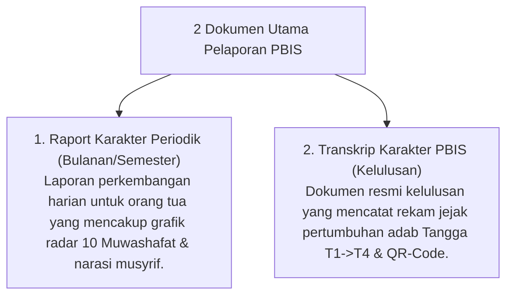

# P5-11: Sistem Pelaporan dan Transkrip Karakter PBIS

## Status Dokumen
* **Status**: 🌟 **A+ (Tervalidasi & Siap Diimplementasikan)**
* **Sub-Domain**: `05 Assessment Framework / 11 Reporting`
* **Penanggung Jawab Keilmuan**: Dewan Keilmuan TUMBUH (*Pakar Arsitektur Digital Pesantren & Pakar Desain Kurikulum Adab*)

---

## 1. Konseptualisasi Sistem Pelaporan TUMBUH

Sistem Pelaporan dalam ekosistem **TUMBUH** berfokus pada penyampaian gambaran utuh pertumbuhan jiwa santri (*Holistic Growth Representation*). Laporan ini tidak hanya memuat nilai angka, melainkan disertai narasi perkembangan kualitatif dan grafik Radar Capaian 10 Muwashafat.

---

## 2. Struktur Komponen Raport Karakter PBIS

1. **Grafik Radar 10 Karakter Muwashafat**: Visualisasi kekuatan karakter santri pada aspek spiritual, emosional, fisik, & khidmah.
2. **Catatan Narasi Pengasuhan Musyrif**: Umpan balik kualitatif mengenai usaha, keteladanan, dan area penguatan adab.
3. **Peta Progresi Tangga TUMBUH**: Posisi jenjang tangga santri saat ini (T1, T2, T3, atau T4) dan pencapaian milestone.

---

## 3. Komunikasi dengan Orang Tua (*Parent Partnership*)

- **Penyampaian Berbasis Solusi**: Laporan perkembangan disampaikan dalam forum konsultasi dua arah antara Wali Kelas/Musyrif dan Orang Tua.
- **Rekomendasi Pembiasaan Rumah**: Memberikan rekomendasi konkret kepada orang tua untuk menjaga pembiasaan adab saat santri libur di rumah.
