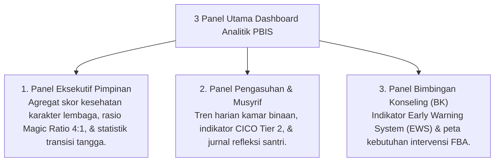

# P5-12-01: Spesifikasi Dashboard Analitik PBIS

## Status Dokumen
* **Status**: 🌟 **A+ (Tervalidasi & Siap Diimplementasikan)**
* **Sub-Domain**: `05 Assessment Framework / 12 Analytics`
* **Penanggung Jawab Keilmuan**: Dewan Keilmuan TUMBUH (*Pakar Arsitektur Digital Pesantren & Pakar Metodologi Riset*)

---

## 1. Arsitektur Dashboard Analitik Real-Time

Dashboard Analitik PBIS menyajikan visualisasi data perilaku, kesehatan emosional, dan kepemimpinan santri secara real-time untuk pengambilan keputusan berbasis data (*Data-Driven Institutional Decision Making*):

---

## 2. Fitur Visualisasi Interactive Charts

- **Heatmap Perilaku Asrama**: Memetakan jam-jam dan lokasi di asrama yang membutuhkan penguatan pengawasan musyrif.
- **Rasio Umpan Balik Positif vs Koreksi (Magic Ratio Tracker)**: Memantau kepatuhan musyrif dalam menerapkan prinsip 4:1.
