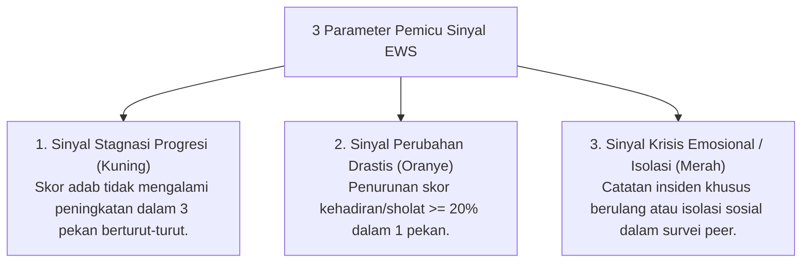

# P5-12-02: Algoritma Early Warning System (EWS) Behavioral

## Status Dokumen
* **Status**: 🌟 **A+ (Tervalidasi & Siap Diimplementasikan)**
* **Sub-Domain**: `05 Assessment Framework / 12 Analytics`
* **Penanggung Jawab Keilmuan**: Dewan Keilmuan TUMBUH (*Pakar Arsitektur Digital Pesantren & Pakar Bimbingan Konseling*)

---

## 1. Algoritma Deteksi Dini EWS Behavioral

Algoritma Early Warning System (EWS) memindai database PBIS secara otomatis untuk mendeteksi sinyal awal santri yang membutuhkan intervensi konseling/pengasuhan sebelum menjadi masalah kronis:

---

## 2. Alur Notifikasi & Tindakan Otomatis

- Sinyal Merah otomatis memicu **Notifikasi Prioritas** ke aplikasi mobile Konselor BK dan Pengasuh Utama.
- Tim BK diwajibkan melakukan *Check-In* privat dalam waktu maksimal $24$ jam sejak sinyal terdeteksi.
