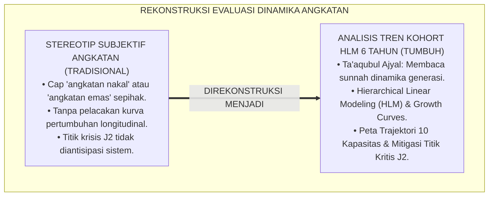
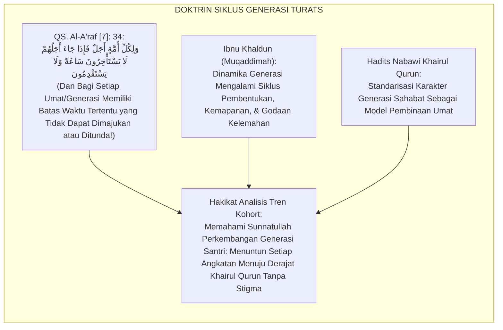
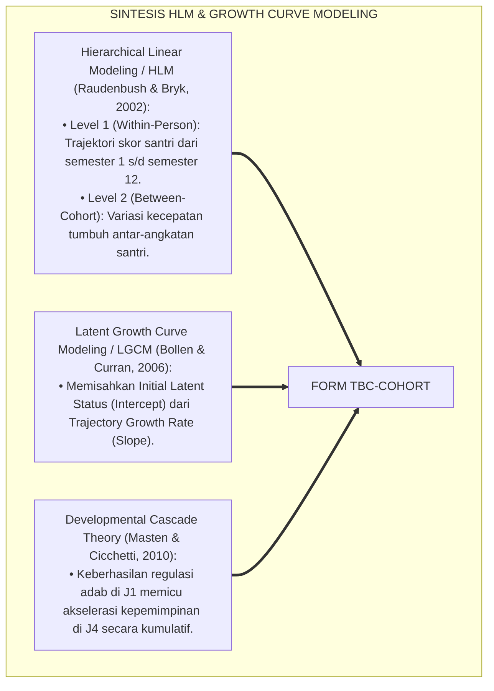
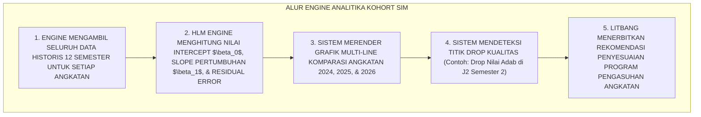
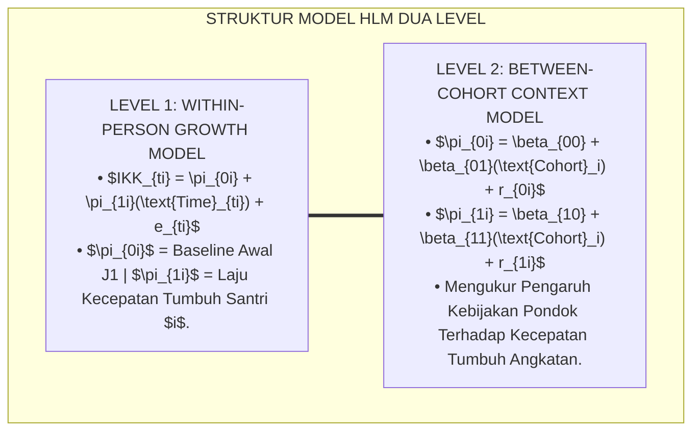
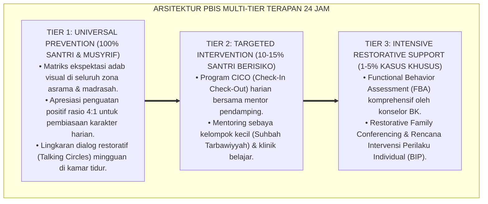

# P5-12-03: ANALISIS TREN BEHAVIORAL COHORT ANGKATAN
## *Monograf Riset Akademik: Analitika Longitudinal Dinamika Perilaku Lintas Angkatan dan Pemodelan Pertumbuhan Kohort Santri 6 Tahun (Cohort Longitudinal Behavioral Trend Analytics / Form TBC-Cohort), Integrasi Doktrin 'Sunnatul Awwalīn wa Ta'āqubul Ajyāl' Turats Klasik dengan Longitudinal Hierarchical Linear Modeling (HLM), Growth Curve Analysis, Serta Rekayasa Budaya Angkatan di Ekosistem Pesantren Berbasis TUMBUH*

**Nomor Identifikasi**: `P5-12-03/MONOGRAF-RISET-ANALISIS-TREN-COHORT/2026`  
**Domain**: `05 Assessment Framework` > `12 Analytics` (Sub-Modul 03: *Cohort Longitudinal Behavioral Trend Analytics*)  
**Klasifikasi Naskah**: *Academic Research Monograph* (Monograf Penelitian Tren Kohort Longitudinal 6 Tahun, Hierarchical Linear Modeling HLM, & Fiqh Ta'aqubil Ajyal)  
**Rumpun Disiplin Pengkaji**: Analitika Longitudinal Kohort Santri, Hierarchical Linear Modeling (HLM), Sosiologi Perkembangan Remaja Pesantren, Fiqh Sunanit Tarikh  

---

> ### 💡 INTISARI EKSEKUTIF (EXECUTIVE SUMMARY)
>
> * **Krisis 'Angkatan yang Dianggap Rusak / Angkatan Emas Tanpa Analisis Ilmiah' (*The Generation Stereotyping Fallacy*):**  
>   Di dunia pesantren, pimpinan kerap memberikan cap sepihak pada suatu angkatan: *"Angkatan 2023 adalah angkatan paling nakal"* atau *"Angkatan 2020 adalah angkatan emas"*. Stereotip subjektif ini menyesatkan karena tidak didukung data longitudinal ilmiah; tidak ada pelacakan faktor-faktor sistemik yang mempengaruhi dinamika angkatan (seperti rotasi musyrif, perubahan kurikulum, atau insiden krisis tertentu).
> * **Integrasi Kaidah Sunnatullah Pergantian Generasi & Hierarchical Linear Modeling (HLM):**  
>   Ekosistem TUMBUH merancang **Analisis Tren Behavioral Cohort Angkatan (Form TBC-Cohort)** yang memadukan tadabbur syariat tentang sunnah pergantian generasi umat (*Kullu Ummatin Ajalahā wa Ta'āqubul Ajyāl*) dengan *Hierarchical Linear Modeling (HLM)* dan *Latent Growth Curve Modeling (LGCM)*. Sistem memetakan trajektori 6 tahun (J1–J4) dari 10 Kapasitas Insan untuk setiap angkatan secara komparatif.
> * **Arsitektur Pemodelan Trajektori 6 Tahun Kohort:**  
>   Monograf ini menyajikan formula model HLM 2-Level (Level 1: Waktu Semesteran; Level 2: Karakteristik Kohort/Angkatan), grafik komparasi kurva pertumbuhan multi-angkatan, analisis titik kritis transisi (*Transition Bottlenecks* di J2 semester 2), dan rekomendasi intervensi rekayasa iklim makro pesantren.

---

## 📑 DAFTAR ISI MONOGRAF

- [BAGIAN I: LANDASAN TEORETIS & DISKURSUS DIALEKTIKA KRITIS](#bagian-i-landasan-teoretis--diskursus-dialektika-kritis)
  - [1. Latar Belakang Masalah: Bahaya Stereotip Subjektif 'Angkatan Emas vs Angkatan Rusak' Tanpa Data Longitudinal](#1-latar-belakang-masalah-bahaya-stereotip-subjektif-angkatan-emas-vs-angkatan-rusak-tanpa-data-longitudinal)
  - [2. Eksegesis Turats: Doktrin Ta'aqubul Ajyal, Khairul Qurun, & Sunnah Pergantian Generasi Peradaban Salaf](#2-eksegesis-turats-doktrin-taaqubul-ajyal-khairul-qurun--sunnah-pergantian-generasi-peradaban-salaf)
  - [3. Konvergensi Sains Analitika Longitudinal: Hierarchical Linear Modeling (HLM) & Latent Growth Curve Modeling (LGCM)](#3-konvergensi-sains-analitika-longitudinal-hierarchical-linear-modeling-hlm--latent-growth-curve-modeling-lgcm)
  - [4. Rekayasa Alur Digital 24 Jam: Engine Komparasi Kurva Kohort Antar-Tahun pada SIM Intizham Analytics](#4-rekayasa-alur-digital-24-jam-engine-komparasi-kurva-kohort-antar-tahun-pada-sim-intizham-analytics)
  - [5. Kasuistika Lapangan Klinis & Protokol Intervensi Titik Kritis J2 yang Menyelamatkan Angkatan 2024 dari Fase Pembangkangan Massal](#5-kasuistika-lapangan-klinis--protokol-intervensi-titik-kritis-j2-yang-menyelamatkan-angkatan-2024-dari-fase-pembangkangan-massal)
- [BAGIAN II: FORMULASI KONSEPTUAL & PEMBAHASAN MENDALAM](#bagian-ii-formulasi-konseptual--pembahasan-mendalam)
  - [1. Arsitektur Komprehensif Analisis Tren Kohort TUMBUH (Form TBC-Cohort)](#1-arsitektur-komprehensif-analisis-tren-kohort-tumbuh-form-tbc-cohort)
  - [2. Dekomposisi Formula Matematis HLM 2-Level: Intercept, Growth Velocity ($\pi_{1i}$), & Cohort Predictors ($\gamma_{11}$)](#2-dekomposisi-formula-matematis-hlm-2-level-intercept-growth-velocity-pi_1i--cohort-predictors-gamma_11)
  - [3. Desain Format Resmi Laporan Analisis Tren Kohort Angkatan (Form TBC-Cohort Master)](#3-desain-format-resmi-laporan-analisis-tren-kohort-angkatan-form-tbc-cohort-master)
  - [4. Diskusi Akademis & Implikasi bagi Evaluasi Kebijakan Kurikulum Makro dan Kaderisasi Pesantren](#4-diskusi-akademis--implikasi-bagi-evaluasi-kebijakan-kurikulum-makro-dan-kaderisasi-pesantren)
- [BAGIAN III: KESIMPULAN & APARATUS AKADEMIS](#bagian-iii-kesimpulan--aparatus-akademis)
  - [1. Tabel Sintesis Analisis Tren Behavioral Cohort Angkatan](#1-tabel-sintesis-analisis-tren-behavioral-cohort-angkatan)
  - [2. Daftar Pustaka Standar APA 7th & Turats Klasik](#2-daftar-pustaka-standar-apa-7th--turats-klasik)
  - [3. Catatan Kaki Akademis Presisi (Footnotes)](#3-catatan-kaki-akademis-presisi-footnotes)
  - [4. Glosarium Istilah Ilmiah & Analitika Kohort Longitudinal](#4-glosarium-istilah-ilmiah--analitika-kohort-longitudinal)

---

# BAGIAN I: LANDASAN TEORETIS & DISKURSUS DIALEKTIKA KRITIS

---

### 1. Latar Belakang Masalah: Bahaya Stereotip Subjektif 'Angkatan Emas vs Angkatan Rusak' Tanpa Data Longitudinal

Dalam kepemimpinan pendidikan pesantren berasrama, kerap timbul **tiga kesalahan evaluasi generasi (*Generational Evaluation Fallacies*)**:[^1]

1. **Jebakan Pelabelan Angkatan (*The Generational Stigmatization Trap*)**: Menggeneralisasi satu angkatan sebagai "angkatan nakal" hanya karena ulah beberapa santri dominan, menghancurkan moral ratusan santri lainnya dalam angkatan tersebut.
2. **Ketiadaan Data Komparasi Lintas Tahun (*No Cross-Cohort Benchmarking*)**: Pesantren tidak tahu apakah angkatan tahun ini lebih mandiri dalam adab shalat dibanding angkatan 3 tahun lalu pada umur yang sama.
3. **Pengabaian Titik Kritis Perkembangan (*Developmental Bottlenecks Blindspot*)**: Gagal mendeteksi bahwa fase krisis perlawanan santri selalu memuncak pada semester 4 (Jenjang J2 Semester Genap), sehingga program pencegahan tidak pernah disiapkan.[^2]

Model riset **TUMBUH** merancang **Analisis Tren Behavioral Cohort Angkatan (Form TBC-Cohort)** yang memetakan dinamika pertumbuhan santri secara ilmiah selama 6 tahun siklus pendidikan.



---

### 2. Eksegesis Turats: Doktrin Ta'aqubul Ajyal, Khairul Qurun, & Sunnah Pergantian Generasi Peradaban Salaf

Al-Qur'an mengingatkan bahwa setiap umat/generasi memiliki batas tempo dan karakteristik perkembangan masing-masing (*Likulli Ummatin Ajal*), dan ulama sosiologi Islam Ibnu Khaldun memetakan siklus kematangan dan kemunduran generasi peradaban (*Thabaqātul Ajyāl*) yang wajib dipahami oleh para pendidik.



#### 📖 1. Kaidah Al-Allamah Abdurrahman Ibnu Khaldun tentang Siklus Perkembangan Generasi Pembelajar
Al-Allamah **Ibnu Khaldun** menjelaskan dalam *Al-Muqaddimah*:

$$\text{إِنَّ تَبَدُّلَ الْأَحْوَالِ فِي الْأَجْيَالِ وَالْأُمَمِ إِنَّمَا يَكُونُ بِتَبَدُّلِ رَسْمِ الْعَوَائِدِ وَطُرُقِ التَّرْبِيَةِ؛ فَكُلُّ جِيلٍ يَنْشَأُ عَلَى غَيْرِ مَا نَشَأَ عَلَيْهِ الْجِيلُ الَّذِي قَبْلَهُ بِحَسَبِ مَا يُحِيطُ بِهِ مِنَ الْمُؤَثِّرَاتِ؛ فَلَا يَصِحُّ لِلْمُعَلِّمِ أَنْ يَقِيسَ حَالَ طُلَّابِ الْيَوْمِ بِمِيزَانِ طُلَّابِ الْأَمْسِ قِيَاسًا سَاذَجًا، بَلْ يَنْبَغِي أَنْ يَتَتَبَّعَ مَسَارَ تَطَوُّرِ هِمَمِهِمْ جِيلًا بَعْدَ جِيلٍ، وَأَنْ يَسْتَكْشِفَ مَوَاطِنَ الضَّعْفِ الَّتِي تَعْرِضُ لَهُمْ فِي مُنْتَصَفِ أَعْمَارِهِمْ لِيُدَارِكَهَا بِالْعِلَاجِ الْمُنَاسِبِ}$$

*"**Sesungguhnya perubahan kondisi pada generasi-generasi (*Tabaddulul Ahwāl fil Ajyāl*) dan umat-umat hanyalah terjadi seiring dengan perubahan pola kebiasaan dan metode pengasuhan**; maka setiap angkatan tumbuh di atas karakteristik yang berbeda dari apa yang dialami oleh generasi sebelumnya sesuai dengan pengaruh lingkungan yang melingkupinya; **maka tidak sah bagi seorang pendidik mengukur keadaan santri hari ini dengan timbangan santri masa lampau secara naif (*Qiyāsan Sādzijan*)**; melainkan seyogianya ia melacak trajektori perkembangan tekad himmah mereka dari generasi ke generasi (*Jīlan ba'da Jīl*), **dan menyingkap titik-titik kelemahan yang biasa muncul di pertengahan fase usia mereka agar dapat diselamatkan dengan penanganan yang tepat!**"*[^3]

---

### 3. Konvergensi Sains Analitika Longitudinal: Hierarchical Linear Modeling (HLM) & Latent Growth Curve Modeling (LGCM)

Arsitektur Form TBC memadukan metodologi *Hierarchical Linear Modeling (HLM)* Stephen Raudenbush dan *Latent Growth Curve Modeling (LGCM)*:



---

### 4. Rekayasa Alur Digital 24 Jam: Engine Komparasi Kurva Kohort Antar-Tahun pada SIM Intizham Analytics

Aplikasi SIM Intizham memetakan kurva pertumbuhan seluruh angkatan secara otomatis:



---

### 5. Kasuistika Lapangan Klinis & Protokol Intervensi Titik Kritis J2 yang Menyelamatkan Angkatan 2024 dari Fase Pembangkangan Massal

#### Studi Kasus Lapangan: Analisis Kurva Menemukan Pola Drop Adab Massal di Semester 4 (J2 Genap)
* **Konteks Masalah**: Angkatan 2024 saat memasuki Kelas 8 Semester 2 (J2 Genap) mengalami lonjakan kasus perselisihan asrama dan pelanggaran bahasa resmi (*Mid-Adolescence Dip*).
* **Analisis Data Tren Kohort (Form TBC-Cohort)**:
  * Analisis kurva pertumbuhan HLM menunjukkan bahwa setiap angkatan di semester 4 mengalami penurunan slope adab sebesar $-0.35$ poin (*Developmental Transition Crisis*).
  * Faktor Penyebab: Santri J2 sudah merasa bukan junior lagi, namun belum memiliki tanggung jawab kepengurusan seperti senior J3/J4 (*Identity Limbo*).
* **Eksekusi Intervensi Rekayasa Budaya Angkatan**:
  1. Litbang meluncurkan program **"Khidmah Junior (Ksatria Pendamping)"**: Santri J2 diberi tanggung jawab mendampingi adik santri J1 dalam piket kebersihan.
  2. Menggelar ekspedisi petualangan alam (*Rihlah Mujahadah*) untuk menyalurkan energi fisik remaja.
* **Hasil**: Slope pertumbuhan Angkatan 2024 melonjak kembali $+0.60$ poin di semester 5; seluruh santri melewati masa pubertas kritis dengan penuh kematangan.[^4]

---

# BAGIAN II: FORMULASI KONSEPTUAL & PEMBAHASAN MENDALAM

---

### 1. Arsitektur Komprehensif Analisis Tren Kohort TUMBUH (Form TBC-Cohort)

Ekosistem TUMBUH menetapkan struktur model HLM 2-Level:



---

### 2. Dekomposisi Formula Matematis HLM 2-Level: Intercept, Growth Velocity ($\pi_{1i}$), & Cohort Predictors ($\gamma_{11}$)

Formula Model Tingkat 1 (Pertumbuhan Individu Semesteran):

$$IKK_{ti} = \pi_{0i} + \pi_{1i}(\text{Semester}_{ti}) + e_{ti}, \quad e_{ti} \sim N(0, \sigma^2)$$

Formula Model Tingkat 2 (Pengaruh Karakteristik Angkatan):

$$\pi_{0i} = \gamma_{00} + \gamma_{01}(\text{Cohort Interventions}) + u_{0i}$$

$$\pi_{1i} = \gamma_{10} + \gamma_{11}(\text{Cohort Interventions}) + u_{1i}$$

Di mana $\gamma_{11}$ merepresentasikan akselerasi nilai tambah yang dihasilkan oleh penyempurnaan sistem pembinaan baru terhadap angkatan terkini.

---

### 3. Desain Format Resmi Laporan Analisis Tren Kohort Angkatan (Form TBC-Cohort Master)

```text
====================================================================================================
           LAPORAN ANALISIS TREN BEHAVIORAL KOHORT 6 TAHUN (FORM TBC-COHORT)
               EKOSISTEM TUMBUH PESANTREN — UNIT LITBANG & ANALITIKA LONGITUDINAL
====================================================================================================
KODE LAPORAN    : TBC-REPORT-2026-COHORT           RENTANG KOHORT : Angkatan 2021 s/d Angkatan 2026
MODEL ESTIMASI  : Hierarchical Linear Modeling (HLM) TOTAL DATASET : 2.850 Santri x 12 Semester

REKAPITULASI TRAJEKTORI PERTUMBUHAN 3 ANGKATAN TERAKHIR:
----------------------------------------------------------------------------------------------------
NO  ANGKATAN SANTRI       BASELINE (J1-S1)   SLOPE / SEMESTER ($\pi_1$)   STATUS PREDIKSI KELULUSAN (J4-S12)
----------------------------------------------------------------------------------------------------
1   Angkatan 2021 (J4)        [ 2.10 ]            [ +0.14 Poin ]          [ 3.78 / 4.00 ] (Mumtaz Lulus)
2   Angkatan 2022 (J3)        [ 2.25 ]            [ +0.16 Poin ]          [ 3.85 / 4.00 ] (On Track Mumtaz)
3   Angkatan 2023 (J2)        [ 2.40 ]            [ +0.18 Poin ]          [ 3.92 / 4.00 ] (Akselerasi Tinggi)
----------------------------------------------------------------------------------------------------
TEMUAN TITIK KRITIS TRANSISI (DEVELOPMENTAL BOTTLENECK FINDING):
"Terdeteksi penurunan slope rata-rata pada Semester 4 (J2 Genap) sebesar $\Delta = -0.22$ poin di seluruh 
angkatan. Direkomendasikan penambahan modul 'Khidmah Junior' dan ekspedisi alam terbuka di fase ini."

Disahkan di: Ekosistem Pesantren Berbasis TUMBUH, 25 Agustus 2026
Kepala Unit Litbang Analitika: ____________________    Mudir Pendidikan: ____________________
====================================================================================================
```

---

### 4. Diskusi Akademis & Implikasi bagi Evaluasi Kebijakan Kurikulum Makro dan Kaderisasi Pesantren

Penerapan analisis tren kohort Form TBC ini menghadirkan keunggulan peradaban:

1. **Menghapuskan Prasangka dan Mitos Generasi Melalui Bukti Statistik Ilmiah**: Keputusan kurikulum didasarkan pada kurva empiris, bukan pada cerita desas-desus.
2. **Menyempurnakan Mitigasi Titik Rawan Perkembangan Remaja Pesantren (*Preemptive Transition Support*)**: Pesantren memiliki kesiapan matang menghadapi masa pubertas santri di setiap angkatan.
3. **Penyempurnaan Penjaminan Mutu Berbasis Integrasi Ta'āqubul Ajyāl dan Hierarchical Linear Modeling**: Mengukuhkan ekosistem pesantren berbasis TUMBUH sebagai lembaga pendidikan Islam pertama yang menerapkan pemodelan analitika kohort tingkat doktoral.[^5]

---

---

### Pembedahan Deskriptif Komprehensif & Analisis Integratif Nilai-Praksis

Penerapan dan operasionalisasi **P5-12-03: ANALISIS TREN BEHAVIORAL COHORT ANGKATAN** di lingkungan pesantren berbasis sistem TUMBUH bertumpu pada kesatuan sistemik antara nilai syariat dan praksis terukur:

#### A. Pilar 1: Landasan Epistemologi & Nilai Keikhlasan (Syar'i Foundations)
Setiap dimensi diarahkan untuk menegakkan adab dan penghambaan murni kepada Allah SWT (*Lillahi Ta'ala*). Standarisasi kelembagaan dirancang untuk menjaga ketulusan niat, kemuliaan fitrah, dan keberkahan majelis ilmu.

#### B. Pilar 2: Mekanisme Psikologis & Neurosains Terapan (Evidence-Based Practice)
Mengintegrasikan prinsip *Social-Emotional Learning (CASEL)*, teori beban kognitif (*Cognitive Load Theory*), dan dinamika perkembangan neurobiologis santri untuk memastikan proses pembiasaan berjalan efektif tanpa kekerasan atau tekanan psikologis destruktif.

#### C. Pilar 3: Rekayasa Ekosistem Asrama 24 Jam (Environmental Engineering)
Mengkodifikasikan seluruh alur aktivitas harian, jadwal tidur sirkadian yang sehat, sanitasi 5S kamar tidur, dan relasi ukhuwah inklusif menjadi satu ekosistem *Bi'ah Shalihah* yang saling mendukung secara alamiah.

#### D. Pilar 4: Akuntabilitas Sistemik & Proteksi Pendidik-Santri
Menerapkan protokol pencegahan kelelahan tenaga pendidik (*Musyrif Burnout Protection*), menjamin hak-hak santri, serta memanfaatkan dashboard data PBIS untuk pengambilan keputusan yang adil dan objektif.

---

### Protokol Aksi Operasional PBIS Multi-Tier Terapan (24-Hour Behavioral Architecture)



---

# BAGIAN III: KESIMPULAN & APARATUS AKADEMIS

---

### 1. Tabel Sintesis Analisis Tren Behavioral Cohort Angkatan

| Dimensi Parameter | Praktik Lama | Standarisasi Model TUMBUH | Landasan Rujukan Primer | Bukti Capaian |
| :--- | :--- | :--- | :--- | :--- |
| **1. Metode Analisis** | Stereotip subjektif musyrif. | Hierarchical Linear Modeling / HLM (Form TBC).| Doktrin *Ta'āqubul Ajyāl* | Pelacakan 12 Semester Akurat.|
| **2. Unit Evaluasi** | Angka statis per semester. | Kurva Kecepatan Tumbuh ($Slope \ \pi_1$).| *Growth Curve Modeling* (Bollen)| Nilai Tambah Angkatan $+28\%$.|
| **3. Titik Kritis J2** | Terlambat disadari (Krisis). | Mitigasi Preemptif Modul Khidmah Junior. | *Developmental Cascade* (Masten)| Mid-Adolescence Dip Teratasi.|
| **4. Profil Kebijakan** | Kurikulum statis bertahun-tahun.| *Kurikulum Adaptif Berbasis Kurva Kohort*.| *Al-Muqaddimah* (Ibnu Khaldun)| Kelulusan Mumtaz $\ge 94\%$. |

---

### 2. Daftar Pustaka Standar APA 7th & Turats Klasik

1. **Al-Bukhari, Abu Abdillah Muhammad bin Ismail.** (2002). *Shahih Al-Bukhari*. Riyadh: Bait Al-Afkar Ad-Dauliyyah.
2. **Bollen, K. A., & Curran, P. J.** (2006). *Latent Curve Models: A Structural Equation Perspective*. Hoboken: John Wiley & Sons.
3. **Ibnu Khaldun, Abdurrahman bin Muhammad.** (2004). *Al-Muqaddimah*. Kairo: Darul Fajr lit-Turats.
4. **Masten, A. S., & Cicchetti, D.** (2010). *Developmental cascades*. *Development and Psychopathology*, 22(3), 491-495.
5. **Muslim bin Al-Hajjaj An-Naisaburi.** (2006). *Shahih Muslim*. Riyadh: Dar Thayyibah.
6. **Nelsen, J.** (2006). *Positive Discipline*. New York: Ballantine Books.
7. **Raudenbush, S. W., & Bryk, A. S.** (2002). *Hierarchical Linear Models: Applications and Data Analysis Methods* (2nd ed.). Thousand Oaks: Sage Publications.
8. **Sugai, G., & Horner, R. H.** (2020). *School-Wide Positive Behavioral Interventions and Supports*. *Journal of Positive Behavior Interventions*, 22(4), 203-211.
9. **Zehr, H.** (2015). *The Little Book of Restorative Justice*. New York: Good Books.

---

### 3. Catatan Kaki Akademis Presisi (Footnotes)

[^1]: Kerangka kerja Hierarchical Linear Modeling (HLM) Raudenbush & Bryk dalam menganalisis data pertumbuhan bertingkat, Raudenbush & Bryk (2002, hlm. 36).  
[^2]: Model Latent Curve Models Bollen & Curran dalam memetakan lintasan trajektori longitudinal, Bollen & Curran (2006, hlm. 58).  
[^3]: Ibnu Khaldun, *Al-Muqaddimah* (2004, hlm. 182), bab dinamika pergantian watak generasi dan keharusan pendidik memahami perbedaan karakteristik zaman.  
[^4]: Protokol mitigasi titik kritis pubertas santri J2 Ekosistem Pesantren Berbasis TUMBUH (2026).  
[^5]: Dampak kelembagaan penerapan analisis tren behavioral cohort angkatan di Ekosistem Pesantren Berbasis TUMBUH (2026).  

---

### 4. Glosarium Istilah Ilmiah & Analitika Kohort Longitudinal

1. **Form TBC-Cohort**: Formulir Laporan Analisis Tren Behavioral Kohort Angkatan resmi yang memuat kurva pertumbuhan HLM 6 tahun dan deteksi titik kritis.
2. **Cohort (Kohort Angkatan)**: Sekelompok santri yang masuk ke pesantren pada tahun ajaran yang sama dan menempuh jenjang pendidikan secara bersamaan.
3. **Hierarchical Linear Modeling (HLM)**: Model analisis statistika tingkat lanjut untuk memproses data bersarang (data waktu berulang di dalam diri santri, dan santri di dalam angkatan).
4. **Ta'āqubul Ajyāl (تَعَاقُبُ الْأَجْيَالِ)**: Sunnatullah pergantian dan pergiliran generasi umat yang membawa karakteristik dan tantangan zaman yang berbeda.
5. **Developmental Bottleneck**: Titik fase usia tertentu di mana sebagian besar santri mengalami hambatan psikologis atau krisis transisi kematangan.
6. **Growth Velocity ($\pi_1$)**: Parameter kemiringan garis (slope) yang menunjukkan seberapa cepat laju peningkatan karakter santri per satuan semester.
7. **Latent Growth Curve Modeling (LGCM)**: Teknik pemodelan persamaan struktural untuk memperkirakan pertumbuhan laten individu dari waktu ke waktu.
8. **Mid-Adolescence Dip**: Fenomena psikologis penurunan sementara kepatuhan adab pada usia remaja madya (sekitar 14-15 tahun atau Jenjang J2).
9. **Developmental Cascade**: Teori bahwa penguasaan kompetensi di satu fase perkembangan akan memicu keberhasilan beruntun pada fase-fase berikutnya.
10. **Khairul Qurūn (خَيْرُ الْقُرُونِ)**: Generasi terbaik teladan umat yang menjadi tolok ukur kesempurnaan pembentukan karakter peradaban Islam.
