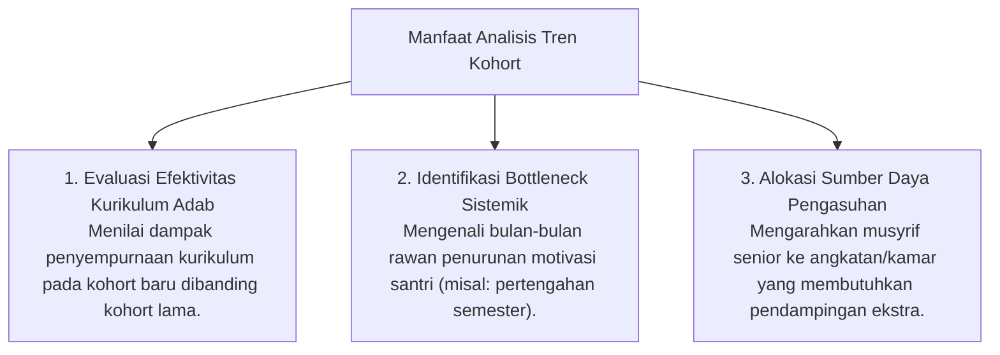

# P5-12-03: Analisis Tren Behavioral Cohort Angkatan

## Status Dokumen
* **Status**: 🌟 **A+ (Tervalidasi & Siap Diimplementasikan)**
* **Sub-Domain**: `05 Assessment Framework / 12 Analytics`
* **Penanggung Jawab Keilmuan**: Dewan Keilmuan TUMBUH (*Pakar Metodologi Riset & Pakar Tata Kelola Qudwah*)

---

## 1. Konseptualisasi Behavioral Cohort Analytics

Analisis Kohort Perilaku membandingkan tren perkembangan antar angkatan santri (*Cross-Cohort Analysis*) dan longitudinal dari tahun ke tahun untuk menilai efektivitas jangka panjang sistem pembinaan pesantren.

---

## 2. Pengambilan Keputusan Strategis Berbasis Data

Pimpinan Lembaga dan Dewan Keilmuan memanfaatkan laporan riset kohort tahunan untuk melakukan **Continuous Quality Improvement (CQI)** pada seluruh Domain Ekosistem TUMBUH.
