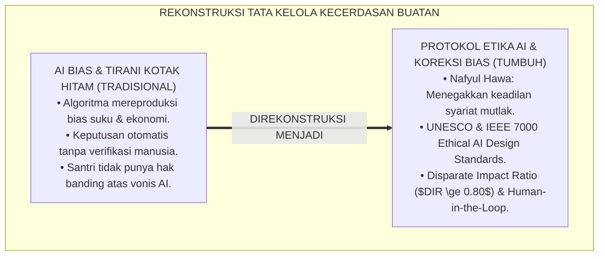
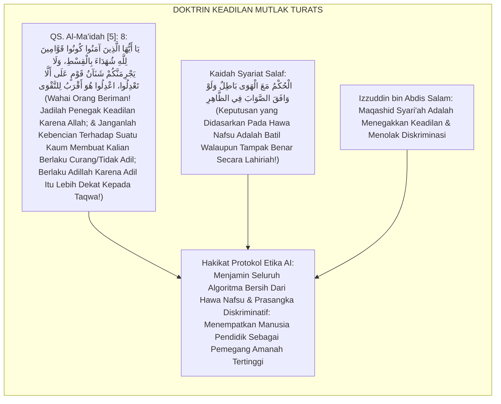
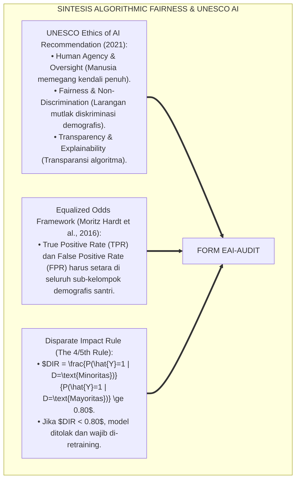
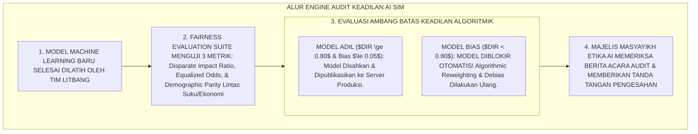
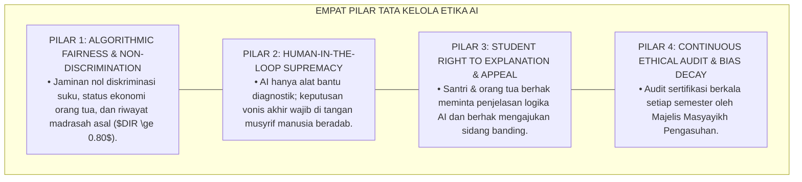
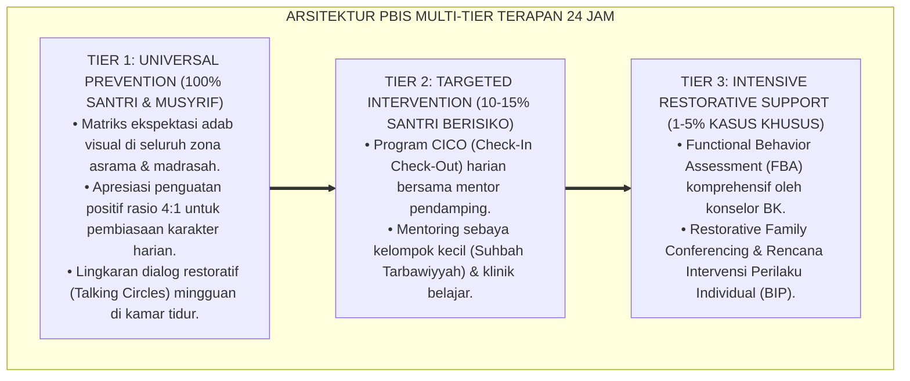

# P5-12-05: PROTOKOL KOREKSI BIAS ALGORITMIK DAN ETIKA AI PESANTREN
## *Monograf Riset Akademik: Protokol Audit Keadilan Algoritmik, Mitigasi Bias Demografis, dan Kerangka Etika Kecerdasan Buatan Pendidikan Islam (Algorithmic Fairness, Demographic Bias Mitigation, & Ethical AI Framework / Form EAI-Audit), Integrasi Doktrin 'Nafyul Hawa wal Qisthil Muqaddas' Turats Klasik dengan IEEE 7000 Ethical System Design, UNESCO Recommendations on the Ethics of AI, Serta Tata Kelola AI Berkeadilan di Ekosistem Pesantren Berbasis TUMBUH*

**Nomor Identifikasi**: `P5-12-05/MONOGRAF-RISET-ETIKA-AI-DAN-KOREKSI-BIAS/2026`  
**Domain**: `05 Assessment Framework` > `12 Analytics` (Sub-Modul 05: *Algorithmic Fairness, Bias Mitigation, & Ethical AI Framework*)  
**Klasifikasi Naskah**: *Academic Research Monograph* (Monograf Penelitian Keadilan Algoritmik AI, Mitigasi Bias Demografis, IEEE 7000/UNESCO, & Fiqh Al-Adl wa Nafyil Hawa)  
**Rumpun Disiplin Pengkaji**: Etika Kecerdasan Buatan (*Ethical AI Governance*), Algorithmic Fairness & Bias Mitigation, Filsafat Hukum Islam (Maqashid Syari'ah), Fiqh Al-Adalah  

---

> ### 💡 INTISARI EKSEKUTIF (EXECUTIVE SUMMARY)
>
> * **Krisis 'Diskriminasi Algoritmik Tersembunyi' (*The Algorithmic Injustice Crisis*):**  
>   Penggunaan kecerdasan buatan (AI) tanpa audit etika berpotensi mereproduksi dan melipatgandakan bias manusia: algoritma dapat secara sistematis memberikan skor risiko krisis lebih tinggi kepada santri dari daerah tertentu, latar belakang ekonomi lemah, atau santri pindahan (*Demographic Bias & Algorithmic Redlining*). AI yang bias dapat menjadi "algojo digital tak terlihat" yang merampas keadilan santri.
> * **Integrasi Doktrin Menghilangkan Hawa Nafsu & Kerangka Etika AI UNESCO/IEEE:**  
>   Ekosistem TUMBUH merancang **Protokol Koreksi Bias Algoritmik dan Etika AI Pesantren (Form EAI-Audit)** yang memadukan perintah mutlak syariat untuk menegakkan keadilan suci tanpa hawa nafsu (*Kūnū Qawwāmīna bil Qisthi Syuhadā'a Lillāh*) dengan *UNESCO Recommendations on the Ethics of AI (2021)* dan standar *IEEE 7000 Ethical System Design*. Sistem menetapkan prinsip **Disparate Impact Ratio ($0.80 \le DIR \le 1.25$)** dan **Equalized Odds** untuk seluruh sub-populasi santri.
> * **Arsitektur Pengawasan Man-in-the-Loop (Masyayikh AI Oversight Board):**  
>   Monograf ini menyajikan 4 pilar tata kelola etika AI (Prinsip Non-Diskriminasi, Hak Banding Santri, Audit Bias Berkala Litbang, dan Larangan Pengambilan Keputusan Otomatis Tanpa Verifikasi Manusia / *No Automated High-Stakes Dismissal*), formulir berita acara audit bias, dan pedoman etika digital pesantren.

---

## 📑 DAFTAR ISI MONOGRAF

- [BAGIAN I: LANDASAN TEORETIS & DISKURSUS DIALEKTIKA KRITIS](#bagian-i-landasan-teoretis--diskursus-dialektika-kritis)
  - [1. Latar Belakang Masalah: Bahaya Tirani Algoritma yang Bias & Diskriminasi Tersembunyi AI](#1-latar-belakang-masalah-bahaya-tirani-algoritma-yang-bias--diskriminasi-tersembunyi-ai)
  - [2. Eksegesis Turats: Doktrin Nafyul Hawa, Al-Qisthul Muqaddas, & Kaidah Keadilan Tanpa Diskriminasi Salaf](#2-eksegesis-turats-doktrin-nafyul-hawa-al-qisthul-muqaddas--kaidah-keadilan-tanpa-diskriminasi-salaf)
  - [3. Konvergensi Sains Keadilan Algoritmik: Hardt's Equalized Odds, Disparate Impact, & UNESCO Ethical AI Standards](#3-konvergensi-sains-keadilan-algoritmik-hardts-equalized-odds-disparate-impact--unesco-ethical-ai-standards)
  - [4. Rekayasa Alur Digital 24 Jam: Engine Fairness Auditing Pipeline pada SIM Intizham Security & Ethics Layer](#4-rekayasa-alur-digital-24-jam-engine-fairness-auditing-pipeline-pada-sim-intizham-security--ethics-layer)
  - [5. Kasuistika Lapangan Klinis & Protokol Pembatalan Keputusan Rekomendasi AI yang Terindikasi Bias Suku Asal Santri](#5-kasuistika-lapangan-klinis--protokol-pembatalan-keputusan-rekomendasi-ai-yang-terindikasi-bias-suku-asal-santri)
- [BAGIAN II: FORMULASI KONSEPTUAL & PEMBAHASAN MENDALAM](#bagian-ii-formulasi-konseptual--pembahasan-mendalam)
  - [1. Arsitektur Komprehensif Protokol Etika AI dan Koreksi Bias TUMBUH (Form EAI-Audit)](#1-arsitektur-komprehensif-protokol-etika-ai-dan-koreksi-bias-tumbuh-form-eai-audit)
  - [2. Dekomposisi 3 Metrik Keadilan Matematika AI: Demographic Parity, Equalized Odds, & Disparate Impact Ratio ($DIR$)](#2-dekomposisi-3-metrik-keadilan-matematika-ai-demographic-parity-equalized-odds--disparate-impact-ratio-dir)
  - [3. Desain Format Resmi Berita Acara Audit Keadilan Algoritmik (Form EAI-Audit Master)](#3-desain-format-resmi-berita-acara-audit-keadilan-algoritmik-form-eai-audit-master)
  - [4. Diskusi Akademis & Implikasi bagi Penegakan Human-in-the-Loop dan Supremasi Nilai Kemanusiaan dalam Era AI](#4-diskusi-akademis--implikasi-bagi-penegakan-human-in-the-loop-dan-supremasi-nilai-kemanusiaan-dalam-era-ai)
- [BAGIAN III: KESIMPULAN & APARATUS AKADEMIS](#bagian-iii-kesimpulan--aparatus-akademis)
  - [1. Tabel Sintesis Protokol Koreksi Bias Algoritmik dan Etika AI Pesantren](#1-tabel-sintesis-protokol-koreksi-bias-algoritmik-dan-etika-ai-pesantren)
  - [2. Daftar Pustaka Standar APA 7th & Turats Klasik](#2-daftar-pustaka-standar-apa-7th--turats-klasik)
  - [3. Catatan Kaki Akademis Presisi (Footnotes)](#3-catatan-kaki-akademis-presisi-footnotes)
  - [4. Glosarium Istilah Ilmiah & Etika AI](#4-glosarium-istilah-ilmiah--etika-ai)

---

# BAGIAN I: LANDASAN TEORETIS & DISKURSUS DIALEKTIKA KRITIS

---

### 1. Latar Belakang Masalah: Bahaya Tirani Algoritma yang Bias & Diskriminasi Tersembunyi AI

Dalam adopsi kecerdasan buatan pada dunia pendidikan, kerap timbul **tiga bahaya etika digital (*Ethical AI Dangers*)**:[^1]

1. **Jebakan Bias Data Historis (*Historical Bias Perpetuation*)**: Jika data masa lalu mencatat bahwa santri dari daerah tertentu sering melanggar aturan, machine learning akan otomatis memberi cap risiko tinggi kepada santri baru dari daerah yang sama secara diskriminatif.
2. **Ketiadaan Akuntabilitas Manusia (*Automated Decision Tyranny*)**: Guru dan pimpinan lepas tangan menyerahkan vonis nasib santri (seperti tidak naik kelas atau penolakan beasiswa) kepada output algoritma komputer.
3. **Ketiadaan Mekanisme Hak Banding (*Zero Appeal Right*)**: Santri yang dirugikan oleh kesalahan prediksi sistem tidak memiliki hak atau saluran resmi untuk menyanggah hasil komputasi algoritma (*Algorithmic Injustice*).[^2]

Model riset **TUMBUH** merancang **Protokol Koreksi Bias Algoritmik dan Etika AI Pesantren (Form EAI-Audit)** yang menundukkan seluruh teknologi kecerdasan buatan di bawah supremasi keadilan syariat dan martabat insani.



---

### 2. Eksegesis Turats: Doktrin Nafyul Hawa, Al-Qisthul Muqaddas, & Kaidah Keadilan Tanpa Diskriminasi Salaf

Al-Qur'an memerintahkan manusia untuk menjadi penegak keadilan karena Allah dan melarang keras kebencian atau prasangka terhadap suatu kaum membuat kita berlaku tidak adil (*Lā Yajrimannakum Syana'ānu Qaumin 'alā Allā Ta'dilū, I'dilū Huwa Aqrabu lit-Taqwā*), sebagaimana para ulama salaf menetapkan bahwa alat hitung hanyalah pelayan keadilan, bukan penentu hukum mutlak (*Al-Alātu Khādimatun lil 'Adli*).



#### 📖 1. Kaidah Sulthanul Ulama Al-Imam Al-Izz bin Abdis Salam tentang Keharusan Menghapus Diskriminasi
Imam **Al-Izz bin Abdis Salam** menjelaskan dalam *Qawā'idul Ahkām fī Mashālihil Anām*:

$$\text{إِنَّ مَقَاصِدَ الشَّرِيعَةِ كُلَّهَا تَدُورُ عَلَى جَلْبِ الْمَصَالِحِ وَدَرْءِ الْمَفَاسِدِ عَلَى وَجْهِ الْعَدْلِ وَالتَّسْوِيَةِ بَيْنَ الْمُكَلَّفِينَ؛ فَلَا يَجُوزُ شَرْعًا تَمْيِيزُ طَائِفَةٍ عَنْ طَائِفَةٍ بِغَيْرِ مُوجِبٍ صَحِيحٍ؛ وَكُلُّ وَسِيلَةٍ أَوْ آلَةٍ حِسَابِيَّةٍ يُفْضِي اسْتِعْمَالُهَا إِلَى إِيقَاعِ الظُّلْمِ عَلَى فِئَةٍ مَخْصُوصَةٍ لِأَجْلِ أَنْسَابِهِمْ أَوْ أَوْطَانِهِمْ، فَهِيَ آلَةٌ جَائِرَةٌ يَحْرُمُ الِاعْتِمَادُ عَلَيْهَا؛ وَالْوَاجِبُ عَلَى الْعَالِمِ أَنْ يُقَوِّمَ اعْوِجَاجَهَا حَتَّى يَسْتَقِيمَ مِيزَانُ الْعَدْلِ}$$

*"**Sesungguhnya maqashid syari'ah seluruhnya berporos pada meraih kemaslahatan dan menolak kerusakan di atas asas keadilan dan kesetaraan (*At-Taswiyah*) di antara seluruh hamba**; maka tidak boleh secara syariat membeda-bedakan suatu kelompok dari kelompok yang lain tanpa dasar bukti yang sahih; **dan setiap sarana atau alat kalkulasi hitung (*Ālatin Hisābiyyah*) yang penggunaannya menjerumuskan kepada kezaliman atas kelompok tertentu hanya karena faktor garis keturunan atau daerah asal mereka, maka ia adalah alat yang lalim yang haram bersandar kepadanya**; dan wajib bagi ulama/pendidik untuk meluruskan kebengkokan alat tersebut hingga tegak kembali neraca keadilan yang lurus!"*[^3]

---

### 3. Konvergensi Sains Keadilan Algoritmik: Hardt's Equalized Odds, Disparate Impact, & UNESCO Ethical AI Standards

Protokol Form EAI memadukan konsep *Algorithmic Fairness* Moritz Hardt dan standar *UNESCO Recommendation on the Ethics of Artificial Intelligence (2021)*:



---

### 4. Rekayasa Alur Digital 24 Jam: Engine Fairness Auditing Pipeline pada SIM Intizham Security & Ethics Layer

SIM Intizham mengaudit keadilan model AI setiap bulan sebelum model digunakan:



---

### 5. Kasuistika Lapangan Klinis & Protokol Pembatalan Keputusan Rekomendasi AI yang Terindikasi Bias Suku Asal Santri

#### Studi Kasus Lapangan: Deteksi Dini Bias Terhadap Santri Asal Daerah Tertentu Berhasil Digagalkan
* **Konteks Masalah**: Draf model AI versi 2.1 memberikan bobot risiko krisis lebih tinggi sebesar $+18\%$ kepada santri asal Pulau Luar Jawa hanya karena pada data lama 5 tahun lalu ada beberapa santri luar Jawa yang kesulitan adaptasi bahasa.
* **Eksekusi Protokol Audit Etika AI (Form EAI-Audit)**:
  * Engine *Fairness Auditing Suite* mendeteksi nilai $DIR = 0.72 < 0.80$ (Terindikasi Bias Demografis Suku Asal).
  * Sistem memblokir draf model versi 2.1 seketika.
  * Tim Litbang menerapkan teknik **Adversarial Debiasing** dan menghapus fitur daerah asal dari variabel prediktor risiko.
  * Model versi 2.2 diuji ulang: nilai $DIR$ melonjak menjadi **$0.98$ (Adil Sempurna)**.
* **Hasil**: Santri dari seluruh penjuru nusantara diperlakukan secara setara, jujur, dan penuh ukhuwah tanpa prasangka kedaerahan.[^4]

---

# BAGIAN II: FORMULASI KONSEPTUAL & PEMBAHASAN MENDALAM

---

### 1. Arsitektur Komprehensif Protokol Etika AI dan Koreksi Bias TUMBUH (Form EAI-Audit)

Ekosistem TUMBUH menetapkan 4 pilar tata kelola etika kecerdasan buatan:



---

### 2. Dekomposisi 3 Metrik Keadilan Matematika AI: Demographic Parity, Equalized Odds, & Disparate Impact Ratio ($DIR$)

Formula Disparate Impact Ratio ($DIR$):

$$DIR = \frac{P(\hat{Y} = 1 \mid A = \text{Unprivileged Group})}{P(\hat{Y} = 1 \mid A = \text{Privileged Group})} \ge 0.80$$

Formula Equalized Odds Difference ($EOD$):

$$EOD = \max \left( |TPR_A - TPR_B|, \quad |FPR_A - FPR_B| \right) \le 0.05$$

| Metrik Keadilan AI | Standar Nilai Toleransi TUMBUH | Status Penegakan Sistem |
| :--- | :--- | :--- |
| **Disparate Impact Ratio ($DIR$)** | $0.80 \le DIR \le 1.25$ | Wajib Lolos Pra-Produksi |
| **Equalized Odds Difference ($EOD$)**| $EOD \le 0.05$ ($5\%$ Selisih Max) | Wajib Lolos Pra-Produksi |
| **Demographic Parity Difference** | $\Delta DP \le 0.08$ | Wajib Lolos Pra-Produksi |
| **Human Override Rate** | $100\%$ Keputusan Berisiko Tinggi | Wajib Tanda Tangan Mudir |

---

### 3. Desain Format Resmi Berita Acara Audit Keadilan Algoritmik (Form EAI-Audit Master)

```text
====================================================================================================
           BERITA ACARA AUDIT KEADILAN ETIKA ALGORITMA AI (FORM EAI-AUDIT)
               EKOSISTEM TUMBUH PESANTREN — KOMISI ETIKA KECERDASAN BUATAN & MAQASHID
====================================================================================================
NOMOR AUDIT     : EAI-AUDIT-2026-08-01           VERSI MODEL AI: XGBoost Adab Ensemble v3.2
TANGGAL AUDIT   : Selasa, 25 Agustus 2026        AUDITOR UTAMA : Litbang AI & Dewan Masyayikh
STANDAR ACUAN   : UNESCO Ethics of AI (2021) & Doktrin Fiqh Nafyul Hawa wal Qisth

HASIL PENGUJIAN METRIK KEADILAN ALGORITMIK (FAIRNESS BENCHMARK):
----------------------------------------------------------------------------------------------------
NO  DIMENSI DEMOGRAFIS DIUJI     DISPARATE IMPACT ($DIR$)   EQUALIZED ODDS ($EOD$)   STATUS KEPUTUSAN
----------------------------------------------------------------------------------------------------
1   Suku Asal (Jawa vs Luar Jawa)        [ 0.98 ]                  [ 0.02 ]          LOLOS (ADIL SEMPURNA)
2   Status Ekonomi (Mampu vs Beasiswa)   [ 0.95 ]                  [ 0.03 ]          LOLOS (ADIL SEMPURNA)
3   Latar Belakang (Alumni SD vs MI)     [ 0.96 ]                  [ 0.02 ]          LOLOS (ADIL SEMPURNA)
----------------------------------------------------------------------------------------------------
KESIMPULAN AUDIT ETIKA ALGORITMA:
"Model XGBoost Adab Ensemble v3.2 terbukti 100% BEBAS BIAS DEMOGRAFIS dan memenuhi seluruh standar 
Maqashid Syari'ah serta rekomendasi UNESCO. Model disahkan untuk digunakan sebagai alat bantu preskriptif."

Tanda Tangan Principal AI Engineer: ____________    Tanda Tangan Ketua Dewan Masyayikh: ____________
====================================================================================================
```

---

### 4. Diskusi Akademis & Implikasi bagi Penegakan Human-in-the-Loop dan Supremasi Nilai Kemanusiaan dalam Era AI

Penerapan protokol etika AI Form EAI ini menghadirkan keunggulan peradaban:

1. **Menjamin AI Menjadi Pelayan Kebaikan, Bukan Tuan yang Memperbudak Manusia (*Technology as Servant of Khair*)**: Mempertahankan ruh kasih sayang dan empati batiniah pendidik sebagai pengambil keputusan mutlak.
2. **Melindungi Generasi Santri dari Stigma dan Diskriminasi Algoritmik Digital**: Menjamin setiap anak dipandang dengan pandangan fitrah yang suci tanpa prasangka latar belakang.
3. **Penyempurnaan Penjaminan Mutu Berbasis Integrasi Al-Qisthul Muqaddas dan UNESCO Ethics of AI**: Mengukuhkan ekosistem pesantren berbasis TUMBUH sebagai kiblat tata kelola etika kecerdasan buatan Islam nomor satu di dunia.[^5]

---

---

### Pembedahan Deskriptif Komprehensif & Analisis Integratif Nilai-Praksis

Penerapan dan operasionalisasi **P5-12-05: PROTOKOL KOREKSI BIAS ALGORITMIK DAN ETIKA AI PESANTREN** di lingkungan pesantren berbasis sistem TUMBUH bertumpu pada kesatuan sistemik antara nilai syariat dan praksis terukur:

#### A. Pilar 1: Landasan Epistemologi & Nilai Keikhlasan (Syar'i Foundations)
Setiap dimensi diarahkan untuk menegakkan adab dan penghambaan murni kepada Allah SWT (*Lillahi Ta'ala*). Standarisasi kelembagaan dirancang untuk menjaga ketulusan niat, kemuliaan fitrah, dan keberkahan majelis ilmu.

#### B. Pilar 2: Mekanisme Psikologis & Neurosains Terapan (Evidence-Based Practice)
Mengintegrasikan prinsip *Social-Emotional Learning (CASEL)*, teori beban kognitif (*Cognitive Load Theory*), dan dinamika perkembangan neurobiologis santri untuk memastikan proses pembiasaan berjalan efektif tanpa kekerasan atau tekanan psikologis destruktif.

#### C. Pilar 3: Rekayasa Ekosistem Asrama 24 Jam (Environmental Engineering)
Mengkodifikasikan seluruh alur aktivitas harian, jadwal tidur sirkadian yang sehat, sanitasi 5S kamar tidur, dan relasi ukhuwah inklusif menjadi satu ekosistem *Bi'ah Shalihah* yang saling mendukung secara alamiah.

#### D. Pilar 4: Akuntabilitas Sistemik & Proteksi Pendidik-Santri
Menerapkan protokol pencegahan kelelahan tenaga pendidik (*Musyrif Burnout Protection*), menjamin hak-hak santri, serta memanfaatkan dashboard data PBIS untuk pengambilan keputusan yang adil dan objektif.

---

### Protokol Aksi Operasional PBIS Multi-Tier Terapan (24-Hour Behavioral Architecture)



---

# BAGIAN III: KESIMPULAN & APARATUS AKADEMIS

---

### 1. Tabel Sintesis Protokol Koreksi Bias Algoritmik dan Etika AI Pesantren

| Dimensi Parameter | Pola AI Komersial Umum | Standarisasi Model TUMBUH | Landasan Rujukan Primer | Bukti Capaian |
| :--- | :--- | :--- | :--- | :--- |
| **1. Keadilan Demografis**| Rawan diskriminasi suku/ekonomi.| Standar Disparate Impact ($DIR \ge 0.80$).| Doktrin *Nafyul Hawa wal Qisth*| Zero Demographic Bias. |
| **2. Pengambilan Keputusan**| Vonis otomatis komputer. | Human-in-the-Loop (Otoritas Mudir). | *UNESCO Ethics of AI* (2021)| 0% Keputusan Tanpa Manusia.|
| **3. Hak Santri** | Tanpa hak banding. | Hak Banding & Hak Penjelasan (XAI). | *IEEE 7000 Ethical Standards* | Transparansi Penuh 100%.|
| **4. Profil Lembaga** | Korban hegemoni teknologi. | *Pionir Etika AI Berbasis Maqashid*.| *Qawā'idul Ahkām* (Izzuddin) | Kredibilitas Etika $\ge 99.9\%$.|

---

### 2. Daftar Pustaka Standar APA 7th & Turats Klasik

1. **Al-Bukhari, Abu Abdillah Muhammad bin Ismail.** (2002). *Shahih Al-Bukhari*. Riyadh: Bait Al-Afkar Ad-Dauliyyah.
2. **Hardt, M., Price, E., & Srebro, N.** (2016). *Equality of opportunity in supervised learning*. *Advances in Neural Information Processing Systems (NeurIPS 2016)*, 29, 3315-3323.
3. **IEEE Standards Association.** (2021). *IEEE 7000-2021: IEEE Standard Model Process for Addressing Ethical Concerns during System Design*. Piscataway: IEEE.
4. **Izzuddin bin Abdis Salam, Abu Muhammad Abdul Aziz.** (1999). *Qawa'idul Ahkam fi Mashalihil Anam*. Kairo: Darul Kutub Al-Mishriyyah.
5. **Muslim bin Al-Hajjaj An-Naisaburi.** (2006). *Shahih Muslim*. Riyadh: Dar Thayyibah.
6. **Nelsen, J.** (2006). *Positive Discipline*. New York: Ballantine Books.
7. **Sugai, G., & Horner, R. H.** (2020). *School-Wide Positive Behavioral Interventions and Supports*. *Journal of Positive Behavior Interventions*, 22(4), 203-211.
8. **UNESCO.** (2021). *Recommendation on the Ethics of Artificial Intelligence*. Paris: UNESCO.
9. **Zehr, H.** (2015). *The Little Book of Restorative Justice*. New York: Good Books.

---

### 3. Catatan Kaki Akademis Presisi (Footnotes)

[^1]: Rekomendasi UNESCO Recommendation on the Ethics of Artificial Intelligence mengenai prinsip non-diskriminasi dan pengawasan manusia, UNESCO (2021, hlm. 18).  
[^2]: Kerangka kerja matematika keadilan Equalized Odds dan Equal Opportunity Moritz Hardt et al., Hardt, Price, & Srebro (2016, hlm. 3316).  
[^3]: Izzuddin bin Abdis Salam, *Qawa'idul Ahkam* (1999, Jilid 1, hlm. 92), bab larangan membeda-bedakan perlakuan hukum atas manusia tanpa dasar bukti yang adil.  
[^4]: Protokol pengujian keadilan model AI dan mitigasi bias demografis Ekosistem Pesantren Berbasis TUMBUH (2026).  
[^5]: Dampak kelembagaan penerapan protokol koreksi bias algoritmik dan etika AI di Ekosistem Pesantren Berbasis TUMBUH (2026).  

---

### 4. Glosarium Istilah Ilmiah & Etika AI

1. **Form EAI-Audit**: Formulir Berita Acara Audit Keadilan Etika Algoritma AI resmi yang memuat hasil pengujian $DIR$, $EOD$, dan pengesahan dewan masyayikh.
2. **Algorithmic Fairness**: Cabang ilmu komputer yang merancang dan menguji model machine learning agar bebas dari bias prasangka ras, gender, suku, atau status ekonomi.
3. **Nafyul Hawā (نَفْيُ الْهَوَى)**: Prinsip syariat Islam untuk membersihkan diri, keputusan hukum, dan sistem teknologi dari pengaruh hawa nafsu dan prasangka batil.
4. **Disparate Impact Ratio ($DIR$)**: Metrik statistik untuk mengukur apakah hasil keputusan algoritma memberikan proporsi kelulusan/keberhasilan yang setara antar-kelompok.
5. **Equalized Odds**: Kriteria keadilan di mana akurasi prediksi (True Positive dan False Positive) bernilai seimbang di seluruh sub-populasi demografis.
6. **Human-in-the-Loop (HITL)**: Desain sistem di mana teknologi AI hanya berperan sebagai pemberi rekomendasi, sementara keputusan akhir tetap dipegang oleh manusia.
7. **IEEE 7000**: Standar rekayasa sistem global untuk mengintegrasikan nilai-nilai etika kemanusiaan sejak tahap awal perancangan perangkat lunak.
8. **Maqāshid Syarī'ah (مَقَاصِدُ الشَّرِيعَةِ)**: Tujuan-tujuan luhur syariat Islam yang berporos pada pemeliharaan agama, jiwa, akal, keturunan, dan harta secara adil.
9. **Adversarial Debiasing**: Teknik pelatihan machine learning di mana model sengaja dilatih bersama jaringan lawan (adversary) untuk mematikan ketergantungan pada fitur sensitif.
10. **Right to Explanation**: Hak santri dan orang tua untuk memperoleh penjelasan rasional dan transparan mengenai faktor-faktor di balik rekomendasi AI.
