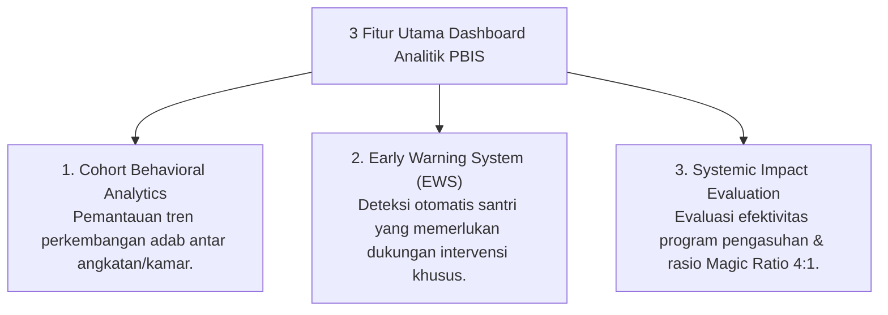

# P5-12: Dashboard Analitik PBIS dan Early Warning System (EWS)

## Status Dokumen
* **Status**: 🌟 **A+ (Tervalidasi & Siap Diimplementasikan)**
* **Sub-Domain**: `05 Assessment Framework / 12 Analytics`
* **Penanggung Jawab Keilmuan**: Dewan Keilmuan TUMBUH (*Pakar Arsitektur Digital Pesantren & Pakar Metodologi Riset*)

---

## 1. Konseptualisasi Dashboard Analitik PBIS

Dashboard Analitik PBIS dirancang untuk menyajikan visualisasi data perilaku, tren adab, serta indikator kesehatan sosial-emosional santri secara *real-time* bagi pimpinan pengasuhan, kepala sekolah, dan tim bimbingan konseling.

---

## 2. Parameter Early Warning System (EWS)

Sistem EWS secara otomatis menandai (*flagging*) santri yang mengalami sinyal resiko:
1. **Sinyal Stagnasi Milestone**: Santri T1 yang belum menunjukkan perbaikan skor adab setelah 4 pekan berturut-turut.
2. **Sinyal Penurunan Emosional**: Penurunan drastis partisipasi sholat berjamaah atau perubahan drastis hasil self-monitoring.
3. **Sinyal Isolasi Sosial**: Santri yang tidak pernah terpilih atau tidak ada catatan interaksi positif dalam survei peer.

---

## 3. Tindakan Responsif Berdasar Data Analitik

- **Pemicu Notifikasi Tim BK**: Sistem EWS mengirimkan notifikasi khusus kepada Konselor BK untuk melakukan sesi *Check-In* privat.
- **Continuous Policy Improvement**: Pimpinan pengasuhan memanfaatkan agregat data bulanan untuk menyesuaikan kebijakan jadwal asrama, beban hafalan, atau menu kegiatan santri.
