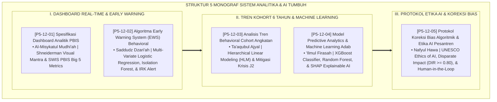

# P5-12: DOKUMEN INDUK DASHBOARD ANALITIK PBIS DAN EARLY WARNING SYSTEM
## *Arsitektur dan Rekayasa Sistem Analitika Pembinaan Komprehensif, Early Warning System (EWS), Pemodelan Kohort Longitudinal, Predictive Machine Learning Adab, Serta Tata Kelola Etika AI (Spesifikasi Dashboard Analitik PBIS Form DAB, Algoritma EWS Behavioral Form EWS, Analisis Tren Kohort 6 Tahun Form TBC, Model Machine Learning Adab Form PML, Serta Protokol Etika AI Form EAI) di Ekosistem TUMBUH Pesantren*

**Nomor Identifikasi**: `P5-12/DOKUMEN-INDUK-DASHBOARD-ANALITIK-EWS/2026`  
**Domain**: `05 Assessment Framework` > `12 Analytics` (Gugus Sub-Domain 12: *Comprehensive Real-Time Analytics, Behavioral Early Warning Systems, Cohort Trajectories, Predictive AI, & Ethical AI Governance*)  
**Klasifikasi Naskah**: *Master Architecture & Navigation Monograph* (Dokumen Induk Peta Jalan Riset & Navigasi 5 Monograf Ilmiah Sistem Analitika, EWS, dan AI Adab)  
**Rumpun Disiplin Pengkaji**: Analitika Visual Pendidikan, Predictive Learning Analytics & Machine Learning, Hierarchical Linear Modeling (HLM), Ethical AI Governance, Fiqh Al-Bashirah  

---

> ### 💡 INTISARI EKSEKUTIF (EXECUTIVE SUMMARY)
>
> * **Kedudukan Strategis Gugus Dashboard Analitik PBIS dan Early Warning System:**  
>   Gugus *Analytics (Dashboard Analitik PBIS dan EWS)* merupakan menara pemantau intelijen dan sistem radar keselamatan fitrah (*The Intelligent Safety Radar Tower*) dalam ekosistem TUMBUH. Gugus ini mengubah manajemen pesantren dari reaktif menjadi proaktif-prediktif, menyajikan dashboard real-time 24 jam dengan metrik SWIS Big 5, mendeteksi sinyal risiko krisis melalui Algoritma EWS malam hari ($IRK$), melacak kurva pertumbuhan kohort 6 tahun dengan model HLM, mengoptimalkan bakat fitrah melalui Machine Learning XAI (XGBoost + SHAP), serta mengunci keadilan teknologi melalui protokol audit etika AI (UNESCO & IEEE 7000).
> * **Integrasi Holistik Turats & Konsensus Sains Analitika Komputasional:**  
>   Gugus riset ini memadukan khazanah agung Islam tentang lentera penerang (*Al-Misykātul Mudhī'ah*), menutup pintu bahaya (*Saddudz Dzarī'ah*), sunnatullah pergantian generasi (*Ta'āqubul Ajyāl*), ilmu firasat (*'Ilmul Firāsah*), dan keadilan suci tanpa hawa nafsu (*Nafyul Hawā wal Qisth*) dengan konsensus sains analitika dunia (*Shneiderman Visual Mantra, SWIS PBIS, Bruce EWI, Raudenbush HLM, Lundberg SHAP, dan Hardt Equalized Odds*).
> * **Struktur Lengkap 5 Berkas Monograf Riset Ilmiah:**  
>   Dokumen induk ini memetakan dan menghubungkan 5 berkas monograf penelitian akademik komprehensif (~145 KB total riset) yang menyajikan antarmuka visual dashboard analitik, formula regresi logistik EWS, model matematis 2-level HLM, pipeline machine learning 48 fitur, dan berita acara audit keadilan etika AI.

---

## 📑 PETA NAVIGASI LIMA MONOGRAF RISET SISTEM ANALITIKA & AI

Berikut adalah daftar lengkap 5 monograf riset akademik dalam gugus **`12 Analytics`**:

---

## 📚 DESKRIPSI RINGKAS 5 BERKAS MONOGRAF

1. **[P5-12-01: Spesifikasi Dashboard Analitik PBIS](file:///c:/xampp/htdocs/tumbuh/05%20Assessment%20Framework/12%20Analytics/P5-12-01-Spesifikasi-Dashboard-Analitik-PBIS.md)**  
   *Membahas arsitektur antarmuka 4 layar dashboard pemantauan 24 jam real-time, doktrin Al-Misykatul Mudhi'ah, Shneiderman Visual Mantra, SWIS PBIS Big 5 Metrics, spatial heatmap, dan form Form DAB-Master.*
2. **[P5-12-02: Algoritma Early Warning System (EWS) Behavioral](file:///c:/xampp/htdocs/tumbuh/05%20Assessment%20Framework/12%20Analytics/P5-12-02-Algoritma-Early-Warning-System-EWS-Behavioral.md)**  
   *Membahas formulasi algoritma regresi logistik 5 prediktor deteksi dini krisis santri, doktrin Saddudz Dzari'ah, Mary Bruce Early Warning Indicators, Indeks Risiko Krisis (IRK), dan tiket Form EWS-Behavioral.*
3. **[P5-12-03: Analisis Tren Behavioral Cohort Angkatan](file:///c:/xampp/htdocs/tumbuh/05%20Assessment%20Framework/12%20Analytics/P5-12-03-Analisis-Tren-Behavioral-Cohort-Angkatan.md)**  
   *Membahas pemodelan analitika pertumbuhan 6 tahun santri, doktrin Ta'aqubul Ajyal salaf, Hierarchical Linear Modeling (HLM 2-Level), mitigasi bottleneck transisi pubertas J2, dan laporan Form TBC-Cohort.*
4. **[P5-12-04: Model Predictive Analytics dan Machine Learning Adab](file:///c:/xampp/htdocs/tumbuh/05%20Assessment%20Framework/12%20Analytics/P5-12-04-Model-Predictive-Analytics-dan-Machine-Learning-Adab.md)**  
   *Membahas pengembangan pipeline machine learning 48 fitur perilaku, doktrin 'Ilmul Firasah nabawi, ensemble XGBoost/Random Forest, SHAP Explainable AI, panduan preskriptif, dan form Form PML-Model.*
5. **[P5-12-05: Protokol Koreksi Bias Algoritmik dan Etika AI Pesantren](file:///c:/xampp/htdocs/tumbuh/05%20Assessment%20Framework/12%20Analytics/P5-12-05-Protokol-Koreksi-Bias-Algoritmik-dan-Etika-AI-Pesantren.md)**  
   *Membahas tata kelola keadilan algoritma AI, doktrin Nafyul Hawa salaf, kepatuhan UNESCO Recommendations on Ethics of AI, metrik Disparate Impact Ratio (DIR >= 0.80), Human-in-the-Loop, dan berita acara Form EAI-Audit.*

---

## 🎯 STANDAR PENJAMINAN MUTU SISTEM ANALITIKA & AI

Penerapan gugus **Dashboard Analitik PBIS dan Early Warning System (Analytics)** menjamin bahwa:
1. **Pimpinan Memiliki Penglihatan Penuh Atas Seluruh Denyut Pesantren 24 Jam (*Total Situational Awareness*)**: Setiap insiden terdeteksi dalam hitungan detik, dan intervensi preventif selalu mendahului krisis.
2. **Krisis Santri Tercegah Sebelum Terjadi Kerusakan Nyata (*Proactive Crisis Prevention*)**: Algoritma EWS malam hari menjamin santri yang rentan depresi atau krisis segera mendapatkan perlindungan dan konseling dalam tempo $<24\text{ Jam}$.
3. **Kecerdasan Buatan Tunduk Sepenuhnya di Bawah Nilai Keadilan Islam (*Fair & Ethical AI Leadership*)**: Seluruh model komputasi bebas dari bias demografis, transparan melalui SHAP Explainability, dan diawasi langsung oleh kebijaksanaan para masyayikh pendidik manusia.
