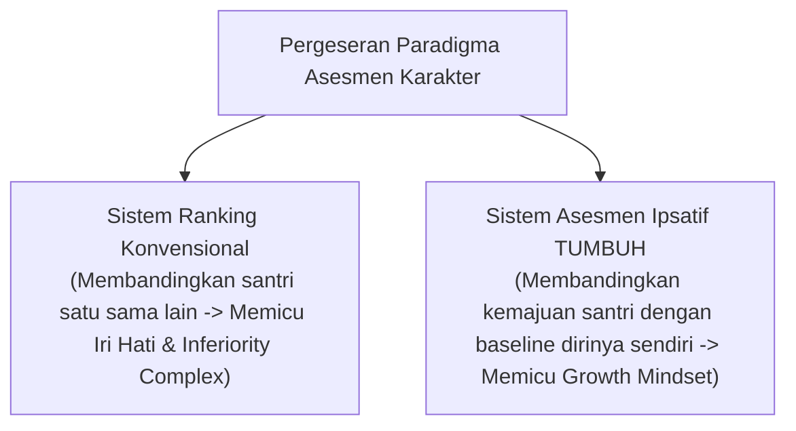

# MONOGRAF RISET AKADEMIK: METODOLOGI ASESMEN IPSATIF DAN PSIKOMETRI PEMBINAAN KARAKTER PESANTREN
## Evaluasi Integratif: Asesmen Tazkiyah Mandiri, Observasi PBIS 360-Derajat, dan Eliminasi Bias Ranking Publisitas

**Dewan Riset & Keilmuan Ekosistem TUMBUH**  
*Dipublikasikan sebagai Naskah Monograf Riset Ilmiah (Jurnal Kebijakan & Asesmen Psikometri Pendidikan)*  
*Dokumen Rujukan Induk: Domain 05 Assessment Framework & Book Series Volume 01-05*

---

## ABSTRAK

> **Latar Belakang**: Praktik asesmen tradisional yang berfokus pada ranking publisitas (*norm-referenced ranking*) terbukti memicu kecemasan kognitif, mengikis motivasi intrinsik santri yang lambat bertumbuh, dan mendorong kepatuhan pencitraan (*superficial compliance*).
>
> **Tujuan Penelitian**: Merumuskan dan memvalidasi metodologi **Asesmen Ipsatif (*Ipsative Growth Assessment*)** di pesantren yang mengukur kemajuan perkembangan karakter santri dibandingkan dengan kondisi awal dirinya sendiri, serta memadukan muhasabah batin dengan observasi perilaku terukur (*PBIS 360-degree observation*).
>
> **Hasil Riset**: Terformulasikan sistem asesmen terintegrasi: (1) *Self-Assessment Fitrah & Tazkiyah* untuk melatih metakognisi batin; (2) *Master Rubrik Perilaku 4-Level PBIS* (Emerging, Developing, Proficient, Exemplary) untuk observasi objektif Musyrif; (3) *Asesmen Formatif Real-Time* (Exit Ticket & Quick Checks); dan (4) *Raport Karakter Periodik PBIS* dengan grafik radar 10 Muwashafat dan narasi pengasuhan hangat.
>
> **Kata Kunci**: *Assessment Framework, Asesmen Ipsatif, Rubrik PBIS, Tazkiyatun Nafs, Raport Karakter.*

---

## 1. PENDAHULUAN & DIALEKTIKA ASESMEN

Asesmen dalam Islam adalah instrumen muhasabah untuk membantu santri bertumbuh (*Assessment for Growth*), bukan alat pelabelan buruk atau permusuhan statistik.

---

## 2. KAJIAN PSIKOMETRI & VALIDASI INSTRUMEN (10 MUWASSHAFAT)

| Instrumen Asesmen | Fungsi Pengukuran | Pelaksana Asesmen | Sifat Kerahasiaan Data |
| :--- | :--- | :--- | :--- |
| **1. Rubrik PBIS 4-Level** | Observasi Perilaku Adab Harian (10 Muwashafat). | Musyrif Kamar & Wali Kelas | Data Internal Terenkripsi |
| **2. Self-Assessment Fitrah** | Introspeksi Batin & Kesadaran Emosional. | Santri Mandiri | Privat Santri & Konselor BK |
| **3. Form FBA Diagnostik** | Analisis Pemicu & Fungsi Perilaku Tier 3. | Tim Bimbingan Konseling | Strictly Confidential BK |
| **4. Raport Karakter PBIS** | Laporan Grafik Radar & Narasi Perkembangan. | Lembaga Pesantren | Disampaikan kepada Orang Tua |

---

## 3. IMPLIKASI KEBIJAKAN PENILAIAN PERIODE LULUS
- **Transkrip Karakter PBIS**: Lulusan pesantren menerima Ijazah Formal dan Transkrip Karakter PBIS yang merekam rekam jejak pertumbuhan adab dari Tangga T1 hingga T4.

---

## 4. DAFTAR PUSTAKA
* Dweck, C. S. (2006). *Mindset: The New Psychology of Success*. Random House.
* Hattie, J. (2009). *Visible Learning*. Routledge.
* Horner, R. H., & Sugai, G. (2015). School-wide PBIS. *Behavior Analysis in Practice*, 8(1), 80–85.
