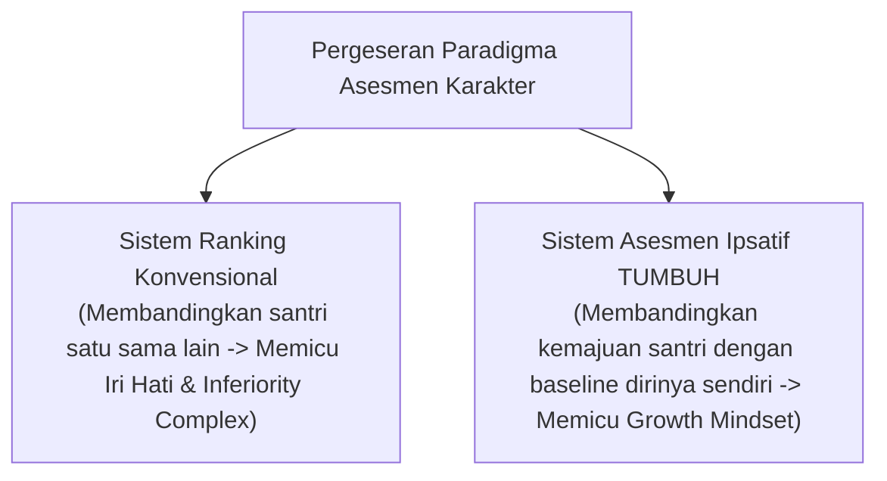
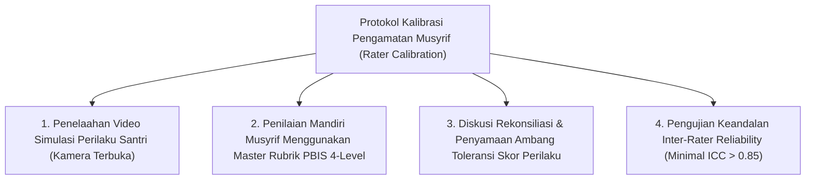

# MONOGRAF RISET AKADEMIK: METODOLOGI ASESMEN IPSATIF DAN PSIKOMETRI PEMBINAAN KARAKTER PESANTREN
## Evaluasi Integratif: Asesmen Tazkiyah Mandiri, Observasi PBIS 360-Derajat, Sosialisasi Raport Orang Tua, dan Kalibrasi Pengamatan (Rater Calibration)

**Dewan Riset & Keilmuan Ekosistem TUMBUH**  
*Dipublikasikan sebagai Naskah Monograf Riset Ilmiah (Jurnal Kebijakan & Asesmen Psikometri Pendidikan)*  
*Dokumen Rujukan Induk: Domain 05 Assessment Framework & Book Series Volume 01-05*

---

## ABSTRAK

> **Latar Belakang**: Praktik asesmen tradisional yang berfokus pada ranking publisitas (*norm-referenced ranking*) terbukti memicu kecemasan kognitif, mengikis motivasi intrinsik santri yang lambat bertumbuh, dan mendorong kepatuhan pencitraan (*superficial compliance*). Di sisi lain, orang tua santri membutuhkan kejelasan informasi cara membaca Raport Ipsatif, dan penilaian Musyrif membutuhkan kalibrasi agar bebas dari bias subjektif (*Rater Bias*).
>
> **Tujuan Penelitian**: Merumuskan dan memvalidasi metodologi **Asesmen Ipsatif (*Ipsative Growth Assessment*)** di pesantren, menyusun panduan edukasi sosialisasi raport untuk orang tua, serta menetapkan *Rater Calibration Protocol* bagi seluruh Musyrif.
>
> **Hasil Riset**: Terformulasikan sistem asesmen terintegrasi: (1) *Self-Assessment Fitrah & Tazkiyah* untuk metakognisi batin; (2) *Master Rubrik Perilaku 4-Level PBIS* (Emerging, Developing, Proficient, Exemplary) untuk observasi Musyrif; (3) *Rater Calibration Protocol* untuk menyamakan persepsi antar-musyrif; dan (4) *Parent Engagement & Raport Guide* untuk memandu orang tua membaca Grafik Radar 10 Muwashafat.
>
> **Kata Kunci**: *Assessment Framework, Asesmen Ipsatif, Rubrik PBIS, Tazkiyatun Nafs, Raport Karakter, Rater Calibration, Parent Engagement.*

---

## 1. PENDAHULUAN & DIALEKTIKA ASESMEN

Asesmen dalam Islam adalah instrumen muhasabah untuk membantu santri bertumbuh (*Assessment for Growth*), bukan alat pelabelan buruk atau permusuhan statistik.

---

## 2. KAJIAN PSIKOMETRI & VALIDASI INSTRUMEN (10 MUWASSHAFAT)

| Instrumen Asesmen | Fungsi Pengukuran | Pelaksana Asesmen | Sifat Kerahasiaan Data |
| :--- | :--- | :--- | :--- |
| **1. Rubrik PBIS 4-Level** | Observasi Perilaku Adab Harian (10 Muwashafat). | Musyrif Kamar & Wali Kelas | Data Internal Terenkripsi |
| **2. Self-Assessment Fitrah** | Introspeksi Batin & Kesadaran Emosional. | Santri Mandiri | Privat Santri & Konselor BK |
| **3. Form FBA Diagnostik** | Analisis Pemicu & Fungsi Perilaku Tier 3. | Tim Bimbingan Konseling | Strictly Confidential BK |
| **4. Raport Karakter PBIS** | Laporan Grafik Radar & Narasi Perkembangan. | Lembaga Pesantren | Disampaikan kepada Orang Tua |

---

## 3. PROTOKOL KALIBRASI PENGAMATAN MUSYRIF (RATER CALIBRATION PROTOCOL)

Untuk mengatasi bias observasi subjektif antar-musyrif (*Low Inter-Rater Reliability*), ditetapkan protokol kalibrasi pengamatan sebelum awal semester:

---

## 4. PANDUAN SOSIALISASI RAPORT IPSATIF KEPADA ORANG TUA

1. **Prinsip Edukasi**: Mengarahkan fokus orang tua dari *pencarian angka ranking* menuju *apresiasi grafik radar pertumbuhan mandiri anak*.
2. **Komponen Laporan Raport**:
   - **Grafik Radar 10 Muwashafat**: Visualisasi 10 Dimensi Karakter.
   - **Skor Pertumbuhan Ipsatif**: Persentase kemajuan anak dibanding semester sebelumnya.
   - **Narasi Pengasuhan Musyrif**: Catatan kualitatif apresiatif yang menyoroti kekuatan unik & rekomendasi bimbingan di rumah.

---

## 5. IMPLIKASI KEBIJAKAN PENILAIAN PERIODE LULUS
- **Transkrip Karakter PBIS**: Lulusan pesantren menerima Ijazah Formal dan Transkrip Karakter PBIS yang merekam rekam jejak pertumbuhan adab dari Tangga T1 hingga T4.

---

## 6. DAFTAR PUSTAKA
* Dweck, C. S. (2006). *Mindset: The New Psychology of Success*. Random House.
* Hattie, J. (2009). *Visible Learning*. Routledge.
* Horner, R. H., & Sugai, G. (2015). School-wide PBIS. *Behavior Analysis in Practice*, 8(1), 80–85.
