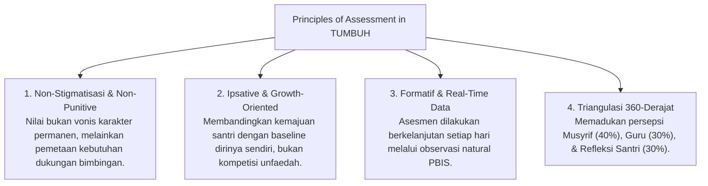
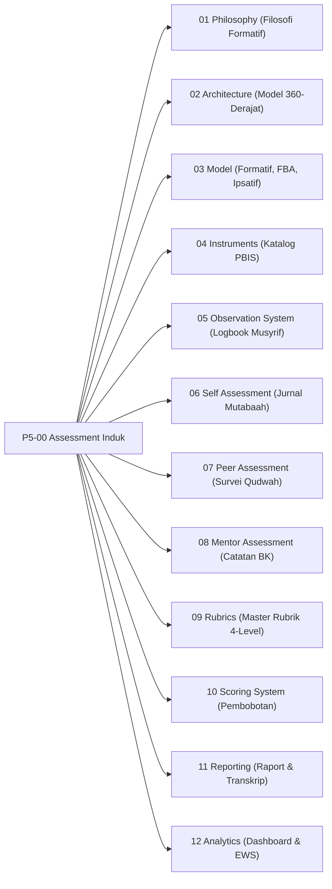

# P5-00: Assessment Framework Induk (Kerangka Asesmen Karakter Ekosistem TUMBUH)

## Status Dokumen
* **Status**: 🌟 **A+ (Tervalidasi & Induk Baku)**
* **Domain**: Project 5 — `05 Assessment Framework`
* **Penanggung Jawab Keilmuan**: Dewan Keilmuan TUMBUH (*Pakar Metodologi Riset, Pakar Arsitektur PBIS Restoratif, & Pakar Filosofi TUMBUH*)

---

## 1. Pendahuluan & Falsafah Asesmen Karakter

Dalam ekosistem **TUMBUH**, asesmen karakter dan adab dipahami bukan sebagai alat penghakiman, perangkingan, atau pemberian stigma negatif (*labelling*), melainkan sebagai **sarana tazkiyah dan cermin pertumbuhan fitrah santri** (*Assessment FOR Growth and Learning*).

---

## 2. Model Triad Pertumbuhan Simbiotik dalam Asesmen

- **Santri Tumbuh**: Mendapatkan umpan balik kualitatif konstruktif yang membakar motivasi *Growth Mindset* dan kesadaran diri (*Self-Awareness*).
- **Musyrif & Guru Tumbuh**: Terlindungi dari bias subjektif melalui pencatatan logbook objektif PBIS dan panduan rubrik 4-level yang jelas.
- **Sistem Lembaga Tumbuh**: Memiliki dashboard analitik berbasis data (*Data-Driven Decision Making*) untuk menyempurnakan kurikulum dan intervensi pembinaan.

---

## 3. Empat Kaidah Baku Asesmen TUMBUH

1. **Kaidah Penguatan Positif Utama (*Magic Ratio 4:1 Rule*)**:
   - Pencatatan logbook PBIS wajib mengutamakan apresiasi perilaku positif dibanding pencatatan pelanggaran dengan rasio minimal 4 apresiasi untuk setiap 1 koreksi.
2. **Kaidah Kerahasiaan & Kehormatan Santri (*Privacy Protection Rule*)**:
   - Data asesmen perilaku dan hasil konseling bersifat rahasia. Dilarang keras mengumumkan daftar santri pelanggar di papan pengumuman umum atau di hadapan majlis.
3. **Kaidah Analisis Fungsional Perilaku (*FBA Rule*)**:
   - Setiap pelanggaran berulang wajib dianalisis akar penyebabnya (Functional Behavior Assessment) sebelum diberikan intervensi restoratif.
4. **Kaidah Portofolio Bukti Otentik (*Authentic Evidence Rule*)**:
   - Penilaian adab dan karakter wajib didasarkan pada portofolio bukti otentik dalam kehidupan harian asrama dan kelas, bukan sekadar ujian tertulis.

---

## 4. Peta Hubungan Sub-Domain Asesmen

---

## 5. Rujukan Keilmuan Multidisiplin

1. **Turats Islam**: Kitab *Adabul 'Alim wal Muta'allim* (Imam An-Nawawi), *Ihya 'Ulumuddin* (Imam Al-Ghazali - *Tazkiyatun Nafs*).
2. **Sains Kontemporer**: *School-Wide PBIS Assessment Framework* (Sugai & Horner), *Ipsative Assessment* (Gwyneth Hughes), *Functional Behavior Assessment* (O'Neill et al.), *CASEL Assessment Guide*.
