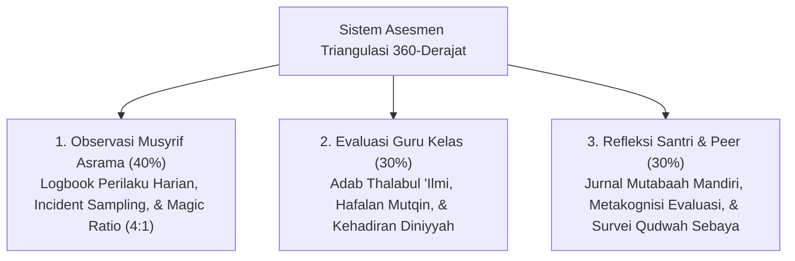

# 05 Assessment Framework (Kerangka Asesmen & Penilaian Karakter Ekosistem TUMBUH)

Domain ini memuat arsitektur asesmen, pengukuran karakter, penilaian formatif-restoratif, serta analisis perkembangan santri melintasi 10 Karakter Utama (*Muwashafat*) dan Tangga TUMBUH (T1–T4). Sistem ini mengawinkan prinsip penyucian jiwa (*Tazkiyatun Nafs*) dengan *School-Wide Positive Behavioral Interventions and Supports* (SW-PBIS), *Functional Behavior Assessment* (FBA), *CASEL Social-Emotional Learning* (SEL), dan *Ipsative Growth Assessment*.

---

## Arsitektur Asesmen 360-Derajat

---

## Indeks Dokumen Induk & 12 Sub-Domain Modul

* 📄 **[P5-00-Assessment-Framework-Induk.md](./P5-00-Assessment-Framework-Induk.md)**: Dokumen Maha-Induk Falsafah, Arsitektur, dan Standar Operasional Asesmen Karakter TUMBUH.

### Sub-Domain 01: Assessment Philosophy
* 📁 **[01 Assessment Philosophy](./01%20Assessment%20Philosophy/)**:
  * 📄 [P5-01-Filosofi-Asesmen-Formatif-Restoratif.md](./01%20Assessment%20Philosophy/P5-01-Filosofi-Asesmen-Formatif-Restoratif.md)
  * 📄 [P5-01-01-Prinsip-Penilaian-Non-Stigmatisasi-dan-Restoratif.md](./01%20Assessment%20Philosophy/P5-01-01-Prinsip-Penilaian-Non-Stigmatisasi-dan-Restoratif.md)
  * 📄 [P5-01-02-Integrasi-Tazkiyatun-Nafs-dan-Asesmen-Fitrah.md](./01%20Assessment%20Philosophy/P5-01-02-Integrasi-Tazkiyatun-Nafs-dan-Asesmen-Fitrah.md)
  * 📄 [P5-01-03-Penerapan-Growth-Mindset-dalam-Umpan-Balik.md](./01%20Assessment%20Philosophy/P5-01-03-Penerapan-Growth-Mindset-dalam-Umpan-Balik.md)
  * 📄 [P5-01-04-Etika-dan-Kerahasiaan-Data-Asesmen-Santri.md](./01%20Assessment%20Philosophy/P5-01-04-Etika-dan-Kerahasiaan-Data-Asesmen-Santri.md)

### Sub-Domain 02: Assessment Architecture
* 📁 **[02 Assessment Architecture](./02%20Assessment%20Architecture/)**:
  * 📄 [P5-02-Arsitektur-Sistem-Asesmen-360-Derajat.md](./02%20Assessment%20Architecture/P5-02-Arsitektur-Sistem-Asesmen-360-Derajat.md)
  * 📄 [P5-02-01-Model-Triangulasi-Data-360-Derajat.md](./02%20Assessment%20Architecture/P5-02-01-Model-Triangulasi-Data-360-Derajat.md)
  * 📄 [P5-02-02-Alur-Integrasi-Data-Multi-Sumber.md](./02%20Assessment%20Architecture/P5-02-02-Alur-Integrasi-Data-Multi-Sumber.md)
  * 📄 [P5-02-03-Jadwal-dan-Frekuensi-Pengumpulan-Data-PBIS.md](./02%20Assessment%20Architecture/P5-02-03-Jadwal-dan-Frekuensi-Pengumpulan-Data-PBIS.md)

### Sub-Domain 03: Assessment Model
* 📁 **[03 Assessment Model](./03%20Assessment%20Model/)**:
  * 📄 [P5-03-Model-Asesmen-Formatif-Diagnostik-Ipsatif.md](./03%20Assessment%20Model/P5-03-Model-Asesmen-Formatif-Diagnostik-Ipsatif.md)
  * 📄 [P5-03-01-Model-Asesmen-Formatif-Harian-dan-Feedback-Loop.md](./03%20Assessment%20Model/P5-03-01-Model-Asesmen-Formatif-Harian-dan-Feedback-Loop.md)
  * 📄 [P5-03-02-Protokol-Functional-Behavior-Assessment-FBA.md](./03%20Assessment%20Model/P5-03-02-Protokol-Functional-Behavior-Assessment-FBA.md)
  * 📄 [P5-03-03-Metodologi-Asesmen-Ipsatif-Laju-Pertumbuhan-Diri.md](./03%20Assessment%20Model/P5-03-03-Metodologi-Asesmen-Ipsatif-Laju-Pertumbuhan-Diri.md)

### Sub-Domain 04: Assessment Instruments
* 📁 **[04 Assessment Instruments](./04%20Assessment%20Instruments/)**:
  * 📄 [P5-04-Katalog-Instrumen-Asesmen-Karakter.md](./04%20Assessment%20Instruments/P5-04-Katalog-Instrumen-Asesmen-Karakter.md)
  * 📄 [P5-04-01-Instrumen-Logbook-Digital-PBIS-Musyrif.md](./04%20Assessment%20Instruments/P5-04-01-Instrumen-Logbook-Digital-PBIS-Musyrif.md)
  * 📄 [P5-04-02-Instrumen-Check-In-Check-Out-CICO-Tier-2.md](./04%20Assessment%20Instruments/P5-04-02-Instrumen-Check-In-Check-Out-CICO-Tier-2.md)
  * 📄 [P5-04-03-Formulir-Analisis-Diagnostik-Perilaku-FBA.md](./04%20Assessment%20Instruments/P5-04-03-Formulir-Analisis-Diagnostik-Perilaku-FBA.md)
  * 📄 [P5-04-04-Instrumen-Jurnal-Mutabaah-dan-Portofolio-Adab.md](./04%20Assessment%20Instruments/P5-04-04-Instrumen-Jurnal-Mutabaah-dan-Portofolio-Adab.md)

### Sub-Domain 05: Observation System
* 📁 **[05 Observation System](./05%20Observation%20System/)**:
  * 📄 [P5-05-Sistem-Observasi-Perilaku-Musyrif-Asrama.md](./05%20Observation%20System/P5-05-Sistem-Observasi-Perilaku-Musyrif-Asrama.md)
  * 📄 [P5-05-01-Teknik-Observasi-Naturalistik-dan-Time-Sampling.md](./05%20Observation%20System/P5-05-01-Teknik-Observasi-Naturalistik-dan-Time-Sampling.md)
  * 📄 [P5-05-02-Penerapan-Magic-Ratio-4-1-dalam-Pencatatan.md](./05%20Observation%20System/P5-05-02-Penerapan-Magic-Ratio-4-1-dalam-Pencatatan.md)
  * 📄 [P5-05-03-SOP-Pencatatan-Incident-Logbook-Objektif.md](./05%20Observation%20System/P5-05-03-SOP-Pencatatan-Incident-Logbook-Objektif.md)

### Sub-Domain 06: Self Assessment
* 📁 **[06 Self Assessment](./06%20Self%20Assessment/)**:
  * 📄 [P5-06-Sistem-Asesmen-Diri-dan-Jurnal-Refleksi.md](./06%20Self%20Assessment/P5-06-Sistem-Asesmen-Diri-dan-Jurnal-Refleksi.md)
  * 📄 [P5-06-01-Metodologi-Muhasabah-dan-Self-Monitoring-Santri.md](./06%20Self%20Assessment/P5-06-01-Metodologi-Muhasabah-dan-Self-Monitoring-Santri.md)
  * 📄 [P5-06-02-Panduan-Jurnal-Refleksi-Malam-3-Pertanyaan.md](./06%20Self%20Assessment/P5-06-02-Panduan-Jurnal-Refleksi-Malam-3-Pertanyaan.md)
  * 📄 [P5-06-03-Instrumen-Evaluasi-Diri-Tangga-TUMBUH.md](./06%20Self%20Assessment/P5-06-03-Instrumen-Evaluasi-Diri-Tangga-TUMBUH.md)

### Sub-Domain 07: Peer Assessment
* 📁 **[07 Peer Assessment](./07%20Peer%20Assessment/)**:
  * 📄 [P5-07-Sistem-Asesmen-Sebaya-dan-Survei-Qudwah.md](./07%20Peer%20Assessment/P5-07-Sistem-Asesmen-Sebaya-dan-Survei-Qudwah.md)
  * 📄 [P5-07-01-Asesmen-Sebaya-Berbasis-Ukhuwah-Islamiyah.md](./07%20Peer%20Assessment/P5-07-01-Asesmen-Sebaya-Berbasis-Ukhuwah-Islamiyah.md)
  * 📄 [P5-07-02-Survei-Keteladanan-Qudwah-Senior-T4.md](./07%20Peer%20Assessment/P5-07-02-Survei-Keteladanan-Qudwah-Senior-T4.md)
  * 📄 [P5-07-03-Lingkaran-Apresiasi-Kawan-Se-Kamar.md](./07%20Peer%20Assessment/P5-07-03-Lingkaran-Apresiasi-Kawan-Se-Kamar.md)

### Sub-Domain 08: Mentor Assessment
* 📁 **[08 Mentor Assessment](./08%20Mentor%20Assessment/)**:
  * 📄 [P5-08-Sistem-Asesmen-Musyrif-dan-Wali-Kelas.md](./08%20Mentor%20Assessment/P5-08-Sistem-Asesmen-Musyrif-dan-Wali-Kelas.md)
  * 📄 [P5-08-01-Peran-Musyrif-sebagai-Evaluator-Empatis.md](./08%20Mentor%20Assessment/P5-08-01-Peran-Musyrif-sebagai-Evaluator-Empatis.md)
  * 📄 [P5-08-02-Format-Catatan-Narasi-Perkembangan-Kualitatif.md](./08%20Mentor%20Assessment/P5-08-02-Format-Catatan-Narasi-Perkembangan-Kualitatif.md)
  * 📄 [P5-08-03-Periodic-Progress-Review-dan-Sesi-Refleksi.md](./08%20Mentor%20Assessment/P5-08-03-Periodic-Progress-Review-dan-Sesi-Refleksi.md)

### Sub-Domain 09: Rubrics
* 📁 **[09 Rubrics](./09%20Rubrics/)**:
  * 📄 [P5-09-Master-Rubrik-Perilaku-4-Level-PBIS.md](./09%20Rubrics/P5-09-Master-Rubrik-Perilaku-4-Level-PBIS.md)
  * 📄 [P5-09-01-Rubrik-Karakter-Spiritual-dan-Ibadah.md](./09%20Rubrics/P5-09-01-Rubrik-Karakter-Spiritual-dan-Ibadah.md)
  * 📄 [P5-09-02-Rubrik-Karakter-Fisik-Intelektual-dan-Mujahadah.md](./09%20Rubrics/P5-09-02-Rubrik-Karakter-Fisik-Intelektual-dan-Mujahadah.md)
  * 📄 [P5-09-03-Rubrik-Karakter-Manajemen-Waktu-dan-Khidmah.md](./09%20Rubrics/P5-09-03-Rubrik-Karakter-Manajemen-Waktu-dan-Khidmah.md)

### Sub-Domain 10: Scoring System
* 📁 **[10 Scoring System](./10%20Scoring%20System/)**:
  * 📄 [P5-10-Sistem-Pembobotan-dan-Formulasi-Skor.md](./10%20Scoring%20System/P5-10-Sistem-Pembobotan-dan-Formulasi-Skor.md)
  * 📄 [P5-10-01-Algoritma-Pembobotan-Skor-Triangulasi-360.md](./10%20Scoring%20System/P5-10-01-Algoritma-Pembobotan-Skor-Triangulasi-360.md)
  * 📄 [P5-10-02-Skala-Konversi-Kuantitatif-ke-Predikat-Kualitatif.md](./10%20Scoring%20System/P5-10-02-Skala-Konversi-Kuantitatif-ke-Predikat-Kualitatif.md)
  * 📄 [P5-10-03-Perhitungan-Bonus-Pertumbuhan-Diri-Ipsatif.md](./10%20Scoring%20System/P5-10-03-Perhitungan-Bonus-Pertumbuhan-Diri-Ipsatif.md)

### Sub-Domain 11: Reporting
* 📁 **[11 Reporting](./11%20Reporting/)**:
  * 📄 [P5-11-Sistem-Pelaporan-dan-Transkrip-Karakter.md](./11%20Reporting/P5-11-Sistem-Pelaporan-dan-Transkrip-Karakter.md)
  * 📄 [P5-11-01-Spesifikasi-Raport-Karakter-Periodik-PBIS.md](./11%20Reporting/P5-11-01-Spesifikasi-Raport-Karakter-Periodik-PBIS.md)
  * 📄 [P5-11-02-Format-Transkrip-Adab-dan-QR-Code-Verification.md](./11%20Reporting/P5-11-02-Format-Transkrip-Adab-dan-QR-Code-Verification.md)
  * 📄 [P5-11-03-SOP-Komunikasi-Laporan-Perkembangan-Orang-Tua.md](./11%20Reporting/P5-11-03-SOP-Komunikasi-Laporan-Perkembangan-Orang-Tua.md)

### Sub-Domain 12: Analytics
* 📁 **[12 Analytics](./12%20Analytics/)**:
  * 📄 [P5-12-Dashboard-Analitik-PBIS-dan-Early-Warning-System.md](./12%20Analytics/P5-12-Dashboard-Analitik-PBIS-dan-Early-Warning-System.md)
  * 📄 [P5-12-01-Spesifikasi-Dashboard-Analitik-PBIS.md](./12%20Analytics/P5-12-01-Spesifikasi-Dashboard-Analitik-PBIS.md)
  * 📄 [P5-12-02-Algoritma-Early-Warning-System-EWS-Behavioral.md](./12%20Analytics/P5-12-02-Algoritma-Early-Warning-System-EWS-Behavioral.md)
  * 📄 [P5-12-03-Analisis-Tren-Behavioral-Cohort-Angkatan.md](./12%20Analytics/P5-12-03-Analisis-Tren-Behavioral-Cohort-Angkatan.md)
