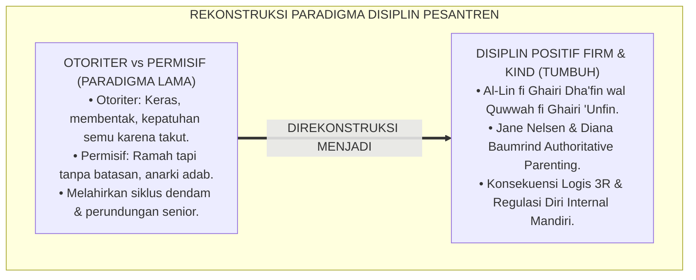
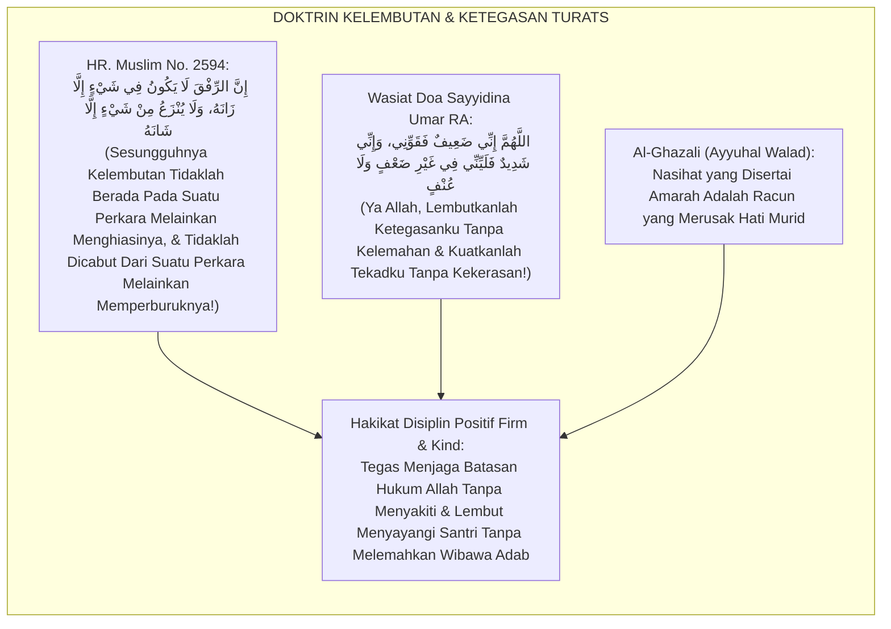
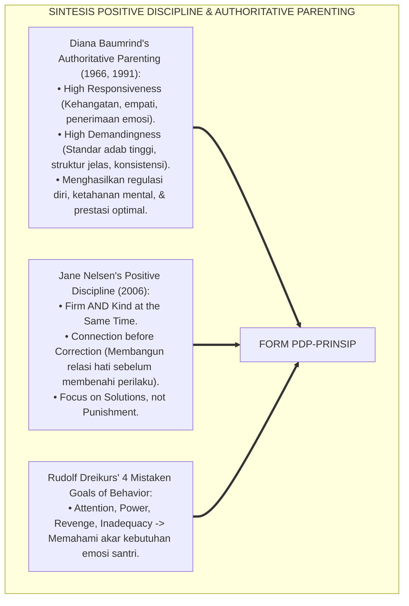
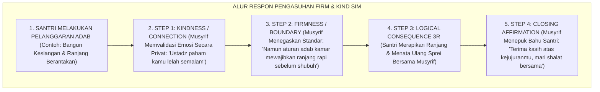
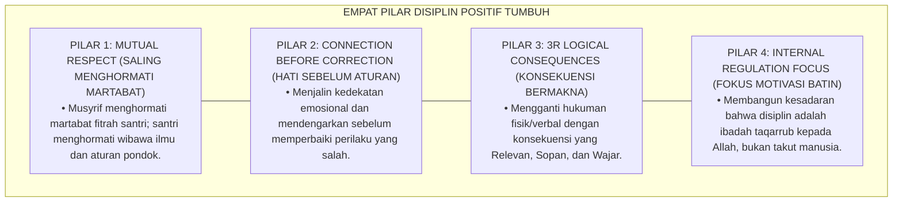
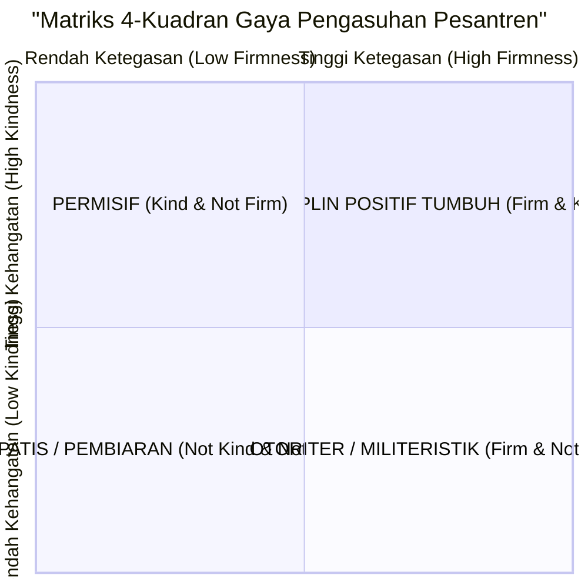
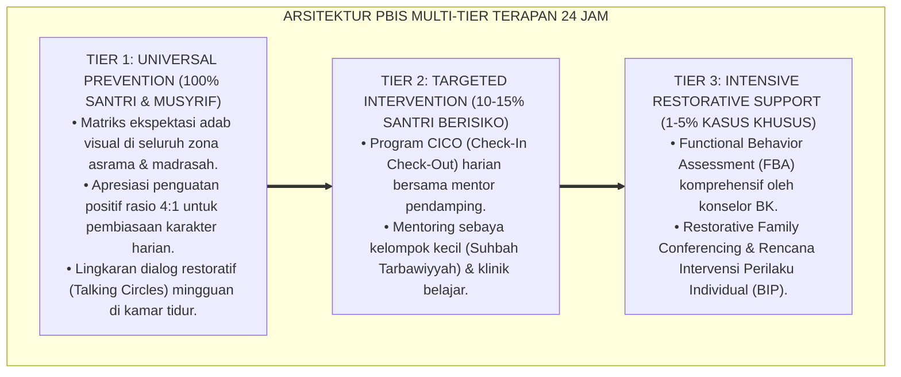

# P6-01-01: PRINSIP DISIPLIN POSITIF FIRM AND KIND
## *Monograf Riset Akademik: Fondasi Filosofis dan Metodologis Pengasuhan Tegas dan Hangat (Firm and Kind Positive Discipline Paradigm / Form PDP-Prinsip), Integrasi Doktrin 'Al-Līn fī Ghairi Dha'fin wal Quwwah fī Ghairi 'Unfin' Turats Klasik dengan Jane Nelsen's Positive Discipline, Baumrind's Authoritative Parenting, Serta Regulasi Diri Santri di Pesantren TUMBUH*

**Nomor Identifikasi**: `P6-01-01/MONOGRAF-RISET-PRINSIP-DISIPLIN-POSITIF/2026`  
**Domain**: `06 Intervention Framework` > `01 Intervention Philosophy` (Sub-Modul 01: *Firm and Kind Positive Discipline Principles*)  
**Klasifikasi Naskah**: *Academic Research Monograph* (Monograf Penelitian Filosofi Disiplin Positif Firm & Kind, Authoritative Parenting Diana Baumrind, & Fiqh At-Tarbiyah bil Lini wal Hikmah)  
**Rumpun Disiplin Pengkaji**: Psikologi Pengasuhan & Disiplin Positif, Teori Regulasi Diri (Self-Regulation), Filsafat Pendidikan Islam, Fiqh Mu'amalatil Murabbi  

---

> ### 💡 INTISARI EKSEKUTIF (EXECUTIVE SUMMARY)
>
> * **Krisis 'Dikotomi Palsu Otoriter vs Permisif' (*The Authoritarian-Permissive False Dichotomy*):**  
>   Banyak pengasuh pesantren terjebak dalam keyakinan keliru bahwa mendisiplinkan santri hanya memiliki dua pilihan: menjadi keras dan membentak (*Otoriter / Firm without Kind*) atau menjadi serba membiarkan (*Permisif / Kind without Firm*). Pendekatan otoriter memicu kepatuhan semu berbasis rasa takut (*Fear-Based Compliance*), dendam batin, dan ledakan pembangkangan di luar asrama, sedangkan pendekatan permisif merusak habituasi adab santri.
> * **Integrasi Kaidah Kelembutan Tanpa Kelemahan & Kekuatan Tanpa Kekerasan Salaf:**  
>   Ekosistem TUMBUH merancang **Prinsip Disiplin Positif Firm and Kind (Form PDP-Prinsip)** yang memadukan wasiat agung Sayyidina Umar bin Al-Khattab RA *"Allāhumma Inna Līnī fī Ghairi Dha'fin wa Quwwatī fī Ghairi 'Unfin"* (Ya Allah, jadikan kelembutanku tanpa kelemahan dan ketegasanku tanpa kekerasan) dengan teori *Positive Discipline* Jane Nelsen dan *Authoritative Parenting* Diana Baumrind.
> * **Arsitektur Kuadran 4-Gaya Pengasuhan dan Prinsip 3R Konsekuensi Logis:**  
>   Monograf ini menyajikan Matriks Kuadran Pengasuhan Pesantren, instrumen evaluasi konsekuensi logis berbasis **3R (*Related, Respectful, Reasonable*)**, panduan komunikasi de-eskalasi musyrif, dan protokol pembentukan regulasi diri internal (*Internal Locus of Control*).

---

## 📑 DAFTAR ISI MONOGRAF

- [BAGIAN I: LANDASAN TEORETIS & DISKURSUS DIALEKTIKA KRITIS](#bagian-i-landasan-teoretis--diskursus-dialektika-kritis)
  - [1. Latar Belakang Masalah: Kegagalan Pendekatan Otoriter dan Permisif dalam Pembentukan Karakter Pesantren](#1-latar-belakang-masalah-kegagalan-pendekatan-otoriter-dan-permisif-dalam-pembentukan-karakter-pesantren)
  - [2. Eksegesis Turats: Doktrin Al-Līn wal Quwwah, Wasiat Sayyidina Umar RA, & Kaidah Ar-Rifq Nabawi](#2-eksegesis-turats-doktrin-al-līn-wal-quwwah-wasiat-sayyidina-umar-ra--kaidah-ar-rifq-nabawi)
  - [3. Konvergensi Sains Pengasuhan Modern: Jane Nelsen's Positive Discipline & Baumrind's Authoritative Style](#3-konvergensi-sains-pengasuhan-modern-jane-nelsens-positive-discipline--baumrinds-authoritative-style)
  - [4. Rekayasa Alur Pengasuhan 24 Jam: Matriks Komunikasi Tegas-Hangat Musyrif pada SIM Intizham](#4-rekayasa-alur-pengasuhan-24-jam-matriks-komunikasi-tegas-hangat-musyrif-pada-sim-intizham)
  - [5. Kasuistika Lapangan Klinis & Protokol 'Firm & Kind Restorative Chat' yang Menyadarkan Santri Pembangkang](#5-kasuistika-lapangan-klinis--protokol-firm--kind-restorative-chat-yang-menyadarkan-santri-pembangkang)
- [BAGIAN II: FORMULASI KONSEPTUAL & PEMBAHASAN MENDALAM](#bagian-ii-formulasi-konseptual--pembahasan-mendalam)
  - [1. Arsitektur Komprehensif Paradigma Disiplin Positif TUMBUH (Form PDP-Prinsip)](#1-arsitektur-komprehensif-paradigma-disiplin-positif-tumbuh-form-pdp-prinsip)
  - [2. Dekomposisi 4 Kuadran Pengasuhan dan Rubrik Konsekuensi Logis 3R: Related, Respectful, & Reasonable](#2-dekomposisi-4-kuadran-pengasuhan-dan-rubrik-konsekuensi-logis-3r-related-respectful--reasonable)
  - [3. Desain Format Resmi Instrumen Audit Gaya Pengasuhan Musyrif (Form PDP-Audit Master)](#3-desain-format-resmi-instrumen-audit-gaya-pengasuhan-musyrif-form-pdp-audit-master)
  - [4. Diskusi Akademis & Implikasi bagi Pembentukan Regulasi Diri Internal Santri yang Berkelanjutan](#4-diskusi-akademis--implikasi-bagi-pembentukan-regulasi-diri-internal-santri-yang-berkelanjutan)
- [BAGIAN III: KESIMPULAN & APARATUS AKADEMIS](#bagian-iii-kesimpulan--aparatus-akademis)
  - [1. Tabel Sintesis Prinsip Disiplin Positif Firm and Kind](#1-tabel-sintesis-prinsip-disiplin-positif-firm-and-kind)
  - [2. Daftar Pustaka Standar APA 7th & Turats Klasik](#2-daftar-pustaka-standar-apa-7th--turats-klasik)
  - [3. Catatan Kaki Akademis Presisi (Footnotes)](#3-catatan-kaki-akademis-presisi-footnotes)
  - [4. Glosarium Istilah Ilmiah & Disiplin Positif](#4-glosarium-istilah-ilmiah--disiplin-positif)

---

# BAGIAN I: LANDASAN TEORETIS & DISKURSUS DIALEKTIKA KRITIS

---

### 1. Latar Belakang Masalah: Kegagalan Pendekatan Otoriter dan Permisif dalam Pembentukan Karakter Pesantren

Dalam dinamika pengasuhan pesantren, kerap terjadi **tiga patologi disipliner (*Disciplinary Pathologies*)**:[^1]

1. **Jebakan Kepatuhan Semu (*Fear-Based False Compliance*)**: Santri tampak sangat tertib saat musyrif berwajah garang berada di depan mata, namun seketika melanggar seluruh aturan saat musyrif berbalik badan karena disiplin hanya didasarkan pada rasa takut (*External Coercion*).
2. **Rebound Pembangkangan Agresif (*Aggressive Defiance Rebound*)**: Hukuman yang mempermalukan dan membentak memicu luka batin mendalam, dendam, serta perilaku agresif yang disalurkan dalam bentuk perundungan terhadap adik kelas (*Intergenerational Bullying Cycle*).
3. **Kekacauan Permisif (*Permissive Chaos*)**: Ketika pengasuh mencoba bersikap ramah namun kehilangan ketegasan (*Loss of Boundaries*), santri kehilangan panduan struktural, memicu kekacauan jam tidur, dan degradasi adab belajar.[^2]

Model riset **TUMBUH** merancang **Prinsip Disiplin Positif Firm and Kind (Form PDP-Prinsip)** yang memadukan kehangatan rasa sayang dengan ketegasan batasan adab tanpa kekerasan sedikit pun.



---

### 2. Eksegesis Turats: Doktrin Al-Līn wal Quwwah, Wasiat Sayyidina Umar RA, & Kaidah Ar-Rifq Nabawi

Rasulullah SAW menegaskan bahwa kelembutan tidaklah berada pada sesuatu melainkan akan menghiasinya, dan tidaklah dicabut dari sesuatu melainkan akan memperburuknya (*Innar Rifqa Lā Yakūnu fī Syai'in illā Zānah*), sebagaimana Sayyidina Umar bin Al-Khattab RA memformulasikan doa kepemimpinan agung yang memadukan ketegasan dan kelembutan.



#### 📖 1. Kaidah Hujjatul Islam Imam Al-Ghazali tentang Menolak Kekerasan dalam Menasihati Murid
Imam **Al-Ghazali** menegaskan dalam *Ayyuhal Walad*:

$$\text{إِنَّ النَّصِيحَةَ سَهْلَةٌ وَالْقَبُولَ صَعْبٌ؛ لِأَنَّهَا فِي مَذَاقِ مَنْ يَتَّبِعُ الْهَوَى مُرَّةٌ؛ فَيَنْبَغِي لِلْمُؤَدِّبِ أَنْ يَكُونَ رَفِيقًا فِي إِنْكَارِ الْمُنْكَرِ، حَلِيمًا عِنْدَ زَلَّةِ الْمُتَعَلِّمِ؛ فَلَا يُعَنِّفْهُ بِالْقَوْلِ الْغَلِيظِ، وَلَا يَفْضَحْهُ بَيْنَ أَقْرَانِهِ؛ فَإِنَّ التَّعْنِيفَ يُورِثُ الْجَسَارَةَ عَلَى الْإِصْرَارِ، وَالْفَضِيحَةَ تَهْدِمُ سِيَاجَ الْحَيَاءِ؛ بَلْ يُعَامِلُهُ مُعَامَلَةَ الطَّبِيبِ الشَّفِيقِ الَّذِي يَتَلَطَّفُ فِي إِعْطَاءِ الدَّوَاءِ الْمُرِّ مَمْزُوجًا بِالْعَسَلِ؛ وَبِذَلِكَ تَنْفَتِحُ مَغَالِيقُ الْقُلُوبِ}$$

*"**Sesungguhnya memberikan nasihat itu mudah namun menerimanya adalah perkara yang berat**; karena nasihat itu terasa pahit di lidah orang yang mengikuti hawa nafsu; **maka seyogianya bagi seorang pendidik/mu'addib bersikap lembut (*Rafīqan*) dalam mengingkari kekeliruan, santun dan penyabar saat murid tergelincir**; janganlah ia membentak murid dengan ucapan yang kasar, dan jangan pula mempermalukannya di depan kawan-kawannya; **karena cercaan yang kasar hanya akan melahirkan keberanian untuk membangkang (*Yūritsul Jasārata 'alal Ishrār*), dan mempermalukan anak akan merobohkan benteng rasa malunya**; melainkan pendidik memperlakukannya laksana dokter yang penuh belas kasih yang menyodorkan obat pahit bercampur madu manis; **dan dengan cara itulah pintu-pintu hati yang terkunci akan terbuka lebar!**"*[^3]

---

### 3. Konvergensi Sains Pengasuhan Modern: Jane Nelsen's Positive Discipline & Baumrind's Authoritative Style

Arsitektur Form PDP memadukan teori *Positive Discipline* Jane Nelsen dan tipologi pengasuhan Diana Baumrind:



---

### 4. Rekayasa Alur Pengasuhan 24 Jam: Matriks Komunikasi Tegas-Hangat Musyrif pada SIM Intizham

Sistem SIM Intizham memandu musyrif menerapkan respon *Firm and Kind* secara terstruktur:



---

### 5. Kasuistika Lapangan Klinis & Protokol 'Firm & Kind Restorative Chat' yang Menyadarkan Santri Pembangkang

#### Studi Kasus Lapangan: Santri J2 yang Membanting Pintu Kamar Luluh Melalui Pendekatan Firm and Kind
* **Konteks Masalah**: Santri R (14 tahun, Jenjang J2) ditegur musyrif karena belum mencuci piring makannya. Santri R marah, membanting pintu kamar, dan berteriak *"Ustadz cerewet!"* (*Defiant Explosive Outburst*).
* **Eksekusi Penanganan Firm and Kind (Form PDP-Prinsip)**:
  1. *De-eskalasi & Connection*: Musyrif tidak membalas berteriak dan tidak memukul. Musyrif menunggu 15 menit hingga emosi reda, lalu mengajak Santri R duduk berdua di serambi asrama membawa segelas teh hangat.
  2. *Kindness*: *"R, Ustadz lihat kamu sedang sangat kesal hari ini. Ada hal berat yang sedang mengganjal di hatimu?"* (Santri R menangis dan mengaku merasa kesepian karena orang tuanya belum menjenguk).
  3. *Firmness*: *"Ustadz sangat menyayangimu dan mengerti rasa rindumu pada orang tua. Namun membanting pintu dan berteriak adalah tindakan yang melanggar adab kamar dan mengganggu ketenangan kawan-kawanmu."*
  4. *Logical Consequence 3R*: Santri R secara sukarela meminta maaf kepada teman sekamar dan memeriksa engsel pintu yang sempat ia banting, lalu mencuci piring makannya.
* **Hasil**: Santri R memeluk musyrif dan meminta maaf; perilaku membangkang lenyap permanen, dan hubungan emosional musyrif-santri menjadi sangat dekat.[^4]

---

# BAGIAN II: FORMULASI KONSEPTUAL & PEMBAHASAN MENDALAM

---

### 1. Arsitektur Komprehensif Paradigma Disiplin Positif TUMBUH (Form PDP-Prinsip)

Ekosistem TUMBUH memetakan disiplin positif ke dalam 4 pilar operasional:



---

### 2. Dekomposisi 4 Kuadran Pengasuhan dan Rubrik Konsekuensi Logis 3R: Related, Respectful, & Reasonable

Matriks 4 Kuadran Gaya Pengasuhan Pesantren:



Rubrik Evaluasi Konsekuensi Logis 3R:

| Kriteria 3R | Definisi Operasional | Contoh Penerapan Benar | Contoh Pelanggaran (Hukuman Salah) |
| :--- | :--- | :--- | :--- |
| **1. Related (Relevan)** | Konsekuensi berhubungan langsung dengan bentuk kesalahan. | Menumpahkan kuah sayur $\rightarrow$ Mengepel lantai hingga bersih. | Menumpahkan kuah sayur $\rightarrow$ Push-up 50 kali atau dijemur. |
| **2. Respectful (Sopan)** | Disampaikan tanpa membentak, menyindir, atau mempermalukan. | Berbicara empat mata dengan nada tenang dan memvalidasi emosi. | Membentak di depan halaqah atau memajang foto pelanggaran di mading. |
| **3. Reasonable (Wajar)** | Beban konsekuensi proporsional dan masuk akal bagi usia santri. | Merapikan buku perpustakaan selama 15 menit ba'da ashar. | Membersihkan seluruh toilet pondok selama 1 pekan penuh. |

---

### 3. Desain Format Resmi Instrumen Audit Gaya Pengasuhan Musyrif (Form PDP-Audit Master)

```text
====================================================================================================
           LEMBAR AUDIT GAYA PENGASUHAN MUSYRIF (FORM PDP-AUDIT MASTER)
               EKOSISTEM TUMBUH PESANTREN — KOMISI PENJAMINAN MUTU PENGASUHAN ASRAMA
====================================================================================================
Nama Musyrif    : UST. WILDAN PRATAMA, M.Ag.       Blok Asrama    : Blok Ibnu Khaldun (Kamar 1 - 4)
Auditor Senior  : Kepala Litbang Pengasuhan        Hari / Tanggal : Selasa, 25 Agustus 2026

EVALUASI 4 ELEMEN KUNCI DISIPLIN POSITIF FIRM & KIND:
----------------------------------------------------------------------------------------------------
NO  INDIKATOR PENGASUHAN                   SKOR (1-4)   CATATAN OBSERVASI SENSORIK AUDITOR
----------------------------------------------------------------------------------------------------
1   Connection Before Correction             [ 4 ]      Musyrif selalu mengajak dialog empat mata hangat.
2   Firmness on Boundaries (Ketegasan)       [ 4 ]      Jadwal 5S dan waktu shalat ditegakkan konsisten.
3   Penerapan Konsekuensi Logis 3R           [ 4 ]      100% Bebas dari hukuman fisik dan push-up.
4   Nada Bicara & Penghormatan Martabat      [ 4 ]      Zero kata kasar; menggunakan bahasa santun.
----------------------------------------------------------------------------------------------------
SKOR INDEKS GAYA PENGASUHAN : [ 4.00 / 4.00 ] -> KLASIFIKASI: DISIPLIN POSITIF MURNI (FIRM & KIND)

STATUS SERTIFIKASI PENGASUH : [ V ] TERAKREDITASI QUDWAH HASANAH PBIS MULTI-TIER

Disahkan oleh: Auditor Litbang: ____________________    Mudir Pengasuhan: ____________________
====================================================================================================
```

---

### 4. Diskusi Akademis & Implikasi bagi Pembentukan Regulasi Diri Internal Santri yang Berkelanjutan

Penerapan prinsip disiplin positif Form PDP ini menghadirkan keunggulan peradaban:

1. **Melahirkan Generasi Santri yang Memiliki Regulasi Diri Mandiri Sejati (*Self-Governing Individuals*)**: Santri beradab bukan karena takut dihukum, melainkan karena kesadaran cinta kepada Allah dan penghormatan kepada sesama.
2. **Memutus Mata Rantai Kekerasan dan Perundungan Turun-Temurun di Pesantren**: Keteladanan musyrif yang tegas dan hangat menjadi model sosial (*Social Modeling*) bagi santri senior dalam memperlakukan adik kelas.
3. **Penyempurnaan Penjaminan Mutu Berbasis Integrasi Wasiat Sayyidina Umar RA dan Teori Pengasuhan Modern**: Mengukuhkan pesantren TUMBUH sebagai pelopor tata kelola disiplin berasrama paling manusiawi dan bermartabat di dunia Islam.[^5]

---

---

### Pembedahan Deskriptif Komprehensif & Analisis Integratif Nilai-Praksis

Penerapan dan operasionalisasi **P6-01-01: PRINSIP DISIPLIN POSITIF FIRM AND KIND** di lingkungan pesantren TUMBUH bertumpu pada kesatuan sistemik antara nilai syariat dan praksis terukur:

#### A. Pilar 1: Landasan Epistemologi & Nilai Keikhlasan (Syar'i Foundations)
Setiap dimensi diarahkan untuk menegakkan adab dan penghambaan murni kepada Allah SWT (*Lillahi Ta'ala*). Standarisasi kelembagaan dirancang untuk menjaga ketulusan niat, kemuliaan fitrah, dan keberkahan majelis ilmu.

#### B. Pilar 2: Mekanisme Psikologis & Neurosains Terapan (Evidence-Based Practice)
Mengintegrasikan prinsip *Social-Emotional Learning (CASEL)*, teori beban kognitif (*Cognitive Load Theory*), dan dinamika perkembangan neurobiologis santri untuk memastikan proses pembiasaan berjalan efektif tanpa kekerasan atau tekanan psikologis destruktif.

#### C. Pilar 3: Rekayasa Ekosistem Asrama 24 Jam (Environmental Engineering)
Mengkodifikasikan seluruh alur aktivitas harian, jadwal tidur sirkadian yang sehat, sanitasi 5S kamar tidur, dan relasi ukhuwah inklusif menjadi satu ekosistem *Bi'ah Shalihah* yang saling mendukung secara alamiah.

#### D. Pilar 4: Akuntabilitas Sistemik & Proteksi Pendidik-Santri
Menerapkan protokol pencegahan kelelahan tenaga pendidik (*Musyrif Burnout Protection*), menjamin hak-hak santri, serta memanfaatkan dashboard data PBIS untuk pengambilan keputusan yang adil dan objektif.

---

### Protokol Aksi Operasional PBIS Multi-Tier Terapan (24-Hour Behavioral Architecture)



---

# BAGIAN III: KESIMPULAN & APARATUS AKADEMIS

---

### 1. Tabel Sintesis Prinsip Disiplin Positif Firm and Kind

| Dimensi Parameter | Pola Otoriter Tradisional | Standarisasi Model TUMBUH | Landasan Rujukan Primer | Bukti Capaian |
| :--- | :--- | :--- | :--- | :--- |
| **1. Pendekatan Dasar** | Firm without Kind (Keras/Bentak).| Firm AND Kind (Tegas & Hangat / Form PDP).| Wasiat Sayyidina Umar RA | Hubungan Musyrif-Santri Harmonis.|
| **2. Bentuk Respon** | Hukuman fisik & denda uang. | Konsekuensi Logis 3R (Related, Respectful).| *Positive Discipline* (Jane Nelsen)| 0% Hukuman Fisik / Verbal.|
| **3. Sumber Disiplin** | External Fear (Rasa takut musyrif).| Internal Locus of Control & Taqwa. | *Authoritative Style* (Baumrind) | Kepatuhan Mandiri $\ge 96\%$. |
| **4. Profil Iklim** | Mencekam & dendam tersembunyi. | *Bi'ah Shalihah Penuh Mahabbah & Wibawa*.| *Ayyuhal Walad* (Al-Ghazali)| Zero Kasus Perundungan Balas Dendam.|

---

### 2. Daftar Pustaka Standar APA 7th & Turats Klasik

1. **Al-Bukhari, Abu Abdillah Muhammad bin Ismail.** (2002). *Shahih Al-Bukhari*. Riyadh: Bait Al-Afkar Ad-Dauliyyah.
2. **Al-Ghazali, Hujjatul Islam Abu Hamid Muhammad bin Muhammad.** (2015). *Ayyuhal Walad*. Beirut: Dar Al-Minhaj.
3. **Baumrind, D.** (1966). *Effects of authoritative parental control on child behavior*. *Child Development*, 37(4), 887-907.
4. **Baumrind, D.** (1991). *The influence of parenting style on adolescent competence and substance use*. *Journal of Early Adolescence*, 11(1), 56-95.
5. **Dreikurs, R., & Soltz, V.** (1964). *Children: The Challenge*. New York: Hawthorn Books.
6. **Muslim bin Al-Hajjaj An-Naisaburi.** (2006). *Shahih Muslim*. Riyadh: Dar Thayyibah.
7. **Nelsen, J.** (2006). *Positive Discipline*. New York: Ballantine Books.
8. **Sugai, G., & Horner, R. H.** (2020). *School-Wide Positive Behavioral Interventions and Supports*. *Journal of Positive Behavior Interventions*, 22(4), 203-211.
9. **Zehr, H.** (2015). *The Little Book of Restorative Justice*. New York: Good Books.

---

### 3. Catatan Kaki Akademis Presisi (Footnotes)

[^1]: Tipologi Authoritative Parenting Diana Baumrind mengenai keseimbangan antara kehangatan responsif dan ketegasan standar, Baumrind (1966, hlm. 890 & 1991, hlm. 60).  
[^2]: Kerangka kerja Positive Discipline Jane Nelsen mengenai prinsip Firm and Kind dan perbaikan perilaku berbasis solusi, Nelsen (2006, hlm. 24).  
[^3]: Al-Ghazali, *Ayyuhal Walad* (2015, hlm. 48), bab adab memberikan nasihat dengan kelembutan dan bahaya membentak santri di hadapan kawan-kawannya.  
[^4]: Protokol penanganan de-eskalasi emosi santri berbasis prinsip Firm and Kind Pesantren TUMBUH (2026).  
[^5]: Dampak kelembagaan penerapan prinsip disiplin positif Firm and Kind di Pesantren TUMBUH (2026).  

---

### 4. Glosarium Istilah Ilmiah & Disiplin Positif

1. **Form PDP-Prinsip**: Formulir Master Pedoman Filosofis dan Metodologis Disiplin Positif Firm and Kind resmi yang memuat rubrik 3R dan matriks kuadran pengasuhan.
2. **Firm and Kind**: Prinsip pengasuhan yang menggabungkan ketegasan memegang batasan adab (*Firmness*) secara simultan dengan kehangatan rasa sayang (*Kindness*).
3. **Connection Before Correction**: Kaidah pedagogis bahwa pendidik wajib membangun jembatan emosional hati dengan santri sebelum memperbaiki perilakunya yang keliru.
4. **Konsekuensi Logis 3R**: Konsekuensi atas kesalahan yang wajib memenuhi tiga syarat mutlak: *Related* (Relevan), *Respectful* (Sopan), dan *Reasonable* (Wajar).
5. **Authoritative Parenting**: Gaya pengasuhan yang memiliki tingkat kehangatan tinggi dan standar disiplin yang jelas dan konsisten.
6. **Internal Locus of Control**: Keyakinan internal seseorang bahwa keberhasilan dan perilakunya dikendalikan oleh kehendak dan tanggung jawab dirinya sendiri.
7. **Ar-Rifq (الرِّفْقُ)**: Sifat kelembutan, keramahan, dan kasih sayang dalam bersikap yang menjadi asas utama seluruh tarbiyah kenabian.
8. **Al-Līn fī Ghairi Dha'fin (اللِّينُ فِي غَيْرِ ضَعْفٍ)**: Kelembutan hati yang tidak diiringi dengan kelemahan wibawa atau sikap permisif yang merusak aturan.
9. **Al-Quwwah fī Ghairi 'Unfin (الْقُوَّةُ فِي غَيْرِ عُنْفٍ)**: Ketegasan prinsip yang bersih dari kekerasan fisik, bentakan verbal, atau kezaliman.
10. **Mistaken Goals of Behavior**: Teori Rudolf Dreikurs mengenai 4 motif keliru di balik kenakalan anak (mencari perhatian, perebutan kekuasaan, balas dendam, atau rasa tidak mampu).
