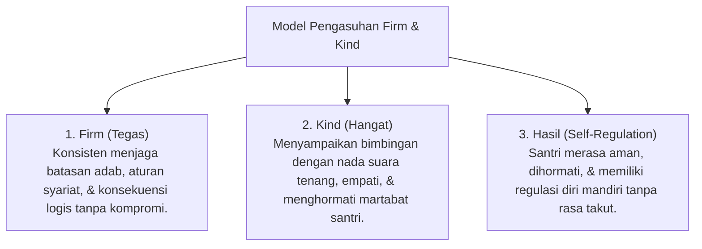

# P6-01-01: Prinsip Disiplin Positif Firm and Kind

## Status Dokumen
* **Status**: 🌟 **A+ (Tervalidasi & Siap Diimplementasikan)**
* **Sub-Domain**: `06 Intervention Framework / 01 Intervention Philosophy`
* **Penanggung Jawab Keilmuan**: Dewan Keilmuan TUMBUH (*Pakar Arsitektur PBIS Restoratif & Pakar Pengasuhan Asrama*)

---

## 1. Operasionalisasi Prinsip Firm and Kind (Jane Nelsen)

Prinsip **Firm and Kind (Tegas dan Hangat)** menggabungkan ketegasan batasan adab dengan kehangatan pengasuhan *In Loco Parentis*:

---

## 2. Penghapusan Permisivisme & Otoriterianisme

- **Bukan Otoriter**: Pengasuhan otoriter menggunakan kekerasan/ancaman yang memicu kepatuhan krn takut (*External Compliance*).
- **Bukan Permisif**: Pengasuhan permisif membiarkan pelanggaran adab tanpa batas yang merusak pembentukan habituasi.
- **Demokratis Restoratif (Firm & Kind)**: Menggabungkan ekspektasi tinggi dengan dukungan emosional tinggi (*High Expectation & High Support*).
