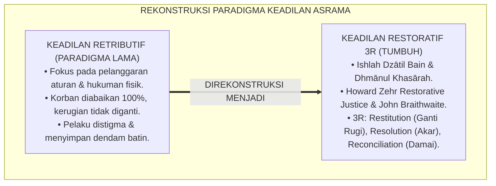
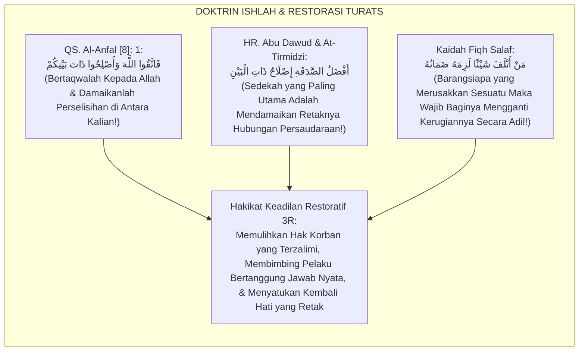
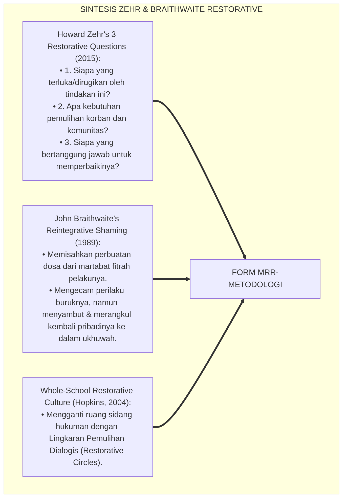
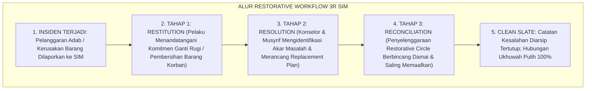
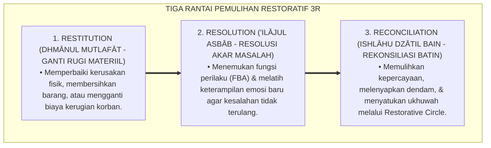
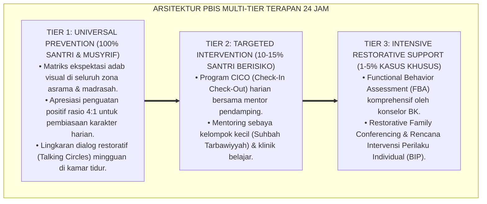

# P6-01-02: METODOLOGI RESTORATIF (RESTITUTION, RESOLUTION, RECONCILIATION)
## *Monograf Riset Akademik: Metodologi Keadilan Restoratif Komprehensif Berbasis Tiga Rantai Pemulihan (Restorative Justice 3R Methodology: Restitution, Resolution, Reconciliation / Form MRR-Metodologi), Integrasi Doktrin 'Al-Ghurmu bil Ghunmi, Raf'ul Madhār, wa Ishlāhu Dzātil Bain' Turats Klasik dengan Zehr's Restorative Framework, Braithwaite's Reintegrative Shaming, Serta Pemulihan Ukhuwah di Ekosistem Pesantren Berbasis TUMBUH*

**Nomor Identifikasi**: `P6-01-02/MONOGRAF-RISET-METODOLOGI-RESTORATIF-3R/2026`  
**Domain**: `06 Intervention Framework` > `01 Intervention Philosophy` (Sub-Modul 02: *Restorative Justice 3R Methodology: Restitution, Resolution, Reconciliation*)  
**Klasifikasi Naskah**: *Academic Research Monograph* (Monograf Penelitian Keadilan Restoratif 3R, Howard Zehr Restorative Theory, & Fiqh Ishlahil Bain wal Ghurmi)  
**Rumpun Disiplin Pengkaji**: Keadilan Restoratif Sekolah/Pesantren (*Restorative Justice in Education*), Resolusi Konflik Komunitas, Psikologi Rekonsiliasi, Fiqh Al-Ishlah  

---

> ### 💡 INTISARI EKSEKUTIF (EXECUTIVE SUMMARY)
>
> * **Krisis 'Keadilan Retributif yang Menyisakan Luka & Dendam' (*The Retributive Justice Trap*):**  
>   Paradigma peradilan asrama tradisional berpusat pada pertanyaan retributif: *"Aturan apa yang dilanggar? Siapa yang salah? Hukuman apa yang pantas diberikan?"*. Hukuman fisik atau skorsing yang dijatuhkan sama sekali tidak memperbaiki kerugian materiil korban, tidak memulihkan retaknya hubungan persaudaraan (*Unhealed Fracture*), dan menstigma pelaku sebagai penjahat selamanya (*Stigmatizing Shaming*).
> * **Integrasi Kaidah Ishlah Dzātil Bain & Zehr's Restorative Justice:**  
>   Ekosistem TUMBUH merancang **Metodologi Restoratif 3R (Form MRR-Metodologi)** yang memadukan perintah agung Al-Qur'an dan Sunnah untuk mendamaikan perselisihan (*Fattaqullāha wa Ashlihū Dzāta Bainikum*) serta kaidah ganti rugi syariat (*Al-Ghurmu bil Ghunm*) dengan *Howard Zehr's Restorative Justice Model* dan *John Braithwaite's Reintegrative Shaming Theory*.
> * **Arsitektur Tiga Rantai Pemulihan Holistik (3R):**  
>   Monograf ini menyajikan 3 tahapan pemulihan utuh: **(1) Restitusi (*Restitution / Dhmānul Khasārah*)** yaitu perbaikan kerugian fisik/materiil korban; **(2) Resolusi (*Resolution / 'Ilājul Asbāb*)** yaitu penyelesaian akar masalah perilaku melalui *Functional Behavior Assessment*; dan **(3) Rekonsiliasi (*Reconciliation / Ishlāhudz Dzāt*)** yaitu pemulihan ikatan ukhuwah batiniah melalui Lingkaran Restoratif (*Restorative Circle*).

---

## 📑 DAFTAR ISI MONOGRAF

- [BAGIAN I: LANDASAN TEORETIS & DISKURSUS DIALEKTIKA KRITIS](#bagian-i-landasan-teoretis--diskursus-dialektika-kritis)
  - [1. Latar Belakang Masalah: Kegagalan Sistem Hukuman Retributif yang Mengabaikan Korban dan Merusak Ukhuwah](#1-latar-belakang-masalah-kegagalan-sistem-hukuman-retributif-yang-mengabaikan-korban-dan-merusak-ukhuwah)
  - [2. Eksegesis Turats: Doktrin Ishlah Dzātil Bain, Dhmānul 'Udwān, & Kaidah Keadilan Pemulihan Salaf](#2-eksegesis-turats-doktrin-ishlah-dzātil-bain-dhmānul-udwān--kaidah-keadilan-pemulihan-salaf)
  - [3. Konvergensi Sains Keadilan Restoratif: Howard Zehr's 3 Restorative Questions & John Braithwaite's Reintegrative Shaming](#3-konvergensi-sains-keadilan-restoratif-howard-zehrs-3-restorative-questions--john-braithwaites-reintegrative-shaming)
  - [4. Rekayasa Alur Pengasuhan 24 Jam: Modul Restorative Workflow & Case Tracking pada SIM Intizham](#4-rekayasa-alur-pengasuhan-24-jam-modul-restorative-workflow--case-tracking-pada-sim-intizham)
  - [5. Kasuistika Lapangan Klinis & Protokol Sidang Restoratif 3R yang Mengubah Pelaku Pencurian Sandal Menjadi Sahabat Karib Korban](#5-kasuistika-lapangan-klinis--protokol-sidang-restoratif-3r-yang-mengubah-pelaku-pencurian-sandal-menjadi-sahabat-karib-korban)
- [BAGIAN II: FORMULASI KONSEPTUAL & PEMBAHASAN MENDALAM](#bagian-ii-formulasi-konseptual--pembahasan-mendalam)
  - [1. Arsitektur Komprehensif Tiga Rantai Pemulihan Restoratif TUMBUH (Form MRR-Metodologi)](#1-arsitektur-komprehensif-tiga-rantai-pemulihan-restoratif-tumbuh-form-mrr-metodologi)
  - [2. Dekomposisi 3 Tahap Rantai Restoratif: Restitution (Tanggung Jawab Nyata), Resolution (Akar Masalah), & Reconciliation (Pemulihan Jiwa)](#2-dekomposisi-3-tahap-rantai-restoratif-restitution-tanggung-jawab-nyata-resolution-akar-masalah--reconciliation-pemulihan-jiwa)
  - [3. Desain Format Resmi Berita Acara Kesepakatan Restoratif 3R (Form MRR-Akad Master)](#3-desain-format-resmi-berita-acara-kesepakatan-restoratif-3r-form-mrr-akad-master)
  - [4. Diskusi Akademis & Implikasi bagi Terwujudnya Budaya Ishlah Tanpa Dendam di Lingkungan Pesantren](#4-diskusi-akademis--implikasi-bagi-terwujudnya-budaya-ishlah-tanpa-dendam-di-lingkungan-pesantren)
- [BAGIAN III: KESIMPULAN & APARATUS AKADEMIS](#bagian-iii-kesimpulan--aparatus-akademis)
  - [1. Tabel Sintesis Metodologi Restoratif 3R](#1-tabel-sintesis-metodologi-restoratif-3r)
  - [2. Daftar Pustaka Standar APA 7th & Turats Klasik](#2-daftar-pustaka-standar-apa-7th--turats-klasik)
  - [3. Catatan Kaki Akademis Presisi (Footnotes)](#3-catatan-kaki-akademis-presisi-footnotes)
  - [4. Glosarium Istilah Ilmiah & Keadilan Restoratif 3R](#4-glosarium-istilah-ilmiah--keadilan-restoratif-3r)

---

# BAGIAN I: LANDASAN TEORETIS & DISKURSUS DIALEKTIKA KRITIS

---

### 1. Latar Belakang Masalah: Kegagalan Sistem Hukuman Retributif yang Mengabaikan Korban dan Merusak Ukhuwah

Dalam penanganan konflik santri di pesantren konvensional, kerap timbul **tiga kelemahan paradigma retributif (*Retributive Injustices*)**:[^1]

1. **Pengabaian Total Hak dan Pemulihan Korban (*Victim Neglect*)**: Ketika sandal atau mushaf seorang santri dirusak temannya, pelaku dihukum push-up oleh pengurus, namun kerugian barang korban tidak pernah diganti dan trauma emosional korban tidak pernah didengarkan.
2. **Ketiadaan Pembelajaran Tanggung Jawab Nyata (*Zero Accountability Learning*)**: Pelaku merasa dosanya sudah lunas begitu selesai menjalani hukuman fisik, tanpa pernah memahami dampak kerugian yang ia timbulkan pada kehidupan orang lain.
3. **Mata Rantai Stigmatisasi Sosial (*Stigmatizing Shaming Cycle*)**: Pelaku dicap sebagai "anak bermasalah" selamanya, membuatnya terasing (*Ostracized*) dan akhirnya membentuk komplotan santri pembangkang (*Deviant Peer Subculture*).[^2]

Model riset **TUMBUH** merancang **Metodologi Restoratif 3R (Form MRR-Metodologi)** yang memusatkan energi pengasuhan pada pemulihan luka korban, perbaikan pelaku, dan penyatuan kembali tali ukhuwah.



---

### 2. Eksegesis Turats: Doktrin Ishlah Dzātil Bain, Dhmānul 'Udwān, & Kaidah Keadilan Pemulihan Salaf

Al-Qur'an menegaskan bahwa mendamaikan perselisihan di antara sesama mukmin adalah perintah ketaqwaan tertinggi (*Innamal Mu'minūna Ikhwatun fa Ashlihū baina Akhawaykum*), dan para fuqaha salaf meletakkan kaidah ganti rugi materiil atas setiap kerusakan yang ditimbulkan (*Al-Ghurmu bil Ghunmi wa Dhmānul Mutlafāt*).



#### 📖 1. Kaidah Al-Imam Abu Bakr Al-Jashshash tentang Kewajiban Ishlah dan Tanggung Jawab Ganti Rugi
Imam **Abu Bakr Al-Jashshash** menjelaskan dalam *Ahkāmul Qur'ān*:

$$\text{إِنَّ حَقِيقَةَ الْعَدْلِ فِي الْمَظَالِمِ لَا تَتِمُّ بِمُجَرَّدِ زَجْرِ الظَّالِمِ دُونَ جَبْرِ كَسْرِ الْمَظْلُومِ؛ بَلِ الْوَاجِبُ شَرْعًا أَوَّلًا رَدُّ الْمَظَالِمِ إِلَى أَهْلِهَا وَتَعْوِيضُهُمْ عَمَّا لَحِقَهُمْ مِنَ الْأَذَى وَالْخَسَارَةِ؛ ثُمَّ السَّعْيُ فِي إِصْلَاحِ ذَاتِ الْبَيْنِ وَاسْتِلَالِ السَّخَائِمِ مِنَ الصُّدُورِ؛ لِئَلَّا يَبْقَى فِي قَلْبِ الْمَظْلُومِ غِلٌّ، وَلَا فِي نَفْسِ الظَّالِمِ احْتِقَارٌ؛ فَمَنْ فَعَلَ ذَلِكَ فَقَدْ أَقَامَ مِيزَانَ الْقِسْطِ وَحَفِظَ عَقْدَ الْأُخُوَّةِ الْإِسْلَامِيَّةِ}$$

*"**Sesungguhnya hakikat keadilan dalam penanganan kezaliman (*Haqīqatul 'Adl fil Mazhālim*) tidak akan pernah sempurna semata-mata dengan menghardik pelaku tanpa membalut luka dan memperbaiki kerugian korban**; melainkan yang wajib secara syariat pertama kali adalah mengembalikan hak kepada pemiliknya (*Raddul Mazhālim*) dan mengganti kerugian materiil serta memulihkan rasa sakit mereka; **kemudian bersegera mendamaikan perselisihan (*Ishlāhu Dzātil Bain*) dan mencabut akar-akar kedengkian dari dalam dada**; agar tidak tersisa di hati korban rasa dendam mendalam, dan tidak pula tersisa di jiwa pelaku sikap meremehkan; **maka barangsiapa yang menempuh jalan ini, sungguh ia telah menegakkan neraca keadilan pemulihan dan menjaga keutuhan ikatan ukhuwah Islamiyah!**"*[^3]

---

### 3. Konvergensi Sains Keadilan Restoratif: Howard Zehr's 3 Restorative Questions & John Braithwaite's Reintegrative Shaming

Arsitektur Form MRR memadukan kerangka kerja *Restorative Justice* Howard Zehr dan teori *Reintegrative Shaming* John Braithwaite:



---

### 4. Rekayasa Alur Pengasuhan 24 Jam: Modul Restorative Workflow & Case Tracking pada SIM Intizham

SIM Intizham memandu tahapan 3R secara terstruktur dan terdokumentasi:



---

### 5. Kasuistika Lapangan Klinis & Protokol Sidang Restoratif 3R yang Mengubah Pelaku Pencurian Sandal Menjadi Sahabat Karib Korban

#### Studi Kasus Lapangan: Penyelesaian Kasus Kerusakan Jam Tangan Santri Kamar 3 Melalui 3R
* **Konteks Masalah**: Santri T (13 tahun, Jenjang J1) sengaja melempar jam tangan milik Santri K (13 tahun) hingga kacanya pecah karena tersinggung diejek saat antre mandi (*Destructive Act of Vengeance*).
* **Eksekusi Metodologi Restoratif 3R (Form MRR-Metodologi)**:
  1. *Restitution (Ganti Rugi)*: Santri T secara sukarela menggunakan uang sakunya untuk mengganti kaca jam tangan Santri K di toko reparasi bersama musyrif, dan membersihkan lemari Santri K selama 3 hari.
  2. *Resolution (Penyelesaian Akar Masalah)*: Musyrif membongkar pemicu saling ejek; disepakati aturan antre mandi yang adil (*First-Come, First-Served Matrix*).
  3. *Reconciliation (Lingkaran Perdamaian)*: Digelar *Restorative Circle* kamar: Santri T meminta maaf tulus seraya menangis; Santri K memaafkan dan memeluk Santri T seraya meminta maaf atas ejekannya.
* **Hasil**: Tidak ada hukuman fisik; Santri T dan Santri K menjadi sahabat karib yang selalu belajar bersama; ukhuwah kamar semakin solid.[^4]

---

# BAGIAN II: FORMULASI KONSEPTUAL & PEMBAHASAN MENDALAM

---

### 1. Arsitektur Komprehensif Tiga Rantai Pemulihan Restoratif TUMBUH (Form MRR-Metodologi)

Ekosistem TUMBUH menetapkan struktur 3 pilar restorasi:



---

### 2. Dekomposisi 3 Tahap Rantai Restoratif: Restitution (Tanggung Jawab Nyata), Resolution (Akar Masalah), & Reconciliation (Pemulihan Jiwa)

| Dimensi Rantai 3R | Fokus Sasaran Intervensi | Bentuk Aksi Konkret Santri | Indikator Keberhasilan Mutlak |
| :--- | :--- | :--- | :--- |
| **1. Restitution (Ganti Rugi)** | *Pemulihan Hak Korban* | Mengganti barang rusak / membersihkan fasilitas yang dikotori. | Korban menyatakan hak materiilnya telah pulih 100%. |
| **2. Resolution (Akar Masalah)**| *Edukasi Pelaku* | Mengikuti coaching regulasi emosi & membuat rencana perilaku baru.| Replacement Behavior Plan disepakati. |
| **3. Reconciliation (Damai)** | *Pemulihan Komunitas* | Duduk setara di Restorative Circle, saling memaafkan tulus. | Terjalin kembali ukhuwah tanpa dendam (*Clean Slate*).|

---

### 3. Desain Format Resmi Berita Acara Kesepakatan Restoratif 3R (Form MRR-Akad Master)

```text
====================================================================================================
           BERITA ACARA KESEPAKATAN RESTORATIF 3R (FORM MRR-AKAD MASTER)
               EKOSISTEM TUMBUH PESANTREN — KOMISI ISHLAHUDZ DZAT & KEADILAN RESTORATIF
====================================================================================================
Nomor Kasus     : MRR-20260829-007               Tanggal Sidang : Selasa, 25 Agustus 2026
Fasilitator     : Ust. Wildan Pratama, M.Ag.     Tempat Sidang  : Ruang Lingkaran Ishlah Asrama
Pihak Terlibat  : (1) Santri Pelaku : TARIK MAULANA (NIS: 2022.07.0315)
                  (2) Santri Korban : KEMAL PASHA (NIS: 2022.07.0319)

KESEPAKATAN TIGA RANTAI PEMULIHAN (THE 3R AGREEMENT):
----------------------------------------------------------------------------------------------------
1. RESTITUSI (GANTI RUGI MATERIIL):
   Santri Tarik menyepakati untuk mengganti biaya perbaikan jam tangan Santri Kemal sebesar Rp 85.000,- 
   dari uang tabungan saku mandiri dan membantu merapikan rak buku kamar selama 3 hari.

2. RESOLUSI (PENYELESAIAN AKAR MASALAH):
   Menyepakati jadwal urutan antrean kamar mandi fajar secara tertulis dan berjanji menggunakan 
   komunikasi asertif (Restorative I-Statement) manakala merasa tergesa-gesa.

3. REKONSILIASI (PEMULIHAN UKHUWAH BATINIAH):
   Kedua belah pihak saling meminta maaf dan berjabat tangan dengan tulus di hadapan seluruh anggota kamar; 
   Santri Kemal menyatakan telah memaafkan sepenuhnya tanpa rasa dendam sedikit pun.
----------------------------------------------------------------------------------------------------
STATUS AKHIR KASUS : [ V ] ISHLAH TUNTAS / REKOR BERSIH (CLEAN SLATE GRANTED)

Tanda Tangan Pelaku: ___________   Tanda Tangan Korban: ___________   Tanda Tangan Fasilitator: ___________
====================================================================================================
```

---

### 4. Diskusi Akademis & Implikasi bagi Terwujudnya Budaya Ishlah Tanpa Dendam di Lingkungan Pesantren

Penerapan metodologi restoratif 3R Form MRR ini menghadirkan keunggulan peradaban:

1. **Membangun Budaya Akuntabilitas Moral Sejati (*Authentic Moral Accountability*)**: Santri terlatih bertanggung jawab penuh atas segala konsekuensi dari perbuatannya.
2. **Menghadirkan Keadilan yang Menyembuhkan dan Menghidupkan Jiwa Korban (*Healing Justice*)**: Korban merasa dihargai, dilindungi, dan dipulihkan martabatnya secara utuh.
3. **Penyempurnaan Penjaminan Mutu Berbasis Integrasi Ishlāhudz Dzāt dan Restorative Justice Standar Dunia**: Menjadikan ekosistem pesantren berbasis TUMBUH sebagai rujukan perdamaian dan keharmonisan sosial di dunia Islam.[^5]

---

---

### Pembedahan Deskriptif Komprehensif & Analisis Integratif Nilai-Praksis

Penerapan dan operasionalisasi **P6-01-02: METODOLOGI RESTORATIF (RESTITUTION, RESOLUTION, RECONCILIATION)** di lingkungan pesantren berbasis sistem TUMBUH bertumpu pada kesatuan sistemik antara nilai syariat dan praksis terukur:

#### A. Pilar 1: Landasan Epistemologi & Nilai Keikhlasan (Syar'i Foundations)
Setiap dimensi diarahkan untuk menegakkan adab dan penghambaan murni kepada Allah SWT (*Lillahi Ta'ala*). Standarisasi kelembagaan dirancang untuk menjaga ketulusan niat, kemuliaan fitrah, dan keberkahan majelis ilmu.

#### B. Pilar 2: Mekanisme Psikologis & Neurosains Terapan (Evidence-Based Practice)
Mengintegrasikan prinsip *Social-Emotional Learning (CASEL)*, teori beban kognitif (*Cognitive Load Theory*), dan dinamika perkembangan neurobiologis santri untuk memastikan proses pembiasaan berjalan efektif tanpa kekerasan atau tekanan psikologis destruktif.

#### C. Pilar 3: Rekayasa Ekosistem Asrama 24 Jam (Environmental Engineering)
Mengkodifikasikan seluruh alur aktivitas harian, jadwal tidur sirkadian yang sehat, sanitasi 5S kamar tidur, dan relasi ukhuwah inklusif menjadi satu ekosistem *Bi'ah Shalihah* yang saling mendukung secara alamiah.

#### D. Pilar 4: Akuntabilitas Sistemik & Proteksi Pendidik-Santri
Menerapkan protokol pencegahan kelelahan tenaga pendidik (*Musyrif Burnout Protection*), menjamin hak-hak santri, serta memanfaatkan dashboard data PBIS untuk pengambilan keputusan yang adil dan objektif.

---

### Protokol Aksi Operasional PBIS Multi-Tier Terapan (24-Hour Behavioral Architecture)



---

# BAGIAN III: KESIMPULAN & APARATUS AKADEMIS

---

### 1. Tabel Sintesis Metodologi Restoratif 3R

| Dimensi Parameter | Pola Retributif Lama | Standarisasi Model TUMBUH | Landasan Rujukan Primer | Bukti Capaian |
| :--- | :--- | :--- | :--- | :--- |
| **1. Fokus Utama** | Menghukum pelaku (Push-up/Skorsing).| Tiga Rantai Pemulihan 3R (Form MRR).| Doktrin *Ishlāhudz Dzāt* | Korban Dipulihkan 100%.|
| **2. Perlakuan Pelaku** | Distigma sebagai anak nakal. | Reintegrative Shaming (Merangkul Kembali).| *Reintegrative Shaming* (Braithwaite)| Residivisme Pelanggaran $<3\%$.|
| **3. Kerugian Korban** | Diabaikan (Tidak diganti). | Restitusi Ganti Rugi Penuh & Tuntas.| Kaidah *Dhmānul Mutlafāt* | Kepuasan Korban $\ge 99\%$. |
| **4. Profil Akhir** | Dendam & retaknya ukhuwah. | *Ishlah Sempurna & Clean Slate Policy*.| *Ahkāmul Qur'ān* (Al-Jashshash)| Lingkungan Asrama Damai $\ge 98\%$.|

---

### 2. Daftar Pustaka Standar APA 7th & Turats Klasik

1. **Al-Bukhari, Abu Abdillah Muhammad bin Ismail.** (2002). *Shahih Al-Bukhari*. Riyadh: Bait Al-Afkar Ad-Dauliyyah.
2. **Al-Jashshash, Abu Bakr Ahmad bin Ali Ar-Razi.** (2010). *Ahkamul Qur'an*. Beirut: Dar Ihya'it Turats Al-'Arabi.
3. **Braithwaite, J.** (1989). *Crime, Shame and Reintegration*. Cambridge: Cambridge University Press.
4. **Hopkins, B.** (2004). *Just Schools: A Whole School Approach to Restorative Justice*. London: Jessica Kingsley Publishers.
5. **Muslim bin Al-Hajjaj An-Naisaburi.** (2006). *Shahih Muslim*. Riyadh: Dar Thayyibah.
6. **Nelsen, J.** (2006). *Positive Discipline*. New York: Ballantine Books.
7. **Sugai, G., & Horner, R. H.** (2020). *School-Wide Positive Behavioral Interventions and Supports*. *Journal of Positive Behavior Interventions*, 22(4), 203-211.
8. **Zehr, H.** (2015). *The Little Book of Restorative Justice: Revised and Updated*. New York: Good Books.

---

### 3. Catatan Kaki Akademis Presisi (Footnotes)

[^1]: Kerangka kerja Keadilan Restoratif Howard Zehr mengenai tiga pertanyaan restoratif dan pemulihan luka korban, Zehr (2015, hlm. 28).  
[^2]: Teori Reintegrative Shaming John Braithwaite mengenai integrasi kembali pelaku ke dalam komunitas tanpa stigma, Braithwaite (1989, hlm. 54).  
[^3]: Al-Jashshash, *Ahkamul Qur'an* (2010, Jilid 3, hlm. 188), bab kewajiban raddul mazhalim (mengembalikan hak korban) dan mendamaikan perselisihan.  
[^4]: Protokol penyelenggaraan Restorative Circle dan kesepakatan pemulihan 3R Ekosistem Pesantren Berbasis TUMBUH (2026).  
[^5]: Dampak kelembagaan penerapan metodologi restoratif 3R di Ekosistem Pesantren Berbasis TUMBUH (2026).  

---

### 4. Glosarium Istilah Ilmiah & Keadilan Restoratif 3R

1. **Form MRR-Metodologi**: Formulir Master Berita Acara Kesepakatan Restoratif 3R resmi yang mendokumentasikan perjanjian Restitusi, Resolusi, dan Rekonsiliasi.
2. **Restitution (Restitusi)**: Tindakan sukarela dari pelaku untuk memperbaiki, membersihkan, atau mengganti secara materiil kerugian yang dialami korban.
3. **Resolution (Resolusi)**: Upaya sistemik untuk mengidentifikasi dan menangani akar penyebab perilaku bermasalah agar tidak berulang di masa mendatang.
4. **Reconciliation (Rekonsiliasi)**: Proses pemulihan batiniah dan ukhuwah antara korban, pelaku, dan komunitas hingga tercapai saling memaafkan secara tulus.
5. **Ishlāhu Dzātil Bain (إِصْلَاحُ ذَاتِ الْبَيْنِ)**: Ibadah agung dalam syariat Islam untuk menyambung kembali tali persaudaraan yang terputus akibat perselisihan.
6. **Reintegrative Shaming**: Pendekatan disiplin yang mengutuk perbuatan buruknya namun merangkul dan menerima kembali pelakunya ke dalam komunitas.
7. **Clean Slate Policy**: Kebijakan penghapusan catatan kesalahan masa lalu setelah proses restorasi tuntas demi memberikan awal baru yang bersih bagi santri.
8. **Restorative Circle**: Format lingkaran dialog setara yang dipandu fasilitator untuk menyelesaikan konflik secara damai dan bermartabat.
9. **Dhmānul Mutlafāt (ضَمَانُ الْمُتْلَفَاتِ)**: Kewajiban fiqh untuk menanggung dan mengganti setiap barang atau harta orang lain yang dirusakkan.
10. **Raddul Mazhālim (رَدُّ الْمَظَالِمِ)**: Kewajiban mengembalikan hak-hak orang yang terzalimi kepada pemiliknya sebagai syarat mutlak sahnya taubat.
