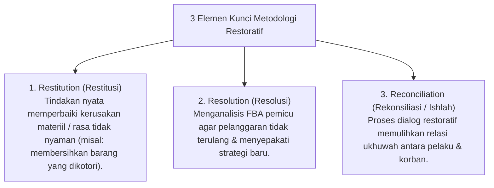

# P6-01-02: Metodologi Restoratif (Restitution, Resolution, Reconciliation)

## Status Dokumen
* **Status**: 🌟 **A+ (Tervalidasi & Siap Diimplementasikan)**
* **Sub-Domain**: `06 Intervention Framework / 01 Intervention Philosophy`
* **Penanggung Jawab Keilmuan**: Dewan Keilmuan TUMBUH (*Pakar Arsitektur PBIS Restoratif & Pakar Filosofi TUMBUH*)

---

## 1. Operasionalisasi 3 Elemen Restoratif (Howard Zehr)

---

## 2. Implementasi Ishlah al-Bain dalam Tradisi Pesantren

Metodologi Restoratif berakar kuat pada ajaran Islam tentang **Ishlah al-Bain** (QS. Al-Hujurat: 9-10) di mana setiap pertikaian diselesaikan dengan mendamaikan kedua pihak secara adil dan penuh persaudaraan.
