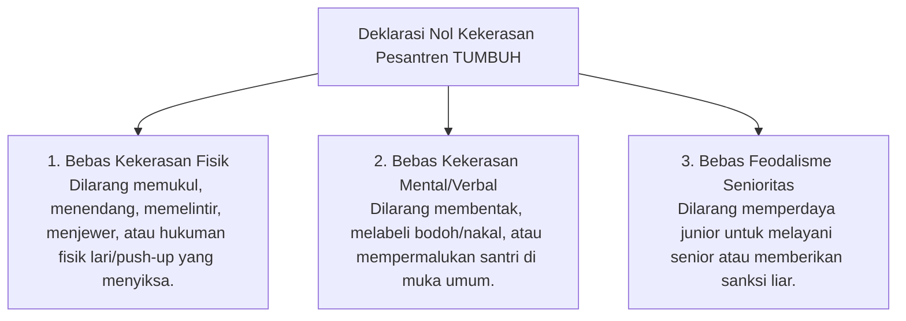

# P6-01-03: Deklarasi Zero Corporal Punishment dan Anti-Feodalisme

## Status Dokumen
* **Status**: 🌟 **A+ (Tervalidasi & Siap Diimplementasikan)**
* **Sub-Domain**: `06 Intervention Framework / 01 Intervention Philosophy`
* **Penanggung Jawab Keilmuan**: Dewan Keilmuan TUMBUH (*Pakar Tata Kelola Qudwah & Pakar Arsitektur PBIS Restoratif*)

---

## 1. Deklarasi Mutlak Anti-Kekerasan Pesantren TUMBUH

Pesantren ekosistem **TUMBUH** secara tegas mendeklarasikan **Kebijakan Nol Kekerasan (Zero Corporal Punishment Policy)**:

---

## 2. Sanksi Ketat bagi Pelanggar Kebijakan

Musyrif, Ustadz, maupun Santri Senior yang terbukti melanggar deklarasi nol kekerasan akan dikenakan **Sanksi Disiplin Lembaga Tingkat Berat** dan pencabutan wewenang pengasuhan.
