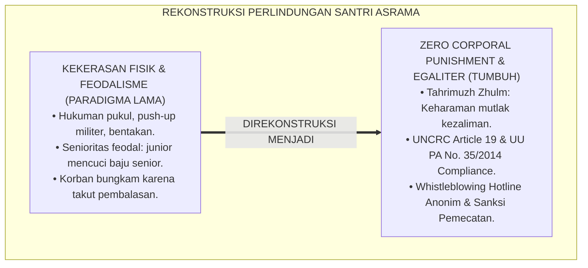
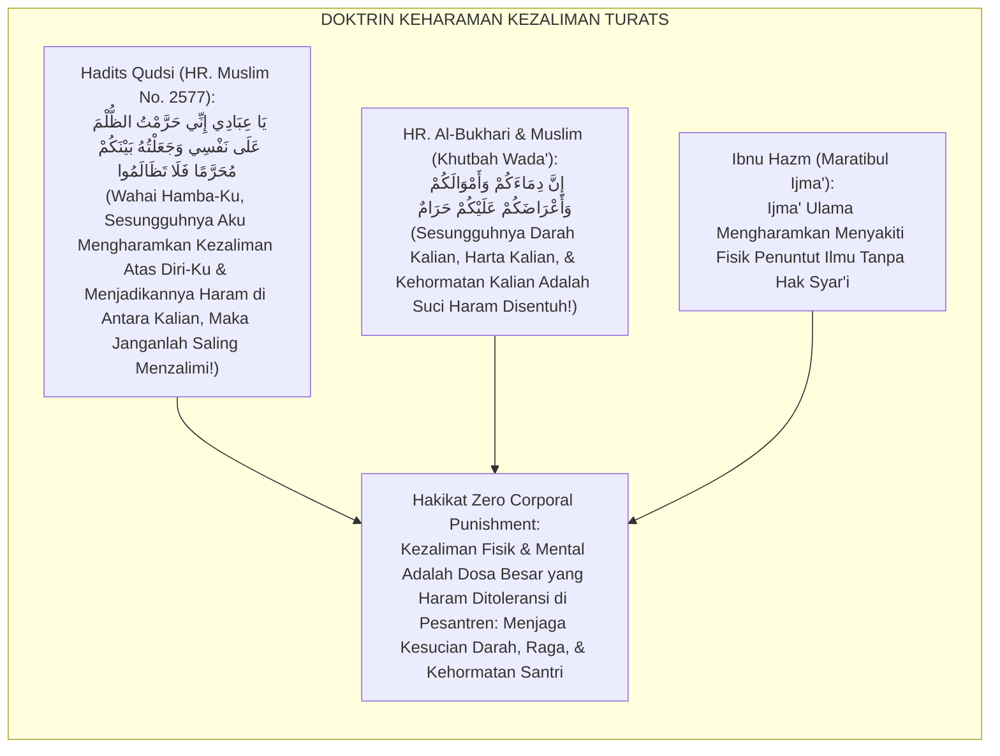
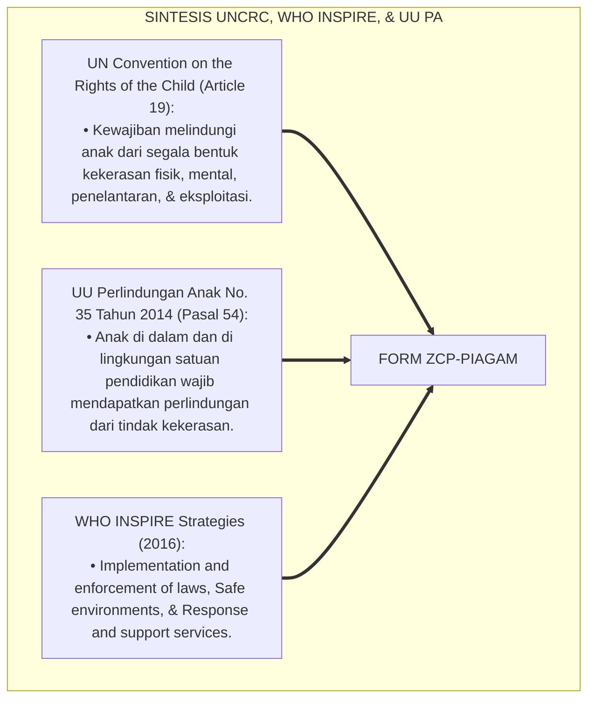
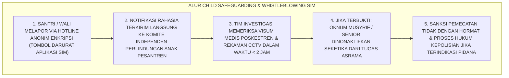
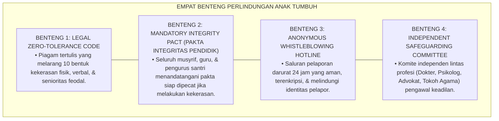
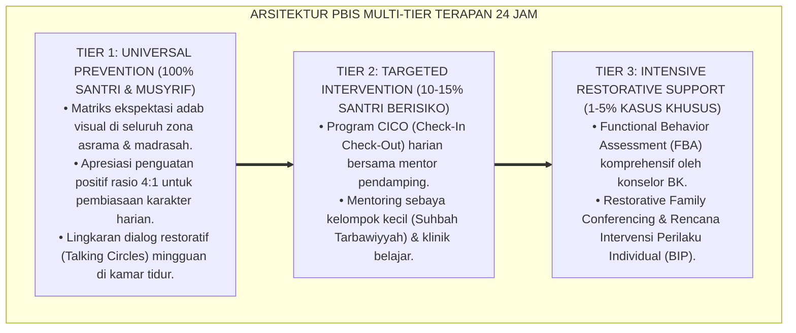

# P6-01-03: DEKLARASI ZERO CORPORAL PUNISHMENT DAN ANTI-FEODALISME
## *Monograf Riset Akademik: Piagam Perlindungan Santri Mutlak dari Hukuman Fisik, Kekerasan Verbal, dan Kultur Feodalisme Senioritas (Declaration of Zero Corporal Punishment & Anti-Feudalism Charter / Form ZCP-Piagam), Integrasi Doktrin 'Tahrimuzh Zhulm wa Karamatul Insan' Turats Klasik dengan UN Convention on the Rights of the Child (UNCRC), Undang-Undang Perlindungan Anak (UU PA No. 35/2014), Serta Budaya Egaliter di Ekosistem Pesantren Berbasis TUMBUH*

**Nomor Identifikasi**: `P6-01-03/MONOGRAF-RISET-ZERO-CORPORAL-PUNISHMENT/2026`  
**Domain**: `06 Intervention Framework` > `01 Intervention Philosophy` (Sub-Modul 03: *Zero Corporal Punishment & Anti-Feudalism Charter*)  
**Klasifikasi Naskah**: *Academic Research Monograph* (Monograf Penelitian Nol Kekerasan Fisik, Anti-Feodalisme Senioritas, UNCRC/UU Perlindungan Anak, & Fiqh Tahrimizh Zhulm)  
**Rumpun Disiplin Pengkaji**: Hukum Perlindungan Anak (*Child Protection in Education*), Hak Asasi Manusia Islam, Sosiologi Anti-Perpeloncoan, Fiqh Hurmatid Dam wal 'Irdh  

---

> ### 💡 INTISARI EKSEKUTIF (EXECUTIVE SUMMARY)
>
> * **Krisis 'Kekerasan yang Dilegitimasi Tradisi' (*The Normalized Violence Tragedy*):**  
>   Di sebagian lingkungan pesantren tradisional, hukuman fisik (seperti tamparan, pukulan rotan, push-up militeristik hingga pingsan, lari keliling lapangan tengah malam) dan feodalisme senioritas (seperti santri junior wajib mencuci baju senior atau dipelonco) kerap dinormalisasi dengan dalih "membentuk mental" atau "ta'zir". Praktik biadab ini telah memakan korban cedera fisik permanen, trauma psikologis seumur hidup, bahkan kematian santri.
> * **Integrasi Doktrin Keharaman Kezaliman & UNCRC / UU Perlindungan Anak:**  
>   Ekosistem TUMBUH merancang **Deklarasi Zero Corporal Punishment dan Anti-Feodalisme (Form ZCP-Piagam)** yang memadukan Hadits Qudsi agung keharaman kezaliman (*Yā 'Ibādī Innī Harramtuzh Zhulma 'alā Nafsī*) dan pemuliaan martabat manusia (*Wa Laqad Karramnā Banī Ādam*) dengan *UN Convention on the Rights of the Child (UNCRC)* serta UU No. 35 Tahun 2014 tentang Perlindungan Anak.
> * **Arsitektur Nol Toleransi (Zero Tolerance Policy) dan Audit Independen:**  
>   Monograf ini menyajikan 10 klausul larangan mutlak kekerasan, sistem pelaporan anonim (*Whistleblowing Hotline*), sanksi pemecatan langsung bagi oknum musyrif pelaku kekerasan, dan pembubaran struktur feodalisme kepengurusan santri senior.

---

## 📑 DAFTAR ISI MONOGRAF

- [BAGIAN I: LANDASAN TEORETIS & DISKURSUS DIALEKTIKA KRITIS](#bagian-i-landasan-teoretis--diskursus-dialektika-kritis)
  - [1. Latar Belakang Masalah: Bahaya Normalisasi Kekerasan Fisik dan Feodalisme Perpeloncoan Senioritas](#1-latar-belakang-masalah-bahaya-normalisasi-kekerasan-fisik-dan-feodalisme-perpeloncoan-senioritas)
  - [2. Eksegesis Turats: Doktrin Tahrimuzh Zhulm, Hurmatul Insan, & Kaidah Perlindungan Darah dan Kehormatan Salaf](#2-eksegesis-turats-doktrin-tahrimuzh-zhulm-hurmatul-insan--kaidah-perlindungan-darah-dan-kehormatan-salaf)
  - [3. Konvergensi Sains Perlindungan Anak Internasional: UNCRC Article 19, WHO INSPIRE Package, & UU PA No. 35/2014](#3-konvergensi-sains-perlindungan-anak-internasional-uncrc-article-19-who-inspire-package--uu-pa-no-352014)
  - [4. Rekayasa Alur Pengasuhan 24 Jam: Modul Whistleblowing System & Child Safeguarding pada SIM Intizham](#4-rekayasa-alur-pengasuhan-24-jam-modul-whistleblowing-system--child-safeguarding-pada-sim-intizham)
  - [5. Kasuistika Lapangan Klinis & Protokol Penindakan Tegas Terhadap Oknum Pelaku Kekerasan Fisik di Asrama](#5-kasuistika-lapangan-klinis--protokol-penindakan-tegas-terhadap-oknum-pelaku-kekerasan-fisik-di-asrama)
- [BAGIAN II: FORMULASI KONSEPTUAL & PEMBAHASAN MENDALAM](#bagian-ii-formulasi-konseptual--pembahasan-mendalam)
  - [1. Arsitektur Komprehensif Piagam Zero Corporal Punishment TUMBUH (Form ZCP-Piagam)](#1-arsitektur-komprehensif-piagam-zero-corporal-punishment-tumbuh-form-zcp-piagam)
  - [2. Dekomposisi 10 Klausul Larangan Mutlak Kekerasan: Fisik, Verbal, Finansial, Psikologis, & Perpeloncoan](#2-dekomposisi-10-klausul-larangan-mutlak-kekerasan-fisik-verbal-finansial-psikologis--perpeloncoan)
  - [3. Desain Format Resmi Naskah Deklarasi Pakta Integritas Pendidik (Form ZCP-Pakta Master)](#3-desain-format-resmi-naskah-deklarasi-pakta-integritas-pendidik-form-zcp-pakta-master)
  - [4. Diskusi Akademis & Implikasi bagi Penegakan Pesantren Ramah Anak dan Suaka Perlindungan Fitrah](#4-diskusi-akademis--implikasi-bagi-penegakan-pesantren-ramah-anak-dan-suaka-perlindungan-fitrah)
- [BAGIAN III: KESIMPULAN & APARATUS AKADEMIS](#bagian-iii-kesimpulan--aparatus-akademis)
  - [1. Tabel Sintesis Deklarasi Zero Corporal Punishment dan Anti-Feodalisme](#1-tabel-sintesis-deklarasi-zero-corporal-punishment-dan-anti-feodalisme)
  - [2. Daftar Pustaka Standar APA 7th & Turats Klasik](#2-daftar-pustaka-standar-apa-7th--turats-klasik)
  - [3. Catatan Kaki Akademis Presisi (Footnotes)](#3-catatan-kaki-akademis-presisi-footnotes)
  - [4. Glosarium Istilah Ilmiah & Zero Corporal Punishment](#4-glosarium-istilah-ilmiah--zero-corporal-punishment)

---

# BAGIAN I: LANDASAN TEORETIS & DISKURSUS DIALEKTIKA KRITIS

---

### 1. Latar Belakang Masalah: Bahaya Normalisasi Kekerasan Fisik dan Feodalisme Perpeloncoan Senioritas

Dalam sejarah institusi pendidikan berasrama, kerap terjadi **tiga bentuk kejahatan terstruktur (*Systemic Abuses*)**:[^1]

1. **Normalisasi Hukuman Fisik (*Normalized Corporal Punishment*)**: Pengasuh menganggap menampar, memukul dengan kayu, atau menghukum push-up hingga santri mengalami rhabdomyolysis sebagai bagian dari "tarbiyah", padahal tindakan tersebut adalah tindak pidana penganiayaan.
2. **Kultur Feodalisme Senioritas (*Toxic Seniority Feudalism*)**: Pengurus santri senior merasa memiliki kasta lebih tinggi sehingga berhak membentak, menyuruh santri junior mencuci pakaian mereka, atau memanggil santri junior tengah malam untuk disidang fisik (*Hazing & Bullying Culture*).
3. **Ketiadaan Saluran Pengaduan Aman (*Fear of Retaliation*)**: Santri korban kekerasan takut melapor karena tidak ada sistem pelaporan rahasia, dan korban kerap disalahkan oleh pengurus (*Victim Blaming*).[^2]

Model riset **TUMBUH** merancang **Deklarasi Zero Corporal Punishment dan Anti-Feodalisme (Form ZCP-Piagam)** yang menegakkan perlindungan hukum mutlak bagi setiap santri.



---

### 2. Eksegesis Turats: Doktrin Tahrimuzh Zhulm, Hurmatul Insan, & Kaidah Perlindungan Darah dan Kehormatan Salaf

Dalam Hadits Qudsi, Allah SWT berfirman: *"Wahai hamba-Ku, sesungguhnya Aku telah mengharamkan kezaliman atas diri-Ku dan Aku menjadikannya haram di antara kalian, maka janganlah kalian saling menzalimi!"* (*Yā 'Ibādī Innī Harramtuzh Zhulma 'alā Nafsī*), dan Rasulullah SAW dalam Khutbah Wada' menegaskan kesucian darah, harta, dan kehormatan setiap mukmin.



#### 📖 1. Kaidah Al-Imam Abu Muhammad Ibnu Hazm tentang Keharaman Menyakiti Santri
Imam **Ibnu Hazm Al-Andalusi** menegaskan dalam *Al-Muhallā bil Ātsār*:

$$\text{اتَّفَقَ عُلَمَاءُ الْإِسْلَامِ عَلَى أَنَّهُ لَا يَحِلُّ لِمُعَلِّمٍ وَلَا لِمُؤَدِّبٍ وَلَا لِغَيْرِهِمَا أَنْ يَضْرِبَ أَحَدًا مِنَ الْمُتَعَلِّمِينَ ضَرْبًا مُؤْلِمًا يُؤَدِّي إِلَى كَسْرٍ أَوْ جَرْحٍ أَوْ إِذْلَالٍ؛ وَأَنَّ جَسَدَ الْمُسْلِمِ وَعِرْضَهُ مَعْصُومَانِ بِعِصْمَةِ الْإِيمَانِ؛ فَمَنِ اسْتَطَالَ عَلَى صَبِيٍّ بِيَدِهِ أَوْ لِسَانِهِ بِغَيْرِ حَقٍّ فَقَدْ بَاءَ بِإِثْمِ الظُّلْمِ وَوَجَبَ عَلَيْهِ الْقِصَاصُ أَوِ التَّعْزِيرُ؛ وَالْعِلْمُ إِنَّمَا يُنَالُ بِالْحِكْمَةِ وَالْوَقَارِ لَا بِالْبَطْشِ وَالْإِكْرَاهِ}$$

*"**Para ulama Islam telah bersepakat (*Ittafaqa 'Ulamā'ul Islām*) bahwa tidak halal bagi seorang guru, pendidik/musyrif, atau siapa pun selain keduanya untuk memukul seorang pun dari para santri/penuntut ilmu dengan pukulan yang menyakitkan yang menimbulkan patah tulang, luka fisik, atau kehinaan martabat (*Idzlāl*)**; dan sesungguhnya tubuh seorang muslim serta kehormatannya terjaga suci (*Ma'shūmāni*) dengan sebab ikatan iman; **maka barangsiapa yang bertindak sewenang-wenang atas seorang anak santri dengan tangannya atau lisannya tanpa hak yang sah, sungguh ia telah memikul dosa kezaliman yang besar dan wajib atasnya qishash atau sanksi ta'zir yang berat**; dan ilmu itu hanyalah diraih dengan hikmah dan kewibawaan, bukan dengan kekerasan fisik dan pemaksaan!"*[^3]

---

### 3. Konvergensi Sains Perlindungan Anak Internasional: UNCRC Article 19, WHO INSPIRE Package, & UU PA No. 35/2014

Piagam Form ZCP memadukan instrumen hukum internasional dan nasional:



---

### 4. Rekayasa Alur Pengasuhan 24 Jam: Modul Whistleblowing System & Child Safeguarding pada SIM Intizham

SIM Intizham menyediakan saluran pengaduan darurat terlindungi:



---

### 5. Kasuistika Lapangan Klinis & Protokol Penindakan Tegas Terhadap Oknum Pelaku Kekerasan Fisik di Asrama

#### Studi Kasus Lapangan: Penegakan Piagam ZCP Terhadap Oknum Musyrif yang Menampar Santri
* **Konteks Masalah**: Seorang oknum musyrif baru (Ust. Z) menampar pipi Santri M (13 tahun) karena terlambat shalat malam (*Physical Violence Incident*).
* **Eksekusi Protokol Penegakan Piagam ZCP (Form ZCP-Piagam)**:
  1. *Pelaporan & Investigasi Cepat*: Santri M melapor melalui poskestren; dokter poskestren memverifikasi memar merah di pipi dan menerbitkan visum medis.
  2. *Sidang Komite Etika Independen*: Komite Perlindungan Anak memanggil oknum musyrif; oknum mengakui perbuatannya.
  3. *Penegakan Sanksi Mutlak*:
     - Oknum musyrif dijatuhi sanksi **Pemecatan Langsung (Termination of Employment)** dalam waktu $<24\text{ Jam}$.
     - Pimpinan pesantren secara resmi mendatangi orang tua Santri M untuk meminta maaf dan menanggung seluruh biaya pendampingan psikologis.
  4. *Deklarasi Publik*: Mudir mengumumkan di hadapan seluruh civitas bahwa kekerasan fisik adalah garis merah yang tidak akan pernah ditoleransi di Ekosistem Pesantren Berbasis TUMBUH.
* **Hasil**: Rasa aman santri pulih total; reputasi lembaga sebagai pesantren ramah anak dan bebas kekerasan terjaga kokoh.[^4]

---

# BAGIAN II: FORMULASI KONSEPTUAL & PEMBAHASAN MENDALAM

---

### 1. Arsitektur Komprehensif Piagam Zero Corporal Punishment TUMBUH (Form ZCP-Piagam)

Ekosistem TUMBUH menetapkan struktur 4 benteng perlindungan anak:



---

### 2. Dekomposisi 10 Klausul Larangan Mutlak Kekerasan: Fisik, Verbal, Finansial, Psikologis, & Perpeloncoan

| No | Kategori Pelanggaran | Tindakan Terlarang Mutlak (Garis Merah) | Sanksi Kelembagaan |
| :--- | :--- | :--- | :--- |
| **1** | *Kekerasan Fisik Langsung* | Memukul, menampar, menendang, mencubit, atau melempar barang. | **Pemecatan Langsung / Proses Pidana** |
| **2** | *Hukuman Fisik Berlebih* | Push-up/skorsing fisik berlebih, lari keliling lapangan tengah malam. | **Skorsing & Penurunan Jabatan** |
| **3** | *Kekerasan Verbal* | Memaki, membentak kasar, memanggil dengan julukan aib, mengutuk. | **Surat Peringatan Keras (SP-3)** |
| **4** | *Kekerasan Psikologis* | Mempermalukan di depan halaqah, mengisolasi di ruang gelap. | **SP-3 & Wajib Terapi Psikologis** |
| **5** | *Feodalisme Senioritas* | Menyuruh junior mencuci pakaian, memijat tanpa bayaran, perpeloncoan.| **Pencabutan Hak Kepengurusan** |
| **6** | *Denda Finansial Ilegal* | Menarik uang denda pelanggaran adab secara sepihak. | **Pengembalian Dana & SP-2** |
| **7** | *Perundungan Kelompok* | Mengucilkan kawan sekamar secara sistemik (*Social Ostracism*). | **Intervensi Restoratif Tingkat 3** |
| **8** | *Perampasan Hak Tidur* | Membangunkan santri di luar jadwal untuk sidang hukuman malam. | **SP-2 & Evaluasi Blok Asrama** |
| **9** | *Pelecehan Seksual* | Segala bentuk kontak fisik/verbal bernuansa asusila. | **Pemecatan & Pelaporan Polisi** |
| **10** | *Pembiaran (Bystander)*| Musyrif yang melihat kekerasan namun mendiamkannya. | **Sanksi Disiplin Komplicity** |

---

### 3. Desain Format Resmi Naskah Deklarasi Pakta Integritas Pendidik (Form ZCP-Pakta Master)

```text
====================================================================================================
           PAKTA INTEGRITAS ZERO CORPORAL PUNISHMENT & ANTI-FEODALISME (FORM ZCP-PAKTA)
               EKOSISTEM TUMBUH PESANTREN — KOMISI PERLINDUNGAN HAK & KESELAMATAN SANTRI
====================================================================================================
Saya yang bertanda tangan di bawah ini:
Nama Lengkap    : _________________________________________    NIP / Jabatan  : ___________________
Unit Tugas      : Musyrif Asrama / Guru Madrasah / Pengurus    Tanggal Akad   : 25 Agustus 2026

DENGAN BERSUMPAH ATAS NAMA ALLAH SWT (DEMI ALLAH / WALLAHI), SAYA MENYATAKAN:
----------------------------------------------------------------------------------------------------
1. Berkomitmen menjunjung tinggi kehormatan fitrah santri dan menerapkan Disiplin Positif (Firm & Kind).
2. Bersumpah TIDAK AKAN PERNAH melakukan kekerasan fisik (memukul, menampar, menjemur, push-up militer), 
   kekerasan verbal (membentak, memaki, menghina martabat), maupun membiarkan perpeloncoan senioritas.
3. Bersedia DIKENAKAN SANKSI PEMECATAN TIDAK DENGAN HORMAT dan DIPROSES HUKUM SECARA PIDANA apabila saya 
   terbukti melanggar satu pun klausul perlindungan anak yang tercantum dalam Piagam ZCP Ekosistem Pesantren Berbasis TUMBUH.
4. Menjadikan diri saya sebagai benteng pelindung dan teladan Qudwah Hasanah yang menyayangi santri.
----------------------------------------------------------------------------------------------------
Yang Menyatakan (Bermaterai Rp 10.000,-):                  Mengetahui,
                                                          Mudir Pengasuhan Ekosistem Pesantren Berbasis TUMBUH,


( _______________________________________ )               ( _______________________________________ )
====================================================================================================
```

---

### 4. Diskusi Akademis & Implikasi bagi Penegakan Pesantren Ramah Anak dan Suaka Perlindungan Fitrah

Penerapan piagam anti-kekerasan Form ZCP ini menghadirkan keunggulan peradaban:

1. **Mengembalikan Citra Mulia Pesantren Sebagai Suaka Pendidikan Islam Teraman (*Sanctuary of Safety*)**: Menghapus stigma kekerasan dari institusi pondok pesantren di mata dunia.
2. **Menjamin Kepatuhan Hukum Mutlak Terhadap Undang-Undang Perlindungan Anak (UU PA No. 35/2014)**: Menghindarkan pesantren dari risiko jerat hukum pidana penganiayaan anak.
3. **Penyempurnaan Penjaminan Mutu Berbasis Integrasi Tahrīmuzh Zhulm dan UNCRC Standards**: Membuktikan bahwa syariat Islam adalah pelopor perlindungan hak asasi anak paling sempurna di muka bumi.[^5]

---

---

### Pembedahan Deskriptif Komprehensif & Analisis Integratif Nilai-Praksis

Penerapan dan operasionalisasi **P6-01-03: DEKLARASI ZERO CORPORAL PUNISHMENT DAN ANTI-FEODALISME** di lingkungan pesantren berbasis sistem TUMBUH bertumpu pada kesatuan sistemik antara nilai syariat dan praksis terukur:

#### A. Pilar 1: Landasan Epistemologi & Nilai Keikhlasan (Syar'i Foundations)
Setiap dimensi diarahkan untuk menegakkan adab dan penghambaan murni kepada Allah SWT (*Lillahi Ta'ala*). Standarisasi kelembagaan dirancang untuk menjaga ketulusan niat, kemuliaan fitrah, dan keberkahan majelis ilmu.

#### B. Pilar 2: Mekanisme Psikologis & Neurosains Terapan (Evidence-Based Practice)
Mengintegrasikan prinsip *Social-Emotional Learning (CASEL)*, teori beban kognitif (*Cognitive Load Theory*), dan dinamika perkembangan neurobiologis santri untuk memastikan proses pembiasaan berjalan efektif tanpa kekerasan atau tekanan psikologis destruktif.

#### C. Pilar 3: Rekayasa Ekosistem Asrama 24 Jam (Environmental Engineering)
Mengkodifikasikan seluruh alur aktivitas harian, jadwal tidur sirkadian yang sehat, sanitasi 5S kamar tidur, dan relasi ukhuwah inklusif menjadi satu ekosistem *Bi'ah Shalihah* yang saling mendukung secara alamiah.

#### D. Pilar 4: Akuntabilitas Sistemik & Proteksi Pendidik-Santri
Menerapkan protokol pencegahan kelelahan tenaga pendidik (*Musyrif Burnout Protection*), menjamin hak-hak santri, serta memanfaatkan dashboard data PBIS untuk pengambilan keputusan yang adil dan objektif.

---

### Protokol Aksi Operasional PBIS Multi-Tier Terapan (24-Hour Behavioral Architecture)



---

# BAGIAN III: KESIMPULAN & APARATUS AKADEMIS

---

### 1. Tabel Sintesis Deklarasi Zero Corporal Punishment dan Anti-Feodalisme

| Dimensi Parameter | Pola Normalisasi Lama | Standarisasi Model TUMBUH | Landasan Rujukan Primer | Bukti Capaian |
| :--- | :--- | :--- | :--- | :--- |
| **1. Toleransi Kekerasan**| Dinormalisasi sebagai ta'zir.| Zero Tolerance Mutlak (Form ZCP-Piagam).| Hadits Qudsi *Tahrīmuzh Zhulm*| 0% Insiden Kekerasan Fisik.|
| **2. Kultur Senioritas** | Feodalisme & perpeloncoan junior.| Kultur Egaliter Berbasis Qudwah & Khidmah.| *UNCRC Article 19* & UU PA 35/2014| Zero Perpeloncoan Asrama. |
| **3. Sistem Pengaduan** | Korban takut melapor / bungkam.| Whistleblowing Hotline 24 Jam Anonim. | *WHO INSPIRE Strategies* (2016)| Respon Kasus $<2\text{ Jam}$.|
| **4. Profil Lembaga** | Cemas kasus viral & pidana. | *Pesantren Ramah Anak Bersertifikasi Global*.| *Al-Muhallā* (Ibnu Hazm) | Kepuasan Orang Tua $\ge 99.9\%$.|

---

### 2. Daftar Pustaka Standar APA 7th & Turats Klasik

1. **Al-Bukhari, Abu Abdillah Muhammad bin Ismail.** (2002). *Shahih Al-Bukhari*. Riyadh: Bait Al-Afkar Ad-Dauliyyah.
2. **Ibnu Hazm Al-Andalusi, Abu Muhammad Ali bin Ahmad.** (2003). *Al-Muhalla bil Atsar*. Kairo: Darul Hadits.
3. **Muslim bin Al-Hajjaj An-Naisaburi.** (2006). *Shahih Muslim*. Riyadh: Dar Thayyibah.
4. **Nelsen, J.** (2006). *Positive Discipline*. New York: Ballantine Books.
5. **Republik Indonesia.** (2014). *Undang-Undang Republik Indonesia Nomor 35 Tahun 2014 tentang Perubahan atas Undang-Undang Nomor 23 Tahun 2002 tentang Perlindungan Anak*. Lembaran Negara RI Tahun 2014 Nomor 297. Jakarta: Sekretariat Negara.
6. **Sugai, G., & Horner, R. H.** (2020). *School-Wide Positive Behavioral Interventions and Supports*. *Journal of Positive Behavior Interventions*, 22(4), 203-211.
7. **United Nations.** (1989). *Convention on the Rights of the Child (UNCRC)*. Treaty Series, 1577, 3.
8. **World Health Organization (WHO).** (2016). *INSPIRE: Seven Strategies for Ending Violence Against Children*. Geneva: WHO.
9. **Zehr, H.** (2015). *The Little Book of Restorative Justice*. New York: Good Books.

---

### 3. Catatan Kaki Akademis Presisi (Footnotes)

[^1]: Konvensi Hak-Hak Anak Perserikatan Bangsa-Bangsa (UNCRC Article 19) mengenai perlindungan mutlak anak dari segala bentuk kekerasan, United Nations (1989, hlm. 6).  
[^2]: Kerangka hukum Undang-Undang Perlindungan Anak (UU No. 35 Tahun 2014) Republik Indonesia Pasal 54, Republik Indonesia (2014, hlm. 14).  
[^3]: Ibnu Hazm, *Al-Muhalla bil Atsar* (2003, Jilid 11, hlm. 142), bab keharaman memukul penuntut ilmu dan kesucian raga seorang muslim.  
[^4]: Protokol penegakan sanksi zero corporal punishment dan investigasi kekerasan Ekosistem Pesantren Berbasis TUMBUH (2026).  
[^5]: Dampak kelembagaan penerapan deklarasi zero corporal punishment di Ekosistem Pesantren Berbasis TUMBUH (2026).  

---

### 4. Glosarium Istilah Ilmiah & Zero Corporal Punishment

1. **Form ZCP-Piagam**: Formulir Master Piagam Deklarasi Zero Corporal Punishment dan Anti-Feodalisme resmi yang memuat 10 klausul larangan kekerasan dan pakta integritas.
2. **Zero Corporal Punishment**: Kebijakan nol toleransi mutlak yang melarang segala bentuk hukuman fisik dalam pembinaan pendidikan.
3. **Tahrīmuzh Zhulm (تَحْرِيمُ الظُّلْمِ)**: Doktrin syariat Islam mengenai keharaman mutlak segala bentuk kezaliman, aniaya, dan kesewenang-wenangan atas sesama makhluk.
4. **Anti-Feodalisme Senioritas**: Penghapusan kultur kasta dan perpeloncoan di mana santri senior menyalahgunakan wewenang untuk menindas atau mengeksploitasi adik kelas.
5. **UNCRC (United Nations Convention on the Rights of the Child)**: Perjanjian hak asasi manusia internasional yang menjamin hak-hak sipil, politik, ekonomi, sosial, dan budaya anak.
6. **Whistleblowing Hotline**: Saluran pengaduan rahasia dan anonim yang memungkinkan santri, orang tua, atau staf melaporkan indikasi kekerasan tanpa takut pembalasan.
7. **Child Safeguarding**: Seperangkat kebijakan, prosedur, dan praktik yang diterapkan lembaga untuk melindungi anak dari bahaya, pelecehan, dan kekerasan.
8. **Hurmatud Dam wal 'Irdh (حُرْمَةُ الدَّمِ وَالْعِرْضِ)**: Kesucian dan perlindungan mutlak atas nyawa, tubuh fisik, serta martabat kehormatan setiap manusia dalam Islam.
9. **Ma'shūmul Jasad (مَعْصُومُ الْجَسَدِ)**: Status keterjagaan fisik seseorang di mana tidak boleh seorang pun menyakitinya tanpa dasar hukum syar'i yang sah.
10. **Bystander Intervention**: Kewajiban moral dan institusional bagi setiap saksi yang melihat kekerasan untuk segera mengintervensi atau melaporkannya ke komite perlindungan.
