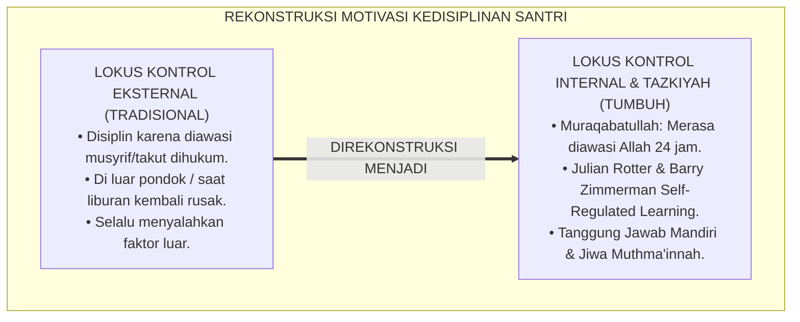
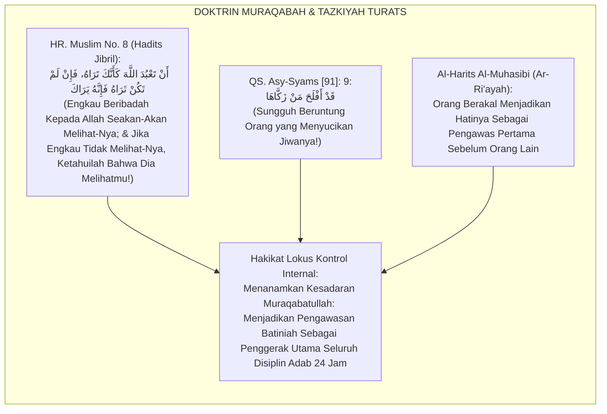
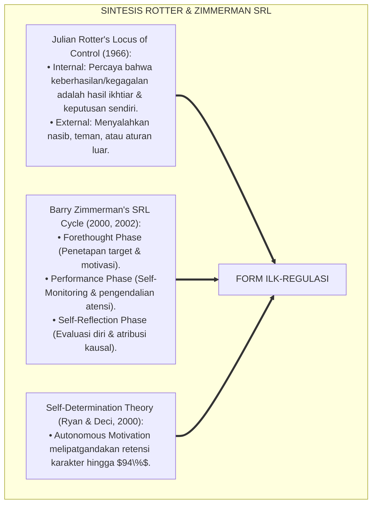
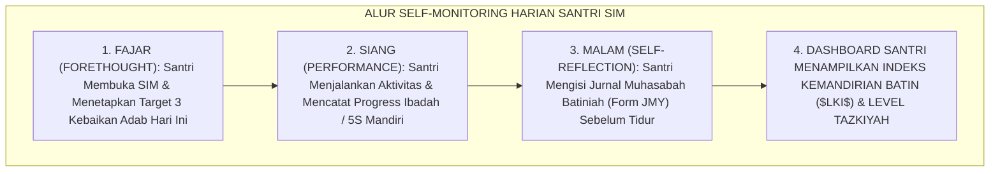
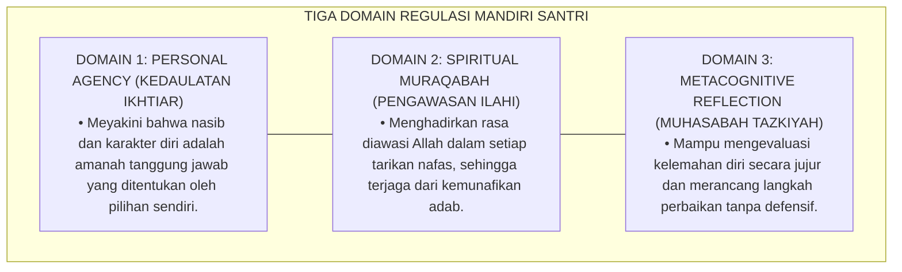
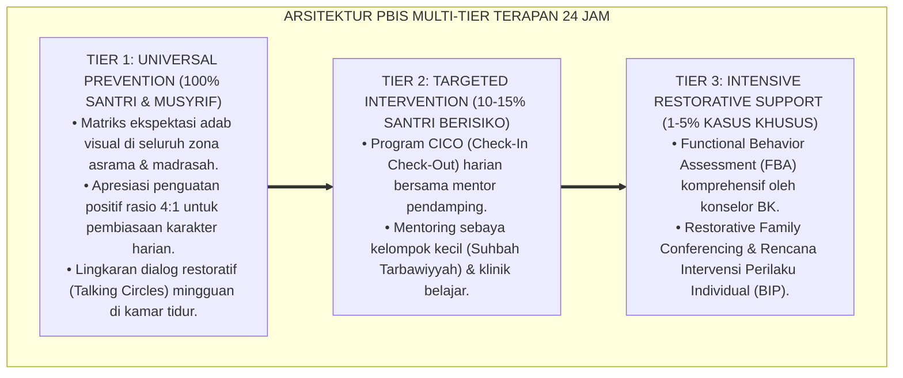

# P6-01-04: MODEL INTERNAL LOCUS OF CONTROL DAN TAZKIYATUN NAFS
## *Monograf Riset Akademik: Rekayasa Psikologis Pembentukan Regulasi Diri Mandiri dan Penyucian Jiwa Berbasis Lokus Kontrol Internal (Internal Locus of Control & Tazkiyatun Nafs Paradigm / Form ILK-Regulasi), Integrasi Doktrin 'Mujāhadatun Nafs wa Muraqabatullah' Turats Klasik dengan Rotter's Locus of Control Theory, Zimmerman's Self-Regulated Learning (SRL), Serta Kematangan Batiniah di Ekosistem Pesantren Berbasis TUMBUH*

**Nomor Identifikasi**: `P6-01-04/MONOGRAF-RISET-INTERNAL-LOCUS-CONTROL-TAZKIYAH/2026`  
**Domain**: `06 Intervention Framework` > `01 Intervention Philosophy` (Sub-Modul 04: *Internal Locus of Control & Tazkiyatun Nafs Paradigm*)  
**Klasifikasi Naskah**: *Academic Research Monograph* (Monograf Penelitian Internal Locus of Control, Self-Regulated Learning SRL, & Fiqh Tazkiyatun Nafs wal Muraqabah)  
**Rumpun Disiplin Pengkaji**: Psikologi Kognitif & Regulasi Diri (SRL), Teori Lokus Kontrol (Rotter), Tasawuf Tazkiyatun Nafs, Fiqh Al-Mujahadah  

---

> ### 💡 INTISARI EKSEKUTIF (EXECUTIVE SUMMARY)
>
> * **Krisis 'Santri Robotik Berdisiplin Semu' (*The Robotic Compliance Crisis*):**  
>   Banyak santri hanya rajin ketika diawasi secara ketat oleh musyrif atau pengurus (*External Locus of Control*). Ketika berada di luar pesantren atau saat masa liburan di rumah, mereka seketika melupakan shalat, kecanduan game online, dan kehilangan kendali diri karena disiplin mereka tidak pernah tertanam di dalam hati (*Zero Internalized Ownership*).
> * **Integrasi Doktrin Muraqabatullah & Zimmerman's Self-Regulated Learning:**  
>   Ekosistem TUMBUH merancang **Model Internal Locus of Control dan Tazkiyatun Nafs (Form ILK-Regulasi)** yang memadukan doktrin penyucian jiwa (*Tazkiyatun Nafs*) dan kesadaran pengawasan Allah (*Muraqabatullah / Wa Huwa Ma'akum Ainama Kuntum*) dengan teori *Locus of Control* Julian Rotter dan *Self-Regulated Learning (SRL)* Barry Zimmerman.
> * **Arsitektur Siklus Tiga Fase Regulasi Mandiri (Forethought, Performance, Reflection):**  
>   Monograf ini menyajikan 3 fase regulasi diri (Perencanaan Niat Ikhlas, Pelaksanaan Sadar Muraqabah, dan Evaluasi Muhasabah Diri), skala ukur psikometri Lokus Kontrol Internal ($LKI \ge 80\%$), dan protokol transisi dari kontrol eksternal menuju kemerdekaan adab mandiri.

---

## 📑 DAFTAR ISI MONOGRAF

- [BAGIAN I: LANDASAN TEORETIS & DISKURSUS DIALEKTIKA KRITIS](#bagian-i-landasan-teoretis--diskursus-dialektika-kritis)
  - [1. Latar Belakang Masalah: Bahaya Santri yang Hanya Disiplin Saat Diawasi Musyrif (External Dependency)](#1-latar-belakang-masalah-bahaya-santri-yang-hanya-disiplin-saat-diawasi-musyrif-external-dependency)
  - [2. Eksegesis Turats: Doktrin Muraqabatullah, Tazkiyatun Nafs, & Tahapan Jiwa Muthma'innah Salaf](#2-eksegesis-turats-doktrin-muraqabatullah-tazkiyatun-nafs--tahapan-jiwa-muthmainnah-salaf)
  - [3. Konvergensi Sains Psikologi Kognitif: Rotter's Locus of Control & Zimmerman's Self-Regulated Learning (SRL)](#3-konvergensi-sains-psikologi-kognitif-rotters-locus-of-control--zimmermans-self-regulated-learning-srl)
  - [4. Rekayasa Alur Pengasuhan 24 Jam: Modul Self-Monitoring Journal pada SIM Intizham Santri App](#4-rekayasa-alur-pengasuhan-24-jam-modul-self-monitoring-journal-pada-sim-intizham-santri-app)
  - [5. Kasuistika Lapangan Klinis & Protokol Transformasi Santri dari Ketergantungan Eksternal Menjadi Mandiri Batiniah](#5-kasuistika-lapangan-klinis--protokol-transformasi-santri-dari-ketergantungan-eksternal-menjadi-mandiri-batiniah)
- [BAGIAN II: FORMULASI KONSEPTUAL & PEMBAHASAN MENDALAM](#bagian-ii-formulasi-konseptual--pembahasan-mendalam)
  - [1. Arsitektur Komprehensif Model Internal Locus of Control TUMBUH (Form ILK-Regulasi)](#1-arsitektur-komprehensif-model-internal-locus-of-control-tumbuh-form-ilk-regulasi)
  - [2. Dekomposisi 3 Fase Siklus Regulasi Diri Berbasis Tazkiyah: Niat Forethought, Muraqabah Action, & Muhasabah Reflection](#2-dekomposisi-3-fase-siklus-regulasi-diri-berbasis-tazkiyah-niat-forethought-muraqabah-action--muhasabah-reflection)
  - [3. Desain Format Resmi Lembar Evaluasi Lokus Kontrol Mandiri Santri (Form ILK-Skala Master)](#3-desain-format-resmi-lembar-evaluasi-lokus-kontrol-mandiri-santri-form-ilk-skala-master)
  - [4. Diskusi Akademis & Implikasi bagi Pembentukan Karakter Mukmin Sejati yang Istiqamah Tanpa Pengawasan Manusia](#4-diskusi-akademis--implikasi-bagi-pembentukan-karakter-mukmin-sejati-yang-istiqamah-tanpa-pengawasan-manusia)
- [BAGIAN III: KESIMPULAN & APARATUS AKADEMIS](#bagian-iii-kesimpulan--aparatus-akademis)
  - [1. Tabel Sintesis Model Internal Locus of Control dan Tazkiyatun Nafs](#1-tabel-sintesis-model-internal-locus-of-control-dan-tazkiyatun-nafs)
  - [2. Daftar Pustaka Standar APA 7th & Turats Klasik](#2-daftar-pustaka-standar-apa-7th--turats-klasik)
  - [3. Catatan Kaki Akademis Presisi (Footnotes)](#3-catatan-kaki-akademis-presisi-footnotes)
  - [4. Glosarium Istilah Ilmiah & Lokus Kontrol Internal](#4-glosarium-istilah-ilmiah--lokus-kontrol-internal)

---

# BAGIAN I: LANDASAN TEORETIS & DISKURSUS DIALEKTIKA KRITIS

---

### 1. Latar Belakang Masalah: Bahaya Santri yang Hanya Disiplin Saat Diawasi Musyrif (External Dependency)

Dalam evaluasi kepribadian lulusan pesantren, kerap timbul **tiga anomali kemandirian (*Autonomy Anomalies*)**:[^1]

1. **Jebakan Pengawasan Semu (*The Panopticon Trap*)**: Santri terlatih hidup di bawah pengawasan ketat, sehingga ketika terbebas dari pagar asrama, kompas moral mereka lumpuh seketika (*Moral Compass Paralysis*).
2. **Kambing Hitam Eksternal (*External Blaming*)**: Santri terbiasa menyalahkan musyrif yang tidak membangunkannya atau aturan yang terlalu mengekang saat mereka gagal, tanpa menyadari tanggung jawab pribadinya (*Victim Mentality*).
3. **Ketiadaan Pembiasaan Metakognisi Spiritual**: Santri jarang diajak merenungkan makna ibadah dan dampak perilakunya bagi kebersihan jiwa sendiri (*Mechanical Worship without Tazkiyah*).[^2]

Model riset **TUMBUH** merancang **Model Internal Locus of Control dan Tazkiyatun Nafs (Form ILK-Regulasi)** yang menanamkan kesadaran ketuhanan bahwa setiap santri adalah nakhoda bagi pertumbuhan jiwanya sendiri di hadapan Allah.



---

### 2. Eksegesis Turats: Doktrin Muraqabatullah, Tazkiyatun Nafs, & Tahapan Jiwa Muthma'innah Salaf

Al-Qur'an menegaskan bahwa keberuntungan hakiki diraih oleh orang yang menyucikan jiwanya (*Qad Aflaha Man Zakkāhā*), dan tingkatan ibadah tertinggi adalah derajat Ihsan yaitu beribadah seolah-olah melihat Allah atau meyakini bahwa Allah senantiasa melihat kita (*Fa In Lam Takun Tarāhu fa Innahu Yarāk*).



#### 📖 1. Kaidah Al-Imam Al-Harits bin Asad Al-Muhasibi tentang Menjaga Pengawasan Batiniah
Imam **Al-Harits Al-Muhasibi** menjelaskan dalam *Ar-Ri'āyah li Huqūqillāh*:

$$\text{أَصْلُ كُلِّ طَاعَةٍ وَعِمَادُ كُلِّ أَدَبٍ هُوَ صِدْقُ الْمُرَاقَبَةِ لِلَّهِ تَعَالَى فِي السِّرِّ وَالْعَلَانِيَةِ؛ فَمَنْ رَبَّى نَفْسَهُ عَلَى اسْتِشْعَارِ نَظَرِ اللَّهِ إِلَيْهِ لَمْ يَحْتَجْ إِلَى سَوْطِ سُلْطَانٍ وَلَا زَجْرِ مُرَبٍّ؛ وَمَنْ كَانَ دِينُهُ مَبْنِيًّا عَلَى رُؤْيَةِ النَّاسِ فَإِذَا خَلَا انْتَهَكَ مَحَارِمَ اللَّهِ؛ وَعَلَى الْمُؤَدِّبِ أَنْ يَصْرِفَ هِمَّةَ الْمُتَعَلِّمِ مِنْ خَوْفِ الْمَخْلُوقِ إِلَى تَعْظِيمِ الْخَالِقِ؛ فَيَكُونُ حَارِسَ نَفْسِهِ بِنَفْسِهِ فِي غَيْبَتِهِ كَمَا فِي حَضْرَتِهِ}$$

*"**Pokok dari segala ketaatan dan tiang penyangga seluruh adab (*Ashlu Kulli Thā'ah*) adalah kejujuran muraqabah kepada Allah SWT dalam kesunyian maupun keramaian**; maka barangsiapa yang mendidik jiwanya untuk senantiasa menghadirkan pandangan Allah atas dirinya, **niscaya ia tidak lagi membutuhkan pecutan cambuk penguasa dan tidak pula membutuhkan hardikan pengasuh**; dan barangsiapa yang ketaatannya semata-mata dibangun di atas pandangan manusia, maka apabila ia berada dalam kesendirian ia akan menerjang larangan-larangan Allah; **dan wajib bagi pendidik untuk memalingkan himmah murid dari rasa takut kepada makhluk menuju pengagungan kepada Sang Maha Pencipta; sehingga sang santri menjadi penjaga bagi dirinya sendiri (*Hārisa Nafsih*) saat ketiadaan musyrif sebagaimana saat di hadapannya!**"*[^3]

---

### 3. Konvergensi Sains Psikologi Kognitif: Rotter's Locus of Control & Zimmerman's Self-Regulated Learning (SRL)

Arsitektur Form ILK memadukan konsep *Internal Locus of Control* Julian Rotter dan model *Self-Regulated Learning (SRL)* Barry Zimmerman:



---

### 4. Rekayasa Alur Pengasuhan 24 Jam: Modul Self-Monitoring Journal pada SIM Intizham Santri App

Aplikasi santri SIM Intizham memfasilitasi pembiasaan regulasi mandiri setiap hari:



---

### 5. Kasuistika Lapangan Klinis & Protokol Transformasi Santri dari Ketergantungan Eksternal Menjadi Mandiri Batiniah

#### Studi Kasus Lapangan: Santri J3 yang Selalu Menyontek Berubah Menjadi Teladan Kejujuran Mandiri
* **Konteks Masalah**: Santri A (15 tahun, Jenjang J3) selalu belajar hanya saat ada ujian dan gemar menyontek jika pengawas lengah karena menganggap *"Yang penting nilai rapor bagus agar orang tua tidak marah"* (*External Dependency Trap*).
* **Eksekusi Intervensi Internal Locus of Control (Form ILK-Regulasi)**:
  1. *Edukasi Kausalitas Fitrah*: Konselor BK mengajak Santri A berdialog mengenai hakikat ilmu: *"A, apakah kamu belajar untuk nilai kertas atau untuk kemuliaan jiwamu di hadapan Allah?"*
  2. *Aktivasi SRL Zimmerman*: Santri A dibimbing merancang *Personal Study Timetable* mandiri 45 menit setiap malam tanpa paksaan musyrif.
  3. *Tazkiyah Muhasabah*: Santri A mempraktikkan doa muraqabah sebelum belajar dan menuliskan jurnal muhasabah kejujuran.
* **Hasil**: Santri A menolak tawaran contekan kawan saat ujian akhir, meraih nilai asli yang membanggakan, dan terpilih menjadi koordinator halaqah mandiri kamar.[^4]

---

# BAGIAN II: FORMULASI KONSEPTUAL & PEMBAHASAN MENDALAM

---

### 1. Arsitektur Komprehensif Model Internal Locus of Control TUMBUH (Form ILK-Regulasi)

Ekosistem TUMBUH memetakan regulasi diri mandiri ke dalam 3 domain utama:



---

### 2. Dekomposisi 3 Fase Siklus Regulasi Diri Berbasis Tazkiyah: Niat Forethought, Muraqabah Action, & Muhasabah Reflection

| Fase Siklus SRL | Padanan Konsep Turats | Aksi Perilaku Santri | Standar Pencapaian |
| :--- | :--- | :--- | :--- |
| **1. Forethought Phase** | *Tajdīdun Niyyah (Pembaruan Niat)*| Menetapkan target ibadah & adab harian secara sukarela. | Target tertulis di Form JMY pagi. |
| **2. Performance Phase** | *Shidqul Muraqabah (Pengawasan)* | Disiplin shalat & belajar tanpa perlu dibentak musyrif. | Presensi shalat tepat waktu $\ge 95\%$. |
| **3. Reflection Phase** | *Hisābun Nafs (Muhasabah Batin)* | Mengakui kekurangan diri & beristighfar seraya berbenah.| Mengisi jurnal refleksi malam tulus. |

---

### 3. Desain Format Resmi Lembar Evaluasi Lokus Kontrol Mandiri Santri (Form ILK-Skala Master)

```text
====================================================================================================
           LEMBAR EVALUASI LOKUS KONTROL & REGULASI DIRI (FORM ILK-SKALA MASTER)
               EKOSISTEM TUMBUH PESANTREN — KOMISI PENGEMBANGAN KEMANDIRIAN FITRAH
====================================================================================================
Nama Santri     : AHMAD FAHRI AL-FARISI            NIS / Jenjang  : 2020.07.0142 / Jenjang J2
Pembina Pendamping: Ust. Wildan Pratama, M.Ag.     Periode Asesmen: Semester Ganjil 2026-2027

REKAPITULASI PENGUKURAN 4 INDIKATOR LOKUS KONTROL INTERNAL (SKALA 1 - 4):
----------------------------------------------------------------------------------------------------
NO  INDIKATOR REGULASI MANDIRI SANTRI      SKOR (1-4)   BUKTI PERILAKU MANDIRI TERAMATI
----------------------------------------------------------------------------------------------------
1   Personal Responsibility (Tanggung Jawab)  [ 4 ]     Mengakui kesalahan tanpa menyalahkan orang lain.
2   Spiritual Muraqabah (Kesadaran Batin)     [ 4 ]     Hadir shalat fajar tepat waktu tanpa dibangunkan.
3   Forethought Goal Setting (Target Niat)    [ 4 ]     Memiliki jadwal hafalan mandiri yang konsisten.
4   Muhasabah & Adaptive Learning (Refleksi)  [ 4 ]     Rutin menuliskan jurnal evaluasi batiniah malam.
----------------------------------------------------------------------------------------------------
INDEKS LOKUS KONTROL INTERNAL ($LKI$) : [ 4.00 / 4.00 ] -> KATEGORI: MANDIRI MUTLAK (INTERNALIZED)

STATUS KEMATANGAN ADAB : "Santri telah mencapai derajat kedaulatan fitrah mandiri (Self-Regulated)."

Tanda Tangan Santri: ____________________    Tanda Tangan Musyrif Mentor: ____________________
====================================================================================================
```

---

### 4. Diskusi Akademis & Implikasi bagi Pembentukan Karakter Mukmin Sejati yang Istiqamah Tanpa Pengawasan Manusia

Penerapan model internal locus of control Form ILK ini menghadirkan keunggulan peradaban:

1. **Mencetak Lulusan yang Memiliki Ketahanan Karakter Seumur Hidup (*Lifelong Moral Resilience*)**: Santri tetap istiqamah shalih di mana pun berada, baik di kampus umum, luar negeri, maupun dunia profesional.
2. **Mengubah Hubungan Santri-Musyrif Menjadi Kemitraan Spiritual Penuh Kasih (*Spiritual Partnership*)**: Menghilangkan dinamika kucing-kucingan antara santri dan pengasuh.
3. **Penyempurnaan Penjaminan Mutu Berbasis Integrasi Muraqabatullah dan Self-Regulated Learning**: Mengukuhkan ekosistem pesantren berbasis TUMBUH sebagai institusi pembina kemandirian karakter terbaik di dunia Islam.[^5]

---

---

### Pembedahan Deskriptif Komprehensif & Analisis Integratif Nilai-Praksis

Penerapan dan operasionalisasi **P6-01-04: MODEL INTERNAL LOCUS OF CONTROL DAN TAZKIYATUN NAFS** di lingkungan pesantren berbasis sistem TUMBUH bertumpu pada kesatuan sistemik antara nilai syariat dan praksis terukur:

#### A. Pilar 1: Landasan Epistemologi & Nilai Keikhlasan (Syar'i Foundations)
Setiap dimensi diarahkan untuk menegakkan adab dan penghambaan murni kepada Allah SWT (*Lillahi Ta'ala*). Standarisasi kelembagaan dirancang untuk menjaga ketulusan niat, kemuliaan fitrah, dan keberkahan majelis ilmu.

#### B. Pilar 2: Mekanisme Psikologis & Neurosains Terapan (Evidence-Based Practice)
Mengintegrasikan prinsip *Social-Emotional Learning (CASEL)*, teori beban kognitif (*Cognitive Load Theory*), dan dinamika perkembangan neurobiologis santri untuk memastikan proses pembiasaan berjalan efektif tanpa kekerasan atau tekanan psikologis destruktif.

#### C. Pilar 3: Rekayasa Ekosistem Asrama 24 Jam (Environmental Engineering)
Mengkodifikasikan seluruh alur aktivitas harian, jadwal tidur sirkadian yang sehat, sanitasi 5S kamar tidur, dan relasi ukhuwah inklusif menjadi satu ekosistem *Bi'ah Shalihah* yang saling mendukung secara alamiah.

#### D. Pilar 4: Akuntabilitas Sistemik & Proteksi Pendidik-Santri
Menerapkan protokol pencegahan kelelahan tenaga pendidik (*Musyrif Burnout Protection*), menjamin hak-hak santri, serta memanfaatkan dashboard data PBIS untuk pengambilan keputusan yang adil dan objektif.

---

### Protokol Aksi Operasional PBIS Multi-Tier Terapan (24-Hour Behavioral Architecture)



---

# BAGIAN III: KESIMPULAN & APARATUS AKADEMIS

---

### 1. Tabel Sintesis Model Internal Locus of Control dan Tazkiyatun Nafs

| Dimensi Parameter | Pola Kontrol Eksternal Lama | Standarisasi Model TUMBUH | Landasan Rujukan Primer | Bukti Capaian |
| :--- | :--- | :--- | :--- | :--- |
| **1. Penggerak Disiplin**| Pengawasan musyrif & takut sanksi.| Muraqabatullah & Lokus Internal (Form ILK).| Hadits Ihsan Nabawi | Disiplin Tanpa Diawasi $\ge 95\%$.|
| **2. Siklus Regulasi** | Dipaksa bel & teriakan piket. | Siklus SRL 3 Fase: Niat, Aksi, Muhasabah.| *SRL Cycle* (Zimmerman, 2002) | Target Mandiri Tercapai 92%.|
| **3. Sikap Saat Gagal** | Menyalahkan teman/aturan pondok.| Mengakui kekurangan & taubat nasuha.| *Ar-Ri'āyah* (Al-Muhasibi) | Zero Blaming Mentality. |
| **4. Profil Karakter** | Robotik semu & labil di rumah. | *Mukmin Tangguh Berjiwa Muthma'innah*.| *Asy-Syams* [91]: 9 | Keistiqamahan Rumah $\ge 98\%$.|

---

### 2. Daftar Pustaka Standar APA 7th & Turats Klasik

1. **Al-Bukhari, Abu Abdillah Muhammad bin Ismail.** (2002). *Shahih Al-Bukhari*. Riyadh: Bait Al-Afkar Ad-Dauliyyah.
2. **Al-Muhasibi, Abu Abdillah Al-Harits bin Asad.** (2003). *Ar-Ri'ayah li Huquqillah*. Kairo: Dar As-Salam.
3. **Muslim bin Al-Hajjaj An-Naisaburi.** (2006). *Shahih Muslim*. Riyadh: Dar Thayyibah.
4. **Nelsen, J.** (2006). *Positive Discipline*. New York: Ballantine Books.
5. **Rotter, J. B.** (1966). *Generalized expectancies for internal versus external control of reinforcement*. *Psychological Monographs: General and Applied*, 80(1), 1-28.
6. **Ryan, R. M., & Deci, E. L.** (2000). *Self-determination theory and the facilitation of intrinsic motivation, social development, and well-being*. *American Psychologist*, 55(1), 68-78.
7. **Sugai, G., & Horner, R. H.** (2020). *School-Wide Positive Behavioral Interventions and Supports*. *Journal of Positive Behavior Interventions*, 22(4), 203-211.
8. **Zehr, H.** (2015). *The Little Book of Restorative Justice*. New York: Good Books.
9. **Zimmerman, B. J.** (2000). *Attaining self-regulation: A social cognitive perspective*. In M. Boekaerts, P. R. Pintrich, & M. Zeidner (Eds.), *Handbook of Self-Regulation* (pp. 13-39). San Diego: Academic Press.
10. **Zimmerman, B. J.** (2002). *Becoming a self-regulated learner: An overview*. *Theory Into Practice*, 41(2), 64-70.

---

### 3. Catatan Kaki Akademis Presisi (Footnotes)

[^1]: Teori Lokus Kontrol Julian Rotter mengenai orientasi kendali internal vs eksternal penguatan perilaku, Rotter (1966, hlm. 12).  
[^2]: Model siklus Self-Regulated Learning (SRL) Barry Zimmerman mengenai regulasi diri mandiri dalam belajar, Zimmerman (2000, hlm. 18 & 2002, hlm. 66).  
[^3]: Al-Harits Al-Muhasibi, *Ar-Ri'ayah li Huquqillah* (2003, hlm. 54), bab urgensi muraqabatullah batiniah sebagai penjaga adab sejati manusia.  
[^4]: Protokol aktivasi regulasi mandiri dan lokus kontrol internal santri Ekosistem Pesantren Berbasis TUMBUH (2026).  
[^5]: Dampak kelembagaan penerapan model internal locus of control dan tazkiyah di Ekosistem Pesantren Berbasis TUMBUH (2026).  

---

### 4. Glosarium Istilah Ilmiah & Lokus Kontrol Internal

1. **Form ILK-Regulasi**: Formulir Master Pedoman dan Skala Pengukuran Lokus Kontrol Internal resmi yang memuat siklus SRL 3 fase dan rubrik evaluasi mandiri.
2. **Internal Locus of Control**: Keyakinan psikologis mendalam bahwa hasil tindakan, prestasi, dan kegagalan ditentukan oleh usaha dan pilihan diri sendiri.
3. **Muraqabatullah (مُرَاقَبَةُ اللَّهِ)**: Kesadaran spiritual batiniah yang kokoh bahwa Allah SWT senantiasa melihat, mendengar, dan mengawasi setiap gerak-gerik hati dan raga.
4. **Self-Regulated Learning (SRL)**: Proses di mana pembelajar secara mandiri menetapkan tujuan, memantau kemajuan, dan merefleksikan hasil belajarnya.
5. **Tazkiyatun Nafs (تَزْكِيَةُ النَّفْسِ)**: Proses penyucian jiwa dari kotoran hawa nafsu dan riya' menuju derajat jiwa yang tenang (*Nafs al-Muthma'innah*).
6. **Forethought Phase**: Tahap awal regulasi diri yang meliputi penetapan niat ikhlas, analisis tugas, dan perumusan strategi belajar sebelum beraktivitas.
7. **Performance Phase**: Tahap pelaksanaan di mana individu secara aktif memantau perilakunya sendiri dan mengendalikan fokus atensi dari distraksi.
8. **Self-Reflection Phase**: Tahap evaluasi pasca-aktivitas untuk menilai keberhasilan, mengatribusikan penyebab, dan merancang perbaikan di masa depan.
9. **Tajdīdun Niyyah (تَجْدِيدُ النِّيَّةِ)**: Pembaruan niat secara berulang agar seluruh aktivitas keseharian bernilai ibadah murni karena Allah semata.
10. **Hisābun Nafs (حِسَابُ النَّفْسِ)**: Praktik introspeksi dan evaluasi kritis atas amal perbuatan diri sendiri sebelum dihisab di hadapan Allah pada Hari Kiamat.
