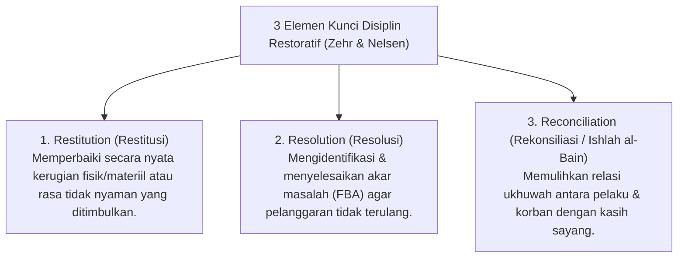

# P6-01: Filosofi Disiplin Positif Restoratif dan Prinsip Firm & Kind

## Status Dokumen
* **Status**: 🌟 **A+ (Tervalidasi & Siap Diimplementasikan)**
* **Sub-Domain**: `06 Intervention Framework / 01 Intervention Philosophy`
* **Penanggung Jawab Keilmuan**: Dewan Keilmuan TUMBUH (*Pakar Arsitektur PBIS Restoratif & Pakar Filosofi TUMBUH*)

---

## 1. Konseptualisasi Disiplin Positif Restoratif

Disiplin Positif Restoratif adalah pendekatan pembinaan karakter yang memandang disiplin sebagai **proses mengajarkan regulasi diri (*Teaching Self-Regulation*)**, bukan proses penghukuman atau penderitaan fisik/mental.

---

## 2. Prinsip "Firm & Kind" (Tegas & Hangat)

- **Firm (Tegas)**: Mempertahankan batasan adab dan konsekuensi logis secara konsisten tanpa kompromi pada nilai-nilai keselamatan dan syariat.
- **Kind (Hangat)**: Menyampaikan bimbingan dengan kelembutan suara, bahasa tubuh yang menghormati martabat santri, dan kehangatan *In Loco Parentis*.

---

## 3. Matriks Perbedaan Hukuman Konvensional vs Konsekuensi Logis Restoratif

| Parameter | Hukuman Konvensional (Punitive) | Konsekuensi Logis Restoratif (TUMBUH) |
| :--- | :--- | :--- |
| **Tujuan Utama** | Menimbulkan penderitaan/rasa takut agar jera. | Mengajarkan tanggung jawab & pemulihan adab. |
| **Fokus Waktu** | Berfokus pada kesalahan di masa lalu. | Berfokus pada solusi di masa depan (*Future Action*). |
| **Hubungan Perilaku** | Tidak relevan dengan pelanggaran (misal: terlambat lalu disuruh lari). | Sangat relevan & berhubungan langsung dengan pelanggaran. |
| **Dampak Emosional** | Kemarahan, dendam, rasa malu, & isolasi sosial. | Kesadaran muhasabah, empati, & pemulihan ukhuwah. |
