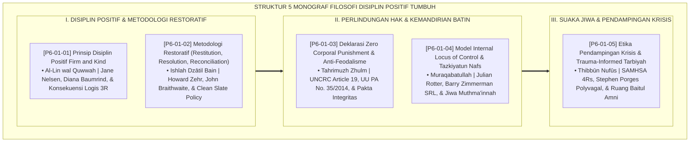

# P6-01: DOKUMEN INDUK FILOSOFI DISIPLIN POSITIF DAN RESTORATIF
## *Arsitektur dan Rekayasa Fondasi Filosofis Pengasuhan Beradab, Keadilan Restoratif, Kebijakan Anti-Kekerasan, Lokus Kontrol Mandiri, Serta Pendampingan Sadar Trauma (Prinsip Disiplin Positif Firm & Kind Form PDP, Metodologi Restoratif 3R Form MRR, Piagam Zero Corporal Punishment Form ZCP, Model Lokus Kontrol Internal Form ILK, Serta Protokol Trauma-Informed Tarbiyah Form TIK) di Ekosistem TUMBUH Pesantren*

**Nomor Identifikasi**: `P6-01/DOKUMEN-INDUK-FILOSOFI-DISIPLIN-RESTORATIF/2026`  
**Domain**: `06 Intervention Framework` > `01 Intervention Philosophy` (Gugus Sub-Domain 01: *Foundational Philosophies of Positive Discipline, Restorative Justice, Child Safeguarding, & Trauma-Informed Tarbiyah*)  
**Klasifikasi Naskah**: *Master Architecture & Navigation Monograph* (Dokumen Induk Peta Jalan Riset & Navigasi 5 Monograf Ilmiah Filosofi Intervensi dan Disiplin Positif)  
**Rumpun Disiplin Pengkaji**: Filsafat Pendidikan Islam, Positive Discipline (Jane Nelsen), Restorative Justice in Education (Howard Zehr), Child Protection & Safeguarding, Trauma-Informed Care (SAMHSA)  

---

> ### 💡 INTISARI EKSEKUTIF (EXECUTIVE SUMMARY)
>
> * **Kedudukan Strategis Gugus Filosofi Disiplin Positif dan Restoratif:**  
>   Gugus *Intervention Philosophy (Filosofi Disiplin Positif dan Restoratif)* merupakan fondasi moral, teologis, dan pedagogis tertinggi (*The Moral & Epistemological Bedrock*) bagi seluruh arsitektur intervensi dalam ekosistem TUMBUH. Gugus ini menghancurkan mitos bahwa pendisiplinan santri harus melalui kekerasan fisik, bentakan verbal, atau feodalisme senioritas, menggantikannya dengan paradigma **Firm and Kind (Tegas dan Hangat)**, **Keadilan Restoratif 3R (Restitusi, Resolusi, Rekonsiliasi)**, **Zero Corporal Punishment**, **Lokus Kontrol Internal (*Muraqabatullah*)**, dan **Pengasuhan Sadar Trauma (*Trauma-Informed Tarbiyah*)**.
> * **Integrasi Holistik Turats & Konsensus Sains Pengasuhan Modern:**  
>   Gugus riset ini memadukan khazanah agung Islam tentang kelembutan tanpa kelemahan (*Al-Līn fī Ghairi Dha'fin*), mendamaikan perselisihan (*Ishlāhu Dzātil Bain*), keharaman mutlak kezaliman (*Tahrīmuzh Zhulm*), pengawasan batin (*Shidqul Murāqabah*), dan merawat jiwa yang terluka (*Thibbūn Nufūs*) dengan konsensus sains dunia (*Jane Nelsen Positive Discipline, Howard Zehr Restorative Justice, UNCRC Child Protection, Barry Zimmerman SRL, dan SAMHSA Trauma-Informed Care*).
> * **Struktur Lengkap 5 Berkas Monograf Riset Ilmiah:**  
>   Dokumen induk ini memetakan dan menghubungkan 5 berkas monograf penelitian akademik komprehensif (~145 KB total riset) yang menyajikan panduan kuadran pengasuhan, berita acara pemulihan 3R, pakta integritas anti-kekerasan, skala ukur kemandirian batin, dan panduan de-eskalasi krisis ramah trauma.

---

## 📑 PETA NAVIGASI LIMA MONOGRAF RISET FILOSOFI DISIPLIN POSITIF

Berikut adalah daftar lengkap 5 monograf riset akademik dalam gugus **`01 Intervention Philosophy`**:

---

## 📚 DESKRIPSI RINGKAS 5 BERKAS MONOGRAF

1. **[P6-01-01: Prinsip Disiplin Positif Firm and Kind](file:///c:/xampp/htdocs/tumbuh/06%20Intervention%20Framework/01%20Intervention%20Philosophy/P6-01-01-Prinsip-Disiplin-Positif-Firm-and-Kind.md)**  
   *Membahas fondasi filosofis pengasuhan tegas dan hangat secara simultan, doktrin Al-Lin wal Quwwah Sayyidina Umar RA, Jane Nelsen Positive Discipline, konsekuensi logis 3R, dan form Form PDP-Prinsip.*
2. **[P6-01-02: Metodologi Restoratif (Restitution, Resolution, Reconciliation)](file:///c:/xampp/htdocs/tumbuh/06%20Intervention%20Framework/01%20Intervention%20Philosophy/P6-01-02-Metodologi-Restoratif-Restitution-Resolution-Reconciliation.md)**  
   *Membahas arsitektur keadilan pemulihan tiga rantai (3R), doktrin Ishlah Dzātil Bain salaf, Howard Zehr Restorative Questions, John Braithwaite Reintegrative Shaming, dan form Form MRR-Metodologi.*
3. **[P6-01-03: Deklarasi Zero Corporal Punishment dan Anti-Feodalisme](file:///c:/xampp/htdocs/tumbuh/06%20Intervention%20Framework/01%20Intervention%20Philosophy/P6-01-03-Deklarasi-Zero-Corporal-Punishment-dan-Anti-Feodalisme.md)**  
   *Membahas kebijakan nol toleransi mutlak terhadap kekerasan fisik dan feodalisme senioritas, doktrin Hadits Qudsi Tahrimuzh Zhulm, UNCRC Article 19, UU PA No. 35/2014, dan form Form ZCP-Piagam.*
4. **[P6-01-04: Model Internal Locus of Control dan Tazkiyatun Nafs](file:///c:/xampp/htdocs/tumbuh/06%20Intervention%20Framework/01%20Intervention%20Philosophy/P6-01-04-Model-Internal-Locus-of-Control-dan-Tazkiyatun-Nafs.md)**  
   *Membahas rekayasa psikologis pembentukan regulasi diri mandiri, doktrin Muraqabatullah salaf, Julian Rotter Locus of Control, Barry Zimmerman Self-Regulated Learning (SRL), dan form Form ILK-Regulasi.*
5. **[P6-01-05: Etika Pendampingan Krisis dan Trauma-Informed Tarbiyah](file:///c:/xampp/htdocs/tumbuh/06%20Intervention%20Framework/01%20Intervention%20Philosophy/P6-01-05-Etika-Pendampingan-Krisis-dan-Trauma-Informed-Tarbiyah.md)**  
   *Membahas protokol pendampingan santri mengalami krisis psikososial, doktrin Thibbun Nufus Abu Zaid Al-Balkhi, SAMHSA Trauma-Informed Care 4Rs, Stephen Porges Polyvagal Theory, dan form Form TIK-Trauma.*

---

## 🎯 STANDAR PENJAMINAN MUTU FILOSOFI INTERVENSI

Penerapan gugus **Filosofi Disiplin Positif dan Restoratif (Intervention Philosophy)** menjamin bahwa:
1. **Terciptanya Lingkungan Asrama yang Bebas dari Ketakutan dan Kekerasan (*Violence-Free Bi'ah Shalihah*)**: Menghilangkan 100% praktik kekerasan fisik, verbal, dan feodalisme senioritas di seluruh sudut pondok.
2. **Keadilan Berpusat pada Pemulihan dan Perdamaian (*Restorative & Healing Justice*)**: Setiap konflik diselesaikan melalui ganti rugi nyata dan rekonsiliasi hati tanpa menyisakan dendam batin.
3. **Melahirkan Santri Berjiwa Merdeka yang Berdisiplin Karena Taqwa (*Autonomous & Self-Governing Believers*)**: Disiplin santri bertumpu pada kesadaran muraqabah ilahiah, bukan pada ketakutan terhadap pengawasan manusia.
