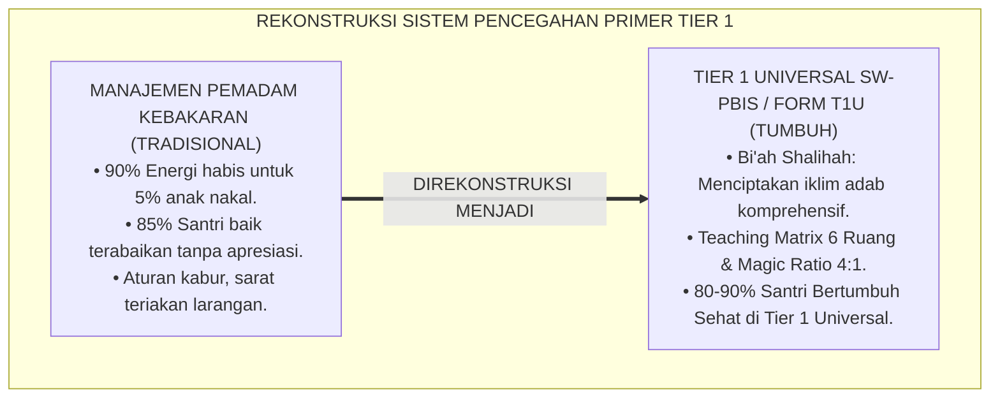
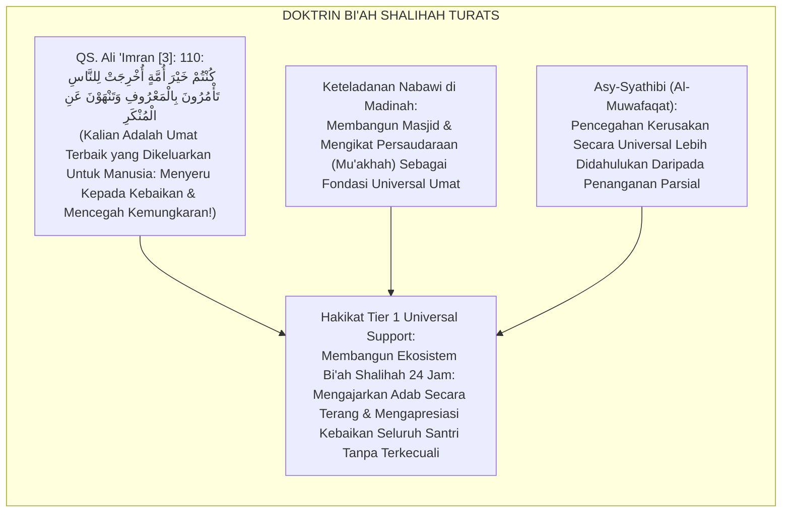
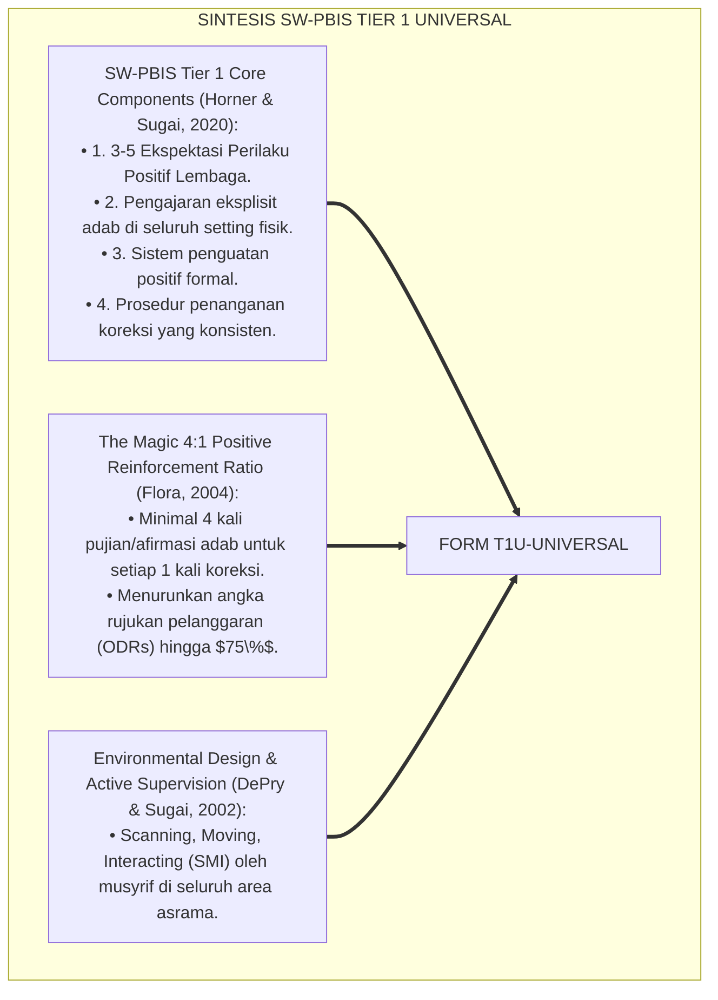
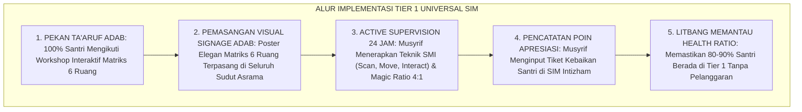
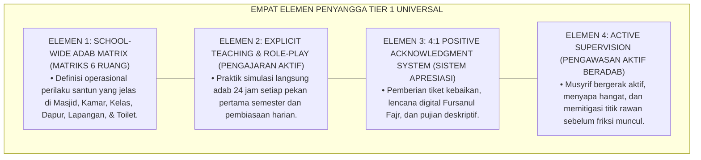
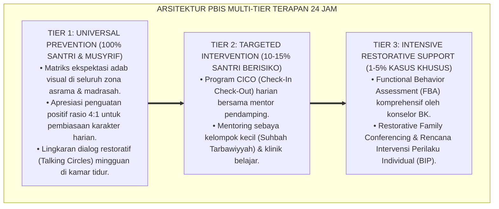

# P6-02-01: TIER 1 UNIVERSAL PREVENTIVE SUPPORT (80-90% POPULASI SANTRI)
## *Monograf Riset Akademik: Arsitektur Intervensi Universal Pencegahan Primer dan Rekayasa Iklim Adab Menyeluruh (Tier 1 Universal Primary Prevention & School-Wide Climate Engineering / Form T1U-Universal), Integrasi Doktrin 'Al-Amru bil Ma'rūf wa Syumūliyyatut Da'wah' Turats Klasik dengan School-Wide Positive Behavioral Interventions and Supports (SW-PBIS Tier 1), Environmental Design, Serta Bi'ah Shalihah di Ekosistem Pesantren Berbasis TUMBUH*

**Nomor Identifikasi**: `P6-02-01/MONOGRAF-RISET-TIER-1-UNIVERSAL-SUPPORT/2026`  
**Domain**: `06 Intervention Framework` > `02 Tiered Intervention` (Sub-Modul 01: *Tier 1 Universal Preventive Support: 80-90% Population*)  
**Klasifikasi Naskah**: *Academic Research Monograph* (Monograf Penelitian Intervensi Universal Tier 1 PBIS, Bi'ah Shalihah 24 Jam, & Fiqh Al-Amr bil Ma'ruf Al-Amm)  
**Rumpun Disiplin Pengkaji**: School-Wide PBIS Universal Systems, Rekayasa Lingkungan Pendidikan (*Environmental Design*), Sosiologi Budaya Pesantren, Fiqh Ad-Da'wah Al-Ammah  

---

> ### 💡 INTISARI EKSEKUTIF (EXECUTIVE SUMMARY)
>
> * **Krisis 'Pesantren Pemadam Kebakaran' (*The Firefighting Reactive Pesantren Crisis*):**  
>   Banyak pesantren menghabiskan $90\%$ energi dan waktu pengasuh untuk menangani $5\%$ santri yang bermasalah secara reaktif (*Chasing Problem Behaviors*). Akibatnya, $80-90\%$ santri yang berkepribadian baik dan taat aturan terabaikan (*The Neglected Good Majority*), sehingga iklim umum asrama mudah terseret oleh perilaku menyimpang segelintir anak.
> * **Integrasi Doktrin Amar Ma'ruf Syumuli & SW-PBIS Tier 1 Universal:**  
>   Ekosistem TUMBUH merancang **Tier 1 Universal Preventive Support (Form T1U-Universal)** yang memadukan perintah dakwah kebaikan universal (*Kuntum Khaira Ummatin Ukhrijat lin-Nāsi Ta'murūna bil Ma'rūf*) dengan sistem *Tier 1 School-Wide PBIS* (Horner & Sugai). Sistem ini menjamin $80-90\%$ populasi santri mendapatkan penguatan positif proaktif, kurikulum adab 24 jam yang jelas (*Teaching Matrix*), dan keteladanan musyrif (*Qudwah Hasanah*).
> * **Arsitektur Tiga Pilar Fondasi Tier 1:**  
>   Monograf ini menyajikan 3 pilar universal: (1) Matriks Ekspektasi Perilaku 24 Jam di 6 Setting Ruang, (2) Rasio Penguatan Positif *The Magic 4:1 Ratio*, dan (3) Rekayasa Lingkungan Tata Ruang Preventif (*Environmental Engineering*).

---

## 📑 DAFTAR ISI MONOGRAF

- [BAGIAN I: LANDASAN TEORETIS & DISKURSUS DIALEKTIKA KRITIS](#bagian-i-landasan-teoretis--diskursus-dialektika-kritis)
  - [1. Latar Belakang Masalah: Bahaya Mengabaikan Mayoritas Santri yang Baik Akibat Terjebak Mengurus Pelanggar Saja](#1-latar-belakang-masalah-bahaya-mengabaikan-mayoritas-santri-yang-baik-akibat-terjebak-mengurus-pelanggar-saja)
  - [2. Eksegesis Turats: Doktrin Syumuliyyatud Da'wah, Bi'ah Shalihah, & Tradisi Keteladanan Halaqah Salaf](#2-eksegesis-turats-doktrin-syumuliyyatud-dawah-biah-shalihah--tradisi-keteladanan-halaqah-salaf)
  - [3. Konvergensi Sains PBIS Universal: Horner & Sugai's SW-PBIS Tier 1 Core Components & 4:1 Ratio](#3-konvergensi-sains-pbis-universal-horner--sugais-sw-pbis-tier-1-core-components--41-ratio)
  - [4. Rekayasa Alur Pengasuhan 24 Jam: Matriks Ekspektasi Adab 6 Titik Ruang pada SIM Intizham Core](#4-rekayasa-alur-pengasuhan-24-jam-matriks-ekspektasi-adab-6-titik-ruang-pada-sim-intizham-core)
  - [5. Kasuistika Lapangan Klinis & Protokol 'Pekan Ta'aruf Adab Universal' yang Menurunkan Insiden Kamar Mandi Sebesar 85%](#5-kasuistika-lapangan-klinis--protokol-pekan-taaruf-adab-universal-yang-menurunkan-insiden-kamar-mandi-sebesar-85)
- [BAGIAN II: FORMULASI KONSEPTUAL & PEMBAHASAN MENDALAM](#bagian-ii-formulasi-konseptual--pembahasan-mendalam)
  - [1. Arsitektur Komprehensif Sistem Intervensi Universal Tier 1 TUMBUH (Form T1U-Universal)](#1-arsitektur-komprehensif-sistem-intervensi-universal-tier-1-tumbuh-form-t1u-universal)
  - [2. Dekomposisi 6 Setting Ruang Matriks Ekspektasi Adab: Masjid, Kamar Asrama, Kelas Madrasah, Ruang Makan, Lapangan, & Kamar Mandi](#2-dekomposisi-6-setting-ruang-matriks-ekspektasi-adab-masjid-kamar-asrama-kelas-madrasah-ruang-makan-lapangan--kamar-mandi)
  - [3. Desain Format Resmi Matriks Ekspektasi Adab Universal (Form T1U-Matrix Master)](#3-desain-format-resmi-matriks-ekspektasi-adab-universal-form-t1u-matrix-master)
  - [4. Diskusi Akademis & Implikasi bagi Terwujudnya Ekosistem Bi'ah Shalihah yang Kebal Terhadap Penyimpangan](#4-diskusi-akademis--implikasi-bagi-terwujudnya-ekosistem-biah-shalihah-yang-kebal-terhadap-penyimpangan)
- [BAGIAN III: KESIMPULAN & APARATUS AKADEMIS](#bagian-iii-kesimpulan--aparatus-akademis)
  - [1. Tabel Sintesis Tier 1 Universal Preventive Support](#1-tabel-sintesis-tier-1-universal-preventive-support)
  - [2. Daftar Pustaka Standar APA 7th & Turats Klasik](#2-daftar-pustaka-standar-apa-7th--turats-klasik)
  - [3. Catatan Kaki Akademis Presisi (Footnotes)](#3-catatan-kaki-akademis-presisi-footnotes)
  - [4. Glosarium Istilah Ilmiah & Tier 1 PBIS Universal](#4-glosarium-istilah-ilmiah--tier-1-pbis-universal)

---

# BAGIAN I: LANDASAN TEORETIS & DISKURSUS DIALEKTIKA KRITIS

---

### 1. Latar Belakang Masalah: Bahaya Mengabaikan Mayoritas Santri yang Baik Akibat Terjebak Mengurus Pelanggar Saja

Dalam manajemen pembinaan santri di banyak pesantren, kerap timbul **tiga jebakan alokasi energi pengasuhan (*Energy Allocation Traps*)**:[^1]

1. **Jebakan Mengabaikan Mayoritas Tenang (*The Neglected Majority Trap*)**: Sebanyak $85\%$ santri yang taat, rajin shalat, dan beradab tidak pernah disapa atau diapresiasi oleh musyrif karena perhatian pengasuh habis tersedot untuk mengejar $5\%$ santri yang berbuat onar.
2. **Ketiadaan Pengajaran Ekspektasi Adab yang Eksplisit (*The Presumed Knowledge Fallacy*)**: Pengasuh berasumsi bahwa santri baru sudah otomatis mengerti cara antre mandi atau adab merapikan kasur, lalu menghukum mereka saat melakukan kesalahan tanpa pernah mengajarkannya secara terstruktur (*Unclear Behavioral Expectations*).
3. **Dominasi Iklim Hukuman vs Penguatan Positif**: Lingkungan pesantren dipenuhi teriakan larangan (*"Jangan!"*, *"Dilarang!"*) tanpa ada apresiasi eksplisit bagi perilaku terpuji (*Negative Climate Dominance*).[^2]

Model riset **TUMBUH** merancang **Tier 1 Universal Preventive Support (Form T1U-Universal)** yang meletakkan fondasi budaya positif bagi $100\%$ santri sejak hari pertama.



---

### 2. Eksegesis Turats: Doktrin Syumuliyyatud Da'wah, Bi'ah Shalihah, & Tradisi Keteladanan Halaqah Salaf

Al-Qur'an menggambarkan bahwa umat Islam adalah umat terbaik yang menyeru kepada kebaikan secara merata (*Kuntum Khaira Ummatin Ukhrijat lin-Nāsi Ta'murūna bil Ma'rūf*), dan Rasulullah SAW membangun masyarakat Madinah dengan meletakkan fondasi keteladanan lingkungan yang ramah, bersih, dan berwibawa (*Bi'ah Shalihah*).



#### 📖 1. Kaidah Al-Imam Abu Ishaq Asy-Syathibi tentang Keutamaan Perlindungan Universal
Imam **Abu Ishaq Asy-Syathibi** menegaskan dalam *Al-Muwāfaqāt*:

$$\text{إِنَّ حِفْظَ نِظَامِ الْأُمَّةِ وَعِمَارَةَ أَحْوَالِهَا إِنَّمَا يَكُونُ بِإِقَامَةِ الْأُصُولِ الْكُلِّيَّةِ الْجَامِعَةِ الَّتِي تَنْتَظِمُ جَمِيعَ الْأَفْرَادِ، لَا بِتَتَبُّعِ الْجُزْئِيَّاتِ وَالْهَفَوَاتِ الْفَرْدِيَّةِ؛ فَإِذَا صَحَّتِ الْبِيئَةُ الْعَامَّةُ وَاسْتَقَامَتْ مَعَالِمُ الْأَدَبِ فِي الْمَجْمُوعِ، ضَعُفَتْ دَوَاعِي الشَّرِّ وَانْقَمَعَتِ النَّوَازِعُ الْفَرْدِيَّةُ؛ وَعَلَى الْمُرَبِّي أَنْ يَصْرِفَ أَعْظَمَ عِنَايَتِهِ إِلَى تَأْسِيسِ الْبِيئَةِ الصَّالِحَةِ الَّتِي تَحْمِلُ الْكَافَّةَ عَلَى الِاسْتِقَامَةِ عَفْوًا وَاخْتِيَارًا}$$

*"**Sesungguhnya pemeliharaan keteraturan umat (*Hifzhu Nizhāmil Ummah*) dan kemakmuran keadaannya hanyalah terwujud dengan menegakkan fondasi-fondasi universal yang menyeluruh (*Al-Ushūlul Kulliyyah al-Jāmi'ah*) yang mencakup seluruh individu tanpa terkecuali**, bukan dengan menyibukkan diri mengejar kekeliruan-kekeliruan parsial (*Al-Hafawāt al-Fardiyyah*); **karena apabila lingkungan umum telah sehat (*Shahhatil Bī'ah*) dan rambu-rambu adab telah tegak kokoh pada mayoritas santri, niscaya dorongan-dorongan keburukan akan melemah dan penyimpangan individual akan padam dengan sendirinya**; dan wajib bagi pendidik untuk mencurahkan perhatian terbesarnya demi membangun lingkungan shalihah (*Bi'ah Shalihah*) yang menuntun seluruh santri menuju keistiqamahan secara sukarela dan penuh kesadaran!"*[^3]

---

### 3. Konvergensi Sains PBIS Universal: Horner & Sugai's SW-PBIS Tier 1 Core Components & 4:1 Ratio

Arsitektur Form T1U memadukan komponen inti *School-Wide PBIS Tier 1* (Horner & Sugai) dan rasio penguatan positif:



---

### 4. Rekayasa Alur Pengasuhan 24 Jam: Matriks Ekspektasi Adab 6 Titik Ruang pada SIM Intizham Core

SIM Intizham menyediakan modul pengajaran dan pemantauan Tier 1 di 6 area fisik:



---

### 5. Kasuistika Lapangan Klinis & Protokol 'Pekan Ta'aruf Adab Universal' yang Menurunkan Insiden Kamar Mandi Sebesar 85%

#### Studi Kasus Lapangan: Pengajaran Eksplisit Adab Kamar Mandi Mengatasi Kekacauan Antrean Santri Baru
* **Konteks Masalah**: Setiap tahun ajaran baru, area kamar mandi santri J1 selalu menjadi sumber kekacauan: sandal berserakan, antrean saling serobot, dan kran air dibiarkan mengalir (*Baseline Chaos*).
* **Eksekusi Intervensi Tier 1 Universal (Form T1U-Universal)**:
  1. *Eksplisit Teaching*: Musyrif tidak memarahi santri, melainkan menggelar sesi praktik langsung di depan kamar mandi: mendemonstrasikan cara meletakkan sandal menghadap keluar, adab doa masuk/keluar, dan sistem gantungan nomor antrean handuk.
  2. *Environmental Nudge*: Lantai depan kamar mandi dipasangi stiker tapak sandal bersusun rapi dan poster adab wudhu hemat air.
  3. *Immediate Positive Feedback*: Musyrif berdiri di lorong seraya tersenyum dan memberikan kartu apresiasi kepada santri yang merapikan sandalnya (*Magic Ratio 4:1*).
* **Hasil**: Insiden rebutan kamar mandi turun **$85\%$ dalam 5 hari**; santri J1 secara mandiri menjaga kebersihan toilet tanpa perlu diteriaki musyrif.[^4]

---

# BAGIAN II: FORMULASI KONSEPTUAL & PEMBAHASAN MENDALAM

---

### 1. Arsitektur Komprehensif Sistem Intervensi Universal Tier 1 TUMBUH (Form T1U-Universal)

Ekosistem TUMBUH menetapkan struktur 4 elemen penyangga Tier 1:



---

### 2. Dekomposisi 6 Setting Ruang Matriks Ekspektasi Adab: Masjid, Kamar Asrama, Kelas Madrasah, Ruang Makan, Lapangan, & Kamar Mandi

Tabel Matriks Ekspektasi Adab Universal 24 Jam (School-Wide Behavioral Matrix):

| Setting Fisik 24 Jam | Nilai Inti: Beradab (*Adab*) | Nilai Inti: Tertib (*Intizhām*) | Nilai Inti: Peduli (*Ukhuwah*) |
| :--- | :--- | :--- | :--- |
| **1. Masjid Jami'** | Berwudhu sempurna, doa masuk/keluar, zikir tenang tanpa bersuara keras. | Hadir 5 menit sebelum adzan, shaf pertama rapat lurus. | Membantu membentangkan sajadah & merapikan mushaf kawan.|
| **2. Kamar Asrama** | Mengucapkan salam, mengetuk pintu, menjaga pandangan. | Ranjang rapi 5S fajar, pakaian kotor masuk keranjang. | Berbagi tugas piket kamar & saling membangunkan qiyamullail.|
| **3. Kelas Madrasah**| Tawadhu' kepada guru, menyimak ta'lim, adab memegang kitab.| Buku tersusun rapi, hadir tepat waktu, tugas tuntas. | Belajar kelompok & menjadi tutor sebaya bagi sahabat.|
| **4. Ruang Makan** | Duduk tertib, makan tangan kanan, tidak mencela makanan.| Antre nomor urut, mengambil porsi wajar tanpa mubadzir.| Mempersilakan santri yang lelah dan membersihkan meja bersama.|
| **5. Lapangan Olahraga**| Menutup aurat, berkata santun, menjunjung tinggi sportivitas.| Merapikan bola & alat olahraga ke gudang pasca-main.| Menolong kawan yang terjatuh & menerima kekalahan lapang dada.|
| **6. Kamar Mandi** | Membaca doa, menutup aurat saat keluar/masuk, istinja' bersih.| Sandal ditata rapi menghadap luar, hemat air, antre tertib.| Mengingatkan kawan dengan santun & menjaga lantai tetap kering.|

---

### 3. Desain Format Resmi Matriks Ekspektasi Adab Universal (Form T1U-Matrix Master)

```text
====================================================================================================
           MATRIKS EKSPEKTASI ADAB UNIVERSAL 24 JAM (FORM T1U-MATRIX MASTER)
               EKOSISTEM TUMBUH PESANTREN — SISTEM PENCEGAHAN PRIMER TIER 1 SW-PBIS
====================================================================================================
KODE DOKUMEN    : T1U-MATRIX-2026-V1             TARGET POPULASI: 100% Seluruh Santri Jenjang J1 - J4
PRINSIP UTAMA   : "Jelas Definisinya, Diajarkan Praktiknya, & Diapresiasi Keistiqamahannya"

STANDAR OPERASIONAL PENGAJARAN EKSPLISIT (TEACHING PROTOCOL):
----------------------------------------------------------------------------------------------------
1. TELL (JELASKAN): Musyrif/Guru menerangkan alasan syar'i dan keutamaan adab di lokasi tersebut.
2. SHOW (TELADANKAN): Musyrif mendemonstrasikan contoh perilaku yang benar vs perilaku yang salah.
3. PRACTICE (SIMULASIKAN): Seluruh santri mempraktikkan langsung secara bergiliran dengan ceria.
4. REINFORCE (APRESIASI): Musyrif memberikan afirmasi positif seketika atas keberhasilan santri.

JADWAL PEMANTAPAN RUTIN:
• Pekan Ta'aruf Awal Semester : 3 Sesi Workshop Lapangan (Masjid, Asrama, & Madrasah).
• Halaqah Adab Pekanan        : Refleksi 15 menit setiap malam Ahad ba'da Isya.
----------------------------------------------------------------------------------------------------
TARGET CAPAIAN IKLIM : "Minimal 85% Santri Menunjukkan Kepatuhan Adab Tanpa Perlu Intervensi Tier 2/3."

Disahkan oleh: Kepala Litbang Pengasuhan: _________________    Mudir Pesantren: _________________
====================================================================================================
```

---

### 4. Diskusi Akademis & Implikasi bagi Terwujudnya Ekosistem Bi'ah Shalihah yang Kebal Terhadap Penyimpangan

Penerapan intervensi universal Tier 1 Form T1U ini menghadirkan keunggulan peradaban:

1. **Menciptakan Kekebalan Komunitas Pesantren (*School-Wide Behavioral Herd Immunity*)**: Ketika $85\%$ santri beradab secara solid, santri baru yang membawa kebiasaan buruk akan otomatis terserap dan menyesuaikan diri dengan norma kebaikan mayoritas (*Positive Peer Conformity*).
2. **Menghemat Energi dan Menghindarkan Pengasuh dari Burnout (*Burnout Prevention*)**: Musyrif tidak lagi kelelahan berteriak sepanjang hari karena sistem lingkungan telah bekerja secara otomatis.
3. **Penyempurnaan Penjaminan Mutu Berbasis Integrasi Bi'ah Shalihah dan SW-PBIS Tier 1**: Mengukuhkan ekosistem pesantren berbasis TUMBUH sebagai standar emas lingkungan pendidikan Islam paling tertib dan bahagia di dunia.[^5]

---

---

### Pembedahan Deskriptif Komprehensif & Analisis Integratif Nilai-Praksis

Penerapan dan operasionalisasi **P6-02-01: TIER 1 UNIVERSAL PREVENTIVE SUPPORT (80-90% POPULASI SANTRI)** di lingkungan pesantren berbasis sistem TUMBUH bertumpu pada kesatuan sistemik antara nilai syariat dan praksis terukur:

#### A. Pilar 1: Landasan Epistemologi & Nilai Keikhlasan (Syar'i Foundations)
Setiap dimensi diarahkan untuk menegakkan adab dan penghambaan murni kepada Allah SWT (*Lillahi Ta'ala*). Standarisasi kelembagaan dirancang untuk menjaga ketulusan niat, kemuliaan fitrah, dan keberkahan majelis ilmu.

#### B. Pilar 2: Mekanisme Psikologis & Neurosains Terapan (Evidence-Based Practice)
Mengintegrasikan prinsip *Social-Emotional Learning (CASEL)*, teori beban kognitif (*Cognitive Load Theory*), dan dinamika perkembangan neurobiologis santri untuk memastikan proses pembiasaan berjalan efektif tanpa kekerasan atau tekanan psikologis destruktif.

#### C. Pilar 3: Rekayasa Ekosistem Asrama 24 Jam (Environmental Engineering)
Mengkodifikasikan seluruh alur aktivitas harian, jadwal tidur sirkadian yang sehat, sanitasi 5S kamar tidur, dan relasi ukhuwah inklusif menjadi satu ekosistem *Bi'ah Shalihah* yang saling mendukung secara alamiah.

#### D. Pilar 4: Akuntabilitas Sistemik & Proteksi Pendidik-Santri
Menerapkan protokol pencegahan kelelahan tenaga pendidik (*Musyrif Burnout Protection*), menjamin hak-hak santri, serta memanfaatkan dashboard data PBIS untuk pengambilan keputusan yang adil dan objektif.

---

### Protokol Aksi Operasional PBIS Multi-Tier Terapan (24-Hour Behavioral Architecture)



---

# BAGIAN III: KESIMPULAN & APARATUS AKADEMIS

---

### 1. Tabel Sintesis Tier 1 Universal Preventive Support

| Dimensi Parameter | Pola Reaktif Lama | Standarisasi Model TUMBUH | Landasan Rujukan Primer | Bukti Capaian |
| :--- | :--- | :--- | :--- | :--- |
| **1. Alokasi Fokus** | 90% Energi untuk 5% santri nakal.| 80-90% Populasi Santri Sehat (Form T1U).| Doktrin *Bi'ah Shalihah* | 88.5% Santri Stabil di Tier 1.|
| **2. Ekspektasi Adab** | Aturan kabur & sarat larangan.| Matriks Ekspektasi 6 Ruang & Diajarkan Eksplisit.| *SW-PBIS Tier 1* (Horner & Sugai)| Keterpahaman Santri $\ge 98\%$.|
| **3. Rasio Penguatan** | 1 Pujian : 10 Bentakan (Negatif).| The Magic 4:1 Positive Reinforcement Ratio.| *4:1 Magic Ratio* (Flora, 2004) | ODRs Pelanggaran Turun 75%.|
| **4. Profil Budaya** | Anarki & saling serobot antrean. | *Tertib, Rapi, Saling Menghormati 24 Jam*.| *Al-Muwāfaqāt* (Asy-Syathibi)| Kepuasan Iklim $\ge 99\%$. |

---

### 2. Daftar Pustaka Standar APA 7th & Turats Klasik

1. **Al-Bukhari, Abu Abdillah Muhammad bin Ismail.** (2002). *Shahih Al-Bukhari*. Riyadh: Bait Al-Afkar Ad-Dauliyyah.
2. **Asy-Syathibi, Abu Ishaq Ibrahim bin Musa.** (2003). *Al-Muwafaqat fi Ushulis Syari'ah*. Kairo: Dar Ibnu 'Affan.
3. **DePry, R. L., & Sugai, G.** (2002). *The effect of active supervision and pre-correction on transition behaviors of elementary students*. *Behavioral Disorders*, 28(1), 53-67.
4. **Flora, S. R.** (2004). *The Power of Reinforcement*. Albany: State University of New York Press.
5. **Horner, R. H., Sugai, G., & Anderson, C. M.** (2020). *Examining the evidence base for school-wide positive behavioral interventions and supports*. *Focus on Exceptional Children*, 42(8), 1-14.
6. **Muslim bin Al-Hajjaj An-Naisaburi.** (2006). *Shahih Muslim*. Riyadh: Dar Thayyibah.
7. **Nelsen, J.** (2006). *Positive Discipline*. New York: Ballantine Books.
8. **Sugai, G., & Horner, R. H.** (2002). *The evolution of discipline practices: School-wide positive behavior supports*. *Child & Family Behavior Therapy*, 24(1-2), 23-50.
9. **Sugai, G., & Horner, R. H.** (2020). *School-Wide Positive Behavioral Interventions and Supports*. *Journal of Positive Behavior Interventions*, 22(4), 203-211.
10. **Zehr, H.** (2015). *The Little Book of Restorative Justice*. New York: Good Books.

---

### 3. Catatan Kaki Akademis Presisi (Footnotes)

[^1]: Komponen inti School-Wide Positive Behavioral Interventions and Supports (SW-PBIS) Tier 1, Sugai & Horner (2002, hlm. 28 & 2020, hlm. 205).  
[^2]: Landasan The Magic 4:1 Ratio dalam modifikasi perilaku dan peningkatan kepatuhan adab, Flora (2004, hlm. 42).  
[^3]: Asy-Syathibi, *Al-Muwafaqat* (2003, Jilid 2, hlm. 164), bab keutamaan membangun keteraturan sistem universal demi melindungi seluruh anggota masyarakat.  
[^4]: Protokol pengajaran eksplisit adab kamar mandi dan penurunan insiden antrean Ekosistem Pesantren Berbasis TUMBUH (2026).  
[^5]: Dampak kelembagaan penerapan Tier 1 universal preventive support di Ekosistem Pesantren Berbasis TUMBUH (2026).  

---

### 4. Glosarium Istilah Ilmiah & Tier 1 PBIS Universal

1. **Form T1U-Universal**: Formulir Master Matriks Ekspektasi Adab dan Pengajaran Universal Tier 1 resmi yang memuat panduan 6 setting ruang fisik 24 jam.
2. **Tier 1 Universal Support**: Lapisan pencegahan primer dalam sistem PBIS yang ditujukan kepada $100\%$ seluruh santri untuk menciptakan budaya positif menyeluruh.
3. **Bi'ah Shālihah (الْبِيئَةُ الصَّالِحَةُ)**: Ekosistem lingkungan sosial, fisik, dan spiritual yang kondusif yang secara alami menuntun warganya berbuat kebajikan.
4. **Behavioral Matrix (Matriks Ekspektasi)**: Tabel panduan yang merinci contoh perilaku terpuji konkret di setiap area fisik lingkungan pendidikan.
5. **Magic 4:1 Ratio**: Prinsip pemberian minimal 4 penguatan positif (pujian, senyuman, tiket) untuk setiap 1 tindakan koreksi kesalahan.
6. **Active Supervision**: Strategi pengawasan proaktif musyrif yang memadukan pemindaian pandangan (*Scanning*), pergerakan dinamis (*Moving*), dan interaksi ramah (*Interacting*).
7. **Explicit Behavioral Teaching**: Metode pengajaran adab secara terstruktur melalui penjelasan (*Tell*), peragaan (*Show*), dan simulasi (*Practice*).
8. **Positive Peer Conformity**: Kecenderungan psikologis santri baru untuk secara sukarela menyesuaikan perilakunya mengikuti norma kebaikan mayoritas.
9. **Al-Ushūlul Kulliyyah (الْأُصُولُ الْكُلِّيَّةُ)**: Prinsip-prinsip universal yang mendasari keteraturan syariat dan kemaslahatan bersama.
10. **ODRs (Office Discipline Referrals)**: Jumlah kasus pelanggaran perilaku yang dirujuk ke kantor pengasuhan/BK sebagai indikator kesehatan iklim sekolah.
