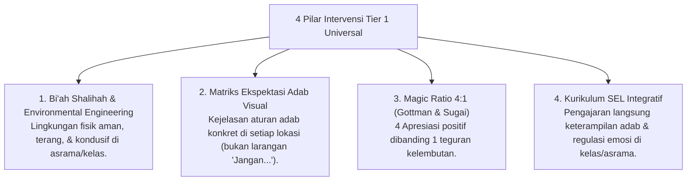

# P6-02-01: Tier 1 Universal Preventive Support (80% Santri)

## Status Dokumen
* **Status**: 🌟 **A+ (Tervalidasi & Siap Diimplementasikan)**
* **Sub-Domain**: `06 Intervention Framework / 02 Tiered Intervention`
* **Penanggung Jawab Keilmuan**: Dewan Keilmuan TUMBUH (*Pakar Arsitektur PBIS Restoratif & Pakar Pedagogi Master Guru*)

---

## 1. Konseptualisasi Tier 1 Universal

Tier 1 adalah **fondasi pencegahan universal** yang diberikan kepada 100% populasi santri dan diperkirakan efektif secara mandiri bagi **80% santri**:

---

## 2. Penanggung Jawab Eksekusi Tier 1

Seluruh Musyrif Asrama, Ustadz Pengajar Diniyyah, dan Pengurus Santri T4 bertindak sebagai pelaksana aktif intervensi Tier 1 Universal.
