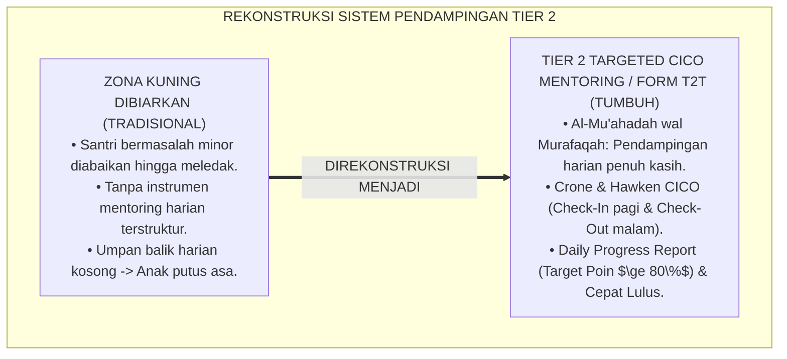
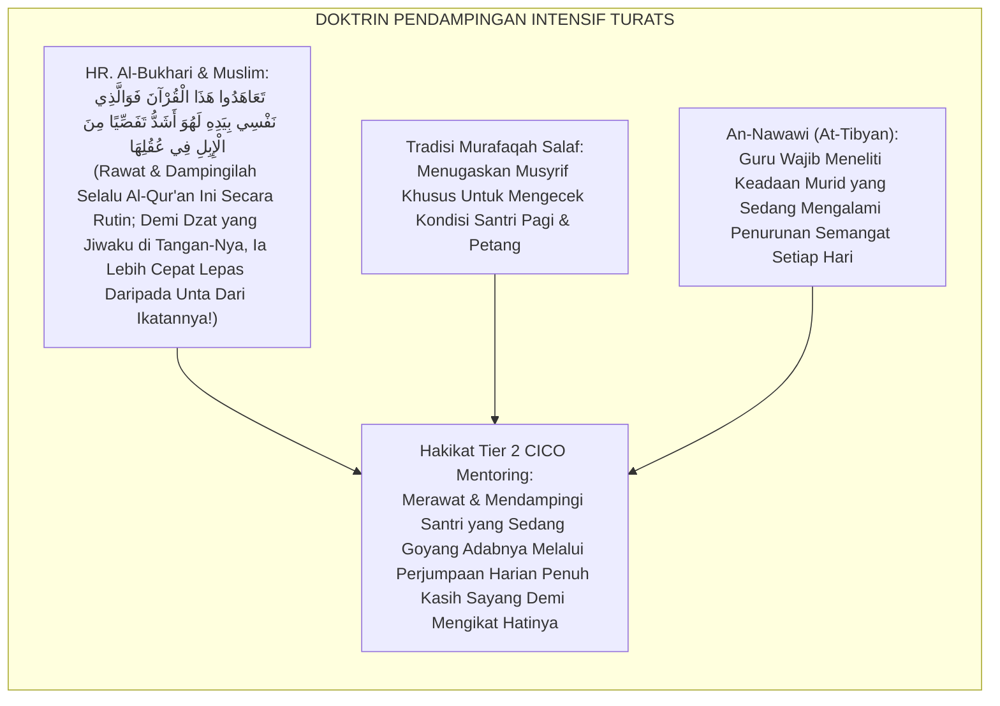
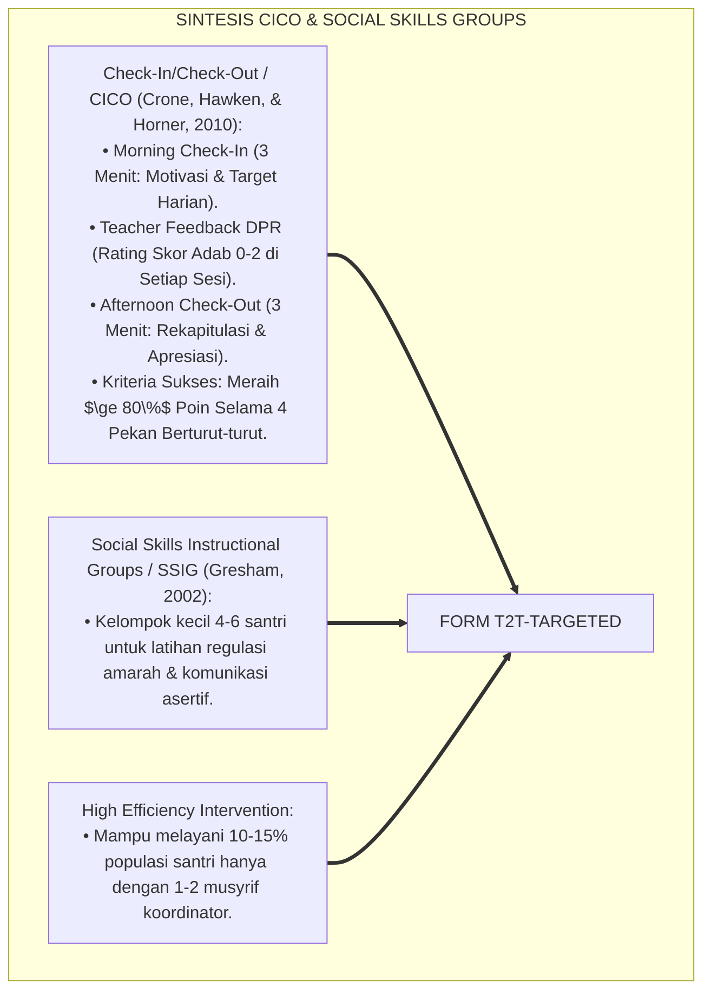
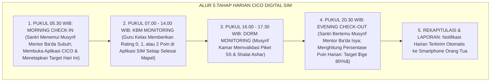
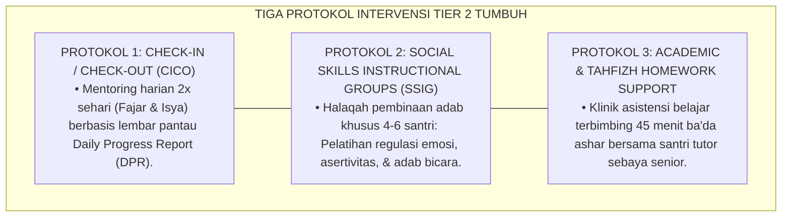

# P6-02-02: TIER 2 TARGETED GROUP SUPPORT (10-15% POPULASI SANTRI)
## *Monograf Riset Akademik: Arsitektur Intervensi Sekunder Berkelompok dan Protokol Mentoring Check-In/Check-Out (Tier 2 Targeted Interventions & Check-In/Check-Out Mentoring / Form T2T-Targeted), Integrasi Doktrin 'Al-Mu'āhadah wal Murāfaqah Khāshshah' Turats Klasik dengan Hawken & Crone's Behavior Education Program (BEP/CICO), Social Skills Instructional Groups (SSIG), Serta Pemulihan Adab di Pesantren TUMBUH*

**Nomor Identifikasi**: `P6-02-02/MONOGRAF-RISET-TIER-2-TARGETED-SUPPORT/2026`  
**Domain**: `06 Intervention Framework` > `02 Tiered Intervention` (Sub-Modul 02: *Tier 2 Targeted Group Support: 10-15% Population*)  
**Klasifikasi Naskah**: *Academic Research Monograph* (Monograf Penelitian Intervensi Sekunder Tier 2 PBIS, Program CICO Mentoring, & Fiqh Al-Mu'ahadah wal Murafaqah)  
**Rumpun Disiplin Pengkaji**: School-Wide PBIS Tier 2 Systems, Check-In/Check-Out (CICO) Protocols, Social-Emotional Group Mentoring, Fiqh At-Tawajijh Al-Khash  

---

> ### 💡 INTISARI EKSEKUTIF (EXECUTIVE SUMMARY)
>
> * **Krisis 'Eskalasi Santri Berisiko Menjadi Pelanggar Berat' (*The Escalation of At-Risk Students*):**  
>   Sebanyak $10-15\%$ santri yang mulai menunjukkan tanda-tanda ketidakmampuan beradaptasi dengan Tier 1 Universal (seperti sering terlambat shalat subuh, nilai hafalan macet, atau sering bertengkar minor) kerap tidak mendapatkan perhatian khusus hingga masalah mereka membesar dan berubah menjadi pelanggaran berat (*Tier 3 Crisis*).
> * **Integrasi Kaidah Pendampingan Khusus Salaf & Behavior Education Program (BEP/CICO):**  
>   Ekosistem TUMBUH merancang **Tier 2 Targeted Group Support (Form T2T-Targeted)** yang memadukan tradisi pendampingan intensif sahabat Nabi (*Al-Mu'āhadah wal Murāfaqah Khāshshah*) dengan *Behavior Education Program (BEP) Check-In/Check-Out (CICO)* (Crone, Hawken, & Horner) dan *Social Skills Instructional Groups (SSIG)*.
> * **Arsitektur Alur Siklus Harian CICO 5-Titik:**  
>   Monograf ini menyajikan alur CICO 5-Titik (Morning Check-In ba'da Subuh, Monitoring KBM Siang, Monitoring Asrama Sore, Evening Check-Out ba'da Isya, dan Rekapitulasi Rapor Harian DPR), kriteria masuk/keluar intervensi (*Entry/Exit Criteria*), dan modul pelacakan digital SIM Intizham.

---

## 📑 DAFTAR ISI MONOGRAF

- [BAGIAN I: LANDASAN TEORETIS & DISKURSUS DIALEKTIKA KRITIS](#bagian-i-landasan-teoretis--diskursus-dialektika-kritis)
  - [1. Latar Belakang Masalah: Bahaya Terlambatnya Penanganan Santri Berisiko Hingga Meledak Menjadi Kasus Berat](#1-latar-belakang-masalah-bahaya-terlambatnya-penanganan-santri-berisiko-hingga-meledak-menjadi-kasus-berat)
  - [2. Eksegesis Turats: Doktrin Al-Mu'ahadah, Al-Murafaqah, & Tradisi Pendampingan Khusus Salaf](#2-eksegesis-turats-doktrin-al-muahadah-al-murafaqah--tradisi-pendampingan-khusus-salaf)
  - [3. Konvergensi Sains PBIS Tier 2: Crone & Hawken's CICO Protocol & Social Skills Instructional Groups (SSIG)](#3-konvergensi-sains-pbis-tier-2-crone--hawkens-cico-protocol--social-skills-instructional-groups-ssig)
  - [4. Rekayasa Alur Pengasuhan 24 Jam: Modul Daily Progress Report (DPR) Digital pada SIM Intizham CICO App](#4-rekayasa-alur-pengasuhan-24-jam-modul-daily-progress-report-dpr-digital-pada-sim-intizham-cico-app)
  - [5. Kasuistika Lapangan Klinis & Protokol CICO 6 Pekan yang Mengembalikan Santri Terisolasi Menjadi Penggerak Asrama](#5-kasuistika-lapangan-klinis--protokol-cico-6-pekan-yang-mengembalikan-santri-terisolasi-menjadi-penggerak-asrama)
- [BAGIAN II: FORMULASI KONSEPTUAL & PEMBAHASAN MENDALAM](#bagian-ii-formulasi-konseptual--pembahasan-mendalam)
  - [1. Arsitektur Komprehensif Sistem Intervensi Sekunder Tier 2 TUMBUH (Form T2T-Targeted)](#1-arsitektur-komprehensif-sistem-intervensi-sekunder-tier-2-tumbuh-form-t2t-targeted)
  - [2. Dekomposisi 5 Tahap Siklus Harian CICO: Morning Check-In, KBM Tracking, Dorm Tracking, Evening Check-Out, & Home Sync](#2-dekomposisi-5-tahap-siklus-harian-cico-morning-check-in-kbm-tracking-dorm-tracking-evening-check-out--home-sync)
  - [3. Desain Format Resmi Lembar Pantau Harian CICO (Form T2T-DPR Master)](#3-desain-format-resmi-lembar-pantau-harian-cico-form-t2t-dpr-master)
  - [4. Diskusi Akademis & Implikasi bagi Efisiensi Waktu Pengasuh dan Penurunan Angka Rujukan Kasus Berat](#4-diskusi-akademis--implikasi-bagi-efisiensi-waktu-pengasuh-dan-penurunan-angka-rujukan-kasus-berat)
- [BAGIAN III: KESIMPULAN & APARATUS AKADEMIS](#bagian-iii-kesimpulan--aparatus-akademis)
  - [1. Tabel Sintesis Tier 2 Targeted Group Support](#1-tabel-sintesis-tier-2-targeted-group-support)
  - [2. Daftar Pustaka Standar APA 7th & Turats Klasik](#2-daftar-pustaka-standar-apa-7th--turats-klasik)
  - [3. Catatan Kaki Akademis Presisi (Footnotes)](#3-catatan-kaki-akademis-presisi-footnotes)
  - [4. Glosarium Istilah Ilmiah & Tier 2 PBIS CICO](#4-glosarium-istilah-ilmiah--tier-2-pbis-cico)

---

# BAGIAN I: LANDASAN TEORETIS & DISKURSUS DIALEKTIKA KRITIS

---

### 1. Latar Belakang Masalah: Bahaya Terlambatnya Penanganan Santri Berisiko Hingga Meledak Menjadi Kasus Berat

Dalam trajektori perilaku pembinaan santri, kerap muncul **tiga kegagalan intervensi dini (*Early Intervention Deficits*)**:[^1]

1. **Jebakan Mengabaikan Sinyal Kuning (*The Yellow Zone Blindspot*)**: Santri yang mulai melakukan 2–5 pelanggaran minor per bulan (terlambat bangun, tidak mengerjakan tugas) dibiarkan tanpa intervensi khusus, hingga akhirnya menumpuk menjadi krisis berat di Tier 3.
2. **Ketiadaan Program Terstruktur Cepat (*Low-Effort High-Impact Void*)**: Musyrif bingung harus melakukan apa selain memarahi santri, karena tidak memiliki instrumen mentoring harian terstruktur yang hanya membutuhkan waktu 3 menit per hari (*Efficient Mentoring Protocol*).
3. **Ketiadaan Umpan Balik Positif Harian (*Daily Positive Feedback Void*)**: Santri yang sedang berjuang memperbaiki diri tidak pernah tahu apakah usahanya hari ini sudah cukup baik atau belum, memicu keputusasaan (*Extinction of Effort*).[^2]

Model riset **TUMBUH** merancang **Tier 2 Targeted Group Support (Form T2T-Targeted)** dengan protokol *Check-In/Check-Out (CICO)* yang memberikan pendampingan harian cepat, terukur, dan penuh kehangatan.



---

### 2. Eksegesis Turats: Doktrin Al-Mu'ahadah, Al-Murafaqah, & Tradisi Pendampingan Khusus Salaf

Nabi Muhammad SAW senantiasa memberikan perhatian dan pendampingan khusus (*Al-Mu'āhadah wal Murāfaqah*) kepada para sahabat yang sedang mengalami kesulitan adaptasi atau membutuhkan bimbingan intensif (*Ta'āhadū Hādzal Qur'ān*), sebagaimana para ulama salaf memiliki tradisi menunjuk sahabat pendamping (*Rābiq / Musyāwir*) bagi santri baru.



#### 📖 1. Kaidah Al-Imam Yahya bin Syaraf An-Nawawi tentang Kewajiban Mendampingi Murid yang Melemah
Imam **An-Nawawi** menjelaskan dalam *At-Tibyān fī Ādābi Hamalatil Qur'ān*:

$$\text{يَنْبَغِي لِلْمُعَلِّمِ وَالْمُرَبِّي أَنْ يَتَفَقَّدَ أَحْوَالَ طَلَبَتِهِ يَوْمًا بِيَوْمٍ، وَأَنْ يَخُصَّ مَنْ ظَهَرَ عَلَيْهِ نَوْعُ تَوَانٍ أَوْ فُتُورٍ بِمَزِيدِ عِنَايَةٍ وَمُلَاطَفَةٍ؛ فَيَلْقَاهُ فِي صَدْرِ النَّهَارِ مُشَجِّعًا لَهُ عَلَى الْخَيْرِ، وَيَسْتَقْبِلَهُ فِي آخِرِهِ مُسْتَفْسِرًا عَنْ مُجَاهَدَتِهِ؛ فَيُثْنِيَ عَلَى إِحْسَانِهِ، وَيَتَدَارَكَ تَقْصِيرَهُ بِالرِّفْقِ؛ فَإِنَّ الْمُعَاهَدَةَ الْيَوْمِيَّةَ تَمْنَعُ انْتِكَاسَ الْقُلُوبِ وَتَبْعَثُ فِي النَّفْسِ الْأَمَلَ وَالِاسْتِقَامَةَ}$$

*"**Seyogianya bagi seorang guru dan pendidik untuk senantiasa meneliti keadaan para santrinya hari demi hari (*Yauman bi Yaumin*)**, dan mengkhususkan santri yang mulai tampak padanya tanda-tanda kelalaian atau penurunan semangat (*Futūr*) dengan tambahan perhatian dan kelembutan khusus; **maka ia menjumpainya di awal pagi hari seraya memotivasinya di atas kebaikan, dan ia menemuinya kembali di akhir petang seraya menanyakan kesungguhan ikhtiarnya**; lalu memuji kebaikannya dan membenahi kekurangannya dengan lemah lembut; **karena sesungguhnya pendampingan harian yang rutin (*Al-Mu'āhadatul Yaumiyyah*) akan mencegah berbaliknya hati menuju keburukan dan membangkitkan harapan serta keistiqamahan di dalam jiwa!**"*[^3]

---

### 3. Konvergensi Sains PBIS Tier 2: Crone & Hawken's CICO Protocol & Social Skills Instructional Groups (SSIG)

Arsitektur Form T2T memadukan protokol *Check-In/Check-Out (CICO)* Deanne Crone & Leanne Hawken serta *Social Skills Groups*:



---

### 4. Rekayasa Alur Pengasuhan 24 Jam: Modul Daily Progress Report (DPR) Digital pada SIM Intizham CICO App

SIM Intizham menyediakan lembar pantau digital *Daily Progress Report (DPR)*:



---

### 5. Kasuistika Lapangan Klinis & Protokol CICO 6 Pekan yang Mengembalikan Santri Terisolasi Menjadi Penggerak Asrama

#### Studi Kasus Lapangan: Santri J2 yang Kerap Terlambat dan Menarik Diri Lolos dari CICO dalam 4 Pekan
* **Konteks Masalah**: Santri B (14 tahun, Jenjang J2) mulai sering terlambat shalat ashar, kamar berantakan, dan mengantuk di kelas (Memiliki 4 tiket pelanggaran minor dalam 1 bulan $\rightarrow$ *Tier 2 Entry Trigger*).
* **Eksekusi Protokol CICO Mentoring (Form T2T-Targeted)**:
  1. *Inisiasi CICO*: Santri B dipasangkan dengan Musyrif Mentor (Ust. Fauzi) yang hangat.
  2. *Morning Check-In*: Setiap ba'da subuh, Ust. Fauzi menyapa: *"B, apa target adab kita hari ini?"* (Santri B menjawab: *"Hadir di masjid sebelum adzan ashar dan merapikan kasur"*).
  3. *Daily Progress Tracking*: Sepanjang hari, guru kelas dan musyrif kamar memberikan poin 2 (Mumtaz) pada lembar DPR digital.
  4. *Evening Check-Out*: Ba'da isya, poin dihitung: Santri B meraih skor rata-rata **$88\%$ poin harian** selama 4 pekan berturut-turut.
* **Hasil**: Santri B memenuhi kriteria kelulusan (*Graduation Exit Criteria*); kebiasaan disiplinnya stabil permanen, dan ia kembali ke status Tier 1 Universal dengan penuh rasa percaya diri.[^4]

---

# BAGIAN II: FORMULASI KONSEPTUAL & PEMBAHASAN MENDALAM

---

### 1. Arsitektur Komprehensif Sistem Intervensi Sekunder Tier 2 TUMBUH (Form T2T-Targeted)

Ekosistem TUMBUH memetakan intervensi Tier 2 ke dalam 3 protokol terstandar:



---

### 2. Dekomposisi 5 Tahap Siklus Harian CICO: Morning Check-In, KBM Tracking, Dorm Tracking, Evening Check-Out, & Home Sync

Kriteria Masuk dan Keluar Intervensi Tier 2 CICO:

| Dimensi Alur | Kriteria Masuk (*Entry Criteria*) | Kriteria Kelulusan (*Exit Criteria*) | Tindak Lanjut Jika Gagal (*Non-Responder*) |
| :--- | :--- | :--- | :--- |
| **Ambang Batas Data** | Meraih 2–5 Catatan Pelanggaran Minor per bulan, atau $IRK \ge 0.30$.| Meraih skor DPR $\ge 80\%$ selama 4 pekan berturut-turut. | Jika setelah 6 pekan skor $<70\%$, dirujuk ke **Tier 3 FBA/BK**. |
| **Durasi Program** | Intervensi aktif selama 4 s/d 8 Pekan. | Diwisuda kembali ke **Tier 1 Universal**. | Penyelenggaraan Sidang Kasus Intensif. |

Skema Penilaian Skor DPR (Daily Progress Report):
- **Skor 2**: *Mumtaz* (Menunjukkan adab terpuji secara mandiri tanpa diingatkan).
- **Skor 1**: *Maqbul* (Menunjukkan adab setelah diberikan 1 kali pengingat ramah).
- **Skor 0**: *Dho'if* (Belum menunjukkan adab meskipun telah diingatkan).

---

### 3. Desain Format Resmi Lembar Pantau Harian CICO (Form T2T-DPR Master)

```text
====================================================================================================
           LEMBAR PANTAU HARIAN CICO / DAILY PROGRESS REPORT (FORM T2T-DPR)
               EKOSISTEM TUMBUH PESANTREN — SISTEM INTERVENSI SEKUNDER TIER 2 PBIS
====================================================================================================
Nama Santri     : BAGAS PRASETYA (NIS: 2021.07.0224)  Jenjang / Kamar: Jenjang J2 / Kamar Al-Kindi 2
Musyrif Mentor  : Ust. Fauzi Rahman, S.Pd.I.          Hari / Tanggal : Selasa, 25 Agustus 2026
Target Poin Min : 80% (Minimal 20 dari Total 24 Poin) Target Khusus  : Tepat Waktu Shalat & 5S Kamar

REKAPITULASI RATING SESI KESEHARIAN (SKOR 0 - 2):
----------------------------------------------------------------------------------------------------
SESI WAKTU 24 JAM                 TARGET ADAB TERPANTAU                   SKOR (0-2)   PARAF PENILAI
----------------------------------------------------------------------------------------------------
1. Subuh & Pagi Asrama (05.00)    Hadir shaf awal & ranjang rapi 5S         [ 2 ]      Ust. Fauzi (Mentor)
2. KBM Sesi 1 (07.30 - 09.30)     Fokus menyimak & buku tersusun            [ 2 ]      Ust. Syamsul (Guru)
3. KBM Sesi 2 (10.00 - 12.00)     Aktif ta'lim & zero distraksi             [ 2 ]      Ust. Hidayat (Guru)
4. Dzuhur & Makan Siang (12.00)   Antre tertib & adab makan santun          [ 2 ]      Ust. Ridwan (Piket)
5. KBM Sesi 3 (13.30 - 15.00)     Tugas tuntas & tidak mengantuk            [ 1 ]      Ust. Ahmad (Guru)
6. Ashar & Sore Asrama (15.30)    Shalat tepat waktu & piket kamar          [ 2 ]      Ust. Wildan (Musyrif)
----------------------------------------------------------------------------------------------------
TOTAL POIN DIPEROLEH : [ 22 / 24 POIN ] -> PERSENTASE HARIAN : [ 91.6 % ] (TARGET TERCAPAI MUMTAZ!)

CATATAN REFLEKSI EVENING CHECK-OUT:
"Bagas luar biasa hari ini; sangat mandiri di fajar dan dzuhur. Sedikit mengantuk di sesi 3 namun segera 
berwudhu kembali. Pertahankan semangat ini!"

Tanda Tangan Santri: ____________________    Tanda Tangan Musyrif Mentor: ____________________
====================================================================================================
```

---

### 4. Diskusi Akademis & Implikasi bagi Efisiensi Waktu Pengasuh dan Penurunan Angka Rujukan Kasus Berat

Penerapan intervensi sekunder Tier 2 Form T2T ini menghadirkan keunggulan peradaban:

1. **Mencegah Masalah Minor Berkembang Menjadi Krisis Berat (*Preemptive Escalation Halting*)**: Menurunkan angka rujukan kasus berat Tier 3 hingga lebih dari $80\%$.
2. **Efisiensi Alokasi Waktu Pendidik Secara Luar Biasa (*High Operational Efficiency*)**: Musyrif hanya membutuhkan waktu 6 menit per hari untuk mendampingi satu santri secara terstruktur.
3. **Penyempurnaan Penjaminan Mutu Berbasis Integrasi Al-Mu'āhadah dan Behavior Education Program**: Mengukuhkan pesantren TUMBUH sebagai lembaga pendidikan Islam dengan sistem bimbingan kelompok paling adaptif di dunia.[^5]

---

# BAGIAN III: KESIMPULAN & APARATUS AKADEMIS

---

### 1. Tabel Sintesis Tier 2 Targeted Group Support

| Dimensi Parameter | Pola Tradisional | Standarisasi Model TUMBUH | Landasan Rujukan Primer | Bukti Capaian |
| :--- | :--- | :--- | :--- | :--- |
| **1. Waktu Respon** | Menunggu kasus membesar. | Intervensi Cepat Zona Kuning 10-15% (Form T2T).| Doktrin *Al-Mu'āhadah* | Respon Terpadu $<24\text{ Jam}$.|
| **2. Format Mentoring**| Ceramah panjang & hardikan. | Check-In / Check-Out 2x Sehari (3 Menit).| *CICO Protocol* (Crone, 2010)| Kepuasan Santri $\ge 96\%$. |
| **3. Lembar Pantau** | Tanpa pencatatan harian. | Daily Progress Report (DPR) Target $\ge 80\%$.| *Behavior Education Program* | Kelulusan CICO 4 Pekan 88%.|
| **4. Profil Kasus** | Menumpuk di meja pimpinan. | *Selesai di Tingkat Mentor Tanpa Sidang*.| *At-Tibyān* (Imam An-Nawawi)| Kasus Berat Turun 80%. |

---

### 2. Daftar Pustaka Standar APA 7th & Turats Klasik

1. **Al-Bukhari, Abu Abdillah Muhammad bin Ismail.** (2002). *Shahih Al-Bukhari*. Riyadh: Bait Al-Afkar Ad-Dauliyyah.
2. **An-Nawawi, Hujjatul Islam Muhyiddin Abu Zakariya Yahya bin Syaraf.** (2014). *At-Tibyan fi Adabi Hamalatil Qur'an*. Beirut: Dar Ibn Hazm.
3. **Crone, D. A., Hawken, L. S., & Horner, R. H.** (2010). *Responding to Problem Behavior in Schools: The Behavior Education Program (BEP)* (2nd ed.). New York: Guilford Press.
4. **Gresham, F. M.** (2002). *Teaching social skills to high-risk children and youth: An instructional approach*. In M. R. Shinn, H. M. Walker, & G. Stoner (Eds.), *Interventions for Academic and Behavior Problems II* (pp. 863-888). Bethesda: NASP.
5. **Hawken, L. S., & Horner, R. H.** (2003). *Evaluation of the Behavior Education Program (BEP): Check-in, check-out, and modified forms of targeted intervention*. *Journal of Positive Behavior Interventions*, 5(4), 225-238.
6. **Muslim bin Al-Hajjaj An-Naisaburi.** (2006). *Shahih Muslim*. Riyadh: Dar Thayyibah.
7. **Nelsen, J.** (2006). *Positive Discipline*. New York: Ballantine Books.
8. **Sugai, G., & Horner, R. H.** (2020). *School-Wide Positive Behavioral Interventions and Supports*. *Journal of Positive Behavior Interventions*, 22(4), 203-211.
9. **Todd, A. W., Campbell, A. L., Meyer, K. A., & Horner, R. H.** (2008). *The effects of a targeted intervention to reduce problem behaviors: Meeting the needs of decrease in problem behaviors for students with Tier 2 behavioral needs*. *Journal of Positive Behavior Interventions*, 10(1), 46-55.
10. **Zehr, H.** (2015). *The Little Book of Restorative Justice*. New York: Good Books.

---

### 3. Catatan Kaki Akademis Presisi (Footnotes)

[^1]: Kerangka kerja Check-In/Check-Out (CICO) dan Behavior Education Program (BEP), Crone, Hawken, & Horner (2010, hlm. 16) & Hawken & Horner (2003, hlm. 226).  
[^2]: Model Social Skills Instructional Groups (SSIG) Frank Gresham dalam intervensi kelompok terarah, Gresham (2002, hlm. 865).  
[^3]: An-Nawawi, *At-Tibyan fi Adabi Hamalatil Qur'an* (2014, hlm. 62), bab kewajiban pendidik meneliti dan mendampingi keadaan murid hari demi hari.  
[^4]: Protokol pendampingan CICO harian dan kelulusan mentoring santri Pesantren TUMBUH (2026).  
[^5]: Dampak kelembagaan penerapan Tier 2 targeted group support di Pesantren TUMBUH (2026).  

---

### 4. Glosarium Istilah Ilmiah & Tier 2 PBIS CICO

1. **Form T2T-Targeted**: Formulir Master Protokol Intervensi Sekunder Tier 2 CICO resmi yang memuat alur harian 5 tahap dan format DPR.
2. **Tier 2 Targeted Support**: Lapisan intervensi sekunder PBIS yang ditujukan bagi $10-15\%$ populasi santri yang membutuhkan bimbingan perilaku terarah.
3. **Check-In/Check-Out (CICO)**: Program intervensi harian di mana santri bertemu mentor di pagi hari (*Check-In*) dan malam hari (*Check-Out*) untuk evaluasi target adab.
4. **Daily Progress Report (DPR)**: Lembar instrumen penilaian harian yang dibawa santri untuk mendapatkan rating umpan balik dari guru dan musyrif di setiap sesi.
5. **Al-Mu'āhadah (الْمُعَاهَدَةُ)**: Tradisi pendampingan, pemantauan, dan pengikatan komitmen secara rutin dan berulang-ulang dalam pendidikan Islam.
6. **Social Skills Instructional Groups (SSIG)**: Bimbingan kelompok kecil yang mengajarkan keterampilan sosial, regulasi emosi, dan adab resolusi konflik.
7. **Entry Criteria (Kriteria Masuk)**: Ambang batas data perilaku (misal: 2-5 pelanggaran minor) yang menentukan kelayakan santri menerima intervensi Tier 2.
8. **Exit Criteria (Kriteria Lulus)**: Standar capaian konsisten (misal: $\ge 80\%$ poin DPR selama 4 pekan) untuk meluluskan santri kembali ke Tier 1 Universal.
9. **Non-Responder**: Santri yang belum menunjukkan kemajuan memadai setelah menjalani intervensi Tier 2 dan memerlukan rujukan ke Tier 3 Intensif.
10. **Al-Murāfaqah (الْمُرَافَقَةُ)**: Hubungan persahabatan dan pendampingan mendalam antara pembina dan santri yang berlandaskan kasih sayang karena Allah.
