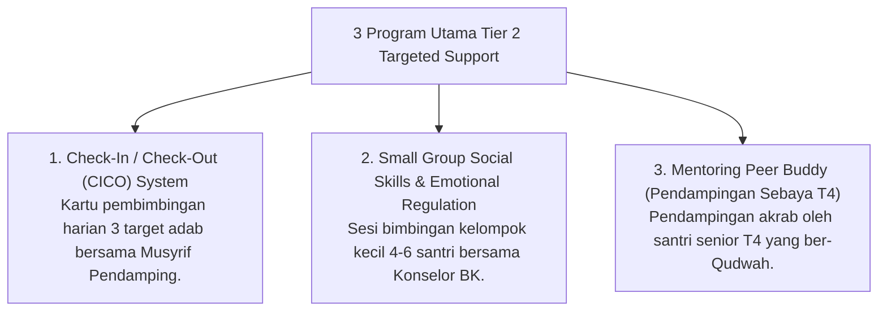

# P6-02-02: Tier 2 Targeted Group Support (15% Santri)

## Status Dokumen
* **Status**: 🌟 **A+ (Tervalidasi & Siap Diimplementasikan)**
* **Sub-Domain**: `06 Intervention Framework / 02 Tiered Intervention`
* **Penanggung Jawab Keilmuan**: Dewan Keilmuan TUMBUH (*Pakar Bimbingan Konseling & Pakar Arsitektur PBIS Restoratif*)

---

## 1. Konseptualisasi Tier 2 Targeted Group Support

Tier 2 diperuntukkan bagi **~15% santri** yang menunjukkan hambatan pembiasaan adab berulang di Tier 1 atau membutuhkan penguatan ekstra:

---

## 2. Kriteria Masuk & Lulus Tier 2

- **Masuk**: Rujukan dari logbook Musyrif karena Rule 3-Strikes Minor atau sinyal EWS Kuning/Oranye.
- **Lulus (Graduasi)**: Mencapai skor CICO $\ge$ 80% selama 4 pekan berturut-turut.
