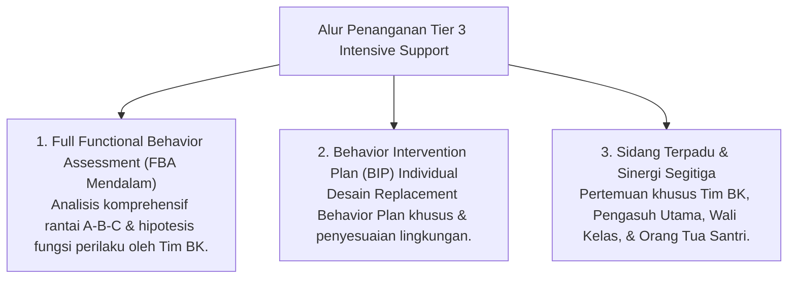

# P6-02-03: Tier 3 Intensive Individual Support (5% Santri)

## Status Dokumen
* **Status**: 🌟 **A+ (Tervalidasi & Siap Diimplementasikan)**
* **Sub-Domain**: `06 Intervention Framework / 02 Tiered Intervention`
* **Penanggung Jawab Keilmuan**: Dewan Keilmuan TUMBUH (*Pakar Bimbingan Konseling & Pakar Pengasuhan Asrama*)

---

## 1. Konseptualisasi Tier 3 Intensive Support

Tier 3 diperuntukkan bagi **~5% santri** yang mengalami krisis emosional berat, trauma, atau masalah perilaku kronis yang tidak tuntas di Tier 2:

---

## 2. Jaminan Bebas Sanksi Fisik/Pengeluaran Sepihak

Penanganan Tier 3 mengutamakan pemulihan jiwa (*Tazkiyatun Nafs*) dan perbaikan lingkungan, menolak keras opsi pengeluaran santri secara terburu-buru (*Drop-Out Mitigation*).
