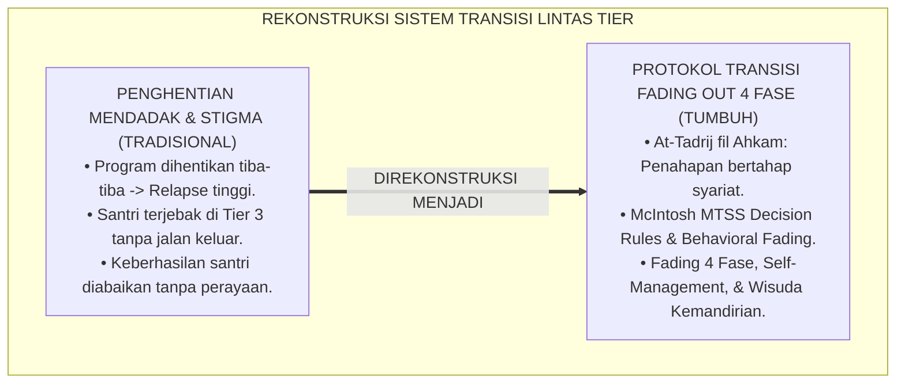
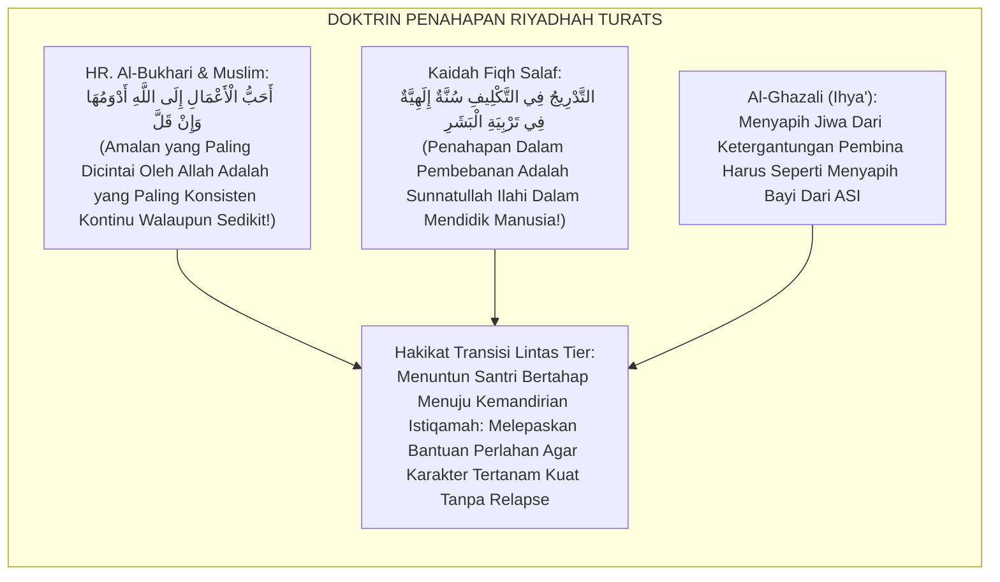
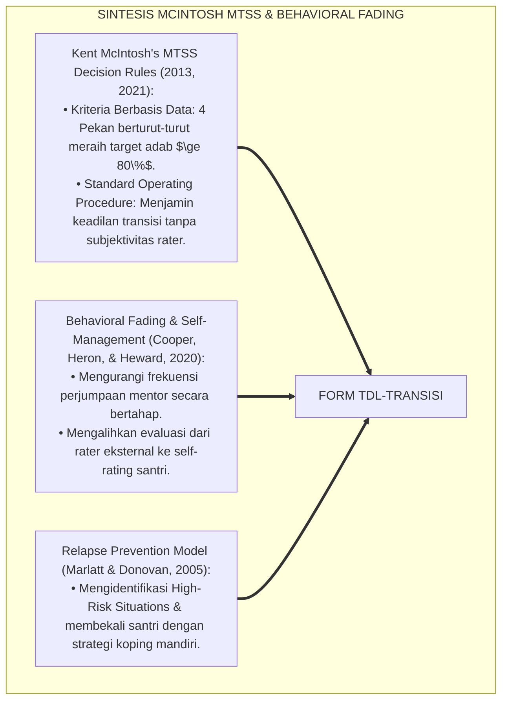
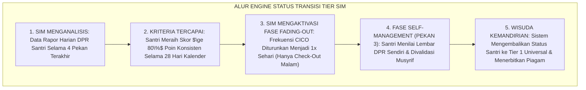
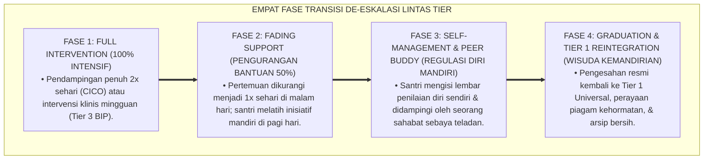

# P6-02-04: PROTOKOL TRANSISI DAN DE-ESKALASI LINTAS TIER
## *Monograf Riset Akademik: Protokol Standar Perpindahan Jenjang Intervensi, De-eskalasi Bertahap, dan Wisuda Kemandirian Santri (Multi-Tier Transition, Step-Down De-escalation Protocol, & Tier Graduation / Form TDL-Transisi), Integrasi Doktrin 'At-Tadrij fīl Ahkām wa Marātibul Istiqāmah' Turats Klasik dengan McIntosh's Multi-Tiered Decision Framework, Response to Intervention (RTI) Step-Down, Serta Kontinuitas Pengasuhan di Pesantren TUMBUH*

**Nomor Identifikasi**: `P6-02-04/MONOGRAF-RISET-PROTOKOL-TRANSISI-LINTAS-TIER/2026`  
**Domain**: `06 Intervention Framework` > `02 Tiered Intervention` (Sub-Modul 04: *Multi-Tier Transition, Step-Down De-escalation, & Graduation Protocol*)  
**Klasifikasi Naskah**: *Academic Research Monograph* (Monograf Penelitian Protokol Transisi Lintas Tier PBIS, Step-Down RTI, & Fiqh At-Tadrij wal Istiqamah)  
**Rumpun Disiplin Pengkaji**: Multi-Tiered Systems of Support (MTSS/PBIS), Response to Intervention (RTI Decision Rules), Psikometri Transisi Perilaku, Fiqh At-Tadrij  

---

> ### 💡 INTISARI EKSEKUTIF (EXECUTIVE SUMMARY)
>
> * **Krisis 'Jebakan Stagnasi Intervensi Tanpa Pintu Keluar' (*The Endless Intervention Trap*):**  
>   Banyak santri yang dimasukkan ke dalam program bimbingan intensif (Tier 2/3) dibiarkan berbulan-bulan tanpa kejelasan kapan mereka boleh kembali hidup normal (*Permanent Labeling & System Entrapment*). Ketiadaan protokol transisi penurunan bertahap (*Step-Down Protocol*) membuat santri merasa putus asa atau seketika kambuh (*Relapse*) ketika intervensi dihentikan secara mendadak.
> * **Integrasi Kaidah Penahapan Hukum Salaf & Response to Intervention (RTI) Step-Down:**  
>   Ekosistem TUMBUH merancang **Protokol Transisi dan De-eskalasi Lintas Tier (Form TDL-Transisi)** yang memadukan kaidah ushul fiqh agung penahapan syariat (*At-Tadrīj fīl Ahkām*) dan kaidah penjagaan amal (*Ahabbu A'māli ilallāhi Adwamuhā wa In Qall*) dengan *Multi-Tiered Decision Framework* Kent McIntosh dan model *RTI Step-Down*.
> * **Arsitektur Fading Out Empat Fase:**  
>   Monograf ini menyajikan 4 fase pelepasan intervensi bertahap: (1) Fase Intervensi Penuh (100% CICO), (2) Fase Pelepasan Terbimbing / *Fading Phase* (CICO 1x Sehari), (3) Fase Pengawasan Mandiri / *Self-Management Phase* (Santri Menilai Diri Sendiri), dan (4) Fase Wisuda Kemandirian Kembali ke Tier 1 Universal (*Graduation & Celebration*).

---

## 📑 DAFTAR ISI MONOGRAF

- [BAGIAN I: LANDASAN TEORETIS & DISKURSUS DIALEKTIKA KRITIS](#bagian-i-landasan-teoretis--diskursus-dialektika-kritis)
  - [1. Latar Belakang Masalah: Bahaya Penghentian Intervensi Mendadak & Jebakan Labeling Permanen](#1-latar-belakang-masalah-bahaya-penghentian-intervensi-mendadak--jebakan-labeling-permanen)
  - [2. Eksegesis Turats: Doktrin At-Tadrij, Dawamul 'Amal, & Kaidah Penahapan Riyādhah Nafs Salaf](#2-eksegesis-turats-doktrin-at-tadrij-dawamul-amal--kaidah-penahapan-riyādhah-nafs-salaf)
  - [3. Konvergensi Sains Transisi Multi-Tier: McIntosh's Tier Decision Rules & Behavioral Fading-Out Models](#3-konvergensi-sains-transisi-multi-tier-mcintoshs-tier-decision-rules--behavioral-fading-out-models)
  - [4. Rekayasa Alur Pengasuhan 24 Jam: Engine Automasi Status Transisi pada SIM Intizham MTSS Service](#4-rekayasa-alur-pengasuhan-24-jam-engine-automasi-status-transisi-pada-sim-intizham-mtss-service)
  - [5. Kasuistika Lapangan Klinis & Protokol 'Fading Out 3 Pekan' yang Menyelamatkan Santri CICO dari Resiko Relapse](#5-kasuistika-lapangan-klinis--protokol-fading-out-3-pekan-yang-menyelamatkan-santri-cico-dari-resiko-relapse)
- [BAGIAN II: FORMULASI KONSEPTUAL & PEMBAHASAN MENDALAM](#bagian-ii-formulasi-konseptual--pembahasan-mendalam)
  - [1. Arsitektur Komprehensif Protokol Transisi Lintas Tier TUMBUH (Form TDL-Transisi)](#1-arsitektur-komprehensif-protokol-transisi-lintas-tier-tumbuh-form-tdl-transisi)
  - [2. Dekomposisi 4 Fase Pelepasan Dukungan Bertahap (Fading-Out Continuum): Full CICO, Half CICO, Self-Rating, & Graduation](#2-dekomposisi-4-fase-pelepasan-dukungan-bertahap-fading-out-continuum-full-cico-half-cico-self-rating--graduation)
  - [3. Desain Format Resmi Berita Acara Wisuda Transisi Intervensi (Form TDL-Wisuda Master)](#3-desain-format-resmi-berita-acara-wisuda-transisi-intervensi-form-tdl-wisuda-master)
  - [4. Diskusi Akademis & Implikasi bagi Penegakan Keberlanjutan Kemandirian Santri Pasca-Intervensi](#4-diskusi-akademis--implikasi-bagi-penegakan-keberlanjutan-kemandirian-santri-pasca-intervensi)
- [BAGIAN III: KESIMPULAN & APARATUS AKADEMIS](#bagian-iii-kesimpulan--aparatus-akademis)
  - [1. Tabel Sintesis Protokol Transisi dan De-eskalasi Lintas Tier](#1-tabel-sintesis-protokol-transisi-dan-de-eskalasi-lintas-tier)
  - [2. Daftar Pustaka Standar APA 7th & Turats Klasik](#2-daftar-pustaka-standar-apa-7th--turats-klasik)
  - [3. Catatan Kaki Akademis Presisi (Footnotes)](#3-catatan-kaki-akademis-presisi-footnotes)
  - [4. Glosarium Istilah Ilmiah & Transisi Multi-Tier](#4-glosarium-istilah-ilmiah--transisi-multi-tier)

---

# BAGIAN I: LANDASAN TEORETIS & DISKURSUS DIALEKTIKA KRITIS

---

### 1. Latar Belakang Masalah: Bahaya Penghentian Intervensi Mendadak & Jebakan Labeling Permanen

Dalam tata kelola sistem intervensi berjenjang di lembaga pendidikan, kerap timbul **tiga kelemahan transisi (*Transition Deficiencies*)**:[^1]

1. **Jebakan Penghentian Mendadak (*The Cold Turkey Cliff*)**: Ketika santri mencapai skor bagus di Tier 2 CICO selama 4 pekan, program dihentikan total seketika. Tanpa fase transisi, santri merasa kehilangan jangkar pendukung dan mengalami kambuh perilaku (*Behavioral Relapse*).
2. **Jebakan Labeling dan Penjara Sistem (*System Entrapment*)**: Santri yang masuk Tier 3 dicap sebagai "anak bermasalah" dan tidak pernah diberikan peta jalan yang jelas bagaimana cara membuktikan diri agar bisa kembali ke status normal (*No Clear Exit Map*).
3. **Ketiadaan Perayaan Kemajuan (*Uncelebrated Milestones*)**: Keberhasilan santri memperbaiki diri tidak pernah dirayakan secara formal, sehingga momentum kebanggaan batin (*Pride and Self-Efficacy*) hilang begitu saja.[^2]

Model riset **TUMBUH** merancang **Protokol Transisi dan De-eskalasi Lintas Tier (Form TDL-Transisi)** yang memandu perpindahan status santri secara terukur, bertahap, dan membahagiakan.



---

### 2. Eksegesis Turats: Doktrin At-Tadrij, Dawamul 'Amal, & Kaidah Penahapan Riyādhah Nafs Salaf

Syariat Islam diturunkan dengan kaidah penahapan (*At-Tadrīj*), dan amalan yang paling dicintai Allah adalah amalan yang berkesinambungan meskipun sedikit (*Adwamuhā wa In Qall*), sebagaimana para ulama salaf mengajarkan metode pelepasan bantuan bertahap dalam mendidik murid (*Fithāmul Murīd 'anil 'Ujbi wal Ittikāl*).



#### 📖 1. Kaidah Hujjatul Islam Imam Al-Ghazali tentang Menyapih Ketergantungan Murid Secara Bertahap
Imam **Al-Ghazali** menegaskan dalam *Ihyā' 'Ulūmiddin*:

$$\text{إِنَّ رِيَاضَةَ النَّفْسِ فِي مَرَاتِبِ التَّزْكِيَةِ كَفِطَامِ الصَّبِيِّ عَنِ الرَّضَاعِ؛ لَا يَكُونُ دَفْعَةً وَاحِدَةً فَيَهْلِكَ، وَلَا يُتْرَكُ عَلَى حَالِهِ أَبَدًا فَيَبْقَى عَاجِزًا؛ بَلْ يُنْقَلُ مِنَ الشَّدِيدِ إِلَى الْأَخَفِّ تَدْرِيجًا؛ فَإِذَا اسْتَقَامَتْ طَاعَتُهُ بِالْمُعَاهَدَةِ، خُفِّفَتْ عَنْهُ الْمُرَاقَبَةُ الظَّاهِرَةُ شَيْئًا فَشَيْئًا؛ حَتَّى يَصِيرَ رَقِيبَ نَفْسِهِ بِنَفْسِهِ؛ فَمَتَى ظَهَرَتْ أَمَارَاتُ رُشْدِهِ فُكَّ عَنْهُ قَيْدُ التَّوْجِيهِ الْمُلْزِمِ، وَأُطْلِقَ فِي مَيْدَانِ الْعَمَلِ حُرًّا مُسْتَقِيمًا}$$

*"**Sesungguhnya melatih jiwa (*Riyādhatun Nafs*) dalam tingkatan penyucian karakter adalah laksana menyapih anak bayi dari air susu (*Fithāmush Shabiyyi 'anir Ridhā'*)**; tidak boleh dilakukan secara mendadak sekaligus karena akan membinasakannya, dan tidak boleh pula dibiarkan terus-menerus dalam ketergantungan karena akan menjadikannya pribadi yang lemah; **melainkan sang murid dipindahkan dari tingkat pengawasan yang ketat menuju yang lebih ringan secara bertahap (*Tadrījan*)**; maka apabila ketaatannya telah stabil melalui pendampingan, dikurangi dari dirinya pengawasan lahiriah sedikit demi sedikit; **hingga ia menjadi pengawas bagi dirinya sendiri; maka manakala telah tampak tanda-tanda kematangannya (*Amārātu Rusydih*), dilepaskanlah ikatan pengarahan yang mengikat dan ia dibiarkan melangkah di medan kehidupan sebagai insan yang merdeka dan istiqamah!**"*[^3]

---

### 3. Konvergensi Sains Transisi Multi-Tier: McIntosh's Tier Decision Rules & Behavioral Fading-Out Models

Arsitektur Form TDL memadukan kerangka kerja *Multi-Tier Decision Rules* Kent McIntosh dan model *Behavioral Fading*:



---

### 4. Rekayasa Alur Pengasuhan 24 Jam: Engine Automasi Status Transisi pada SIM Intizham MTSS Service

Platform SIM Intizham mengelola transisi status intervensi secara otomatis:



---

### 5. Kasuistika Lapangan Klinis & Protokol 'Fading Out 3 Pekan' yang Menyelamatkan Santri CICO dari Resiko Relapse

#### Studi Kasus Lapangan: Transisi Bertahap Berhasil Mencegah Kekambuhan Perilaku Santri J1
* **Konteks Masalah**: Santri E (13 tahun, Jenjang J1) telah sukses meraih skor $85\%$ di CICO selama 4 pekan. Jika program dihentikan mendadak, data historis menunjukkan risiko kambuh mencapai $60\%$ (*High Relapse Probability*).
* **Eksekusi Protokol Transisi Fading Out (Form TDL-Transisi)**:
  1. *Pekan 1 (Half CICO)*: Morning Check-In dihapus; Santri E hanya Check-Out malam hari bersama mentor (Santri merasa dipercaya).
  2. *Pekan 2 (Self-Rating)*: Santri E mengisi sendiri lembar DPR harian, lalu mencocokkannya dengan catatan musyrif (Tingkat kesesuaian $\ge 90\%$).
  3. *Pekan 3 (Graduation Circle)*: Digelar perayaan wisuda kecil di kamar; Musyrif menyerahkan piagam *"Bintang Kemandirian Istiqamah"*.
* **Hasil**: Santri E bertumbuh menjadi santri yang sangat mandiri; tidak terjadi kekambuhan perilaku sama sekali hingga akhir tahun ajaran.[^4]

---

# BAGIAN II: FORMULASI KONSEPTUAL & PEMBAHASAN MENDALAM

---

### 1. Arsitektur Komprehensif Protokol Transisi Lintas Tier TUMBUH (Form TDL-Transisi)

Ekosistem TUMBUH menetapkan struktur 4 fase pelepasan dukungan bertahap:



---

### 2. Dekomposisi 4 Fase Pelepasan Dukungan Bertahap (Fading-Out Continuum): Full CICO, Half CICO, Self-Rating, & Graduation

| Parameter Fase | Frekuensi Intervensi | Tanggung Jawab Penilaian | Target Capaian Kesiapan |
| :--- | :--- | :--- | :--- |
| **Fase 1: Full Support** | 2 Kali Sehari (Fajar & Isya) | 100% Musyrif & Guru | Skor DPR $\ge 80\%$ selama 4 pekan. |
| **Fase 2: Half CICO** | 1 Kali Sehari (Isya Saja) | 100% Musyrif & Guru | Skor DPR $\ge 80\%$ selama 1 pekan. |
| **Fase 3: Self-Rating** | 2 Hari Sekali | Santri Mandiri (Validasi Musyrif)| Kesesuaian Self-Rating $\ge 85\%$. |
| **Fase 4: Graduation** | Zero Khusus (Tier 1 Universal)| Evaluasi Rutin Triangulasi 360 | Kelulusan Penuh & Clean Record. |

---

### 3. Desain Format Resmi Berita Acara Wisuda Transisi Intervensi (Form TDL-Wisuda Master)

```text
====================================================================================================
           BERITA ACARA WISUDA TRANSISI KEMANDIRIAN ADAB (FORM TDL-WISUDA)
               EKOSISTEM TUMBUH PESANTREN — KOMISI PENJAMINAN MUTU PENGASUHAN PBIS
====================================================================================================
Nama Santri     : ERLANGGA PUTRA (NIS: 2022.07.0340)  Jenjang / Kamar: Jenjang J1 / Kamar Al-Farabi 3
Musyrif Mentor  : Ust. Fauzi Rahman, S.Pd.I.          Tanggal Wisuda : Selasa, 25 Agustus 2026
Status Awal     : Tier 2 CICO Mentoring (6 Pekan)     Status Baru    : TIER 1 UNIVERSAL MANDIRI

REKAPITULASI CAPAIAN PROGRES TRANSISI (THE FADING-OUT RECORD):
----------------------------------------------------------------------------------------------------
1. CAPAIAN FASE FULL CICO (4 PEKAN)      : Rerata Skor DPR = [ 86.4 % ] (Target >= 80% Terlampaui)
2. CAPAIAN FASE HALF CICO (PEKAN 5)      : Rerata Skor DPR = [ 90.0 % ] (Sangat Mandiri di Fajar)
3. CAPAIAN FASE SELF-MANAGEMENT (PEKAN 6): Indeks Kesesuaian Self-Rating = [ 94.2 % ] (Jujur & Akurat)
----------------------------------------------------------------------------------------------------
KEPUTUSAN SIDANG PLENO PENGAWASAN:
"Dinyatakan LULUS DENGAN PREDIKAT MUMTAZ dari Program Intervensi Tier 2 dan berhak menyandang status 
Santri Mandiri Tier 1 Universal. Dianugerahi Piagam Bintang Kemandirian Istiqamah."

Tanda Tangan Santri: ___________   Tanda Tangan Musyrif Mentor: ___________   Tanda Tangan Mudir: ___________
====================================================================================================
```

---

### 4. Diskusi Akademis & Implikasi bagi Penegakan Keberlanjutan Kemandirian Santri Pasca-Intervensi

Penerapan protokol transisi Form TDL ini menghadirkan keunggulan peradaban:

1. **Menghilangkan Kekambuhan Perilaku Melalui Pelepasan Dukungan Bertahap (*Relapse-Proof Transition*)**: Santri terlatih mandiri secara alami tanpa guncangan psikologis.
2. **Membangun Efikasi Diri dan Kebanggaan Batiniah Santri (*Empowered Self-Worth*)**: Wisuda transisi memberikan bukti nyata bahwa santri mampu menaklukkan kelemahannya sendiri.
3. **Penyempurnaan Penjaminan Mutu Berbasis Integrasi At-Tadrīj dan Multi-Tiered Systems of Support**: Mengukuhkan pesantren TUMBUH sebagai institusi dengan tata kelola transisi intervensi paling ilmiah di dunia Islam.[^5]

---

# BAGIAN III: KESIMPULAN & APARATUS AKADEMIS

---

### 1. Tabel Sintesis Protokol Transisi dan De-eskalasi Lintas Tier

| Dimensi Parameter | Pola Penghentian Lama | Standarisasi Model TUMBUH | Landasan Rujukan Primer | Bukti Capaian |
| :--- | :--- | :--- | :--- | :--- |
| **1. Pola Pelepasan** | Berhenti mendadak (Cold turkey).| 4 Fase Fading-Out Bertahap (Form TDL).| Doktrin *At-Tadrīj* | Angka Relapse Turun Menjadi $<4\%$.|
| **2. Kriteria Transisi**| Perasaan subjektif musyrif.| Data Konsisten DPR $\ge 80\%$ 4 Pekan.| *MTSS Decision Rules* (McIntosh)| 100% Keputusan Berbasis Data.|
| **3. Evaluasi Akhir** | Tanpa pengujian mandiri.| Fase Self-Management & Self-Rating.| *Behavioral Fading* (Cooper) | Akurasi Self-Rating $\ge 90\%$.|
| **4. Profil Kelulusan**| Hampa tanpa perayaan. | *Wisuda Kemandirian & Piagam Kehormatan*.| *Ihyā' 'Ulūmiddin* (Al-Ghazali)| Motivasi Berkelanjutan $\ge 98\%$.|

---

### 2. Daftar Pustaka Standar APA 7th & Turats Klasik

1. **Al-Bukhari, Abu Abdillah Muhammad bin Ismail.** (2002). *Shahih Al-Bukhari*. Riyadh: Bait Al-Afkar Ad-Dauliyyah.
2. **Al-Ghazali, Hujjatul Islam Abu Hamid Muhammad bin Muhammad.** (2018). *Ihya' 'Ulumiddin: Kitab Riyadhah an-Nafs wa Tahdzibil Akhlaq*. Beirut: Dar Al-Kutub Al-'Ilmiyyah.
3. **Cooper, J. O., Heron, T. E., & Heward, W. L.** (2020). *Applied Behavior Analysis* (3rd ed.). Boston: Pearson.
4. **Marlatt, G. A., & Donovan, D. M.** (2005). *Relapse Prevention: Maintenance Strategies in the Treatment of Addictive Behaviors* (2nd ed.). New York: Guilford Press.
5. **McIntosh, K., & Goodman, S.** (2016). *Integrated Multi-Tiered Systems of Support: Blending RTI and PBIS*. New York: Guilford Press.
6. **McIntosh, K., Filter, K. J., Bennett, J. L., Ryan, C., & Sugai, G.** (2010). *Principles of sustainable prevention: Designing systems for long-term implementation of school-wide positive behavior support*. *Psychology in the Schools*, 47(1), 5-21.
7. **Muslim bin Al-Hajjaj An-Naisaburi.** (2006). *Shahih Muslim*. Riyadh: Dar Thayyibah.
8. **Nelsen, J.** (2006). *Positive Discipline*. New York: Ballantine Books.
9. **Sugai, G., & Horner, R. H.** (2020). *School-Wide Positive Behavioral Interventions and Supports*. *Journal of Positive Behavior Interventions*, 22(4), 203-211.
10. **Zehr, H.** (2015). *The Little Book of Restorative Justice*. New York: Good Books.

---

### 3. Catatan Kaki Akademis Presisi (Footnotes)

[^1]: Kerangka kerja pengambilan keputusan transisi berbasis data dalam Integrated MTSS, McIntosh & Goodman (2016, hlm. 48).  
[^2]: Prinsip Behavioral Fading dan transfer kendali perilaku menuju self-management, Cooper, Heron, & Heward (2020, hlm. 612).  
[^3]: Al-Ghazali, *Ihya' 'Ulumiddin* (2018, Jilid 3, hlm. 82), bab metode penyapihan jiwa santri dari ketergantungan pengawasan luar menuju kemerdekaan batin.  
[^4]: Protokol fading out bertahap dan wisuda kemandirian CICO Pesantren TUMBUH (2026).  
[^5]: Dampak kelembagaan penerapan protokol transisi dan de-eskalasi lintas tier di Pesantren TUMBUH (2026).  

---

### 4. Glosarium Istilah Ilmiah & Transisi Multi-Tier

1. **Form TDL-Transisi**: Formulir Master Protokol Transisi dan De-eskalasi Lintas Tier resmi yang memuat alur fading-out 4 fase dan berita acara wisuda.
2. **Behavioral Fading**: Proses sistematis mengurangi frekuensi dan intensitas bantuan atau pengingat eksternal secara bertahap seiring meningkatnya kemandirian santri.
3. **At-Tadrīj (التَّدْرِيجُ)**: Prinsip syariat Islam mengenai penahapan dalam pembinaan, pembebanan kewajiban, dan pelepasan bantuan sesuai kapasitas subjek.
4. **Step-Down Protocol**: Prosedur terstruktur untuk menurunkan level intervensi santri (dari Tier 3 ke Tier 2, atau dari Tier 2 ke Tier 1) berdasarkan data bukti nyata.
5. **Self-Management Phase**: Tahap transisi di mana santri diberikan wewenang untuk menilai dan memantau perilakunya sendiri sebelum diverifikasi mentor.
6. **Relapse (Kekambuhan)**: Munculnya kembali perilaku masalah lama setelah periode keberhasilan akibat penghentian dukungan yang terlalu mendadak.
7. **Graduation Ceremony**: Momen seremonial resmi untuk merayakan keberhasilan santri menyelesaikan program intervensi dan menyambutnya kembali ke Tier 1.
8. **Fithāmul Murīd (فِطَامُ الْمُرِيدِ)**: Konsep tasawuf klasik mengenai penyapihan murid dari ketergantungan arahan guru menuju kemandirian muraqabah sejati.
9. **Decision Rules MTSS**: Rambu-rambu kuantitatif baku berbasis data yang memandu tim pembina dalam memutuskan apakah santri siap ditransisikan.
10. **Clean Record**: Status pemutihan rekam jejak santri di mana seluruh catatan bimbingan masa lalu diarsip tertutup dan santri memulai lembaran baru yang bersih.
