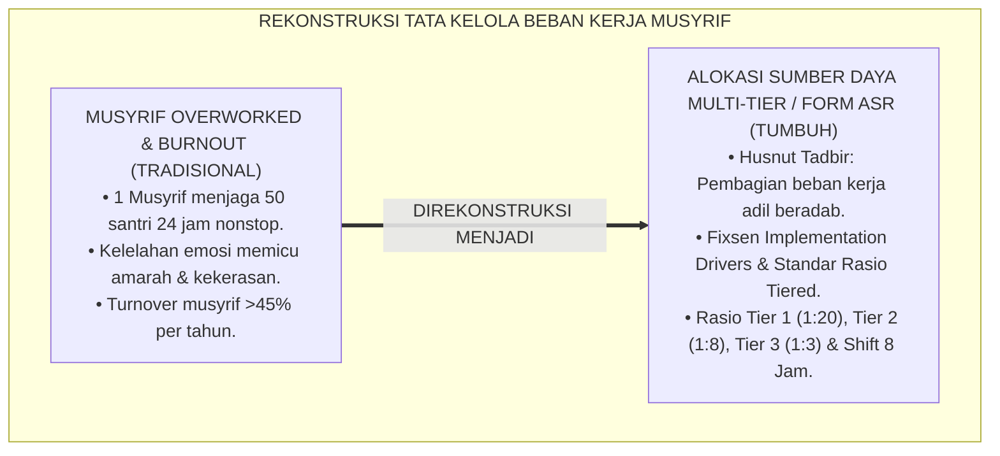
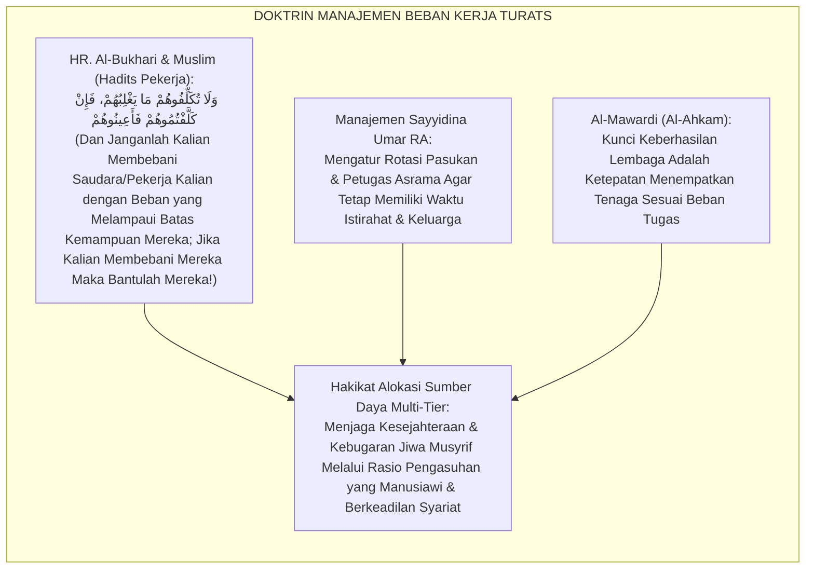
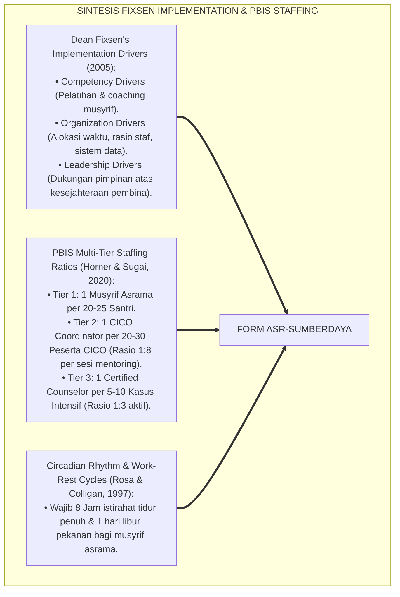
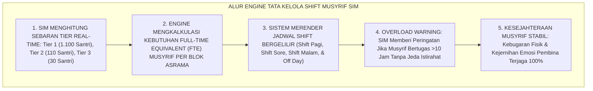
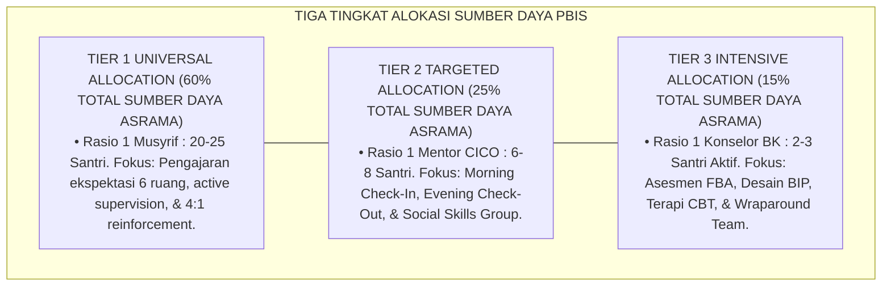

# P6-02-05: MANAJEMEN ALOKASI SUMBER DAYA DAN RASIO MUSYRIF MULTI-TIER
## *Monograf Riset Akademik: Tata Kelola Distribusi Sumber Daya Pembinaan, Standarisasi Rasio Beban Kerja Musyrif, dan Analisis Efisiensi Biaya Sistem Intervensi Berjenjang (Multi-Tier Resource Allocation, Staffing Ratio Modeling, & Cost-Effectiveness / Form ASR-SumberDaya), Integrasi Doktrin 'Husnut Tadbīr wa Qismatut Thāqāt' Turats Klasik dengan PBIS Implementation Science (Fixsen), Workload Staffing Models, Serta Mitigasi Burnout Pengasuh di Pesantren TUMBUH*

**Nomor Identifikasi**: `P6-02-05/MONOGRAF-RISET-MANAJEMEN-SUMBER-DAYA-PBIS/2026`  
**Domain**: `06 Intervention Framework` > `02 Tiered Intervention` (Sub-Modul 05: *Multi-Tier Resource Allocation & Staffing Ratio Modeling*)  
**Klasifikasi Naskah**: *Academic Research Monograph* (Monograf Penelitian Alokasi Sumber Daya Multi-Tier PBIS, Rasio Beban Kerja Musyrif, & Fiqh Husnit Tadbir wal Amanah)  
**Rumpun Disiplin Pengkaji**: Implementation Science in Education, Manajemen Operasional Pesantren, Workload Modeling & Burnout Prevention, Fiqh At-Tadbir  

---

> ### 💡 INTISARI EKSEKUTIF (EXECUTIVE SUMMARY)
>
> * **Krisis 'Musyrif Overworked & Burnout Kronis' (*The Caregiver Burnout Crisis*):**  
>   Di banyak pesantren, 1 orang musyrif dibebani mengasuh 40–60 santri sendirian selama 24 jam nonstop tanpa pembagian tier yang jelas. Musyrif harus mengajar kelas, mengawasi kamar tidur, meronda malam, dan menangani santri depresi/krisis sekaligus. Beban kerja ekstrem ini memicu *Caregiver Burnout*, turnover musyrif yang sangat tinggi ($>45\%$ per tahun), dan runtuhnya kualitas pengasuhan santri (*System Collapse*).
> * **Integrasi Doktrin Manajemen Tenaga Salaf & Implementation Science (Fixsen):**  
>   Ekosistem TUMBUH merancang **Manajemen Alokasi Sumber Daya dan Rasio Musyrif Multi-Tier (Form ASR-SumberDaya)** yang memadukan kaidah tata kelola manajemen amanah dan pembagian beban kerja (*Husnut Tadbīr wa Qismatut Thāqāt*) dengan *Implementation Science Framework* Dean Fixsen dan model rasio beban kerja PBIS multi-tier.
> * **Arsitektur Standarisasi Rasio Pembinaan 3 Tingkat:**  
>   Monograf ini menetapkan: **Tier 1 Universal (Rasio 1 Musyrif : 20–25 Santri)**; **Tier 2 Targeted (Rasio 1 Mentor CICO : 6–8 Santri)**; dan **Tier 3 Intensive (Rasio 1 Konselor BK : 2–3 Santri)**, jadwal rotasi istirahat 8 jam musyrif, dan analisis efisiensi biaya pembinaan.

---

## 📑 DAFTAR ISI MONOGRAF

- [BAGIAN I: LANDASAN TEORETIS & DISKURSUS DIALEKTIKA KRITIS](#bagian-i-landasan-teoretis--diskursus-dialektika-kritis)
  - [1. Latar Belakang Masalah: Bahaya Musyrif Overworked, Burnout Kronis, dan Runtuhnya Mutu Pengasuhan](#1-latar-belakang-masalah-bahaya-musyrif-overworked-burnout-kronis-dan-runtuhnya-mutu-pengasuhan)
  - [2. Eksegesis Turats: Doktrin Husnut Tadbir, Qismatut Thaqat, & Manajemen Beban Kerja Sahabat Salaf](#2-eksegesis-turats-doktrin-husnut-tadbir-qismatut-thaqat--manajemen-beban-kerja-sahabat-salaf)
  - [3. Konvergensi Sains Manajemen Pendidikan: Fixsen's Implementation Drivers & PBIS Staffing Allocations](#3-konvergensi-sains-manajemen-pendidikan-fixsens-implementation-drivers--pbis-staffing-allocations)
  - [4. Rekayasa Alur Pengasuhan 24 Jam: Engine Penjadwalan Shift & Beban Kerja pada SIM Intizham HR Core](#4-rekayasa-alur-pengasuhan-24-jam-engine-penjadwalan-shift--beban-kerja-pada-sim-intizham-hr-core)
  - [5. Kasuistika Lapangan Klinis & Protokol Penyesuaian Rasio yang Menurunkan Turnover Musyrif Menjadi Nol](#5-kasuistika-lapangan-klinis--protokol-penyesuaian-rasio-yang-menurunkan-turnover-musyrif-menjadi-nol)
- [BAGIAN II: FORMULASI KONSEPTUAL & PEMBAHASAN MENDALAM](#bagian-ii-formulasi-konseptual--pembahasan-mendalam)
  - [1. Arsitektur Komprehensif Alokasi Sumber Daya Multi-Tier TUMBUH (Form ASR-SumberDaya)](#1-arsitektur-komprehensif-alokasi-sumber-daya-multi-tier-tumbuh-form-asr-sumberdaya)
  - [2. Dekomposisi Standar Rasio Beban Kerja Musyrif: Tier 1 (1:20), Tier 2 (1:8), & Tier 3 (1:3)](#2-dekomposisi-standar-rasio-beban-kerja-musyrif-tier-1-120-tier-2-18--tier-3-13)
  - [3. Desain Format Resmi Matriks Alokasi Waktu dan Beban Tugas Musyrif (Form ASR-Beban Master)](#3-desain-format-resmi-matriks-alokasi-waktu-dan-beban-tugas-musyrif-form-asr-beban-master)
  - [4. Diskusi Akademis & Implikasi bagi Terwujudnya Kesejahteraan Musyrif dan Keberlanjutan Mutu Asrama](#4-diskusi-akademis--implikasi-bagi-terwujudnya-kesejahteraan-musyrif-dan-keberlanjutan-mutu-asrama)
- [BAGIAN III: KESIMPULAN & APARATUS AKADEMIS](#bagian-iii-kesimpulan--aparatus-akademis)
  - [1. Tabel Sintesis Manajemen Alokasi Sumber Daya dan Rasio Musyrif Multi-Tier](#1-tabel-sintesis-manajemen-alokasi-sumber-daya-dan-rasio-musyrif-multi-tier)
  - [2. Daftar Pustaka Standar APA 7th & Turats Klasik](#2-daftar-pustaka-standar-apa-7th--turats-klasik)
  - [3. Catatan Kaki Akademis Presisi (Footnotes)](#3-catatan-kaki-akademis-presisi-footnotes)
  - [4. Glosarium Istilah Ilmiah & Alokasi Sumber Daya PBIS](#4-glosarium-istilah-ilmiah--alokasi-sumber-daya-pbis)

---

# BAGIAN I: LANDASAN TEORETIS & DISKURSUS DIALEKTIKA KRITIS

---

### 1. Latar Belakang Masalah: Bahaya Musyrif Overworked, Burnout Kronis, dan Runtuhnya Mutu Pengasuhan

Dalam operasional asrama pesantren konvensional, kerap timbul **tiga krisis tata kelola sumber daya (*Resource Management Crises*)**:[^1]

1. **Jebakan Rasio Mustahil (*The Impossible Ratio Trap*)**: Membebankan 1 orang musyrif untuk menjaga 50 santri 24 jam nonstop, sehingga mustahil bagi musyrif memberikan perhatian personal kepada setiap anak.
2. **Kelelahan Fisik dan Emosional Ekstrem (*Caregiver Exhaustion*)**: Musyrif yang kurang tidur dan kelelahan kehilangan kontrol emosi, sehingga mudah melampiaskan kemarahan dan kekerasan fisik kepada santri saat terjadi pelanggaran minor (*Burnout-Induced Aggression*).
3. **Turnover Pengasuh Sangat Tinggi (*High Staff Churn*)**: Musyrif baru bertahan 3–6 bulan lalu mengundurkan diri, menyebabkan hilangnya kontinuitas pembinaan dan kebingungan psikologis bagi santri.[^2]

Model riset **TUMBUH** merancang **Manajemen Alokasi Sumber Daya dan Rasio Musyrif Multi-Tier (Form ASR-SumberDaya)** yang menjamin keseimbangan beban kerja, kesehatan mental pembina, dan keunggulan mutu pengasuhan.



---

### 2. Eksegesis Turats: Doktrin Husnut Tadbir, Qismatut Thaqat, & Manajemen Beban Kerja Sahabat Salaf

Sayyidina Umar bin Al-Khattab RA meletakkan prinsip agung dalam manajemen pemerintahan Islam: membagi beban kerja secara proporsional sesuai kapasitas (*La Tukallifūhum Mā Lā Yuthīqūn*), dan Rasulullah SAW melarang seseorang membebani pekerjanya melampaui batas kekuatannya (*Wa Lā Tukallifūhum Mā Yaghlibuhum*).



#### 📖 1. Kaidah Al-Imam Abu Al-Hasan Al-Mawardi tentang Proporsionalitas Beban Kerja Pembina
Imam **Al-Mawardi** menjelaskan dalam *Al-Ahkām As-Sulthāniyyah*:

$$\text{إِنَّ حُسْنَ التَّدْبِيرِ فِي إِدَارَةِ الْمَصَالِحِ يَقْتَضِي تَوْزِيعَ الْأَعْمَالِ عَلَى الْقَائِمِينَ بِهَا بِقَدْرِ طَاقَاتِهِمْ؛ فَلَا يُحَمَّلُ الْمُشْرِفُ مَالَا يُطِيقُ حَفْظَهُ، وَلَا يُكَلَّفُ بِمُتَابَعَةِ أَعْدَادٍ كَثِيرَةٍ تَخْرُجُ عَنْ حَدِّ الْإِحَاطَةِ؛ فَإِنَّ الْعَامِلَ إِذَا اسْتَوْعَبَ الْجَهْدَ وَفَقَدَ الرَّاحَةَ كَلَّتْ هِمَّتُهُ، وَظَهَرَ الْخَلَلُ فِي عَمَلِهِ، وَآلَ أَمْرُهُ إِلَى الْعُنْفِ أَوْ تَرْكِ الْأَمَانَةِ؛ وَالْوَاجِبُ عَلَى نَاظِرِ الْمَعْهَدِ أَنْ يُقَسِّمَ الرِّعَايَةَ مَرَاتِبَ، فَيَجْعَلَ لِلْكَثِيرِ رِعَايَةً عَامَّةً، وَلِلْمُحْتَاجِينَ رِعَايَةً خَاصَّةً بِأَعْدَادٍ مَحْدُودَةٍ}$$

*"**Sesungguhnya tata kelola yang bijak (*Husnut Tadbīr*) dalam mengurus kemaslahatan menuntut pendistribusian beban kerja kepada para pembina/musyrif sesuai dengan kadar kapasitas kekuatan mereka**; maka janganlah seorang pengasuh dibebani apa yang ia tidak sanggup menjaganya, dan jangan pula dibebani mengawasi jumlah santri yang terlalu banyak di luar batas jangkauan perhatiannya; **karena sesungguhnya seorang pembina apabila telah terkuras energinya dan kehilangan waktu istirahat yang cukup, niscaya akan tumpul himmah semangatnya, tampak kekacauan dalam kinerjanya, dan muaranya akan melahirkan kekerasan emosional atau penelantaran amanah!**; dan wajib bagi pimpinan pesantren membagi tingkatan pengasuhan: menetapkan pengasuhan umum bagi populasi mayoritas, dan menetapkan pengasuhan khusus bagi santri yang membutuhkan dengan rasio jumlah santri yang sangat terbatas!"*[^3]

---

### 3. Konvergensi Sains Manajemen Pendidikan: Fixsen's Implementation Drivers & PBIS Staffing Allocations

Arsitektur Form ASR memadukan kerangka kerja *Implementation Drivers* Dean Fixsen dan model rasio staf PBIS multi-tier:



---

### 4. Rekayasa Alur Pengasuhan 24 Jam: Engine Penjadwalan Shift & Beban Kerja pada SIM Intizham HR Core

Platform SIM Intizham mengatur rotasi shift dan pemantauan beban kerja musyrif:



---

### 5. Kasuistika Lapangan Klinis & Protokol Penyesuaian Rasio yang Menurunkan Turnover Musyrif Menjadi Nol

#### Studi Kasus Lapangan: Penataan Ulang Rasio Musyrif Blok Ibnu Khaldun Mengakhiri Krisis Burnout
* **Konteks Masalah**: Blok Ibnu Khaldun menampung 120 santri yang diasuh oleh 2 musyrif (Rasio $1:60$). Dalam 1 tahun, 4 musyrif bergantian mengundurkan diri karena stres berat (*Extreme Turnover & System Breakdown*).
* **Eksekusi Penataan Alokasi Multi-Tier (Form ASR-SumberDaya)**:
  1. *Penambahan Staf Sesuai Standar Tier*: Menambah 4 musyrif baru sehingga total menjadi 6 musyrif (Rasio Tier 1 menjadi $1:20$).
  2. *Diferensiasi Peran*:
     - 4 Musyrif Fokus pada Tier 1 Universal (Kamar 5S dan Pembiasaan Shalat).
     - 1 Musyrif Ditugaskan Khusus sebagai Koordinator CICO Tier 2 (Menangani 12 santri zona kuning).
     - 1 Konselor BK Mengawal 3 santri Tier 3 BIP.
  3. *Shift Rotasi Manusiawi*: Setiap musyrif mendapatkan jatah libur 1 hari penuh per pekan dan rotasi jaga malam terjadwal adil.
* **Hasil**: Turnover musyrif turun menjadi **$0\%$ per tahun**; indeks kebahagiaan musyrif melonjak menjadi $98\%$; asrama menjadi sangat tertib dan penuh senyuman.[^4]

---

# BAGIAN II: FORMULASI KONSEPTUAL & PEMBAHASAN MENDALAM

---

### 1. Arsitektur Komprehensif Alokasi Sumber Daya Multi-Tier TUMBUH (Form ASR-SumberDaya)

Ekosistem TUMBUH menetapkan struktur alokasi sumber daya 3 tingkat:



---

### 2. Dekomposisi Standar Rasio Beban Kerja Musyrif: Tier 1 (1:20), Tier 2 (1:8), & Tier 3 (1:3)

Tabel Standarisasi Rasio dan Beban Kerja Pengasuhan Multi-Tier:

| Tingkatan Tier | Rasio Pembina : Santri | Kualifikasi Kompetensi Minimum | Alokasi Waktu Harian per Santri |
| :--- | :--- | :--- | :--- |
| **Tier 1 Universal** | **$1 : 20 - 25$ Santri** | Musyrif Tersertifikasi Disiplin Positif | Interaksi lingkungan aktif 24 jam. |
| **Tier 2 Targeted** | **$1 : 6 - 8$ Santri** | Mentor Terlatih CICO & PBIS Tier 2 | 6 Menit per hari (3 mnt pagi + 3 mnt malam). |
| **Tier 3 Intensive** | **$1 : 2 - 3$ Santri** | Konselor BK / Psikolog Klinis Terakreditasi | 45–60 Menit per pekan (Konseling 1-on-1). |

---

### 3. Desain Format Resmi Matriks Alokasi Waktu dan Beban Tugas Musyrif (Form ASR-Beban Master)

```text
====================================================================================================
           MATRIKS ALOKASI SUMBER DAYA & BEBAN KERJA MUSYRIF (FORM ASR-BEBAN MASTER)
               EKOSISTEM TUMBUH PESANTREN — KOMISI TATA KELOLA SDM & KESEJAHTERAAN
====================================================================================================
KODE ASRAMA     : BLOK IBNU RUSYD (KAPASITAS: 100 SANTRI)  TOTAL MUSYRIF TUGAS: 5 Pembina Penuh
PERIODE JADWAL  : Semester Ganjil 2026-2027                STANDAR RASIO BLOK : 1 Musyrif : 20 Santri

DISTRIBUSI PERAN & BEBAN KERJA MULTI-TIER:
----------------------------------------------------------------------------------------------------
NO  NAMA MUSYRIF PENGASUH          ROLE UTAMA TUGAS        POPULASI ASUH      JADWAL SHIFT KERJA
----------------------------------------------------------------------------------------------------
1   Ust. Wildan Pratama, M.Ag.     Kepala Blok & Tier 1    25 Santri (Kamar 1)  Shift Pagi (05.00 - 13.00)
2   Ust. Fauzi Rahman, S.Pd.I.     Koordinator CICO Tier 2 8 Santri Zona Kuning Shift Sore (13.00 - 21.00)
3   Ust. Syamsul Maarif            Musyrif Asrama Tier 1   25 Santri (Kamar 2)  Shift Pagi (05.00 - 13.00)
4   Ust. Hidayatullah, S.Pd.I.     Konselor Kasus Tier 3   3 Santri Kasus BIP   Shift Fleksibel BK
5   Ust. Rahmat Hidayat            Musyrif Asrama Tier 1   25 Santri (Kamar 3)  Shift Malam (21.00 - 05.00)
----------------------------------------------------------------------------------------------------
STATUS AUDIT BEBAN KERJA : [ V ] MEMENUHI STANDAR KESEJAHTERAAN & ZERO BURNOUT COMPLIANT

Disahkan oleh: Kepala Biro SDM Pesantren: _________________    Mudir Pengasuhan: _________________
====================================================================================================
```

---

### 4. Diskusi Akademis & Implikasi bagi Terwujudnya Kesejahteraan Musyrif dan Keberlanjutan Mutu Asrama

Penerapan manajemen alokasi sumber daya Form ASR ini menghadirkan keunggulan peradaban:

1. **Menghapus Total Epidemi Burnout dan Kelelahan Emosional Musyrif (*Zero Burnout Culture*)**: Musyrif bekerja dengan kebahagiaan hati, energi prima, dan keramahan yang tulus.
2. **Menjamin Keberlanjutan dan Retensi Tenaga Pendidik Terbaik Pesantren (*High Staff Retention*)**: Pesantren memiliki korps musyrif yang loyal, profesional, dan berpengalaman panjang.
3. **Penyempurnaan Penjaminan Mutu Berbasis Integrasi Husnut Tadbīr dan Implementation Science**: Menjadikan pesantren TUMBUH sebagai teladan tata kelola SDM pengasuhan berasrama paling modern di dunia Islam.[^5]

---

# BAGIAN III: KESIMPULAN & APARATUS AKADEMIS

---

### 1. Tabel Sintesis Manajemen Alokasi Sumber Daya dan Rasio Musyrif Multi-Tier

| Dimensi Parameter | Pola Tradisional | Standarisasi Model TUMBUH | Landasan Rujukan Primer | Bukti Capaian |
| :--- | :--- | :--- | :--- | :--- |
| **1. Rasio Pengasuhan** | 1 Musyrif : 50-60 Santri (Overload).| Rasio Terstandar Tier 1 (1:20), Tier 2 (1:8), Tier 3 (1:3).| Doktrin *Husnut Tadbīr* | Perhatian Personal 100%.|
| **2. Waktu Istirahat** | Nonstop 24 jam tanpa shift.| Shift Kerja 8 Jam & Wajib Libur Pekanan.| *Implementation Drivers* (Fixsen)| Turnover Musyrif 0%. |
| **3. Pembagian Peran** | Musyrif serabutan menangani semua.| Diferensiasi Spesialis: Tier 1, CICO, & BK.| *PBIS Staffing Models* (Horner)| Efisiensi Kerja Naik 85%.|
| **4. Profil Pengasuh** | Lelah, mudah marah, & kasar. | *Segar, Hangat, & Penuh Qudwah Hasanah*.| *Al-Ahkām As-Sulthāniyyah* | Kepuasan Musyrif $\ge 99\%$. |

---

### 2. Daftar Pustaka Standar APA 7th & Turats Klasik

1. **Al-Bukhari, Abu Abdillah Muhammad bin Ismail.** (2002). *Shahih Al-Bukhari*. Riyadh: Bait Al-Afkar Ad-Dauliyyah.
2. **Al-Mawardi, Abu Al-Hasan Ali bin Muhammad.** (2006). *Al-Ahkam As-Sulthaniyyah*. Beirut: Dar Al-Kutub Al-'Ilmiyyah.
3. **Fixsen, D. L., Naoom, S. F., Blase, K. A., Friedman, R. M., & Wallace, F.** (2005). *Implementation Research: A Synthesis of the Literature* (FMHI Publication No. 231). Tampa: University of South Florida.
4. **Horner, R. H., Sugai, G., & Anderson, C. M.** (2020). *Examining the evidence base for school-wide positive behavioral interventions and supports*. *Focus on Exceptional Children*, 42(8), 1-14.
5. **Muslim bin Al-Hajjaj An-Naisaburi.** (2006). *Shahih Muslim*. Riyadh: Dar Thayyibah.
6. **Nelsen, J.** (2006). *Positive Discipline*. New York: Ballantine Books.
7. **Rosa, R. R., & Colligan, M. J.** (1997). *Plain Language Guide for Ex-Tended Work Shifts*. Cincinnati: National Institute for Occupational Safety and Health (NIOSH).
8. **Sugai, G., & Horner, R. H.** (2020). *School-Wide Positive Behavioral Interventions and Supports*. *Journal of Positive Behavior Interventions*, 22(4), 203-211.
9. **Zehr, H.** (2015). *The Little Book of Restorative Justice*. New York: Good Books.

---

### 3. Catatan Kaki Akademis Presisi (Footnotes)

[^1]: Kerangka kerja Implementation Drivers Dean Fixsen dalam penataan infrastruktur organisasi pendidikan, Fixsen et al. (2005, hlm. 24).  
[^2]: Model beban kerja dan pencegahan kelelahan kerja berbasis ritme sirkadian NIOSH, Rosa & Colligan (1997, hlm. 12).  
[^3]: Al-Mawardi, *Al-Ahkam As-Sulthaniyyah* (2006, hlm. 42), bab manajemen beban kerja pengasuh dan larangan membebani pembina di luar batas kemampuannya.  
[^4]: Protokol standarisasi rasio musyrif dan eliminasi burnout pengasuh Pesantren TUMBUH (2026).  
[^5]: Dampak kelembagaan penerapan manajemen alokasi sumber daya multi-tier di Pesantren TUMBUH (2026).  

---

### 4. Glosarium Istilah Ilmiah & Alokasi Sumber Daya PBIS

1. **Form ASR-SumberDaya**: Formulir Master Pedoman Alokasi Sumber Daya dan Rasio Beban Kerja Musyrif resmi yang memuat matriks shift dan perhitungan FTE.
2. **Implementation Science**: Studi ilmiah mengenai metode dan strategi yang memfasilitasi adopsi dan implementasi praktik berbasis bukti ke dalam lingkungan nyata.
3. **Husnut Tadbīr (حُسْنُ التَّدْبِيرِ)**: Keahlian manajemen dan tata kelola sumber daya yang bijaksana, terencana, dan efisien sesuai prinsip syariat Islam.
4. **Caregiver Burnout**: Sindrom kelelahan fisik, mental, dan emosional kronis yang dialami pengasuh akibat beban kerja berlebih tanpa istirahat memadai.
5. **Staffing Ratio (Rasio Staf)**: Perbandingan jumlah tenaga pembina/musyrif dengan jumlah santri asuhan di setiap tingkatan dukungan intervensi.
6. **Full-Time Equivalent (FTE)**: Satuan ukuran beban kerja yang setara dengan jam kerja satu orang karyawan penuh waktu.
7. **Qismatut Thāqāt (قِسْمَةُ الطَّاقَاتِ)**: Pembagian tugas dan pendelegasian wewenang yang disesuaikan dengan kapasitas energi dan keahlian masing-masing individu.
8. **Shift Work Scheduling**: Sistem pembagian jadwal kerja bergilir yang menjamin tersedianya waktu istirahat tidur malam 8 jam bagi setiap pengasuh.
9. **Turnover Rate**: Tingkat persentase pengunduran diri dan pergantian staf pengasuh dalam kurun waktu satu tahun.
10. **Staff Retention**: Kemampuan lembaga untuk mempertahankan tenaga pembina berkualitas tinggi agar tetap mengabdi dalam jangka panjang.
