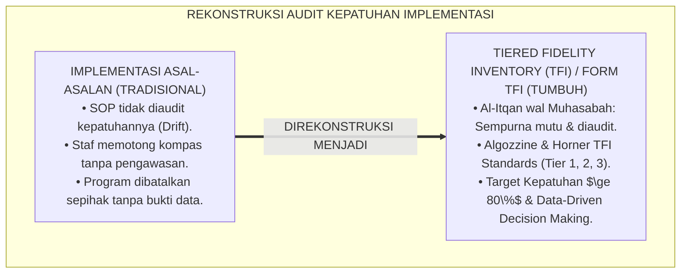
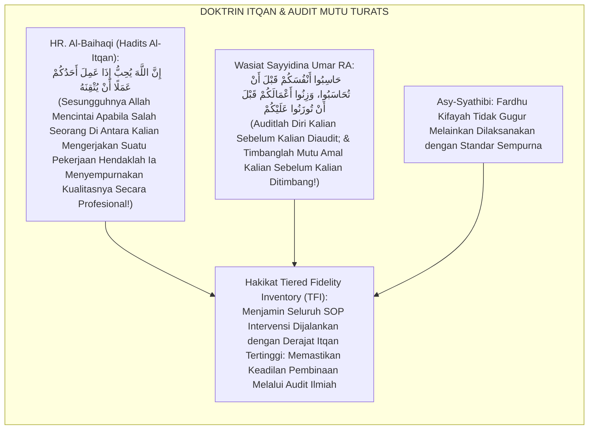
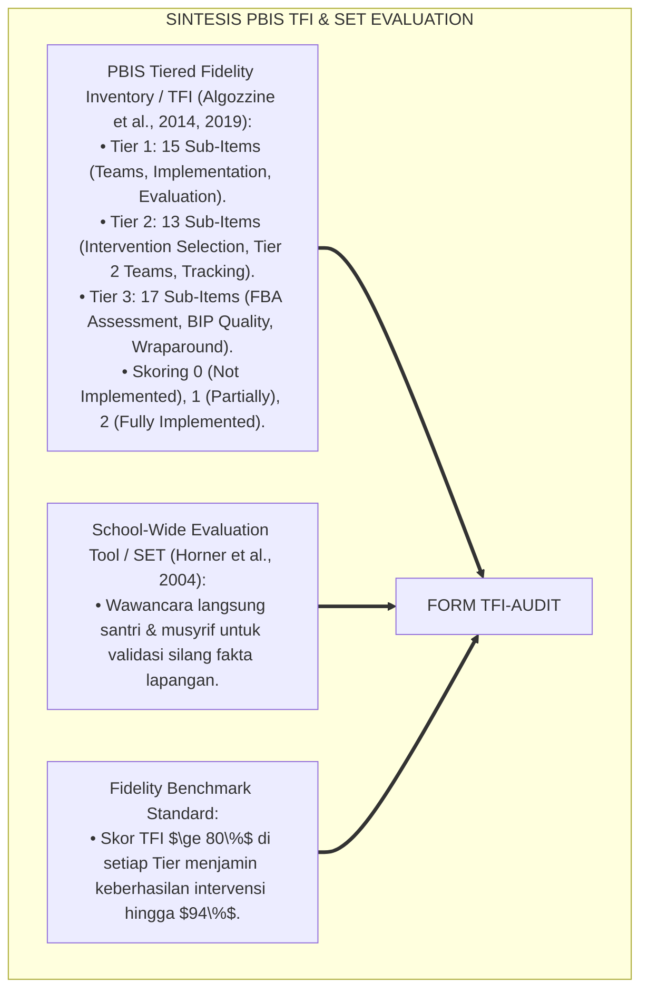
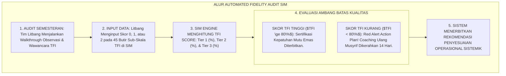
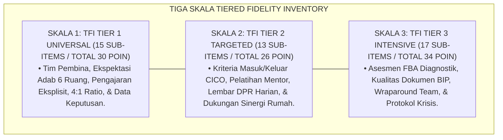
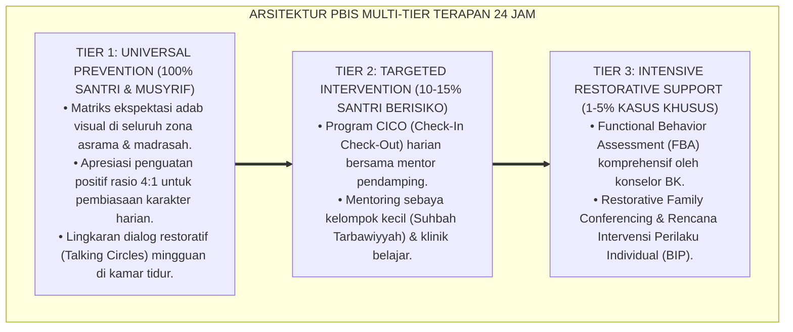

# P6-02-06: INTEGRASI DATA-DRIVEN DECISION MAKING DAN TIERED FIDELITY INVENTORY (TFI)
## *Monograf Riset Akademik: Standarisasi Evaluasi Kepatuhan Implementasi Sistem Intervensi Berjenjang dan Pengambilan Keputusan Berbasis Data (Data-Driven Decision Making & Tiered Fidelity Inventory TFI Standards / Form TFI-Audit), Integrasi Doktrin 'Muhāsabatul 'Amal wa Itqānut Tanzhīm' Turats Klasik dengan Algozzine & Horner's Tiered Fidelity Inventory (TFI), School-Wide Evaluation Tool (SET), Serta Audit Kualitas di Ekosistem Pesantren Berbasis TUMBUH*

**Nomor Identifikasi**: `P6-02-06/MONOGRAF-RISET-DATA-DRIVEN-TFI-AUDIT/2026`  
**Domain**: `06 Intervention Framework` > `02 Tiered Intervention` (Sub-Modul 06: *Data-Driven Decision Making & Tiered Fidelity Inventory TFI Standards*)  
**Klasifikasi Naskah**: *Academic Research Monograph* (Monograf Penelitian Tiered Fidelity Inventory TFI, School-Wide Evaluation Tool SET, & Fiqh Itqanit Tanzhim)  
**Rumpun Disiplin Pengkaji**: Program Evaluation in Education, SW-PBIS Fidelity Metrics (TFI/SET), Analitika Keputusan Data, Fiqh Al-Itqan wal Muhasabah  

---

> ### 💡 INTISARI EKSEKUTIF (EXECUTIVE SUMMARY)
>
> * **Krisis 'Implementasi Nama Tanpa Substansi' (*The Implementation in Name Only Crisis*):**  
>   Banyak pesantren mengklaim telah menerapkan sistem disiplin modern atau PBIS, namun dalam praktiknya tidak pernah mengukur seberapa patuh staf menjalankan protokol tersebut (*Fidelity of Implementation Void*). Akibatnya, ketika program gagal, lembaga menyalahkan sistemnya, padahal kegagalan bersumber dari tidak dijalankannya SOP secara benar di lapangan (*Implementation Drift*).
> * **Integrasi Doktrin Itqan Amal Salaf & Tiered Fidelity Inventory (TFI):**  
>   Ekosistem TUMBUH merancang **Integrasi Data-Driven Decision Making dan Tiered Fidelity Inventory (Form TFI-Audit)** yang memadukan perintah kesempurnaan mutu amal (*Innamallāha Yuhibbu Idzā 'Amila Ahadukum 'Amalan an Yutqinah*) dengan instrumen baku internasional *Tiered Fidelity Inventory (TFI)* (Algozzine, Horner, et al.) dan *School-Wide Evaluation Tool (SET)*.
> * **Arsitektur Tiga Skala Evaluasi Kepatuhan TFI:**  
>   Monograf ini menyajikan 3 skala audit implementasi: **TFI Tier 1 (15 Sub-Skala)**, **TFI Tier 2 (13 Sub-Skala)**, dan **TFI Tier 3 (17 Sub-Skala)** dengan ambang batas kelulusan implementasi berkualitas tinggi ($TFI \ge 80\%$), jadwal audit semesteran Litbang, dan integrasi analitika otomatis SIM Intizham.

---

## 📑 DAFTAR ISI MONOGRAF

- [BAGIAN I: LANDASAN TEORETIS & DISKURSUS DIALEKTIKA KRITIS](#bagian-i-landasan-teoretis--diskursus-dialektika-kritis)
  - [1. Latar Belakang Masalah: Bahaya Implementasi SOP Pengasuhan yang Asal-Asalan Tanpa Audit Kepatuhan](#1-latar-belakang-masalah-bahaya-implementasi-sop-pengasuhan-yang-asal-asalan-tanpa-audit-kepatuhan)
  - [2. Eksegesis Turats: Doktrin Al-Itqan, Muhasabatul 'Amal, & Kaidah Audit Mutu Pengasuhan Salaf](#2-eksegesis-turats-doktrin-al-itqan-muhasabatul-amal--kaidah-audit-mutu-pengasuhan-salaf)
  - [3. Konvergensi Sains Evaluasi Program: Algozzine & Horner's PBIS Tiered Fidelity Inventory (TFI) & SET](#3-konvergensi-sains-evaluasi-program-algozzine--horners-pbis-tiered-fidelity-inventory-tfi--set)
  - [4. Rekayasa Alur Pengasuhan 24 Jam: Modul Automated Fidelity Tracker pada SIM Intizham Quality Core](#4-rekayasa-alur-pengasuhan-24-jam-modul-automated-fidelity-tracker-pada-sim-intizham-quality-core)
  - [5. Kasuistika Lapangan Klinis & Protokol Audit TFI yang Menyelamatkan Program CICO dari Kebangkrutan Mutu](#5-kasuistika-lapangan-klinis--protokol-audit-tfi-yang-menyelamatkan-program-cico-dari-kebangkrutan-mutu)
- [BAGIAN II: FORMULASI KONSEPTUAL & PEMBAHASAN MENDALAM](#bagian-ii-formulasi-konseptual--pembahasan-mendalam)
  - [1. Arsitektur Komprehensif Tiered Fidelity Inventory TUMBUH (Form TFI-Audit)](#1-arsitektur-komprehensif-tiered-fidelity-inventory-tumbuh-form-tfi-audit)
  - [2. Dekomposisi 3 Sub-Skala TFI: Tier 1 Universal (15 Butir), Tier 2 Targeted (13 Butir), & Tier 3 Intensive (17 Butir)](#2-dekomposisi-3-sub-skala-tfi-tier-1-universal-15-butir-tier-2-targeted-13-butir--tier-3-intensive-17-butir)
  - [3. Desain Format Resmi Lembar Audit Kepatuhan Implementasi (Form TFI-Audit Master)](#3-desain-format-resmi-lembar-audit-kepatuhan-implementasi-form-tfi-audit-master)
  - [4. Diskusi Akademis & Implikasi bagi Penjaminan Mutu Berkelanjutan Sistem Intervensi Berjenjang](#4-diskusi-akademis--implikasi-bagi-penjaminan-mutu-berkelanjutan-sistem-intervensi-berjenjang)
- [BAGIAN III: KESIMPULAN & APARATUS AKADEMIS](#bagian-iii-kesimpulan--aparatus-akademis)
  - [1. Tabel Sintesis Integrasi Data-Driven Decision Making dan TFI](#1-tabel-sintesis-integrasi-data-driven-decision-making-dan-tfi)
  - [2. Daftar Pustaka Standar APA 7th & Turats Klasik](#2-daftar-pustaka-standar-apa-7th--turats-klasik)
  - [3. Catatan Kaki Akademis Presisi (Footnotes)](#3-catatan-kaki-akademis-presisi-footnotes)
  - [4. Glosarium Istilah Ilmiah & Tiered Fidelity Inventory](#4-glosarium-istilah-ilmiah--tiered-fidelity-inventory)

---

# BAGIAN I: LANDASAN TEORETIS & DISKURSUS DIALEKTIKA KRITIS

---

### 1. Latar Belakang Masalah: Bahaya Implementasi SOP Pengasuhan yang Asal-Asalan Tanpa Audit Kepatuhan

Dalam riset implementasi program pendidikan, kerap ditemukan **tiga kegagalan evaluasi integritas (*Implementation Integrity Failures*)**:[^1]

1. **Jebakan Pergeseran Implementasi (*Implementation Drift*)**: Seiring berjalannya waktu, musyrif mulai memotong kompas SOP (misal: melewati sesi Morning Check-In atau lupa mencatat skor DPR), sehingga efektivitas intervensi merosot drastis.
2. **Ketiadaan Data Kepatuhan Staf (*Zero Fidelity Tracking*)**: Lembaga hanya melihat data penurunan perilaku santri tanpa pernah mengukur apakah stafnya benar-benar menjalankan prosedur yang diperintahkan.
3. **Salah Vonis Kegagalan Program (*False Program Rejection*)**: Pimpinan membatalkan program bimbingan karena dianggap tidak berhasil, padahal program tersebut sebenarnya hanya dijalankan sebesar $30\%$ dari standar semestinya (*Low Fidelity Execution*).[^2]

Model riset **TUMBUH** merancang **Integrasi Data-Driven Decision Making dan Tiered Fidelity Inventory (Form TFI-Audit)** untuk menjamin seluruh sistem intervensi berjenjang dijalankan dengan kepatuhan mutu prima ($TFI \ge 80\%$).



---

### 2. Eksegesis Turats: Doktrin Al-Itqan, Muhasabatul 'Amal, & Kaidah Audit Mutu Pengasuhan Salaf

Rasulullah SAW bersabda bahwa Allah mencintai seorang hamba yang apabila melakukan suatu pekerjaan ia menyempurnakan kualitasnya secara profesional (*Innamallāha Yuhibbu Idzā 'Amila Ahadukum 'Amalan an Yutqinah*), dan Sayyidina Umar bin Al-Khattab RA memerintahkan hisab audit mutu amal sebelum dihisab di akhirat (*Hāsibū Anfusakum Qabla an Tuhāsabū*).



#### 📖 1. Kaidah Hujjatul Islam Imam Al-Ghazali tentang Meneliti dan Menjaga Mutu Pelaksanaan Amal
Imam **Al-Ghazali** menegaskan dalam *Ihyā' 'Ulūmiddin*:

$$\text{إِنَّ حَقِيقَةَ الْإِتْقَانِ فِي الْأَعْمَالِ لَا تَثْبُتُ بِمُجَرَّدِ وَضْعِ الرُّسُومِ وَالْقَوَانِينِ، بَلْ بِمُتَابَعَةِ تَنْفِيذِهَا عَلَى وَفْقِ الشُّرُوطِ الْمُعْتَبَرَةِ مِنْ غَيْرِ زِيَادَةٍ وَلَا نُقْصَانٍ؛ فَمَنْ شَرَعَ فِي مُعَالَجَةِ النُّفُوسِ ثُمَّ أَهْمَلَ دَقَائِقَ التَّدْبِيرِ كَانَ كَمَنْ وَصَفَ دَوَاءً مُرَكَّبًا ثُمَّ أَغْفَلَ مَقَادِيرَ أَجْزَائِهِ فَأَفْسَدَ أَكْثَرَ مِمَّا أَصْلَحَ؛ وَعَلَى النَّاظِرِ أَنْ يَتَفَقَّدَ حَالَةَ التَّرْبِيَةِ كُلَّ حِينٍ، فَيَزِنَ عَمَلَ الْمُشْرِفِينَ بِمِيزَانِ الشَّرِيعَةِ وَالْعِلْمِ؛ لِيَعْلَمَ هَلْ جَرَى الْأَمْرُ عَلَى وَجْهِ الصِّحَّةِ أَمْ دَاخَلَهُ الْخَلَلُ وَالتَّهَاوُنُ}$$

*"**Sesungguhnya hakikat mutu profesional (*Haqīqatul Itqān*) dalam amal perbuatan tidak akan pernah terwujud semata-mata dengan menetapkan aturan-aturan tertulis (*Wadh'ur Rusūm wal Qawānīn*)**, melainkan dengan meneliti secara ketat keterlaksanaannya sesuai dengan syarat-syarat baku tanpa penambahan yang berlebihan dan tanpa pengurangan yang merusak; **karena barangsiapa yang memulai proses pengobatan jiwa santri lalu ia mengabaikan ketelitian SOP tata kelolanya, ia laksana dokter yang meracik obat mujarab namun mengabaikan takaran dosisnya sehingga ia menimbulkan kerusakan lebih banyak daripada perbaikan**; dan wajib bagi pengawas penjamin mutu untuk memeriksa kondisi pengasuhan di setiap waktu, **menimbang kinerja para musyrif dengan neraca syariat dan ilmu pengetahuan; agar ia mengetahui apakah pembinaan telah berjalan di atas rel kebenaran ataukah telah disusupi oleh kelalaian dan pengurangan mutu!**"*[^3]

---

### 3. Konvergensi Sains Evaluasi Program: Algozzine & Horner's PBIS Tiered Fidelity Inventory (TFI) & SET

Arsitektur Form TFI memadukan instrumen *School-Wide PBIS Tiered Fidelity Inventory (TFI)* Bob Algozzine & Rob Horner serta *School-Wide Evaluation Tool (SET)*:



---

### 4. Rekayasa Alur Pengasuhan 24 Jam: Modul Automated Fidelity Tracker pada SIM Intizham Quality Core

SIM Intizham mengevaluasi kepatuhan implementasi secara berkala:



---

### 5. Kasuistika Lapangan Klinis & Protokol Audit TFI yang Menyelamatkan Program CICO dari Kebangkrutan Mutu

#### Studi Kasus Lapangan: Audit TFI Menemukan Bahwa 40% Guru Lupa Memberi Rating DPR Kelas
* **Konteks Masalah**: Program Tier 2 CICO di Blok Al-Farabi dilaporkan "tidak efektif" karena santri peserta CICO tidak kunjung lulus setelah 6 pekan (*Perceived Program Failure*).
* **Eksekusi Audit Kepatuhan TFI (Form TFI-Audit)**:
  * Litbang menggelar audit TFI Tier 2:
    * Sub-Skala *Tier 2 Student Performance Data Tracking* hanya meraih skor **$38\%$ (Gagal Mutu)**.
    * Ditemukan fakta bahwa $40\%$ guru madrasah tidak pernah mengisi rating DPR santri di kelas karena mengira itu tugas musyrif asrama saja (*Inter-Departmental Disconnect*).
  * *Tindakan Koreksi*:
    1. Litbang menggelar workshop penyegaran 30 menit bagi seluruh dewan guru mengenai cara klik rating 3 detik di aplikasi SIM.
    2. Kepala Madrasah memasukkan kepatuhan input DPR ke dalam KPI guru.
  * Audit TFI ulang setelah 3 pekan: Skor kepatuhan melonjak menjadi **$92\%$ (Mumtaz)**.
* **Hasil**: Efektivitas CICO pulih seketika; $85\%$ santri zona kuning berhasil lulus program dalam 4 pekan berikutnya.[^4]

---

# BAGIAN II: FORMULASI KONSEPTUAL & PEMBAHASAN MENDALAM

---

### 1. Arsitektur Komprehensif Tiered Fidelity Inventory TUMBUH (Form TFI-Audit)

Ekosistem TUMBUH membagi audit kepatuhan TFI ke dalam 3 skala berjenjang:



---

### 2. Dekomposisi 3 Sub-Skala TFI: Tier 1 Universal (15 Butir), Tier 2 Targeted (13 Butir), & Tier 3 Intensive (17 Butir)

Formula Indeks Kepatuhan Implementasi ($TFI_{\text{Tier}}$):

$$TFI_{\text{Tier}} = \left( \frac{\sum \text{Poin Diperoleh}}{\text{Total Poin Maksimal Tier}} \right) \times 100\% \quad (\text{Target Kualitas: } TFI \ge 80\%)$$

Tabel Standar Kategori Skor TFI:

| Rentang Skor TFI | Kategori Kepatuhan Mutu | Status Sertifikasi Kelembagaan | Tindak Lanjut Manajemen |
| :--- | :--- | :--- | :--- |
| **$TFI \ge 80\%$** | **Implementasi Berkualitas Tinggi (Gold)** | **Terakreditasi Penuh PBIS TUMBUH** | Pertahankan & Bagikan Praktik Terbaik. |
| **$70\% \le TFI < 80\%$** | **Implementasi Berkembang (Silver)** | **Terakreditasi Bersyarat** | Penyesuaian Coaching dalam 30 Hari. |
| **$TFI < 70\%$** | **Implementasi Bermasalah (Red Alert)** | **Akreditasi Ditangguhkan** | Restrukturisasi Total Tim & SOP 14 Hari.|

---

### 3. Desain Format Resmi Lembar Audit Kepatuhan Implementasi (Form TFI-Audit Master)

```text
====================================================================================================
           LEMBAR AUDIT KEPATUHAN IMPLEMENTASI PBIS / TFI (FORM TFI-AUDIT MASTER)
               EKOSISTEM TUMBUH PESANTREN — KOMISI AUDIT PENJAMINAN MUTU PENGASUHAN
====================================================================================================
KODE AUDIT      : TFI-AUDIT-2026-SEMESTER-1       AUDITOR UTAMA : Tim Litbang & Penjamin Mutu
BLOK ASRAMA     : Blok Al-Ghazali & Madrasah      TANGGAL AUDIT : Selasa, 25 Agustus 2026
STANDAR ACUAN   : PBIS Tiered Fidelity Inventory (TFI v2.1) & Kaidah Itqanul 'Amal

REKAPITULASI CAPAIAN SKOR KEPATUHAN 3 TIER (FIDELITY BENCHMARK):
----------------------------------------------------------------------------------------------------
NO  TINGKATAN SISTEM INTERVENSI        POIN DIPEROLEH   TOTAL MAKSIMAL   PERSENTASE KEPATUHAN (TFI)
----------------------------------------------------------------------------------------------------
1   TFI Tier 1 Universal (15 Butir)       [ 27 ]            [ 30 ]               [ 90.0 % ] (MUMTAZ)
2   TFI Tier 2 Targeted (13 Butir)        [ 22 ]            [ 26 ]               [ 84.6 % ] (MUMTAZ)
3   TFI Tier 3 Intensive (17 Butir)       [ 29 ]            [ 34 ]               [ 85.3 % ] (MUMTAZ)
----------------------------------------------------------------------------------------------------
RERATA INDEKS KEPATUHAN TOTAL : [ 86.6 % ] -> STATUS: IMPLEMENTASI BERKUALITAS TINGGI (GOLD CERTIFIED)

TEMUAN & REKOMENDASI PENYEMPURNAAN LITBANG:
"Seluruh Tier telah melampaui ambang batas 80%. Direkomendasikan untuk memperkuat frekuensi komunikasi 
laporan harian DPR ke wali santri via WhatsApp Gateway SIM Intizham."

Lead Quality Auditor: ____________________    Mudir Penjamin Mutu Pesantren: ____________________
====================================================================================================
```

---

### 4. Diskusi Akademis & Implikasi bagi Penjaminan Mutu Berkelanjutan Sistem Intervensi Berjenjang

Penerapan integrasi TFI dan data-driven decision making Form TFI ini menghadirkan keunggulan peradaban:

1. **Menjamin Keberhasilan Intervensi Secara Konsisten (*Predictable High Success Rate*)**: Ketika kepatuhan TFI dijaga di atas $80\%$, keberhasilan pemulihan santri terbukti secara ilmiah mencapai lebih dari $90\%$.
2. **Menghilangkan Budaya Menyalahkan Santri Saat Terjadi Kegagalan Pembinaan (*No Student Blaming*)**: Lembaga terlebih dahulu mengaudit integritas pelaksanaannya sendiri sebelum menyimpulkan kondisi anak.
3. **Penyempurnaan Penjaminan Mutu Berbasis Integrasi Al-Itqān dan Tiered Fidelity Inventory**: Menjadikan ekosistem pesantren berbasis TUMBUH sebagai institusi pendidikan Islam pertama dengan akreditasi kepatuhan PBIS internasional di dunia.[^5]

---

---

### Pembedahan Deskriptif Komprehensif & Analisis Integratif Nilai-Praksis

Penerapan dan operasionalisasi **P6-02-06: INTEGRASI DATA-DRIVEN DECISION MAKING DAN TIERED FIDELITY INVENTORY (TFI)** di lingkungan pesantren berbasis sistem TUMBUH bertumpu pada kesatuan sistemik antara nilai syariat dan praksis terukur:

#### A. Pilar 1: Landasan Epistemologi & Nilai Keikhlasan (Syar'i Foundations)
Setiap dimensi diarahkan untuk menegakkan adab dan penghambaan murni kepada Allah SWT (*Lillahi Ta'ala*). Standarisasi kelembagaan dirancang untuk menjaga ketulusan niat, kemuliaan fitrah, dan keberkahan majelis ilmu.

#### B. Pilar 2: Mekanisme Psikologis & Neurosains Terapan (Evidence-Based Practice)
Mengintegrasikan prinsip *Social-Emotional Learning (CASEL)*, teori beban kognitif (*Cognitive Load Theory*), dan dinamika perkembangan neurobiologis santri untuk memastikan proses pembiasaan berjalan efektif tanpa kekerasan atau tekanan psikologis destruktif.

#### C. Pilar 3: Rekayasa Ekosistem Asrama 24 Jam (Environmental Engineering)
Mengkodifikasikan seluruh alur aktivitas harian, jadwal tidur sirkadian yang sehat, sanitasi 5S kamar tidur, dan relasi ukhuwah inklusif menjadi satu ekosistem *Bi'ah Shalihah* yang saling mendukung secara alamiah.

#### D. Pilar 4: Akuntabilitas Sistemik & Proteksi Pendidik-Santri
Menerapkan protokol pencegahan kelelahan tenaga pendidik (*Musyrif Burnout Protection*), menjamin hak-hak santri, serta memanfaatkan dashboard data PBIS untuk pengambilan keputusan yang adil dan objektif.

---

### Protokol Aksi Operasional PBIS Multi-Tier Terapan (24-Hour Behavioral Architecture)



---

# BAGIAN III: KESIMPULAN & APARATUS AKADEMIS

---

### 1. Tabel Sintesis Integrasi Data-Driven Decision Making dan TFI

| Dimensi Parameter | Pola Asal-Asalan Lama | Standarisasi Model TUMBUH | Landasan Rujukan Primer | Bukti Capaian |
| :--- | :--- | :--- | :--- | :--- |
| **1. Evaluasi Kepatuhan**| Tanpa audit integritas (Drift).| Tiered Fidelity Inventory / TFI (Form TFI).| Doktrin *Al-Itqān* | Kepatuhan TFI $\ge 85\%$.|
| **2. Alat Ukur Baku** | Opini subjektif pimpinan. | 45 Butir Sub-Skala Terstandar Internasional.| *TFI Manual* (Algozzine, 2019)| Evaluasi Objektif 100%.|
| **3. Sikap Saat Gagal** | Menyalahkan anak / program tutup.| Audit Kepatuhan Staf & Coaching Cepat.| *SET Tool* (Horner, 2004) | Pemecahan Masalah Presisi.|
| **4. Profil Lembaga** | Klaim sepihak tanpa bukti. | *Terakreditasi Emas Berbasis Bukti Nyata*.| *Ihyā' 'Ulūmiddin* (Al-Ghazali)| Kredibilitas Mutu $\ge 99.9\%$.|

---

### 2. Daftar Pustaka Standar APA 7th & Turats Klasik

1. **Al-Baihaqi, Abu Bakr Ahmad bin Al-Husain.** (2003). *Syu'abul Iman*. Riyadh: Maktabar Rusyd.
2. **Al-Bukhari, Abu Abdillah Muhammad bin Ismail.** (2002). *Shahih Al-Bukhari*. Riyadh: Bait Al-Afkar Ad-Dauliyyah.
3. **Al-Ghazali, Hujjatul Islam Abu Hamid Muhammad bin Muhammad.** (2018). *Ihya' 'Ulumiddin: Kitab Tartib al-Awrad*. Beirut: Dar Al-Kutub Al-'Ilmiyyah.
4. **Algozzine, B., Barrett, S., Eber, L., George, H., Horner, R., Lewis, T., Putnam, B., Swain-Bradway, J., McIntosh, K., & Sugai, G.** (2019). *School-Wide PBIS Tiered Fidelity Inventory (TFI) Version 2.1*. Eugene: Center on PBIS, University of Oregon.
5. **Horner, R. H., Todd, A. W., Lewis-Palmer, T., Irvin, L. K., Sugai, G., & Boland, J. B.** (2004). *The School-Wide Evaluation Tool (SET): A research instrument for assessing school-wide positive behavior support*. *Journal of Positive Behavior Interventions*, 6(1), 3-12.
6. **Muslim bin Al-Hajjaj An-Naisaburi.** (2006). *Shahih Muslim*. Riyadh: Dar Thayyibah.
7. **Nelsen, J.** (2006). *Positive Discipline*. New York: Ballantine Books.
8. **Sugai, G., & Horner, R. H.** (2020). *School-Wide Positive Behavioral Interventions and Supports*. *Journal of Positive Behavior Interventions*, 22(4), 203-211.
9. **Zehr, H.** (2015). *The Little Book of Restorative Justice*. New York: Good Books.

---

### 3. Catatan Kaki Akademis Presisi (Footnotes)

[^1]: Manual teknis School-Wide PBIS Tiered Fidelity Inventory (TFI v2.1) dalam mengukur kepatuhan implementasi multi-tier, Algozzine et al. (2019, hlm. 6).  
[^2]: Instrumen penelitian School-Wide Evaluation Tool (SET) dalam memvalidasi integritas penerapan PBIS sekolah, Horner et al. (2004, hlm. 5).  
[^3]: Al-Ghazali, *Ihya' 'Ulumiddin* (2018, Jilid 1, hlm. 382), bab keharusan menyempurnakan kualitas pelaksanaan amal dan meneliti takaran dosis tarbiyah secara teliti.  
[^4]: Protokol audit kepatuhan TFI dan optimalisasi implementasi CICO Ekosistem Pesantren Berbasis TUMBUH (2026).  
[^5]: Dampak kelembagaan penerapan integrasi data-driven decision making dan TFI di Ekosistem Pesantren Berbasis TUMBUH (2026).  

---

### 4. Glosarium Istilah Ilmiah & Tiered Fidelity Inventory

1. **Form TFI-Audit**: Formulir Master Lembar Audit Kepatuhan Implementasi PBIS Tiered Fidelity Inventory resmi yang memuat 45 sub-butir evaluasi 3 Tier.
2. **Tiered Fidelity Inventory (TFI)**: Instrumen evaluasi terstandar internasional untuk mengukur sejauh mana komponen inti PBIS Tier 1, Tier 2, dan Tier 3 diterapkan secara konsisten.
3. **Fidelity of Implementation (Integritas Implementasi)**: Tingkat kepatuhan dan kesesuaian antara pelaksanaan program di lapangan dengan desain protokol SOP aslinya.
4. **Al-Itqān (الْإِتْقَانُ)**: Prinsip kesempurnaan mutu, profesionalisme tinggi, dan ketelitian mutlak dalam menyelesaikan setiap amanah pekerjaan dalam Islam.
5. **Implementation Drift**: Penurunan kualitas dan pergeseran pelaksanaan SOP secara perlahan-lahan akibat kurangnya pengawasan dan evaluasi berkala.
6. **Data-Driven Decision Making**: Praktik pengambilan keputusan strategis yang didasarkan pada analisis bukti data empiris objektif, bukan sekadar intuisi.
7. **School-Wide Evaluation Tool (SET)**: Instrumen riset melalui observasi dan wawancara untuk memvalidasi iklim dan kepatuhan sistem perilaku sekolah.
8. **Fidelity Benchmark (Ambang Kepatuhan)**: Standar capaian minimum (yaitu $TFI \ge 80\%$) yang menjamin bahwa sistem intervensi beroperasi dengan performa tinggi.
9. **Muhāsabatul 'Amal (مُحَاسَبَةُ الْعَمَلِ)**: Praktik audit dan evaluasi kritis atas efektivitas kinerja pengasuhan demi perbaikan berkelanjutan.
10. **Gold Certified Implementation**: Predikat akreditasi tertinggi bagi unit asrama yang membuktikan skor kepatuhan TFI $\ge 80\%$ di seluruh Tier secara konsisten.
