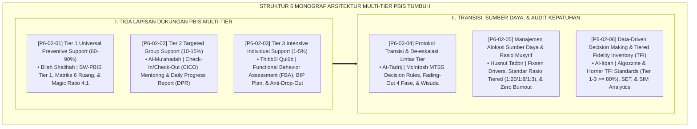

# P6-02: DOKUMEN INDUK ARSITEKTUR INTERVENSI MULTI-TIERED PBIS
## *Arsitektur dan Rekayasa Sistem Intervensi Berjenjang PBIS, Protokol Transisi Bertahap, Tata Kelola Sumber Daya, Serta Evaluasi Kepatuhan Mutu (Tier 1 Universal Form T1U, Tier 2 Targeted CICO Form T2T, Tier 3 Intensive FBA/BIP Form T3I, Protokol Transisi Lintas Tier Form TDL, Manajemen Alokasi Sumber Daya Form ASR, Serta Tiered Fidelity Inventory TFI Form TFI) di Ekosistem TUMBUH Pesantren*

**Nomor Identifikasi**: `P6-02/DOKUMEN-INDUK-ARSITEKTUR-MULTI-TIERED-PBIS/2026`  
**Domain**: `06 Intervention Framework` > `02 Tiered Intervention` (Gugus Sub-Domain 02: *Comprehensive Multi-Tiered Positive Behavioral Interventions & Supports Architecture*)  
**Klasifikasi Naskah**: *Master Architecture & Navigation Monograph* (Dokumen Induk Peta Jalan Riset & Navigasi 6 Monograf Ilmiah Arsitektur Intervensi Multi-Tiered PBIS)  
**Rumpun Disiplin Pengkaji**: Multi-Tiered Systems of Support (MTSS/SW-PBIS), Implementation Science, Behavioral Economics in Education, Fiqh Maratibil Khidmah  

---

> ### 💡 INTISARI EKSEKUTIF (EXECUTIVE SUMMARY)
>
> * **Kedudukan Strategis Gugus Arsitektur Intervensi Multi-Tiered PBIS:**  
>   Gugus *Tiered Intervention (Arsitektur Intervensi Multi-Tiered PBIS)* merupakan tulang punggung operasional pembinaan (*The Operational Backbone of Behavioral Support*) dalam ekosistem TUMBUH. Gugus ini mengubah pendekatan pengasuhan seragam dan reaktif menjadi sistem berjenjang tiga lapis yang presisi: **Tier 1 Universal (80–90% Santri Sehat)**, **Tier 2 Targeted (10–15% Santri Didampingi CICO)**, dan **Tier 3 Intensive (1–5% Santri Dirawat FBA/BIP)**, dengan protokol transisi *Fading Out*, alokasi rasio musyrif manusiawi, dan audit kepatuhan *Tiered Fidelity Inventory (TFI)*.
> * **Integrasi Holistik Turats & Konsensus Sains Intervensi Berjenjang:**  
>   Gugus riset ini memadukan khazanah agung Islam tentang dakwah universal (*Syumūliyyatud Da'wah*), pendampingan intensif (*Al-Mu'āhadah*), pengobatan akar penyakit hati (*Thibbūl Qulūb*), penahapan syariat (*At-Tadrīj*), tata kelola bijak (*Husnut Tadbīr*), dan mutu profesional (*Al-Itqān*) dengan konsensus sains dunia (*Horner & Sugai SW-PBIS, Crone & Hawken CICO, O'Neill FBA, McIntosh MTSS, Fixsen Implementation Science, dan Algozzine TFI*).
> * **Struktur Lengkap 6 Berkas Monograf Riset Ilmiah:**  
>   Dokumen induk ini memetakan dan menghubungkan 6 berkas monograf penelitian akademik komprehensif (~175 KB total riset) yang menyajikan matriks ekspektasi 6 ruang, lembar pantau harian DPR, rencana intervensi perilaku khusus BIP, berita acara wisuda transisi, matriks shift musyrif, dan instrumen audit kepatuhan TFI 45 butir.

---

## 📑 PETA NAVIGASI ENAM MONOGRAF RISET ARSITEKTUR MULTI-TIER PBIS

Berikut adalah daftar lengkap 6 monograf riset akademik dalam gugus **`02 Tiered Intervention`**:

---

## 📚 DESKRIPSI RINGKAS 6 BERKAS MONOGRAF

1. **[P6-02-01: Tier 1 Universal Preventive Support (80-90% Populasi Santri)](file:///c:/xampp/htdocs/tumbuh/06%20Intervention%20Framework/02%20Tiered%20Intervention/P6-02-01-Tier-1-Universal-Preventive-Support-80-Persen.md)**  
   *Membahas sistem pencegahan primer universal bagi 100% santri, doktrin Bi'ah Shalihah, matriks ekspektasi adab 6 ruang fisik, rasio penguatan 4:1, active supervision, dan form Form T1U-Universal.*
2. **[P6-02-02: Tier 2 Targeted Group Support (10-15% Populasi Santri)](file:///c:/xampp/htdocs/tumbuh/06%20Intervention%20Framework/02%20Tiered%20Intervention/P6-02-02-Tier-2-Targeted-Group-Support-15-Persen.md)**  
   *Membahas protokol intervensi sekunder terarah, doktrin Al-Mu'ahadah salaf, Behavior Education Program (BEP) Check-In/Check-Out (CICO), Daily Progress Report (DPR), dan form Form T2T-Targeted.*
3. **[P6-02-03: Tier 3 Intensive Individual Support (1-5% Populasi Santri)](file:///c:/xampp/htdocs/tumbuh/06%20Intervention%20Framework/02%20Tiered%20Intervention/P6-02-03-Tier-3-Intensive-Individual-Support-5-Persen.md)**  
   *Membahas penanganan krisis perilaku berat secara individual, doktrin Thibbūl Qulūb, Functional Behavior Assessment (FBA), Behavior Intervention Plan (BIP), kebijakan Anti-Drop-Out, dan form Form T3I-Intensive.*
4. **[P6-02-04: Protokol Transisi dan De-eskalasi Lintas Tier](file:///c:/xampp/htdocs/tumbuh/06%20Intervention%20Framework/02%20Tiered%20Intervention/P6-02-04-Protokol-Transisi-dan-De-eskalasi-Lintas-Tier.md)**  
   *Membahas protokol perpindahan status intervensi santri, doktrin At-Tadrīj salaf, model MTSS Decision Rules Kent McIntosh, proses pelepasan bantuan (Fading-Out 4 Fase), dan berita acara Form TDL-Transisi.*
5. **[P6-02-05: Manajemen Alokasi Sumber Daya dan Rasio Musyrif Multi-Tier](file:///c:/xampp/htdocs/tumbuh/06%20Intervention%20Framework/02%20Tiered%20Intervention/P6-02-05-Manajemen-Alokasi-Sumber-Daya-dan-Rasio-Musyrif-Multi-Tier.md)**  
   *Membahas standarisasi rasio beban kerja pengasuh (Tier 1: 1:20; Tier 2: 1:8; Tier 3: 1:3), doktrin Husnut Tadbīr salaf, Dean Fixsen Implementation Drivers, sistem shift 8 jam, pencegahan burnout, dan form Form ASR-SumberDaya.*
6. **[P6-02-06: Integrasi Data-Driven Decision Making dan Tiered Fidelity Inventory (TFI)](file:///c:/xampp/htdocs/tumbuh/06%20Intervention%20Framework/02%20Tiered%20Intervention/P6-02-06-Integrasi-Data-Driven-Decision-Making-Tiered-Fidelity.md)**  
   *Membahas standarisasi audit kepatuhan implementasi multi-tier, doktrin Al-Itqān salaf, Tiered Fidelity Inventory (TFI v2.1) 45 sub-butir, target kepatuhan TFI >= 80%, dan form Form TFI-Audit.*

---

## 🎯 STANDAR PENJAMINAN MUTU ARSITEKTUR MULTI-TIERED PBIS

Penerapan gugus **Arsitektur Intervensi Multi-Tiered PBIS (Tiered Intervention)** menjamin bahwa:
1. **Seluruh Santri Mendapatkan Dukungan yang Sesuai dengan Kebutuhannya (*Right Support for the Right Student*)**: 85% santri bertumbuh sehat di Tier 1, 10% terfasilitasi CICO di Tier 2, dan 5% diselamatkan di Tier 3 tanpa ada yang terabaikan.
2. **Kemandirian Santri Terpelihara Secara Berkelanjutan (*Sustainable Habituation*)**: Protokol transisi bertahap menjamin santri tidak mengalami kekambuhan perilaku (*Relapse*) saat kembali ke ritme normal.
3. **Kesehatan dan Kesejahteraan Tenaga Pembina Terjaga Sempurna (*Caregiver Well-being & High Retention*)**: Rasio beban kerja manusiawi dan audit kepatuhan TFI menjamin operasional asrama berjalan dengan harmoni, efisiensi tinggi, dan penuh berkah.
