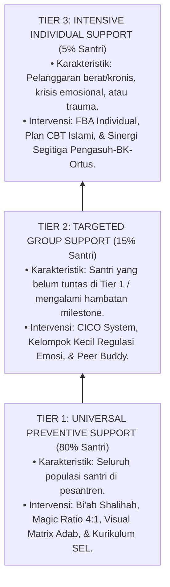

# P6-02: Arsitektur Intervensi Multi-Tiered PBIS (Tier 1, Tier 2, Tier 3)

## Status Dokumen
* **Status**: 🌟 **A+ (Tervalidasi & Siap Diimplementasikan)**
* **Sub-Domain**: `06 Intervention Framework / 02 Tiered Intervention`
* **Penanggung Jawab Keilmuan**: Dewan Keilmuan TUMBUH (*Pakar Arsitektur PBIS Restoratif & Pakar Bimbingan Konseling*)

---

## 1. Spesifikasi Sistem Multi-Tiered SW-PBIS

Intervensi perilaku dalam ekosistem **TUMBUH** terbagi ke dalam **3 Tingkat Dukungan Berjenjang (*Multi-Tiered System of Supports*)**:

---

## 2. Matriks Rincian Komponen per Tier

| Parameter Tier | Tier 1 Universal (80%) | Tier 2 Targeted (15%) | Tier 3 Intensive (5%) |
| :--- | :--- | :--- | :--- |
| **Sasaran Santri** | Seluruh santri pesantren. | Santri risiko sedang / terhambat. | Santri risiko tinggi / kasus khusus. |
| **Bentuk Intervensi** | Penguatan positif PBIS, SOP kamar/kelas, & Magic Ratio 4:1. | CICO, Kelompok Kecil SEL, & Pendampingan Sebaya. | FBA Khusus, Konseling CBT, & Sidang Terpadu. |
| **Penanggung Jawab** | Musyrif Kamar & Guru Kelas. | Wali Kelas & Konselor BK. | Tim Terpadu BK, Pengasuh Utama, & Ortus. |
| **Frekuensi Evaluasi** | Harian / Bulanan. | Mingguan (CICO Check). | Harian / 2-Mingguan. |
