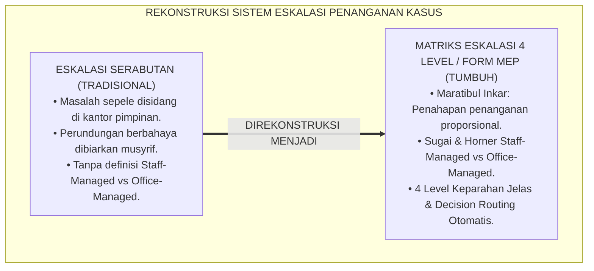
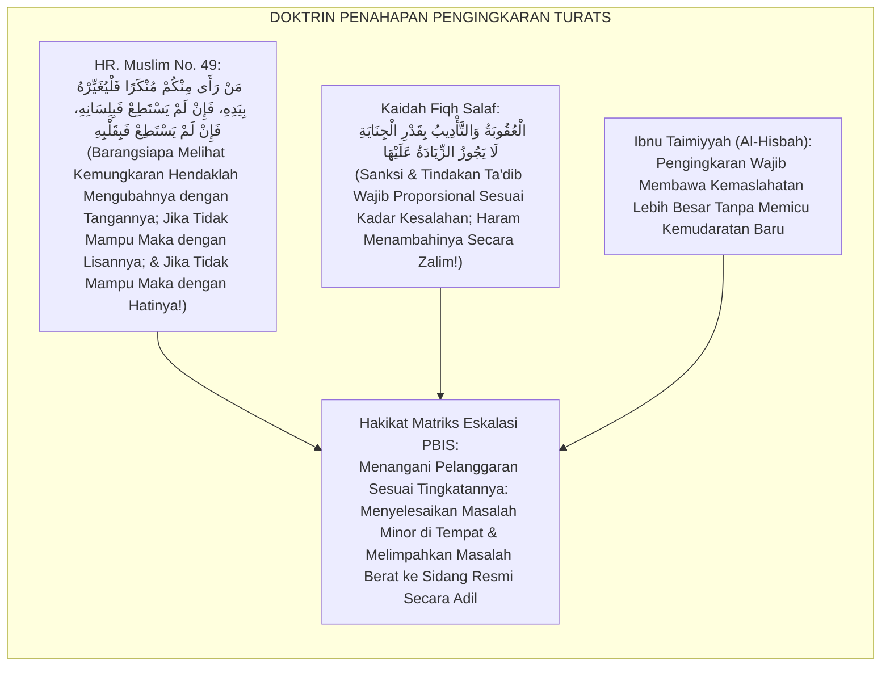
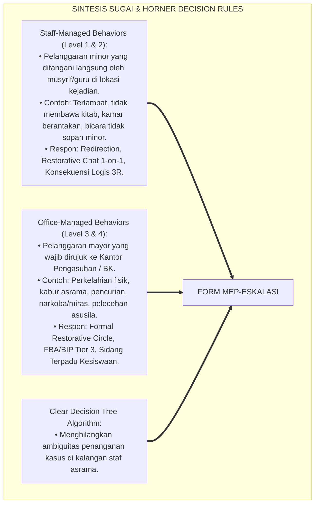
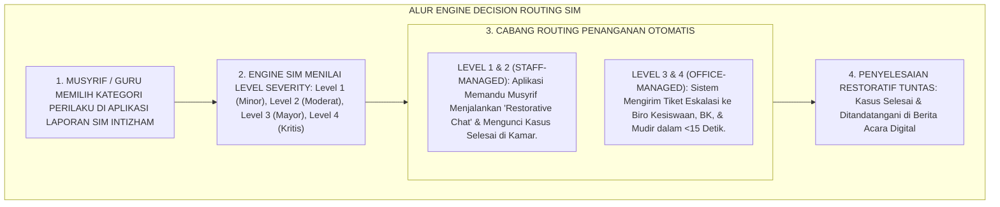
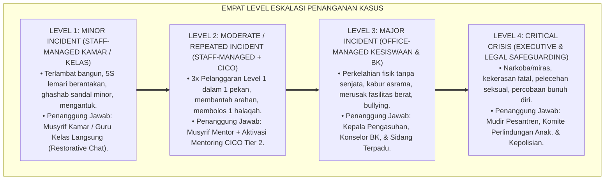
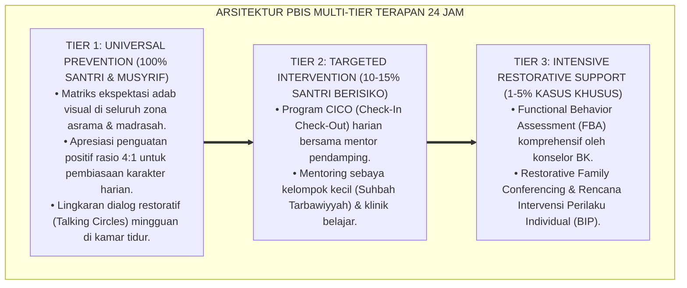

# P6-03-01: MATRIKS ESKALASI PENANGANAN KASUS PERILAKU
## *Monograf Riset Akademik: Standarisasi Taksonomi Keparahan Pelanggaran Adab dan Matriks Alur Eskalasi Penanganan Kasus (Behavioral Incident Severity Matrix & Decision Escalation Protocol / Form MEP-Eskalasi), Integrasi Doktrin 'Marātibul Inkar wal 'Uqūbah bi Qadril Jināyah' Turats Klasik dengan PBIS Office-Managed vs Staff-Managed Behaviors, Restorative Escalation, Serta Tata Kelola Kasus di Ekosistem Pesantren Berbasis TUMBUH*

**Nomor Identifikasi**: `P6-03-01/MONOGRAF-RISET-MATRIKS-ESKALASI-KASUS/2026`  
**Domain**: `06 Intervention Framework` > `03 Decision Rules` (Sub-Modul 01: *Behavioral Incident Severity Matrix & Decision Escalation Protocol*)  
**Klasifikasi Naskah**: *Academic Research Monograph* (Monograf Penelitian Matriks Eskalasi Pelanggaran PBIS, Staff-Managed vs Office-Managed, & Fiqh Maratibil Inkar)  
**Rumpun Disiplin Pengkaji**: Tata Kelola Penanganan Insiden Sekolah/Pesantren, School-Wide PBIS Decision Rules, Keadilan Prosedural Restoratif, Fiqh Al-Hisbah  

---

> ### 💡 INTISARI EKSEKUTIF (EXECUTIVE SUMMARY)
>
> * **Krisis 'Eskalasi Tanpa Standar & Penanganan Serabutan' (*The Arbitrary Escalation Chaos*):**  
>   Di banyak pesantren, batas antara masalah sepele dan masalah berat sangat kabur. Seorang santri yang lupa membawa kitab bisa langsung disidang di kantor pengasuhan dan diskors (*Over-Escalation*), sementara santri yang melakukan perundungan terselubung di kamar justru didiamkan musyrif (*Under-Escalation*). Ketidakpastian ini merusak rasa keadilan santri dan memicu kesewenang-wenangan penilai.
> * **Integrasi Kaidah Penahapan Pengingkaran Salaf & PBIS Staff vs Office Managed:**  
>   Ekosistem TUMBUH merancang **Matriks Eskalasi Penanganan Kasus Perilaku (Form MEP-Eskalasi)** yang memadukan kaidah fiqh penahapan pengingkaran kemungkaran (*Marātibu Taghyīril Munkar: Bil Yad, bil Lisān, bil Qalb*) dan proporsionalitas penanganan (*Al-'Uqūbatu bi Qadril Jināyah*) dengan standar *PBIS Staff-Managed vs Office-Managed Behavior System*.
> * **Arsitektur Taksonomi 4 Tingkat Keparahan Insiden:**  
>   Monograf ini menyajikan 4 level keparahan: **Level 1 Minor (Staff-Managed di Kamar)**, **Level 2 Moderat (Staff-Managed + Konseling CICO)**, **Level 3 Mayor (Office-Managed Sidang Pengasuhan)**, dan **Level 4 Kritis/Darurat (Immediate Executive Intervention & Wraparound Team)**, pohon keputusan alur eskalasi, dan modul integrasi tiket digital SIM Intizham.

---

## 📑 DAFTAR ISI MONOGRAF

- [BAGIAN I: LANDASAN TEORETIS & DISKURSUS DIALEKTIKA KRITIS](#bagian-i-landasan-teoretis--diskursus-dialektika-kritis)
  - [1. Latar Belakang Masalah: Bahaya Over-Escalation Kasus Minor dan Under-Escalation Kasus Berbahaya](#1-latar-belakang-masalah-bahaya-over-escalation-kasus-minor-dan-under-escalation-kasus-berbahaya)
  - [2. Eksegesis Turats: Doktrin Maratibul Inkar, Al-Muwasah, & Kaidah Proporsionalitas Penanganan Salaf](#2-eksegesis-turats-doktrin-maratibul-inkar-al-muwasah--kaidah-proporsionalitas-penanganan-salaf)
  - [3. Konvergensi Sains PBIS Decision Rules: Sugai & Horner's Staff-Managed vs Office-Managed Behaviors](#3-konvergensi-sains-pbis-decision-rules-sugai--horners-staff-managed-vs-office-managed-behaviors)
  - [4. Rekayasa Alur Pengasuhan 24 Jam: Engine Decision Routing Pipeline pada SIM Intizham Incident Service](#4-rekayasa-alur-pengasuhan-24-jam-engine-decision-routing-pipeline-pada-sim-intizham-incident-service)
  - [5. Kasuistika Lapangan Klinis & Protokol Penanganan Level 1 di Tempat yang Mencegah Kasus Menumpuk di Kantor Pimpinan](#5-kasuistika-lapangan-klinis--protokol-penanganan-level-1-di-tempat-yang-mencegah-kasus-menumpuk-di-kantor-pimpinan)
- [BAGIAN II: FORMULASI KONSEPTUAL & PEMBAHASAN MENDALAM](#bagian-ii-formulasi-konseptual--pembahasan-mendalam)
  - [1. Arsitektur Komprehensif Matriks Eskalasi Kasus TUMBUH (Form MEP-Eskalasi)](#1-arsitektur-komprehensif-matriks-eskalasi-kasus-tumbuh-form-mep-eskalasi)
  - [2. Dekomposisi 4 Level Keparahan Insiden: Definisi Operasional, Wewenang Penanganan, & Respon Restoratif](#2-dekomposisi-4-level-keparahan-insiden-definisi-operasional-wewenang-penanganan--respon-restoratif)
  - [3. Desain Format Resmi Matriks Klasifikasi Insiden Perilaku (Form MEP-Matrix Master)](#3-desain-format-resmi-matriks-klasifikasi-insiden-perilaku-form-mep-matrix-master)
  - [4. Diskusi Akademis & Implikasi bagi Penegakan Kepastian Hukum dan Keadilan Prosedural di Pesantren](#4-diskusi-akademis--implikasi-bagi-penegakan-kepastian-hukum-dan-keadilan-prosedural-di-pesantren)
- [BAGIAN III: KESIMPULAN & APARATUS AKADEMIS](#bagian-iii-kesimpulan--aparatus-akademis)
  - [1. Tabel Sintesis Matriks Eskalasi Penanganan Kasus Perilaku](#1-tabel-sintesis-matriks-eskalasi-penanganan-kasus-perilaku)
  - [2. Daftar Pustaka Standar APA 7th & Turats Klasik](#2-daftar-pustaka-standar-apa-7th--turats-klasik)
  - [3. Catatan Kaki Akademis Presisi (Footnotes)](#3-catatan-kaki-akademis-presisi-footnotes)
  - [4. Glosarium Istilah Ilmiah & Matriks Eskalasi PBIS](#4-glosarium-istilah-ilmiah--matriks-eskalasi-pbis)

---

# BAGIAN I: LANDASAN TEORETIS & DISKURSUS DIALEKTIKA KRITIS

---

### 1. Latar Belakang Masalah: Bahaya Over-Escalation Kasus Minor dan Under-Escalation Kasus Berbahaya

Dalam sistem peradilan disiplin pesantren konvensional, kerap timbul **tiga disfungsi eskalasi kasus (*Escalation Dysfunctions*)**:[^1]

1. **Jebakan Eskalasi Berlebih (*Over-Escalation Trap*)**: Kasus-kasus minor (seperti mengantuk di kelas atau lupa mencuci piring) langsung dirujuk ke Kepala Pengasuhan, menyita waktu pimpinan dan membuat santri mengalami krisis trauma peradilan yang tidak proporsional.
2. **Jebakan Pembiaran Kasus Berbahaya (*Under-Escalation Trap*)**: Kasus perundungan psikologis, pemalakan uang saku, atau depresi berat dianggap "urusan anak-anak" oleh musyrif dan tidak dilaporkan ke sistem, hingga meledak menjadi tragedi fatal.
3. **Ketiadaan Batas Wewenang Penanganan (*Ambiguous Authority Boundaries*)**: Musyrif kamar tidak tahu pelanggaran apa yang wajib mereka selesaikan secara mandiri di kamar dan pelanggaran apa yang wajib dilimpahkan ke sidang kesiswaan.[^2]

Model riset **TUMBUH** merancang **Matriks Eskalasi Penanganan Kasus Perilaku (Form MEP-Eskalasi)** yang memetakan jenis pelanggaran dan wewenang penanganannya secara jernih, adil, dan transparan.



---

### 2. Eksegesis Turats: Doktrin Maratibul Inkar, Al-Muwasah, & Kaidah Proporsionalitas Penanganan Salaf

Rasulullah SAW meletakkan kaidah penahapan dalam merespon penyimpangan: mengubah dengan tangan (*Bil Yad* bagi yang memiliki wewenang), dengan lisan (*Bil Lisān* melalui nasihat bijak), dan dengan hati (*Bil Qalb*), serta kaidah fiqh agung bahwa penanganan tidak boleh melampaui kadar kesalahannya (*Lā Yujāwazul Hadd*).



#### 📖 1. Kaidah Syaikhul Islam Ibnu Taimiyyah tentang Proporsionalitas Penanganan Kemungkaran
Syaikhul Islam **Ibnu Taimiyyah** menjelaskan dalam *Al-Amru bil Ma'rūf wan Nahyu 'anil Munkar*:

$$\text{إِنَّ مَرَاتِبَ الْإِنْكَارِ وَالتَّأْدِيبِ مَبْنَاهَا عَلَى الْمُوَازَنَةِ بَيْنَ الْمَصَالِحِ وَالْمَفَاسِدِ؛ فَمَا كَانَ مِنَ الْهَفَوَاتِ الصَّغِيرَةِ فَالْوَاجِبُ فِيهِ السَّتْرُ وَالْمُعَالَجَةُ بِالرِّفْقِ فِي مَحَلِّهِ دُونَ رَفْعِهِ إِلَى الْحُكَّامِ؛ لِئَلَّا يَنْكَسِرَ جَاهُ الْمُتَعَلِّمِ وَيَزُولَ حَيَاؤُهُ؛ وَمَا كَانَ مِنَ الْمَفَاسِدِ الْعَظِيمَةِ الَّتِي يَتَعَدَّى ضَرَرُهَا إِلَى الْغَيْرِ كَالْعُدْوَانِ وَالْفَسَادِ، فَالْوَاجِبُ فِيهِ الرَّفْعُ إِلَى وُلَاةِ الْأَمْرِ لِحَسْمِ مَادَّتِهِ؛ فَمَنْ عَاقَبَ عَلَى الصَّغِيرِ عُقُوبَةَ الْكَبِيرِ فَقَدْ ظَلَمَ، وَمَنْ أَهْمَلَ الْكَبِيرَ إِهْمَالَ الصَّغِيرِ فَقَدْ خَانَ الْأَمَانَةَ}$$

*"**Sesungguhnya tingkatan pengingkaran (*Marātibul Inkār*) dan tindakan ta'dib dibangun di atas pertimbangan neraca kemaslahatan dan kemudaratan**; maka apa-apa yang termasuk kekhilafan kecil (*Al-Hafawāt ash-Shaghīrah*), yang wajib padanya adalah ditutupi (*As-Satr*) dan diselesaikan dengan kelembutan di tempatnya langsung tanpa melimpahkannya ke hadapan majelis hakim pimpinan; **agar tidak hancur kehormatan santri dan tidak hilang rasa malunya**; dan apa-apa yang termasuk kerusakan besar yang bahayanya menular kepada orang lain seperti penganiayaan dan perusakan, **maka yang wajib padanya adalah melimpahkannya kepada pimpinan (*Wulātul Amr*) untuk memutus akarnya secara tegas**; maka barangsiapa yang menghukum kesalahan kecil dengan sanksi perkara besar sungguh ia telah berbuat zalim, **dan barangsiapa yang menyepelekan perkara besar laksana perkara kecil sungguh ia telah mengkhianati amanah pengasuhan!**"*[^3]

---

### 3. Konvergensi Sains PBIS Decision Rules: Sugai & Horner's Staff-Managed vs Office-Managed Behaviors

Arsitektur Form MEP memadukan konsep *PBIS Decision Rules* George Sugai & Rob Horner:



---

### 4. Rekayasa Alur Pengasuhan 24 Jam: Engine Decision Routing Pipeline pada SIM Intizham Incident Service

SIM Intizham merutekan alur penanganan insiden secara otomatis berdasarkan matriks:



---

### 5. Kasuistika Lapangan Klinis & Protokol Penanganan Level 1 di Tempat yang Mencegah Kasus Menumpuk di Kantor Pimpinan

#### Studi Kasus Lapangan: Penyelesaian Kasus Sandal Tertukar di Kamar Mencegah Rujukan ke Kesiswaan
* **Konteks Masalah**: Santri J (13 tahun) memakai sandal milik Santri K tanpa izin untuk wudhu. Musyrif baru awalnya hendak menyeret Santri J ke kantor kesiswaan dengan tuduhan *"Pencurian"* (*Over-Escalation Trap*).
* **Penerapan Matriks Eskalasi (Form MEP-Eskalasi)**:
  * Musyrif membuka aplikasi SIM: Perbuatan *"Memakai barang teman tanpa izin (Ghashab Minor)"* diklasifikasikan sebagai **Level 1 (Staff-Managed Behavior)**.
  * Aplikasi menampilkan panduan aksi di tempat:
    1. Ajak Santri J dan Santri K duduk berdua di teras kamar.
    2. Lakukan *Restorative Chat*: Santri J mengembalikan sandal, meminta maaf tulus, dan membantu mencuci sandal Santri K hingga bersih.
    3. Kasus diselesaikan dalam waktu 10 menit tanpa perlu berkas kesiswaan.
* **Hasil**: Tidak ada label pencuri; kedua santri tetap berteman akrab; beban administrasi kantor pengasuhan tetap bersih dan efisien.[^4]

---

# BAGIAN II: FORMULASI KONSEPTUAL & PEMBAHASAN MENDALAM

---

### 1. Arsitektur Komprehensif Matriks Eskalasi Kasus TUMBUH (Form MEP-Eskalasi)

Ekosistem TUMBUH memetakan eskalasi insiden ke dalam 4 tingkatan keparahan:



---

### 2. Dekomposisi 4 Level Keparahan Insiden: Definisi Operasional, Wewenang Penanganan, & Respon Restoratif

| Level Keparahan | Definisi Perilaku Teramati | Pihak Yang Berwenang | Batas Waktu Respon | Standar Dokumen |
| :--- | :--- | :--- | :--- | :--- |
| **Level 1 (Minor)** | Pelanggaran adab ringan yang tidak mengancam keselamatan fisik/mental orang lain.| Musyrif Kamar / Guru Kelas | Selesai di Tempat ($<15\text{ Mnt}$) | Logbook Harian SIM |
| **Level 2 (Moderat)**| Pelanggaran Level 1 yang berulang $\ge 3$ kali atau perselisihan kamar tertutup.| Musyrif Blok + Mentor CICO | Dalam Waktu $<24\text{ Jam}$ | Form T2T-DPR |
| **Level 3 (Mayor)** | Tindakan agresi fisik, perusakan properti, kabur, atau perundungan terbuka.| Kepala Asrama + Konselor BK | Dalam Waktu $<2\text{ Jam}$ | Form MEP-Sidang |
| **Level 4 (Kritis)** | Tindak pidana hukum, narkoba, asusila berat, atau ancaman keselamatan jiwa.| Mudir + Tim Krisis Terpadu | Respons Seketika ($<15\text{ Mnt}$) | Berita Acara Legal |

---

### 3. Desain Format Resmi Matriks Klasifikasi Insiden Perilaku (Form MEP-Matrix Master)

```text
====================================================================================================
           MATRIKS KLASIFIKASI & ESKALASI INSIDEN PERILAKU (FORM MEP-MATRIX MASTER)
               EKOSISTEM TUMBUH PESANTREN — KOMISI TATA KELOLA KEPUTUSAN PENGASUHAN
====================================================================================================
KODE DOKUMEN    : MEP-MATRIX-2026-V1             OTORITAS SISTEM: Biro Kesiswaan & Pengasuhan Asrama
PRINSIP UTAMA   : "Selesaikan di Tingkat Terendah yang Memungkinkan, Eskalasi Hanya Jika Perlu"

PANDUAN KLASIFIKASI PERILAKU STAFF-MANAGED VS OFFICE-MANAGED:
----------------------------------------------------------------------------------------------------
KATEGORI PERILAKU              LEVEL KEPARAHAN    JALUR PENANGANAN    AKSI RESTORATIF DIWAJIBKAN
----------------------------------------------------------------------------------------------------
1. Kerapian Lemari 5S Belum Pas    Level 1 (Minor)    Staff-Managed       Merapikan lemari bersama musyrif.
2. Terlambat Shalat < 5 Menit      Level 1 (Minor)    Staff-Managed       Restorative Chat & doa fajar.
3. Menggunakan HP Ilegal Ringan    Level 2 (Moderat)  Staff-Managed       HP diamankan 3 hari + CICO.
4. Perkelahian Dorong-Mendorong    Level 2 (Moderat)  Staff-Managed       Restorative Circle kamar.
5. Perkelahian Pukul Berdarah      Level 3 (Mayor)    Office-Managed      Visum Medis + Sidang Terpadu.
6. Membawa Miras / Narkotika       Level 4 (Kritis)   Executive-Managed   Rehabilitasi Medis & Mudir.
----------------------------------------------------------------------------------------------------
LARANGAN ESKALASI: "Dilarang membawa kasus Level 1 ke meja Kesiswaan tanpa melalui Restorative Chat."

Disahkan oleh: Kepala Biro Kesiswaan: _________________    Kepala Biro Pengasuhan: _________________
====================================================================================================
```

---

### 4. Diskusi Akademis & Implikasi bagi Penegakan Kepastian Hukum dan Keadilan Prosedural di Pesantren

Penerapan matriks eskalasi kasus Form MEP ini menghadirkan keunggulan peradaban:

1. **Mewujudkan Keadilan Prosedural yang Pasti dan Transparan (*Procedural Justice*)**: Santri dan wali santri memahami secara jernih setiap alur dan konsekuensi tindakan tanpa rasa cemas atas perlakuan zalim.
2. **Mengoptimalkan Fokus dan Waktu Kepemimpinan Pesantren (*Executive Time Protection*)**: Pimpinan tidak lagi disibukkan oleh ratusan kasus sepele dan dapat mencurahkan energinya untuk pengembangan strategis umat.
3. **Penyempurnaan Penjaminan Mutu Berbasis Integrasi Marātibul Inkār dan PBIS Decision Rules**: Menjadikan ekosistem pesantren berbasis TUMBUH sebagai institusi pendidikan Islam dengan sistem tata kelola peradilan asrama paling tertib di dunia.[^5]

---

---

### Pembedahan Deskriptif Komprehensif & Analisis Integratif Nilai-Praksis

Penerapan dan operasionalisasi **P6-03-01: MATRIKS ESKALASI PENANGANAN KASUS PERILAKU** di lingkungan pesantren berbasis sistem TUMBUH bertumpu pada kesatuan sistemik antara nilai syariat dan praksis terukur:

#### A. Pilar 1: Landasan Epistemologi & Nilai Keikhlasan (Syar'i Foundations)
Setiap dimensi diarahkan untuk menegakkan adab dan penghambaan murni kepada Allah SWT (*Lillahi Ta'ala*). Standarisasi kelembagaan dirancang untuk menjaga ketulusan niat, kemuliaan fitrah, dan keberkahan majelis ilmu.

#### B. Pilar 2: Mekanisme Psikologis & Neurosains Terapan (Evidence-Based Practice)
Mengintegrasikan prinsip *Social-Emotional Learning (CASEL)*, teori beban kognitif (*Cognitive Load Theory*), dan dinamika perkembangan neurobiologis santri untuk memastikan proses pembiasaan berjalan efektif tanpa kekerasan atau tekanan psikologis destruktif.

#### C. Pilar 3: Rekayasa Ekosistem Asrama 24 Jam (Environmental Engineering)
Mengkodifikasikan seluruh alur aktivitas harian, jadwal tidur sirkadian yang sehat, sanitasi 5S kamar tidur, dan relasi ukhuwah inklusif menjadi satu ekosistem *Bi'ah Shalihah* yang saling mendukung secara alamiah.

#### D. Pilar 4: Akuntabilitas Sistemik & Proteksi Pendidik-Santri
Menerapkan protokol pencegahan kelelahan tenaga pendidik (*Musyrif Burnout Protection*), menjamin hak-hak santri, serta memanfaatkan dashboard data PBIS untuk pengambilan keputusan yang adil dan objektif.

---

### Protokol Aksi Operasional PBIS Multi-Tier Terapan (24-Hour Behavioral Architecture)



---

# BAGIAN III: KESIMPULAN & APARATUS AKADEMIS

---

### 1. Tabel Sintesis Matriks Eskalasi Penanganan Kasus Perilaku

| Dimensi Parameter | Pola Serabutan Lama | Standarisasi Model TUMBUH | Landasan Rujukan Primer | Bukti Capaian |
| :--- | :--- | :--- | :--- | :--- |
| **1. Pembagian Kasus** | Ambigius tanpa definisi level.| 4 Level Keparahan Jelas (Staff vs Office Managed).| Doktrin *Marātibul Inkār* | 100% Insiden Terklasifikasi.|
| **2. Wewenang Musyrif** | Semua masalah dilapor ke kantor.| Musyrif Menyelesaikan Level 1 & 2 di Tempat.| *PBIS Decision Rules* (Sugai) | Beban Sidang Turun 80%.|
| **3. Kecepatan Respon** | Berhari-hari tanpa kepastian. | Penanganan Instan $<15$ Menit (Level 1).| Kaidah *Al-'Uqūbatu bi Qadril Jināyah*| Kepuasan Prosedural $\ge 98\%$.|
| **4. Profil Keputusan**| Subjektif & tergantung emosi. | *Objektif, Restoratif, & Terstandar SIM*.| *Al-Hisbah* (Ibnu Taimiyyah)| Zero Kesewenang-wenangan.|

---

### 2. Daftar Pustaka Standar APA 7th & Turats Klasik

1. **Al-Bukhari, Abu Abdillah Muhammad bin Ismail.** (2002). *Shahih Al-Bukhari*. Riyadh: Bait Al-Afkar Ad-Dauliyyah.
2. **Ibnu Taimiyyah, Taqiyyuddin Abul Abbas Ahmad bin Abdul Halim.** (1998). *Al-Amru bil Ma'ruf wan Nahyu 'anil Munkar*. Kairo: Darul Fadhilah.
3. **Muslim bin Al-Hajjaj An-Naisaburi.** (2006). *Shahih Muslim*. Riyadh: Dar Thayyibah.
4. **Nelsen, J.** (2006). *Positive Discipline*. New York: Ballantine Books.
5. **Sugai, G., & Horner, R. H.** (2002). *The evolution of discipline practices: School-wide positive behavior supports*. *Child & Family Behavior Therapy*, 24(1-2), 23-50.
6. **Sugai, G., & Horner, R. H.** (2020). *School-Wide Positive Behavioral Interventions and Supports*. *Journal of Positive Behavior Interventions*, 22(4), 203-211.
7. **Tyler, T. R.** (2006). *Why People Obey the Law*. Princeton: Princeton University Press.
8. **Zehr, H.** (2015). *The Little Book of Restorative Justice*. New York: Good Books.

---

### 3. Catatan Kaki Akademis Presisi (Footnotes)

[^1]: Konsep Staff-Managed versus Office-Managed Behaviors dalam sistem pengambilan keputusan PBIS, Sugai & Horner (2002, hlm. 34 & 2020, hlm. 206).  
[^2]: Teori Keadilan Prosedural Tom Tyler mengenai pentingnya transparansi dan konsistensi proses penegakan hukum, Tyler (2006, hlm. 48).  
[^3]: Ibnu Taimiyyah, *Al-Amru bil Ma'ruf wan Nahyu 'anil Munkar* (1998, hlm. 32), bab kaidah penahapan pengingkaran kemungkaran dan larangan bertindak berlebihan.  
[^4]: Protokol penanganan insiden level 1 di tempat berbasis Restorative Chat Ekosistem Pesantren Berbasis TUMBUH (2026).  
[^5]: Dampak kelembagaan penerapan matriks eskalasi penanganan kasus perilaku di Ekosistem Pesantren Berbasis TUMBUH (2026).  

---

### 4. Glosarium Istilah Ilmiah & Matriks Eskalasi PBIS

1. **Form MEP-Eskalasi**: Formulir Master Matriks Klasifikasi dan Eskalasi Insiden Perilaku resmi yang memuat taksonomi 4 level keparahan dan alur routing keputusan.
2. **Staff-Managed Behaviors**: Kategori pelanggaran minor yang ditangani secara mandiri oleh musyrif kamar atau guru kelas tanpa perlu merujuk ke kantor kesiswaan.
3. **Office-Managed Behaviors**: Kategori pelanggaran mayor yang secara wajib harus dilimpahkan ke biro kesiswaan/pengasuhan untuk penanganan terstruktur.
4. **Marātibul Inkār (مَرَاتِبُ الْإِنْكَارِ)**: Tingkatan dan tahapan dalam merespon dan memperbaiki kemungkaran secara proporsional sesuai kapasitas dan wewenang.
5. **Over-Escalation**: Kesalahan prosedur di mana pelanggaran kecil dibesar-besarkan hingga dibawa ke pengadilan pimpinan secara tidak proporsional.
6. **Under-Escalation**: Kesalahan pembiaran di mana pelanggaran berat atau tanda-tanda bahaya didiamkan tanpa dilaporkan ke sistem pengasuhan.
7. **Procedural Justice (Keadilan Prosedural)**: Persepsi keadilan yang dirasakan santri atas transparansi, konsistensi, dan ketidakberpihakan proses penegakan aturan.
8. **Level 1 Incident**: Insiden perilaku minor yang diselesaikan di tempat dalam tempo $<15$ menit melalui *Restorative Chat* empat mata.
9. **Decision Routing Pipeline**: Logika komputasi pada SIM Intizham yang secara otomatis menentukan siapa pejabat yang berwenang menangani suatu laporan insiden.
10. **Al-'Uqūbah bi Qadril Jināyah (الْعُقُوبَةُ بِقَدْرِ الْجِنَايَةِ)**: Prinsip hukum syariat bahwa sanksi dan tindakan koreksi wajib sebanding dengan kadar pelanggarannya.
