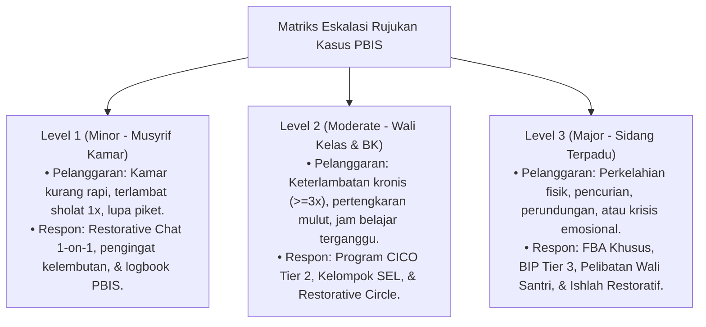

# P6-03-01: Matriks Eskalasi Penanganan Kasus Perilaku

## Status Dokumen
* **Status**: 🌟 **A+ (Tervalidasi & Siap Diimplementasikan)**
* **Sub-Domain**: `06 Intervention Framework / 03 Decision Rules`
* **Penanggung Jawab Keilmuan**: Dewan Keilmuan TUMBUH (*Pakar Arsitektur PBIS Restoratif & Pakar Bimbingan Konseling*)

---

## 1. Matriks Alur Eskalasi Berjenjang

---

## 2. Jaminan Kepastian Prosedur

Setiap pelanggaran memiliki tingkat penanganan yang jelas, mencegah tindakan sewenang-wenang musyrif atau pengabaian kasus oleh lembaga.
