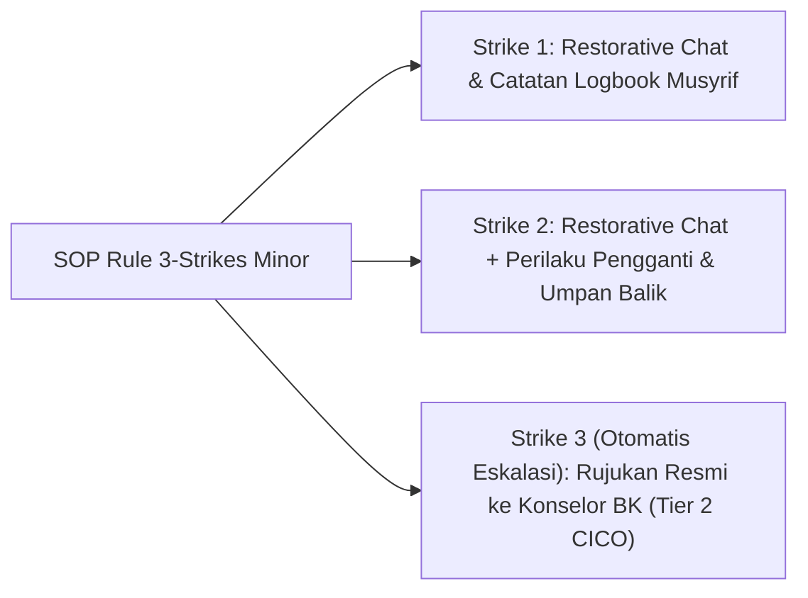

# P6-03-02: Aturan Rujukan Rule 3-Strikes dan Immediate Tier 3

## Status Dokumen
* **Status**: 🌟 **A+ (Tervalidasi & Siap Diimplementasikan)**
* **Sub-Domain**: `06 Intervention Framework / 03 Decision Rules`
* **Penanggung Jawab Keilmuan**: Dewan Keilmuan TUMBUH (*Pakar Arsitektur PBIS Restoratif & Pakar Bimbingan Konseling*)

---

## 1. Operasionalisasi Aturan Rule 3-Strikes Minor

Rule 3-Strikes Minor memastikan bahwa pelanggaran ringan yang berulang tidak diabaikan namun juga tidak ditangani dengan hukuman kasar:

---

## 2. Kriteria Immediate Tier 3 Referral

Kasus-kasus berikut **wajib langsung dirujuk ke Tier 3** tanpa menunggu akumulasi strike:
1. Tindakan kekerasan fisik atau perundungan (*bullying*).
2. Kerusakan fasilitas umum bernilai besar atau pencurian.
3. Krisis emosional berat / ancaman bahaya bagi diri sendiri atau orang lain.
