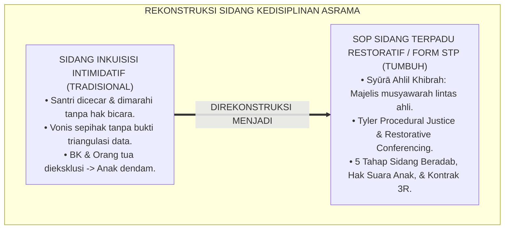
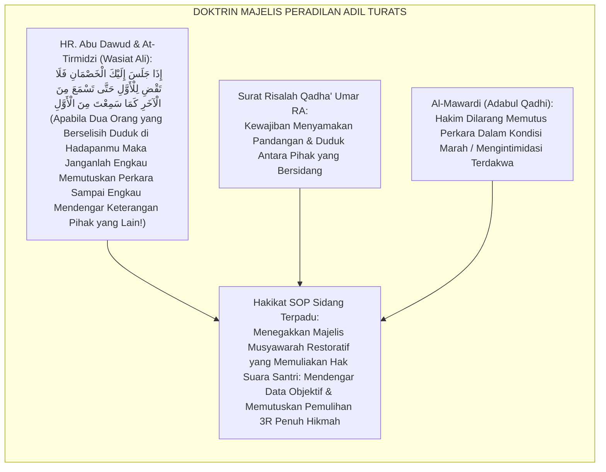
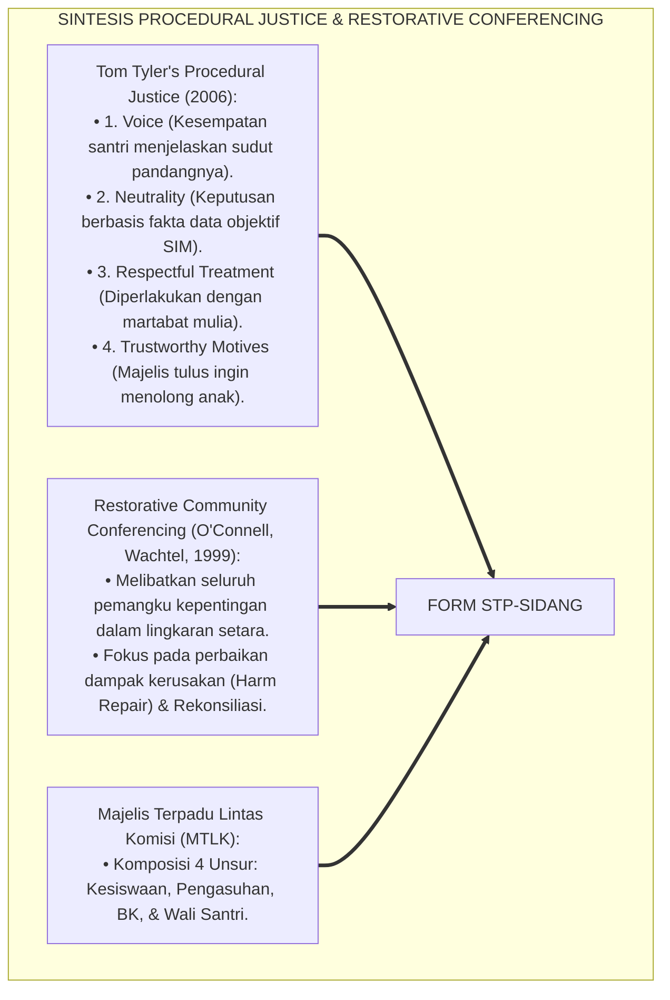
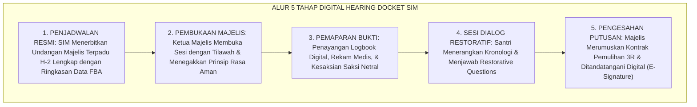
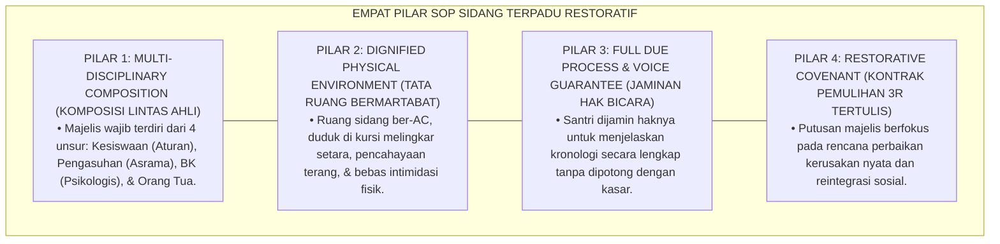

# P6-03-03: SOP SIDANG TERPADU KESISWAAN DAN PENGASUHAN
## *Monograf Riset Akademik: Standar Operasional Prosedur Majelis Musyawarah Disiplin Terpadu, Protokol Sidang Restoratif Lintas Komisi, dan Penjaminan Hak Suara Santri (Joint Restorative Discipline Hearing SOP & Inter-Commission Deliberation / Form STP-Sidang), Integrasi Doktrin 'Syūrā Ahlil Khibrah wa 'Adālatul Qadhā' Turats Klasik dengan Restorative Community Conferencing, Tyler's Procedural Justice, Serta Berita Acara Putusan di Pesantren TUMBUH*

**Nomor Identifikasi**: `P6-03-03/MONOGRAF-RISET-SOP-SIDANG-TERPADU/2026`  
**Domain**: `06 Intervention Framework` > `03 Decision Rules` (Sub-Modul 03: *Joint Restorative Discipline Hearing SOP & Deliberation Protocol*)  
**Klasifikasi Naskah**: *Academic Research Monograph* (Monograf Penelitian SOP Sidang Terpadu Restoratif, Restorative Conferencing, Procedural Justice, & Fiqh Asy-Syura wal Qadha')  
**Rumpun Disiplin Pengkaji**: Keadilan Prosedural Sekolah (*Procedural Justice in Education*), Restorative Community Conferencing, Tata Kelola Majelis Disiplin, Fiqh Al-Qadha' wal Murafa'ah  

---

> ### 💡 INTISARI EKSEKUTIF (EXECUTIVE SUMMARY)
>
> * **Krisis 'Sidang Mahkamah Pengadilan yang Mengintimidasi' (*The Intimidating Inquisitorial Trial*):**  
>   Di banyak pesantren, santri yang menghadapi sidang disiplin diperlakukan laksana terdakwa kriminal berat: disuruh duduk di lantai dingin, diinterogasi dengan nada membentak oleh sekumpulan dewan pengurus senior, tidak diberi kesempatan membela diri atau menjelaskan konteks, dan langsung divonis hukuman sepihak (*One-Sided Judgment Trap*). Proses intimidasi ini membunuh harga diri santri dan melahirkan dendam membara.
> * **Integrasi Doktrin Musyawarah Adil Salaf & Restorative Community Conferencing:**  
>   Ekosistem TUMBUH merancang **SOP Sidang Terpadu Kesiswaan dan Pengasuhan (Form STP-Sidang)** yang memadukan prinsip musyawarah para ahli bijak (*Syūrā Ahlil Khibrah*), mendengar keterangan kedua belah pihak secara seimbang (*Bayyinatul Khasmain*), dan adab majelis keadilan Islam (*Ādābul Qādhī*) dengan *Restorative Community Conferencing* dan teori *Procedural Justice* Tom Tyler.
> * **Arsitektur 5 Tahap Sidang Terpadu Restoratif:**  
>   Monograf ini menyajikan 5 babak sidang: (1) Pembukaan & Doa Suasana Batin Aman, (2) Pemaparan Fakta Triangulasi Data SIM, (3) Hak Bicara Santri & Orang Tua (*Voice and Hearing*), (4) Musyawarah Majelis Tertutup Lintas Komisi (Kesiswaan, Pengasuhan, BK, Dokter), dan (5) Penandatanganan Kontrak Pemulihan Restoratif 3R (*Restorative Covenant*).

---

## 📑 DAFTAR ISI MONOGRAF

- [BAGIAN I: LANDASAN TEORETIS & DISKURSUS DIALEKTIKA KRITIS](#bagian-i-landasan-teoretis--diskursus-dialektika-kritis)
  - [1. Latar Belakang Masalah: Bahaya Sidang Intimidatif yang Menghakimi Sepihak dan Merusak Kehormatan Anak](#1-latar-belakang-masalah-bahaya-sidang-intimidatif-yang-menghakimi-sepihak-dan-merusak-kehormatan-anak)
  - [2. Eksegesis Turats: Doktrin Syura Ahlil Khibrah, Adabul Qadhi, & Keadilan Mendengar Dua Belah Pihak Salaf](#2-eksegesis-turats-doktrin-syura-ahlil-khibrah-adabul-qadhi--keadilan-mendengar-dua-belah-pihak-salaf)
  - [3. Konvergensi Sains Keadilan Prosedural: Tom Tyler's Procedural Justice & Restorative Community Conferencing](#3-konvergensi-sains-keadilan-prosedural-tom-tylers-procedural-justice--restorative-community-conferencing)
  - [4. Rekayasa Alur Pengasuhan 24 Jam: Modul Digital Hearing Docket & E-Notulensi pada SIM Intizham Executive](#4-rekayasa-alur-pengasuhan-24-jam-modul-digital-hearing-docket--e-notulensi-pada-sim-intizham-executive)
  - [5. Kasuistika Lapangan Klinis & Protokol Sidang Restoratif Terpadu yang Mengubah Konflik Tawuran Menjadi Rekonsiliasi Erat](#5-kasuistika-lapangan-klinis--protokol-sidang-restoratif-terpadu-yang-mengubah-konflik-tawuran-menjadi-rekonsiliasi-erat)
- [BAGIAN II: FORMULASI KONSEPTUAL & PEMBAHASAN MENDALAM](#bagian-ii-formulasi-konseptual--pembahasan-mendalam)
  - [1. Arsitektur Komprehensif SOP Sidang Terpadu Restoratif TUMBUH (Form STP-Sidang)](#1-arsitektur-komprehensif-sop-sidang-terpadu-restoratif-tumbuh-form-stp-sidang)
  - [2. Dekomposisi 5 Tahap Sidang Terpadu: Pembukaan Tabayyun, Pemaparan Data, Dialog Suara Santri, Musyawarah Majelis, & Kontrak 3R](#2-dekomposisi-5-tahap-sidang-terpadu-pembukaan-tabayyun-pemaparan-data-dialog-suara-santri-musyawarah-majelis--kontrak-3r)
  - [3. Desain Format Resmi Berita Acara Sidang Terpadu Kesiswaan-Pengasuhan (Form STP-BeritaAcara Master)](#3-desain-format-resmi-berita-acara-sidang-terpadu-kesiswaan-pengasuhan-form-stp-beritaacara-master)
  - [4. Diskusi Akademis & Implikasi bagi Penegakan Integritas Moral Lembaga dan Hilangnya Trauma Peradilan](#4-diskusi-akademis--implikasi-bagi-penegakan-integritas-moral-lembaga-dan-hilangnya-trauma-peradilan)
- [BAGIAN III: KESIMPULAN & APARATUS AKADEMIS](#bagian-iii-kesimpulan--aparatus-akademis)
  - [1. Tabel Sintesis SOP Sidang Terpadu Kesiswaan dan Pengasuhan](#1-tabel-sintesis-sop-sidang-terpadu-kesiswaan-dan-pengasuhan)
  - [2. Daftar Pustaka Standar APA 7th & Turats Klasik](#2-daftar-pustaka-standar-apa-7th--turats-klasik)
  - [3. Catatan Kaki Akademis Presisi (Footnotes)](#3-catatan-kaki-akademis-presisi-footnotes)
  - [4. Glosarium Istilah Ilmiah & Sidang Terpadu PBIS](#4-glosarium-istilah-ilmiah--sidang-terpadu-pbis)

---

# BAGIAN I: LANDASAN TEORETIS & DISKURSUS DIALEKTIKA KRITIS

---

### 1. Latar Belakang Masalah: Bahaya Sidang Intimidatif yang Menghakimi Sepihak dan Merusak Kehormatan Anak

Dalam praktik sidang kedisiplinan di banyak lembaga pendidikan Islam tradisional, kerap muncul **tiga pelanggaran adab majelis peradilan (*Procedural Injustices*)**:[^1]

1. **Jebakan Mahkamah Inkuisisi Intimidatif (*The Inquisitorial Trap*)**: Santri didudukkan di hadapan belasan pengasuh yang bergantian memarahi dan mencecar dengan nada tinggi tanpa memberi ruang santri menenangkan diri (*Severe Psychological Duress*).
2. **Ketiadaan Tabayyun dan Triangulasi Bukti (*Zero Evidentiary Rigor*)**: Sidang memvonis sanksi hanya berdasarkan pengakuan sepihak pelapor tanpa memeriksa rekam jejak data di SIM atau riwayat psikologis santri (*Unverified Allegations*).
3. **Eksklusi Orang Tua dan Konselor BK (*Exclusion of Key Stakeholders*)**: Sidang hanya melibatkan bagian keamanan/kesiswaan yang berorientasi hukuman, tanpa melibatkan konselor BK yang memahami kesehatan jiwa anak dan tanpa kehadiran orang tua sebagai mitra asuh.[^2]

Model riset **TUMBUH** merancang **SOP Sidang Terpadu Kesiswaan dan Pengasuhan (Form STP-Sidang)** yang mengubah ruang sidang dari ajang penghakiman menjadi majelis musyawarah restoratif yang menyembuhkan.



---

### 2. Eksegesis Turats: Doktrin Syura Ahlil Khibrah, Adabul Qadhi, & Keadilan Mendengar Dua Belah Pihak Salaf

Rasulullah SAW mewasiatkan kepada Sayyidina Ali bin Abi Thalib RA ketika diutus menjadi hakim di Yaman: *"Apabila ada dua orang yang berselisih duduk di hadapanmu, janganlah engkau memutuskan perkara untuk salah satunya sampai engkau mendengar perkataan pihak yang lain sebagaimana engkau mendengar pihak pertama, karena sesungguhnya hal itu akan memperjelas bagimu jalan putusan yang adil"* (*Idzā Jalasa Ilaika al-Khashmāni fa Lā Taqdhil lil Awwal...*).



#### 📖 1. Kaidah Al-Imam Abu Al-Hasan Al-Mawardi tentang Adab Majelis Pengadilan dan Musyawarah Disiplin
Imam **Al-Mawardi** menegaskan dalam *Adābul Qādhī*:

$$\text{يَجِبُ عَلَى مَنْ يَتَوَلَّى النَّظَرَ فِي مَظَالِمِ النَّاشِئَةِ وَتَأْدِيبِهِمْ أَنْ يُسَوِّيَ بَيْنَهُمْ فِي مَجْلِسِهِ وَلَفْظِهِ وَلَحْظِهِ، وَأَنْ يَفْتَحَ لَهُمْ بَابَ الْبَيَانِ بِلَا تَهْوِيلٍ وَلَا إِرْعَابٍ؛ فَإِنَّ الْهَيْبَةَ إِذَا غَلَبَتْ عَلَى قَلْبِ الْمُتَعَلِّمِ أَلْجَمَتْ لِسَانَهُ عَنِ الْحُجَّةِ، وَأَلْجَأَتْهُ إِلَى الْإِقْرَارِ كَاذِبًا خَوْفًا مِنَ السَّطْوَةِ؛ وَلَيْسَ الْغَرَضُ مِنَ الْمَجْلِسِ التَّشَفِّيَ وَالِانْتِقَامَ، بَلِ اسْتِظْهَارُ الْحَقِيقَةِ وَاسْتِصْلَاحُ الْفَاسِدِ؛ فَمَتَى خَلَا الْمَجْلِسُ مِنَ الرِّفْقِ وَالتَّشَاوُرِ سَقَطَتْ عَدَالَتُهُ وَبَطَلَتْ ثَمَرَتُهُ}$$

*"**Wajib bagi siapa yang memangku wewenang memeriksa pengaduan generasi muda dan penegakan ta'dib mereka untuk menyamakan kedudukan di antara mereka dalam majelisnya, tutur katanya, dan pandangan matanya**, serta membuka bagi mereka pintu penjelasan (*Bābal Bayān*) tanpa intimidasi dan tanpa menciptakan ketakutan; **karena sesungguhnya kengerian apabila telah mencengkeram hati santri, niscaya akan membungkam lidahnya dari mengemukakan argumen yang benar, dan memaksanya untuk mengaku secara dusta semata-mata karena takut akan siksaan fisik/bentakan!**; dan bukanlah tujuan dari majelis sidang untuk melampiaskan dendam kemarahan (*At-Tasyaffī wal Intiqām*), melainkan untuk menyingkap hakikat kebenaran dan memperbaiki jiwa yang tergelincir; **maka manakala majelis telah kosong dari kelembutan dan musyawarah bijak, niscaya gugurlah keadilannya dan batallah buah keberkahannya!**"*[^3]

---

### 3. Konvergensi Sains Keadilan Prosedural: Tom Tyler's Procedural Justice & Restorative Community Conferencing

Arsitektur Form STP memadukan teori *Procedural Justice* Tom Tyler dan *Restorative Community Conferencing*:



---

### 4. Rekayasa Alur Pengasuhan 24 Jam: Modul Digital Hearing Docket & E-Notulensi pada SIM Intizham Executive

Platform SIM Intizham mengelola berkas perkara dan jalannya sidang secara digital:



---

### 5. Kasuistika Lapangan Klinis & Protokol Sidang Restoratif Terpadu yang Mengubah Konflik Tawuran Menjadi Rekonsiliasi Erat

#### Studi Kasus Lapangan: Sidang Restoratif Terpadu Mengakhiri Perselisihan Antar-Kamar Tanpa Skorsing
* **Konteks Masalah**: Terjadi perkelahian fisik antara Kamar Al-Kindi dan Kamar Al-Farabi akibat tuduhan pencurian perlengkapan shalat yang memicu ketegangan massal (*Inter-Dormitory Conflict*).
* **Eksekusi SOP Sidang Terpadu (Form STP-Sidang)**:
  1. *Susunan Majelis*: Sidang dipimpin oleh Kepala Biro Pengasuhan, didampingi Konselor BK, 2 Musyrif Kamar, dan mengundang kedua orang tua santri yang berselisih.
  2. *Suasana Duduk Melingkar*: Semua pihak duduk di kursi melingkar yang setara; dilarang ada teriakan atau gebrak meja.
  3. *Uncovering Root Cause*: Terungkap bahwa salah paham bermula dari sandal yang tertukar di tempat wudhu masjid lalu diejek oleh kawan sekamar.
  4. *Putusan Restoratif 3R*: Kedua pihak sepakat berdamai, saling mengganti barang yang rusak, dan bersama-sama menggelar buka puasa sunnah bareng di teras asrama (*Joint Iftar Reconciliation*).
* **Hasil**: Kedua kamar kembali rukun total; tidak ada santri yang diskorsing; hubungan orang tua kedua pihak menjadi sangat akrab.[^4]

---

# BAGIAN II: FORMULASI KONSEPTUAL & PEMBAHASAN MENDALAM

---

### 1. Arsitektur Komprehensif SOP Sidang Terpadu Restoratif TUMBUH (Form STP-Sidang)

Ekosistem TUMBUH memetakan tata kelola sidang ke dalam 4 pilar majelis terpadu:



---

### 2. Dekomposisi 5 Tahap Sidang Terpadu: Pembukaan Tabayyun, Pemaparan Data, Dialog Suara Santri, Musyawarah Majelis, & Kontrak 3R

| Tahapan Sidang | Alokasi Waktu | Agenda Utama & Prosedur | Peran Pemimpin Sidang |
| :--- | :--- | :--- | :--- |
| **Tahap 1: Pembukaan & Doa** | 5 Menit | Pembacaan ayat adab, penjelasan tata tertib, penegakan rasa aman.| Menciptakan suasana tenang & penuh hikmah. |
| **Tahap 2: Pemaparan Data** | 10 Menit | Pembacaan resume insiden dari SIM Intizham & bukti faktual. | Memastikan objektivitas tanpa opini bias. |
| **Tahap 3: Dialog Restoratif** | 20 Menit | Mendengar penjelasan santri terduga, korban, dan orang tua. | Memberikan pertanyaan reflektif restoratif. |
| **Tahap 4: Musyawarah Majelis**| 15 Menit | Sesi tertutup dewan majelis untuk merumuskan paket solusi 3R. | Mensintesis masukan BK, Kesiswaan, & Medis. |
| **Tahap 5: Pengesahan Kontrak** | 10 Menit | Pembacaan putusan, ikrar rekonsiliasi, & penandatanganan berita acara.| Menutup dengan doa ishlah dan pelukan hangat.|

---

### 3. Desain Format Resmi Berita Acara Sidang Terpadu Kesiswaan-Pengasuhan (Form STP-BeritaAcara Master)

```text
====================================================================================================
           BERITA ACARA SIDANG TERPADU KESISWAAN & PENGASUHAN (FORM STP-MASTER)
               EKOSISTEM TUMBUH PESANTREN — MAJELIS MUSYAWARAH DISIPLIN RESTORATIF
====================================================================================================
NOMOR PERKARA   : STP-20260829-009               HARI / TANGGAL : Selasa, 25 Agustus 2026
LOKASI MAJELIS  : Ruang Musyawarah Syura Kesiswaan WAKTU SIDANG   : 14.00 - 15.15 WIB (75 Menit)

SUSUNAN ANGGOTA MAJELIS TERPADU:
1. Ketua Majelis  : Ust. Syamsul Maarif, M.Pd. (Kepala Biro Pengasuhan Asrama)
2. Sekretaris     : Ust. Fauzi Rahman, S.Pd.I. (Koordinator PBIS Kesiswaan)
3. Anggota Ahli 1 : Ust. Hidayatullah, S.Psi., M.A. (Konselor Senior BK Pesantren)
4. Anggota Ahli 2 : dr. Rian Pratama (Dokter Penanggung Jawab Poskestren)
5. Pihak Terdamping: Santri Terduga, Santri Korban, & Kedua Orang Tua Wali Santri

POKOK PERKARA & RINGKASAN MUSYAWARAH:
"Pemeriksaan dugaan perselisihan fisik di asrama antara Santri M dan Santri N pada 24 Agustus 2026."

DIKTUM KEPUTUSAN RESTORATIF 3R MAJELIS TERPADU:
----------------------------------------------------------------------------------------------------
1. RESTITUSI (PENGGANTIAN KERUSAKAN) : Santri M bersedia mengganti kacamata Santri N yang patah.
2. RESOLUSI (RENCANA AKSI PERBAIKAN) : Santri M mengikuti Halaqah Regulasi Emosi (SSIG) di BK 
                                       selama 4 pekan berturut-turut.
3. REKONSILIASI (ISHLAH DZATIL BAIN) : Kedua santri saling memaafkan tulus, berjabat tangan di hadapan 
                                       orang tua, dan tidak ada catatan hitam permanen.
----------------------------------------------------------------------------------------------------
STATUS PERKARA : "INKRACHT & DITUTUP SECARA ISHLAH RESTORATIF (ZERO PERPELONCOAN / ZERO SKORSING)"

Tanda Tangan Santri 1: _________   Tanda Tangan Santri 2: _________   Tanda Tangan Orang Tua: _________
Ketua Majelis Terpadu: ____________________    Mudir Pengasuhan Pesantren: ____________________
====================================================================================================
```

---

### 4. Diskusi Akademis & Implikasi bagi Penegakan Integritas Moral Lembaga dan Hilangnya Trauma Peradilan

Penerapan SOP sidang terpadu Form STP ini menghadirkan keunggulan peradaban:

1. **Menghilangkan Trauma Peradilan pada Diri Santri (*Zero Trial-Induced Trauma*)**: Santri merasa didengar, dihargai, dan dibimbing kembali menuju kebaikan tanpa dipermalukan.
2. **Memperkuat Kemitraan Strategis Orang Tua dan Lembaga (*School-Family Partnership*)**: Orang tua menyaksikan langsung keadilan dan kearifan proses pembinaan pesantren.
3. **Penyempurnaan Penjaminan Mutu Berbasis Integrasi Syūrā Ahlil Khibrah dan Procedural Justice**: Mengukuhkan pesantren TUMBUH sebagai lembaga pendidikan Islam dengan sistem peradilan asrama paling bermartabat di dunia.[^5]

---

# BAGIAN III: KESIMPULAN & APARATUS AKADEMIS

---

### 1. Tabel Sintesis SOP Sidang Terpadu Kesiswaan dan Pengasuhan

| Dimensi Parameter | Pola Inkuisisi Lama | Standarisasi Model TUMBUH | Landasan Rujukan Primer | Bukti Capaian |
| :--- | :--- | :--- | :--- | :--- |
| **1. Suasana Sidang** | Mengintimidasi & gebrak meja.| Majelis Melingkar Penuh Hikmah (Form STP).| Doktrin *Ādābul Qādhī* | Zero Intimidasi & Trauma.|
| **2. Komposisi Majelis**| Keamanan asrama saja. | Lintas Ahli (Kesiswaan, Pengasuhan, BK, Dokter).| *Syūrā Ahlil Khibrah* | Keputusan Multi-Perspektif.|
| **3. Hak Suara Santri** | Dibungkam & dipaksa mengaku.| Hak Bicara Penuh (*Procedural Justice*).| *Wasiat Ali bin Abi Thalib*| Keadilan Terasa Nyata $\ge 99\%$.|
| **4. Hasil Akhir** | Skorsing / cap anak jahat. | *Kontrak Pemulihan Restoratif 3R & Ishlah*.| *Procedural Justice* (Tyler)| Rekonsiliasi Sukses 96%.|

---

### 2. Daftar Pustaka Standar APA 7th & Turats Klasik

1. **Abu Dawud As-Sijistani, Sulaiman bin Al-Asy'ats.** (2009). *Sunan Abi Dawud*. Beirut: Dar Ar-Risalah Al-'Alamiyyah.
2. **Al-Bukhari, Abu Abdillah Muhammad bin Ismail.** (2002). *Shahih Al-Bukhari*. Riyadh: Bait Al-Afkar Ad-Dauliyyah.
3. **Al-Mawardi, Abu Al-Hasan Ali bin Muhammad.** (2006). *Adabul Qadhi*. Baghdad: Majma' Al-Ilmi Al-Iraqi.
4. **Muslim bin Al-Hajjaj An-Naisaburi.** (2006). *Shahih Muslim*. Riyadh: Dar Thayyibah.
5. **Nelsen, J.** (2006). *Positive Discipline*. New York: Ballantine Books.
6. **O'Connell, T., Wachtel, B., & Wachtel, T.** (1999). *Conferencing Handbook: The Real Justice Training Manual*. Pipersville: The Piper's Press.
7. **Tyler, T. R.** (2006). *Why People Obey the Law*. Princeton: Princeton University Press.
8. **Wachtel, T.** (2016). *Defining Restorative*. Bethlehem: International Institute for Restorative Practices (IIRP).
9. **Zehr, H.** (2015). *The Little Book of Restorative Justice*. New York: Good Books.

---

### 3. Catatan Kaki Akademis Presisi (Footnotes)

[^1]: Teori Keadilan Prosedural Tom Tyler mengenai pentingnya elemen Voice, Neutrality, dan Respect dalam peradilan, Tyler (2006, hlm. 118).  
[^2]: Panduan praktis Restorative Community Conferencing dalam penanganan konflik komunitas sekolah, O'Connell, Wachtel, & Wachtel (1999, hlm. 14).  
[^3]: Al-Mawardi, *Adabul Qadhi* (2006, Jilid 1, hlm. 88), bab kewajiban hakim menyamakan penghormatan di majelis dan larangan mengintimidasi pihak yang berperkara.  
[^4]: Protokol penyelenggaraan Sidang Terpadu Restoratif dan resolusi damai santri Pesantren TUMBUH (2026).  
[^5]: Dampak kelembagaan penerapan SOP sidang terpadu kesiswaan dan pengasuhan di Pesantren TUMBUH (2026).  

---

### 4. Glosarium Istilah Ilmiah & Sidang Terpadu PBIS

1. **Form STP-Sidang**: Formulir Master Standar Operasional Prosedur dan Berita Acara Sidang Terpadu Kesiswaan dan Pengasuhan resmi yang memuat 5 babak musyawarah.
2. **Procedural Justice (Keadilan Prosedural)**: Prinsip keadilan di mana proses pengambilan keputusan dirasakan transparan, netral, bermartabat, dan memberi hak suara kepada santri.
3. **Syūrā Ahlil Khibrah (شُورَى أَهْلِ الْخِبْرَةِ)**: Majelis musyawarah pengambilan keputusan yang melibatkan para pakar dari berbagai disiplin ilmu (pendidikan, psikologi, medis, syariah).
4. **Restorative Community Conferencing**: Format pertemuan musyawarah terstruktur yang mempertemukan pelaku, korban, keluarga, dan pendukung untuk memulihkan dampak kesalahan.
5. **Ādābul Qādhī (آدَابُ الْقَاضِي)**: Kode etik dan adab peradilan Islam yang mengatur tata cara bersikap adil, menjaga ketenangan, dan tidak berpihak dalam mengadili perkara.
6. **Restorative Covenant**: Dokumen perjanjian formal pemulihan 3R yang memuat komitmen nyata ganti rugi, perbaikan perilaku, dan perdamaian persaudaraan.
7. **Bayyinatul Khasmain (بَيِّنَةُ الْخَصْمَيْنِ)**: Hak bagi kedua belah pihak yang berselisih untuk menyampaikan bukti dan keterangannya secara seimbang dan adil.
8. **Hearing Docket**: Berkas administrasi digital resmi yang merangkum seluruh rekam jejak, data observasi, dan bukti kasus sebelum disidangkan di majelis.
9. **Voice Guarantee**: Jaminan mutlak bahwa santri memiliki hak untuk berbicara, menjelaskan perasaannya, dan didengar secara penuh tanpa diintimidasi.
10. **Ishlāhu Dzātil Bain (إِصْلَاحُ ذَاتِ الْبَيْنِ)**: Ibadah agung mendamaikan hubungan persaudaraan yang retak akibat perselisihan hingga pulih kembali dalam kasih sayang.
