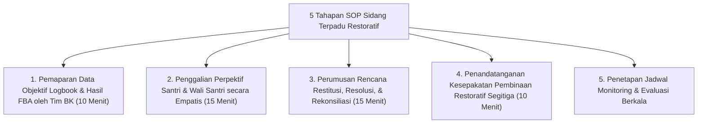

# P6-03-03: SOP Sidang Terpadu Kesiswaan dan Pengasuhan

## Status Dokumen
* **Status**: 🌟 **A+ (Tervalidasi & Siap Diimplementasikan)**
* **Sub-Domain**: `06 Intervention Framework / 03 Decision Rules`
* **Penanggung Jawab Keilmuan**: Dewan Keilmuan TUMBUH (*Pakar Pengasuhan Asrama & Pakar Bimbingan Konseling*)

---

## 1. Spesifikasi Sidang Terpadu Restoratif

Sidang Terpadu Kesiswaan & Pengasuhan adalah forum pengambilan keputusan untuk kasus Tier 3 yang diselenggarakan secara **kekeluargaan, objektif, dan bebas intimidasi**.

---

## 2. Larangan Pengusiran Terburu-buru

Sidang Terpadu berfokus pada perumusan *Behavior Intervention Plan (BIP)* dan pemulihan, bukan persidangan penghukuman atau pengusiran santri.
