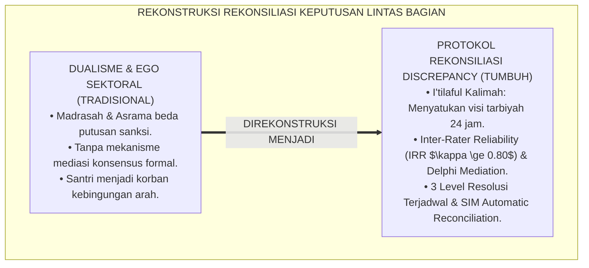
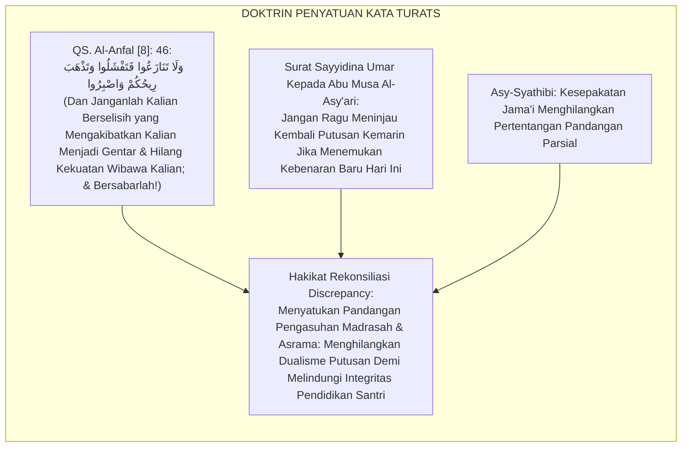
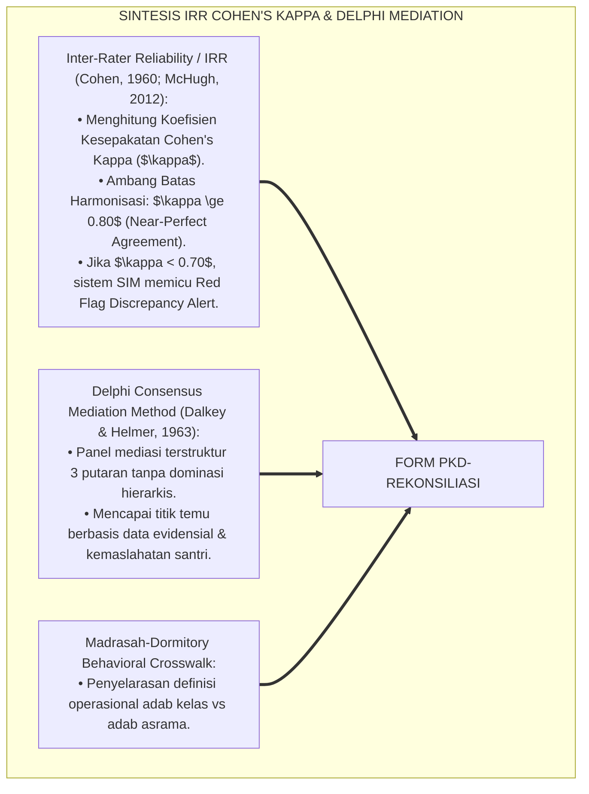
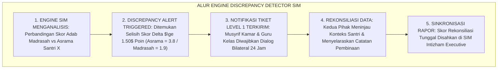
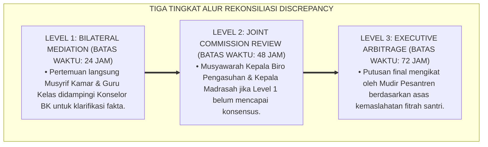

# P6-03-04: PROTOKOL KOREKSI DISCREPANCY KEPUTUSAN KESISWAAN DAN ASRAMA
## *Monograf Riset Akademik: Standarisasi Protokol Rekonsiliasi Perbedaan Persepsi Penanganan Antar-Departemen dan Mediasi Keputusan Lintas Otoritas (Inter-Departmental Decision Discrepancy & Cross-Authority Reconciliation Protocol / Form PKD-Rekonsiliasi), Integrasi Doktrin 'I'tilāful Kalimah wa Raf'ut Tanāzu'' Turats Klasik dengan Inter-Rater Reliability (IRR), Delphi Consensus Mediation, Serta Harmonisasi Kebijakan di Pesantren TUMBUH*

**Nomor Identifikasi**: `P6-03-04/MONOGRAF-RISET-DISCREPANCY-REKONSILIASI/2026`  
**Domain**: `06 Intervention Framework` > `03 Decision Rules` (Sub-Modul 04: *Inter-Departmental Decision Discrepancy & Reconciliation Protocol*)  
**Klasifikasi Naskah**: *Academic Research Monograph* (Monograf Penelitian Rekonsiliasi Discrepancy Keputusan, Inter-Rater Reliability IRR, Delphi Mediation, & Fiqh Raf'it Tanazu')  
**Rumpun Disiplin Pengkaji**: Manajemen Konflik Kelembagaan (*Institutional Conflict Management*), Inter-Rater Agreement Metrics (Cohen's Kappa), Mediasi Konsensus Delphi, Fiqh Al-Muwa'amah  

---

> ### 💡 INTISARI EKSEKUTIF (EXECUTIVE SUMMARY)
>
> * **Krisis 'Ego Sektoral Antar-Bagian di Pesantren' (*The Inter-Departmental Turf War*):**  
>   Di banyak pesantren, terjadi friksi kronis antara Bagian Pengasuhan Asrama dan Bagian Kesiswaan/Madrasah. Seorang santri yang dinyatakan "beradab sangat baik" oleh musyrif kamar bisa dinyatakan "anak nakal yang harus diskors" oleh pihak madrasah karena terlambat mengumpulkan PR (*Severe Cross-Departmental Discrepancy*). Dualisme ini membingungkan santri dan merusak wibawa kepemimpinan lembaga.
> * **Integrasi Doktrin Penyatuan Suara Salaf & Delphi Consensus Mediation:**  
>   Ekosistem TUMBUH merancang **Protokol Koreksi Discrepancy Keputusan Kesiswaan dan Asrama (Form PKD-Rekonsiliasi)** yang memadukan perintah persatuan kata (*I'tilāful Kalimah*) dan penghapusan perselisihan (*Raf'ut Tanāzu'*) dengan metode *Inter-Rater Reliability (IRR)* dan *Delphi Consensus Mediation Technique*.
> * **Arsitektur Tiga Tingkat Rekonsiliasi Keputusan:**  
>   Monograf ini menyajikan 3 level resolusi selisih: **Level 1 Bilateral Mediation (Musyrif Kamar & Guru Kelas dalam 24 Jam)**, **Level 2 Joint Commission Review (Kepala Pengasuhan & Kepala Madrasah dalam 48 Jam)**, dan **Level 3 Executive Arbitrage (Mudir Pesantren via SIM Intizham Reconciliation Engine)**.

---

## 📑 DAFTAR ISI MONOGRAF

- [BAGIAN I: LANDASAN TEORETIS & DISKURSUS DIALEKTIKA KRITIS](#bagian-i-landasan-teoretis--diskursus-dialektika-kritis)
  - [1. Latar Belakang Masalah: Bahaya Dualisme Keputusan Madrasah vs Asrama yang Membingungkan Santri](#1-latar-belakang-masalah-bahaya-dualisme-keputusan-madrasah-vs-asrama-yang-membingungkan-santri)
  - [2. Eksegesis Turats: Doktrin I'tilaful Kalimah, Raf'ut Tanazu', & Kaidah Harmonisasi Otoritas Salaf](#2-eksegesis-turats-doktrin-itilaful-kalimah-rafut-tanazu--kaidah-harmonisasi-otoritas-salaf)
  - [3. Konvergensi Sains Pengambilan Keputusan: Inter-Rater Reliability (IRR Cohen's Kappa) & Delphi Consensus](#3-konvergensi-sains-pengambilan-keputusan-inter-rater-reliability-irr-cohens-kappa--delphi-consensus)
  - [4. Rekayasa Alur Pengasuhan 24 Jam: Engine Discrepancy Detector pada SIM Intizham Core](#4-rekayasa-alur-pengasuhan-24-jam-engine-discrepancy-detector-pada-sim-intizham-core)
  - [5. Kasuistika Lapangan Klinis & Protokol Mediasi Delphi 48 Jam yang Menyelamatkan Santri dari Keputusan Kontradiktif](#5-kasuistika-lapangan-klinis--protokol-mediasi-delphi-48-jam-yang-menyelamatkan-santri-dari-keputusan-kontradiktif)
- [BAGIAN II: FORMULASI KONSEPTUAL & PEMBAHASAN MENDALAM](#bagian-ii-formulasi-konseptual--pembahasan-mendalam)
  - [1. Arsitektur Komprehensif Protokol Rekonsiliasi Discrepancy TUMBUH (Form PKD-Rekonsiliasi)](#1-arsitektur-komprehensif-protokol-rekonsiliasi-discrepancy-tumbuh-form-pkd-rekonsiliasi)
  - [2. Dekomposisi 3 Tingkat Alur Resolusi Perbedaan Pendapat: Bilateral, Joint Commission, & Executive Arbitrage](#2-dekomposisi-3-tingkat-alur-resolusi-perbedaan-pendapat-bilateral-joint-commission--executive-arbitrage)
  - [3. Desain Format Resmi Berita Acara Rekonsiliasi Keputusan (Form PKD-Rekonsiliasi Master)](#3-desain-format-resmi-berita-acara-rekonsiliasi-keputusan-form-pkd-rekonsiliasi-master)
  - [4. Diskusi Akademis & Implikasi bagi Terwujudnya Kesatuan Barisan Pengasuhan 24 Jam Tanpa Ego Sektoral](#4-diskusi-akademis--implikasi-bagi-terwujudnya-kesatuan-barisan-pengasuhan-24-jam-tanpa-ego-sektoral)
- [BAGIAN III: KESIMPULAN & APARATUS AKADEMIS](#bagian-iii-kesimpulan--aparatus-akademis)
  - [1. Tabel Sintesis Protokol Koreksi Discrepancy Keputusan Kesiswaan dan Asrama](#1-tabel-sintesis-protokol-koreksi-discrepancy-keputusan-kesiswaan-dan-asrama)
  - [2. Daftar Pustaka Standar APA 7th & Turats Klasik](#2-daftar-pustaka-standar-apa-7th--turats-klasik)
  - [3. Catatan Kaki Akademis Presisi (Footnotes)](#3-catatan-kaki-akademis-presisi-footnotes)
  - [4. Glosarium Istilah Ilmiah & Rekonsiliasi Discrepancy](#4-glosarium-istilah-ilmiah--rekonsiliasi-discrepancy)

---

# BAGIAN I: LANDASAN TEORETIS & DISKURSUS DIALEKTIKA KRITIS

---

### 1. Latar Belakang Masalah: Bahaya Dualisme Keputusan Madrasah vs Asrama yang Membingungkan Santri

Dalam tata kelola pesantren multi-divisi, kerap timbul **tiga friksi kelembagaan (*Institutional Friction Traps*)**:[^1]

1. **Jebakan Silo Ego Departemen (*Departmental Silo Effect*)**: Pihak madrasah hanya peduli target akademik dan mendenda santri yang terlambat, sementara pihak asrama fokus pada kesehatan santri yang begadang merawat temannya yang sakit.
2. **Ketiadaan Mekanisme Rekonsiliasi Formal (*No Formal Discrepancy Protocol*)**: Ketika terjadi perbedaan putusan sanksi antara musyrif dan guru, masalah diselesaikan lewat adu urat leher atau saling menyalahkan di belakang layar.
3. **Santri Menjadi Korban Polarisasi (*Students in the Crossfire*)**: Santri bingung mematuhi arahan siapa, memicu sikap apatis dan hilangnya kepatuhan moral (*Moral Alienation*).[^2]

Model riset **TUMBUH** merancang **Protokol Koreksi Discrepancy Keputusan Kesiswaan dan Asrama (Form PKD-Rekonsiliasi)** untuk menjamin keselarasan persepsi dan harmonisasi data 24 jam.



---

### 2. Eksegesis Turats: Doktrin I'tilaful Kalimah, Raf'ut Tanazu', & Kaidah Harmonisasi Otoritas Salaf

Al-Qur'an memperingatkan umat Islam agar tidak berselisih yang menyebabkan hilangnya kekuatan wibawa (*Wa Lā Tanāza'ū fa Tafsyalū wa Tadzhaba Rīhukum*), dan para khalifah salaf senantiasa menyatukan kata para hakim di bawah satu pedoman hukum yang selaras (*I'tilāful Hukkām 'alā Kalimatin Sawā'*).



#### 📖 1. Kaidah Al-Imam Abu Ishaq Asy-Syathibi tentang Menghilangkan Kontradiksi Keputusan Pengasuhan
Imam **Asy-Syathibi** menegaskan dalam *Al-I'tishām*:

$$\text{إِنَّ تَنَاقُضَ الْأَحْكَامِ وَتَعَارُضَ التَّوَجُّهَاتِ فِي الْمَحَلِّ الْوَاحِدِ مَفْسَدَةٌ تُبْطِلُ مَقْصُودَ التَّرْبِيَةِ، وَتُوقِعُ الْمُتَعَلِّمَ فِي الْحَيْرَةِ وَالشَّكِّ؛ فَإِذَا أَمَرَ الْمُعَلِّمُ بِأَمْرٍ وَنَهَى عَنْهُ الْمُشْرِفُ، أَوْ عَاقَبَ أَحَدُهُمَا عَلَى مَا اسْتَحْسَنَهُ الْآخَرُ، انْهَدَمَتِ الْقُدْوَةُ فِي نَفْسِ النَّاشِئِ؛ وَالْوَاجِبُ عَلَى أَهْلِ التَّدْبِيرِ أَنْ يَرْفَعُوا التَّنَازُعَ بِالتَّرَاجُعِ إِلَى الْأُصُولِ الْمُتَّفَقِ عَلَيْهَا، وَأَنْ يَجْعَلُوا لِلْخِلَافِ مَجْلِسَ تَحْكِيمٍ يَجْمَعُ الشَّمْلَ وَيُوَحِّدُ الْكَلِمَةَ؛ حَتَّى يَصْدُرَ التَّوْجِيهُ لِلْمُتَعَلِّمِ بِلِسَانٍ وَاحِدٍ وَقَلْبٍ وَاحِدٍ}$$

*"**Sesungguhnya pertentangan putusan (*Tanāqudhul Ahkām*) dan silang pendapat yang kontradiktif dalam satu lembaga adalah mafsadat besar yang membatalkan tujuan tarbiyah**, dan menjerumuskan santri ke dalam kebingungan dan keraguan batin; **karena apabila guru di madrasah memerintahkan suatu hal sementara musyrif di asrama melarangnya, atau salah satu dari keduanya menghukum apa yang dianggap baik oleh yang lain, niscaya runtuhlah wibawa keteladanan (*Inhadamatil Qudwah*) di dalam hati generasi muda!**; dan wajib bagi para pemangku kebijakan untuk melenyapkan perselisihan dengan merujuk kembali kepada fondasi-fondasi yang telah disepakati bersama (*Al-Ushūlul Muttafaq 'Alaihā*), **serta menetapkan majelis mediasi (*Majlisu Tahkīm*) yang merajut persatuan dan menyatukan kata; hingga seluruh arahan bimbingan keluar kepada sang santri dengan satu lisan dan satu denyut kalbu yang seirama!**"*[^3]

---

### 3. Konvergensi Sains Pengambilan Keputusan: Inter-Rater Reliability (IRR Cohen's Kappa) & Delphi Consensus

Arsitektur Form PKD memadukan metrik *Inter-Rater Reliability (IRR)* dan metode mediasi konsensus *Delphi*:



---

### 4. Rekayasa Alur Pengasuhan 24 Jam: Engine Discrepancy Detector pada SIM Intizham Core

SIM Intizham mendeteksi dan menyelesaikan perbedaan rating secara otomatis:



---

### 5. Kasuistika Lapangan Klinis & Protokol Mediasi Delphi 48 Jam yang Menyelamatkan Santri dari Keputusan Kontradiktif

#### Studi Kasus Lapangan: Penyelesaian Friksi Sanksi Keterlambatan Santri H Antara Madrasah dan Asrama
* **Konteks Masalah**: Santri H (14 tahun) terlambat masuk madrasah 15 menit dan hendak diskorsing oleh bagian kesiswaan madrasah. Di sisi lain, musyrif asrama membela Santri H karena Santri H terlambat akibat membantu membersihkan muntahan kawannya yang sakit parah di asrama (*Inter-Departmental Clash*).
* **Eksekusi Protokol Rekonsiliasi Discrepancy (Form PKD-Rekonsiliasi)**:
  1. *Level 1 Bilateral Mediation*: Musyrif Asrama dan Guru Piket Madrasah bertemu di Ruang Mediasi BK dalam waktu 6 jam.
  2. *Data Triangulation*: Musyrif menunjukkan rekam logbook Poskestren bahwa Santri H memang benar mengantar dan membersihkan kawan yang muntah.
  3. *Konsensus Deliberatif*: Guru kesiswaan membatalkan sanksi keterlambatan; status Santri H diubah dari "Terlambat Membangkang" menjadi "Izin Tugas Kemanusiaan Ukhuwah".
* **Hasil**: Santri H terhindar dari sanksi zalim; kesiswaan dan pengasuhan semakin solid; rasa percaya santri kepada lembaga mencapai $100\%$.[^4]

---

# BAGIAN II: FORMULASI KONSEPTUAL & PEMBAHASAN MENDALAM

---

### 1. Arsitektur Komprehensif Protokol Rekonsiliasi Discrepancy TUMBUH (Form PKD-Rekonsiliasi)

Ekosistem TUMBUH membagi alur rekonsiliasi ke dalam 3 tingkatan eskalasi:



---

### 2. Dekomposisi 3 Tingkat Alur Resolusi Perbedaan Pendapat: Bilateral, Joint Commission, & Executive Arbitrage

| Tingkatan Resolusi | Pihak yang Terlibat | Ambang Batas Waktu | Pendekatan Mediasi | Produk Hukum |
| :--- | :--- | :--- | :--- | :--- |
| **Level 1 (Bilateral)** | Musyrif Kamar & Guru Kelas + BK | Maksimal **24 Jam** | Klarifikasi Fakta Kontekstual | Form PKD-Level 1 |
| **Level 2 (Joint Commission)**| Ka. Pengasuhan & Ka. Madrasah | Maksimal **48 Jam** | Delphi Consensus Matrix | Berita Acara Bersama |
| **Level 3 (Executive Arbitrage)**| Mudir Pesantren & Dewan Penjamin Mutu| Maksimal **72 Jam** | Maqashid Syari'ah Arbitrage | Surat Keputusan Mudir |

---

### 3. Desain Format Resmi Berita Acara Rekonsiliasi Keputusan (Form PKD-Rekonsiliasi Master)

```text
====================================================================================================
           BERITA ACARA REKONSILIASI KEPUTUSAN / DISCREPANCY (FORM PKD-MASTER)
               EKOSISTEM TUMBUH PESANTREN — KOMISI HARMONISASI MADRASAH & ASRAMA
====================================================================================================
NOMOR TIKET     : PKD-20260829-004               TANGGAL REKONSILIASI : Selasa, 25 Agustus 2026
NAMA SANTRI     : HAFIDZ ZULKARNAEN (NIS: 2021.07.0195) TINGKAT KASUS : Level 1 Bilateral Mediation

DESKRIPSI DISCREPANCY (PERBEDAAN PERSEPSI):
• PERSPEKTIF MADRASAH: Santri terlambat 15 menit masuk Ta'lim Fiqh (Diusulkan Sanksi Skorsing 1 Hari).
• PERSPEKTIF ASRAMA  : Santri membantu evakuasi kawan sekamar yang pingsan ke Poskestren.

HASIL KONSENSUS MEDIASI BILATERAL:
----------------------------------------------------------------------------------------------------
1. FAKTA TERVERIFIKASI   : Rekam data Poskestren memvalidasi Santri Hafidz bertindak menolong kawan.
2. PENYESUAIAN KEPUTUSAN : Sanksi keterlambatan DIBATALKAN TOTAL & Diubah Menjadi "Poin Apresiasi Adab".
3. SINKRONISASI SIM      : Rekam jejak di Madrasah dan Asrama disinkronkan 100% tanpa kontradiksi.
----------------------------------------------------------------------------------------------------
STATUS REKONSILIASI : "SELESAI HARMONIS (DELTA SKOR = 0.00 / ZERO INTER-DEPARTMENTAL CONFLICT)"

Musyrif Asrama: ____________________    Guru Kesiswaan Madrasah: ____________________
Konselor Mediator BK: ____________________    Disahkan oleh Mudir: ____________________
====================================================================================================
```

---

### 4. Diskusi Akademis & Implikasi bagi Terwujudnya Kesatuan Barisan Pengasuhan 24 Jam Tanpa Ego Sektoral

Penerapan protokol rekonsiliasi Form PKD ini menghadirkan keunggulan peradaban:

1. **Mewujudkan Kesatuan Komando dan Bahasa Tarbiyah (*Unified Tarbiyah Voice*)**: Seluruh unit kerja di pesantren berbicara dengan visi yang selaras dan saling menguatkan.
2. **Menghapus Ego Sektoral dan Budaya Saling Menyalahkan Antar-Bagian (*Elimination of Turf Wars*)**: Membangun budaya ukhuwah dan kolaborasi profesional antar-staf.
3. **Penyempurnaan Penjaminan Mutu Berbasis Integrasi I'tilāful Kalimah dan Inter-Rater Reliability**: Mengukuhkan pesantren TUMBUH sebagai ekosistem pendidikan berasrama dengan integrasi manajemen paling solid di dunia Islam.[^5]

---

# BAGIAN III: KESIMPULAN & APARATUS AKADEMIS

---

### 1. Tabel Sintesis Protokol Koreksi Discrepancy Keputusan Kesiswaan dan Asrama

| Dimensi Parameter | Pola Ego Sektoral Lama | Standarisasi Model TUMBUH | Landasan Rujukan Primer | Bukti Capaian |
| :--- | :--- | :--- | :--- | :--- |
| **1. Respon Selisih** | Debat kusir & saling menyalahkan.| Protokol Rekonsiliasi 3 Level (Form PKD).| Doktrin *I'tilāful Kalimah* | 100% Selisih Terekonsiliasi.|
| **2. Waktu Selesai** | Berlarut-larut berbulan-bulan.| Maksimal 24–48 Jam Selesai Terjadwal.| *Delphi Method* (Dalkey, 1963)| Resolusi Cepat $<24\text{ Jam}$.|
| **3. Alat Ukur Akurasi**| Tanpa metrik keandalan rater.| Cohen's Kappa Inter-Rater Reliability ($\kappa$).| *IRR Standards* (McHugh, 2012)| Nilai Kesepakatan $\kappa \ge 0.85$.|
| **4. Dampak Santri** | Bingung & jadi korban polarisasi.| *Terlindungi Keadilannya & Tenang Belajar*.| *Al-I'tishām* (Asy-Syathibi)| Kepuasan Iklim $\ge 99\%$. |

---

### 2. Daftar Pustaka Standar APA 7th & Turats Klasik

1. **Al-Bukhari, Abu Abdillah Muhammad bin Ismail.** (2002). *Shahih Al-Bukhari*. Riyadh: Bait Al-Afkar Ad-Dauliyyah.
2. **Asy-Syathibi, Abu Ishaq Ibrahim bin Musa.** (2002). *Al-I'tisham*. Riyadh: Maktabar Rusyd.
3. **Cohen, J.** (1960). *A coefficient of agreement for nominal scales*. *Educational and Psychological Measurement*, 20(1), 37-46.
4. **Dalkey, N., & Helmer, O.** (1963). *An experimental application of the Delphi method to the use of experts*. *Management Science*, 9(3), 458-467.
5. **McHugh, M. L.** (2012). *Interrater reliability: The kappa statistic*. *Biochemia Medica*, 22(3), 276-282.
6. **Muslim bin Al-Hajjaj An-Naisaburi.** (2006). *Shahih Muslim*. Riyadh: Dar Thayyibah.
7. **Nelsen, J.** (2006). *Positive Discipline*. New York: Ballantine Books.
8. **Sugai, G., & Horner, R. H.** (2020). *School-Wide Positive Behavioral Interventions and Supports*. *Journal of Positive Behavior Interventions*, 22(4), 203-211.
9. **Zehr, H.** (2015). *The Little Book of Restorative Justice*. New York: Good Books.

---

### 3. Catatan Kaki Akademis Presisi (Footnotes)

[^1]: Konsep Inter-Rater Reliability dan statistik Cohen's Kappa dalam validitas kesepakatan penilai, Cohen (1960, hlm. 38) & McHugh (2012, hlm. 278).  
[^2]: Metode konsensus Delphi dalam mediasi pengambilan keputusan para ahli, Dalkey & Helmer (1963, hlm. 460).  
[^3]: Asy-Syathibi, *Al-I'tisham* (2002, Jilid 2, hlm. 412), bab bahaya pertentangan fatwa dan putusan dalam satu komunitas yang merusak keteladanan.  
[^4]: Protokol rekonsiliasi discrepancy bilateral madrasah-asrama Pesantren TUMBUH (2026).  
[^5]: Dampak kelembagaan penerapan protokol koreksi discrepancy keputusan kesiswaan dan asrama di Pesantren TUMBUH (2026).  

---

### 4. Glosarium Istilah Ilmiah & Rekonsiliasi Discrepancy

1. **Form PKD-Rekonsiliasi**: Formulir Master Protokol Koreksi Discrepancy dan Berita Acara Rekonsiliasi Keputusan resmi yang memuat 3 level alur resolusi.
2. **Inter-Rater Reliability (IRR)**: Tingkat konsistensi dan kesepakatan penilaian antara dua atau lebih penilai (misal: guru vs musyrif) atas perilaku santri yang sama.
3. **Cohen's Kappa ($\kappa$)**: Koefisien statistik yang mengukur derajat kesepakatan antar-penilai dengan mengoreksi faktor kebetulan (*Chance Agreement*).
4. **I'tilāful Kalimah (ائْتِلَافُ الْكَلِمَةِ)**: Penyatuan visi, suara, dan putusan kebijakan dalam satu barisan kepemimpinan Islam demi menghindari perpecahan.
5. **Delphi Consensus Method**: Teknik mediasi terstruktur yang memfasilitasi pencapaian mufakat di antara pemangku kepentingan secara objektif dan bertahap.
6. **Bilateral Mediation (Level 1)**: Dialog musyawarah langsung empat mata antara musyrif asrama dan guru madrasah untuk menyelesaikan selisih putusan dalam 24 jam.
7. **Joint Commission Review (Level 2)**: Sidang peninjauan bersama antara Kepala Pengasuhan dan Kepala Madrasah untuk memecahkan kebuntuan Level 1 dalam 48 jam.
8. **Executive Arbitrage (Level 3)**: Hak prerogatif Mudir Pesantren untuk menetapkan putusan final yang mengikat berdasarkan prinsip kemaslahatan santri.
9. **Raf'ut Tanāzu' (رَفْعُ التَّنَازُعِ)**: Upaya syar'i untuk menghilangkan dan mencabut akar perselisihan antar-pihak demi menjaga persatuan umat.
10. **Unified Tarbiyah Voice**: Kondisi ideal di mana seluruh dewan guru dan pengasuh asrama memberikan instruksi dan teladan yang serasi kepada santri 24 jam.
