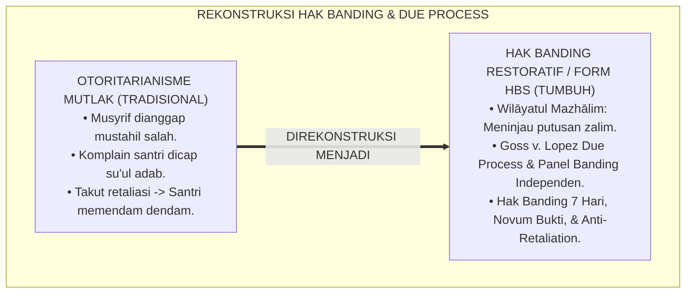
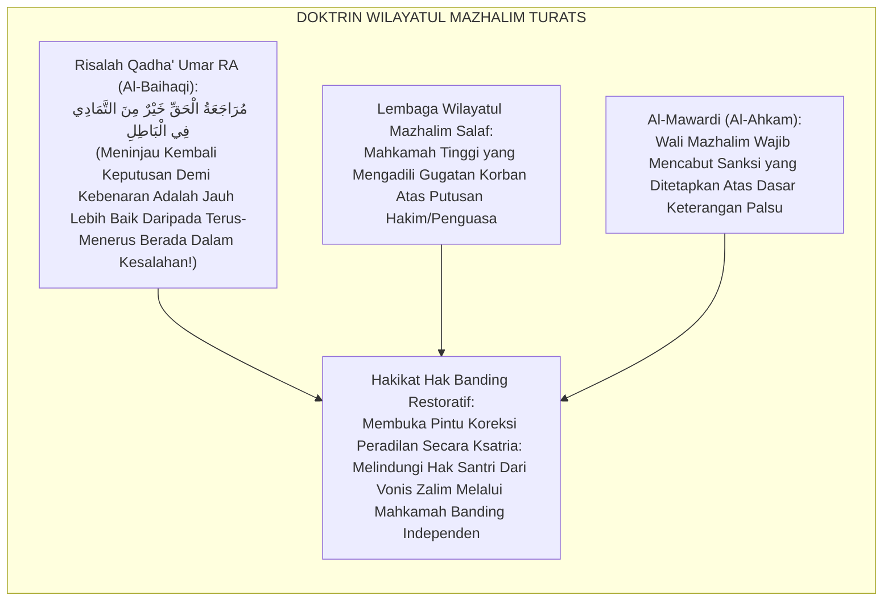
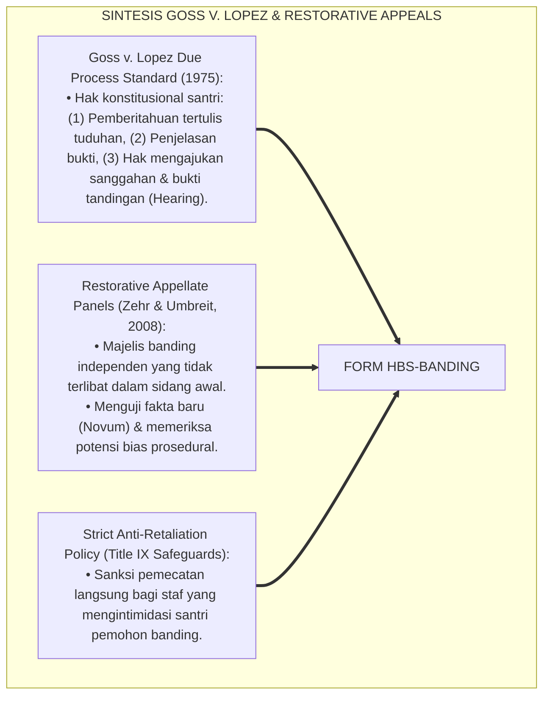
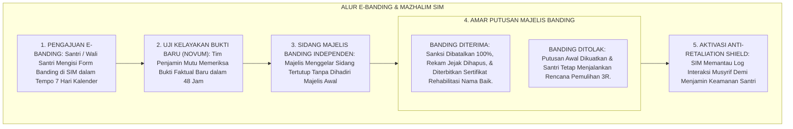
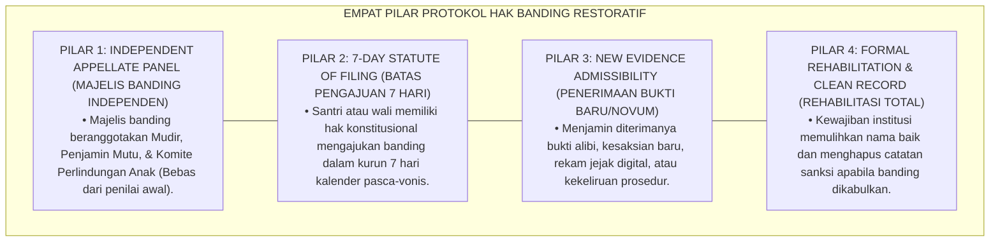

# P6-03-05: PROTOKOL HAK BANDING SANTRI DAN DUE PROCESS RESTORATIF
## *Monograf Riset Akademik: Standarisasi Mekanisme Pengajuan Banding Santri, Peninjauan Ulang Putusan Disiplin, dan Perlindungan Hak Pembelaan Bermartabat (Student Right to Appeal, Restorative Due Process, & Appellate Review Protocol / Form HBS-Banding), Integrasi Doktrin 'Murāja'atul Qadhā' wa Raf'ul Mazhālim' Turats Klasik dengan Goss v. Lopez Due Process Standards, Restorative Appellate Panels, Serta Keadilan Substantif di Pesantren TUMBUH*

**Nomor Identifikasi**: `P6-03-05/MONOGRAF-RISET-HAK-BANDING-DUE-PROCESS/2026`  
**Domain**: `06 Intervention Framework` > `03 Decision Rules` (Sub-Modul 05: *Student Right to Appeal & Restorative Due Process Protocol*)  
**Klasifikasi Naskah**: *Academic Research Monograph* (Monograf Penelitian Hak Banding Santri, Due Process of Law in Education, Goss v. Lopez, & Fiqh Wilayatul Mazhalim)  
**Rumpun Disiplin Pengkaji**: Keadilan Konstitusional Pendidikan (*Constitutional Due Process*), Restorative Appellate Frameworks, Advokasi Perlindungan Santri, Fiqh Al-Mazhalim  

---

> ### 💡 INTISARI EKSEKUTIF (EXECUTIVE SUMMARY)
>
> * **Krisis 'Putusan Disiplin Final Tanpa Hak Menggugat' (*The Infallible Authority Myth*):**  
>   Di banyak pesantren konvensional, putusan sanksi pengurus atau musyrif dianggap mutlak dan tidak boleh dibantah sama sekali (*Absolute Authoritarianism*). Santri yang merasa difitnah atau dijatuhi putusan zalim tidak memiliki saluran resmi untuk mengajukan banding. Keadaan tanpa hak banding ini melahirkan keputusasaan, perlawanan bawah tanah (*Silent Rebellion*), dan rusaknya kepercayaan santri kepada integritas syariat.
> * **Integrasi Doktrin Wilayatul Mazhalim & Goss v. Lopez Due Process:**  
>   Ekosistem TUMBUH merancang **Protokol Hak Banding Santri dan Due Process Restoratif (Form HBS-Banding)** yang memadukan institusi peninjauan kezaliman peradilan Islam klasik (*Wilāyatul Mazhālim*) dan kaidah meninjau kembali putusan yang keliru (*Murāja'atul Qadhā' Khairun minal Idiyādi fīl Bāthil*) dengan standar konstitusional hak pembelaan *Due Process (Goss v. Lopez)*.
> * **Arsitektur Panel Banding Restoratif Independen (PBRI):**  
>   Monograf ini menyajikan hak banding 7 hari kalender santri/wali, pembentukan Majelis Banding Independen (Mudir, Komite Advokasi Perlindungan Anak, dan Perwakilan Santri Senior Demisioner), protokol peninjauan bukti baru (*Novum*), dan jaminan perlindungan mutlak dari aksi balas dendam (*Anti-Retaliation Protection*).

---

## 📑 DAFTAR ISI MONOGRAF

- [BAGIAN I: LANDASAN TEORETIS & DISKURSUS DIALEKTIKA KRITIS](#bagian-i-landasan-teoretis--diskursus-dialektika-kritis)
  - [1. Latar Belakang Masalah: Bahaya Otoritarianisme Mutlak & Hilangnya Saluran Advokasi Santri yang Terzalimi](#1-latar-belakang-masalah-bahaya-otoritarianisme-mutlak--hilangnya-saluran-advokasi-santri-yang-terzalimi)
  - [2. Eksegesis Turats: Doktrin Wilayatul Mazhalim, Muraja'atul Qadha', & Tradisi Koreksi Hakim Salaf](#2-eksegesis-turats-doktrin-wilayatul-mazhalim-murajaatul-qadha--tradisi-koreksi-hakim-salaf)
  - [3. Konvergensi Sains Hukum Pendidikan: Goss v. Lopez Due Process & Restorative Appellate Panels](#3-konvergensi-sains-hukum-pendidikan-goss-v-lopez-due-process--restorative-appellate-panels)
  - [4. Rekayasa Alur Pengasuhan 24 Jam: Modul E-Banding & Whistleblower Protection pada SIM Intizham Legal](#4-rekayasa-alur-pengasuhan-24-jam-modul-e-banding--whistleblower-protection-pada-sim-intizham-legal)
  - [5. Kasuistika Lapangan Klinis & Protokol Sidang Banding yang Membatalkan Sanksi Fitnah dan Merehabilitasi Nama Santri](#5-kasuistika-lapangan-klinis--protokol-sidang-banding-yang-membatalkan-sanksi-fitnah-dan-merehabilitasi-nama-santri)
- [BAGIAN II: FORMULASI KONSEPTUAL & PEMBAHASAN MENDALAM](#bagian-ii-formulasi-konseptual--pembahasan-mendalam)
  - [1. Arsitektur Komprehensif Protokol Hak Banding Restoratif TUMBUH (Form HBS-Banding)](#1-arsitektur-komprehensif-protokol-hak-banding-restoratif-tumbuh-form-hbs-banding)
  - [2. Dekomposisi 4 Tahap Proses Banding: Pengajuan Novum, Uji Kelayakan Administrasi, Sidang Majelis Banding, & Putusan Rehabilitasi](#2-dekomposisi-4-tahap-proses-banding-pengajuan-novum-uji-kelayakan-administrasi-sidang-majelis-banding--putusan-rehabilitasi)
  - [3. Desain Format Resmi Permohonan & Putusan Banding Santri (Form HBS-Banding Master)](#3-desain-format-resmi-permohonan--putusan-banding-santri-form-hbs-banding-master)
  - [4. Diskusi Akademis & Implikasi bagi Terwujudnya Pesantren Beradab yang Berjiwa Keadilan Hakiki](#4-diskusi-akademis--implikasi-bagi-terwujudnya-pesantren-beradab-yang-berjiwa-keadilan-hakiki)
- [BAGIAN III: KESIMPULAN & APARATUS AKADEMIS](#bagian-iii-kesimpulan--aparatus-akademis)
  - [1. Tabel Sintesis Protokol Hak Banding Santri dan Due Process Restoratif](#1-tabel-sintesis-protokol-hak-banding-santri-dan-due-process-restoratif)
  - [2. Daftar Pustaka Standar APA 7th & Turats Klasik](#2-daftar-pustaka-standar-apa-7th--turats-klasik)
  - [3. Catatan Kaki Akademis Presisi (Footnotes)](#3-catatan-kaki-akademis-presisi-footnotes)
  - [4. Glosarium Istilah Ilmiah & Hak Banding Santri](#4-glosarium-istilah-ilmiah--hak-banding-santri)

---

# BAGIAN I: LANDASAN TEORETIS & DISKURSUS DIALEKTIKA KRITIS

---

### 1. Latar Belakang Masalah: Bahaya Otoritarianisme Mutlak & Hilangnya Saluran Advokasi Santri yang Terzalimi

Dalam kultur feodalisme pendidikan asrama tertutup, kerap timbul **tiga kezaliman peradilan (*Infallibility Traps*)**:[^1]

1. **Mitos Ketanpasalahan Pengasuh (*The Fallacy of Infallibility*)**: Anggapan keliru bahwa pembina atau musyrif tidak mungkin salah mendiagnosis perkara, sehingga mengajukan komplain dianggap sebagai "pembangkangan adab (*Su'ul Adab*)".
2. **Ketiadaan Akses Advokasi Mandiri (*No Redress Mechanism*)**: Santri yang dijatuhi putusan akibat fitnah atau salah paham tidak memiliki mekanisme banding resmi (*Appellate Void*).
3. **Ancaman Balas Dendam (*Fear of Retaliation*)**: Santri dan wali santri takut melapor karena khawatir santri akan ditandai dan diintimidasi secara terselubung oleh oknum pengasuh (*Retaliation Menace*).[^2]

Model riset **TUMBUH** merancang **Protokol Hak Banding Santri dan Due Process Restoratif (Form HBS-Banding)** yang menjamin hak banding resmi dan perlindungan mutlak dari retaliasi.



---

### 2. Eksegesis Turats: Doktrin Wilayatul Mazhalim, Muraja'atul Qadha', & Tradisi Koreksi Hakim Salaf

Sayyidina Umar bin Al-Khattab RA menulis surat monumental kepada Abu Musa Al-Asy'ari: *"Janganlah sekali-kali putusan yang engkau tetapkan kemarin menghalangimu untuk meninjaunya kembali pada hari ini jika engkau telah mendapat petunjuk atas kebenaran, karena sesungguhnya kebenaran itu qadim dan meninjau kembali kepada kebenaran lebih baik daripada berkubang dalam kebatilan"* (*Murāja'atul Haqqi Khairun minal Itmāmi fīl Bāthil*). Tradisi Islam klasik juga melahirkan lembaga *Nadhārul Mazhālim* untuk memeriksa putusan para hakim yang diadukan oleh rakyat.



#### 📖 1. Kaidah Al-Imam Abu Al-Hasan Al-Mawardi tentang Kewajiban Meninjau Kembali Putusan yang Dikeluhkan
Imam **Al-Mawardi** menjelaskan dalam *Al-Ahkām As-Sulthāniyyah*:

$$\text{إِنَّ وَظِيفَةَ النَّاظِرِ فِي الْمَظَالِمِ هِيَ اسْتِدْرَاكُ مَا عَجَزَ عَنْهُ الْقُضَاةُ وَحُمَاةُ النِّظَامِ مِنْ كَشْفِ الْحَقَائِقِ الْمَسْتُورَةِ، وَرَفْعِ الْحَيْفِ عَنِ الْمَظْلُومِينَ؛ فَلَيْسَ لِمُشْرِفٍ أَوْ مُؤَدِّبٍ أَنْ يَزْعُمَ الْعِصْمَةَ لِنَفْسِهِ فَيَمْنَعَ مَنْ تَحْتَ يَدِهِ مِنَ التَّظَلُّمِ؛ بَلْ يُفْتَحُ لِلْمُتَعَلِّمِ بَابُ الرَّفْعِ إِلَى هَيْئَةِ عَدْلٍ مُنْصِفَةٍ لَا مَصْلَحَةَ لَهَا فِي الْجَوْرِ؛ فَإِنْ ثَبَتَ خَطَأُ الْحُكْمِ الْأَوَّلِ وَجَبَ نَقْضُهُ عَلَانِيَةً، وَرَدُّ اعْتِبَارِ الْمَظْلُومِ، وَإِصْلَاحُ مَا فَسَدَ؛ فَإِنَّ الْعِزَّةَ بِالرُّجُوعِ إِلَى الْحَقِّ مَفْخَرَةُ أَهْلِ الدِّينِ}$$

*"**Sesungguhnya tugas pengawas mahkamah banding mazhalim (*An-Nādhiru fil Mazhālim*) adalah menuntaskan apa yang tidak sanggup dijangkau oleh hakim biasa dalam menyingkap hakikat yang tersembunyi**, serta mengangkat kezaliman dari orang-orang yang teraniaya; **maka tidak halal bagi seorang musyrif atau pendidik mengklaim dirinya maksum (terbebas dari salah) lalu menghalangi santri asuhannya untuk mengadukan ketidakadilan (*At-Tazhallum*)**; melainkan wajib dibuka bagi sang santri pintu pengajuan banding kepada majelis keadilan yang independen dan jujur yang tidak memiliki kepentingan zalim; **maka apabila telah terbukti kekeliruan vonis awal, wajib hukumnya dibatalkan secara terang-terangan, dipulihkan nama baik santri yang terzalimi, dan diperbaiki kerusakannya; karena sesungguhnya kemuliaan dalam kembali kepada kebenaran (*Al-Izzatu bir Rujū'i ilal Haqq*) adalah kebanggaan sejati para penegak agama!**"*[^3]

---

### 3. Konvergensi Sains Hukum Pendidikan: Goss v. Lopez Due Process & Restorative Appellate Panels

Arsitektur Form HBS memadukan putusan *Supreme Court Due Process (Goss v. Lopez)* dan model *Restorative Appellate Review*:



---

### 4. Rekayasa Alur Pengasuhan 24 Jam: Modul E-Banding & Whistleblower Protection pada SIM Intizham Legal

SIM Intizham menyediakan modul pengajuan banding yang aman dan terenkripsi:



---

### 5. Kasuistika Lapangan Klinis & Protokol Sidang Banding yang Membatalkan Sanksi Fitnah dan Merehabilitasi Nama Santri

#### Studi Kasus Lapangan: Majelis Banding Membatalkan Tuduhan Pencurian Akibat Rekaman CCTV Baru
* **Konteks Masalah**: Santri R (14 tahun) divonis skorsing 1 pekan oleh komisi disiplin kamar karena dituduh mencuri dompet milik kawan sekamarnya berdasarkan kesaksian keliru saksi (*Miscarriage of Justice*).
* **Eksekusi Protokol Hak Banding (Form HBS-Banding)**:
  1. *Pengajuan Banding Resmi*: Wali santri Santri R mengajukan permohonan banding via SIM Intizham dengan menyertakan bukti baru (*Novum*): jam kejadian Santri R sedang berada di perpustakaan.
  2. *Sidang Majelis Banding Independen*: Majelis memeriksa log RFID pintu perpustakaan dan rekaman kamera koridor; terbukti Santri R berada di perpustakaan pada jam tersebut.
  3. *Rehabilitasi Total*: Majelis Banding menganulir seluruh sanksi skorsing; menerbitkan *Surat Keputusan Rehabilitasi Nama Baik*; dan musyrif yang menuduh meminta maaf secara beradab di hadapan majelis.
* **Hasil**: Keadilan hakiki tegak kokoh; nama baik Santri R bersih total tanpa trauma; martabat integritas pesantren semakin agung dan dicintai umat.[^4]

---

# BAGIAN II: FORMULASI KONSEPTUAL & PEMBAHASAN MENDALAM

---

### 1. Arsitektur Komprehensif Protokol Hak Banding Restoratif TUMBUH (Form HBS-Banding)

Ekosistem TUMBUH memetakan sistem banding ke dalam 4 pilar independensi:



---

### 2. Dekomposisi 4 Tahap Proses Banding: Pengajuan Novum, Uji Kelayakan Administrasi, Sidang Majelis Banding, & Putusan Rehabilitasi

| Tahap Alur Banding | Batas Waktu | Prosedur dan Aksi Kunci | Penanggung Jawab |
| :--- | :--- | :--- | :--- |
| **Tahap 1: Filing Banding** | Hari 1 s/d 7 Pasca-Vonis | Pengisian Form HBS-Banding online di SIM Intizham + Unggah Novum. | Santri / Orang Tua Wali |
| **Tahap 2: Screening Novum** | Maksimal **48 Jam** | Verifikasi kelayakan bukti baru (Bukan sekadar penolakan subjektif).| Biro Advokasi & Mutu |
| **Tahap 3: Hearing Majelis** | Maksimal **7 Hari** | Sidang tertutup Majelis Banding Independen memeriksa saksi baru. | Panel Majelis Banding |
| **Tahap 4: Diktum Putusan** | Maksimal **24 Jam** | Pengesahan putusan: Penguatan, Pembatalan, atau Modifikasi 3R. | Mudir Pesantren |

---

### 3. Desain Format Resmi Permohonan & Putusan Banding Santri (Form HBS-Banding Master)

```text
====================================================================================================
           BERITA ACARA PUTUSAN SIDANG MAJELIS BANDING (FORM HBS-PUTUSAN MASTER)
               EKOSISTEM TUMBUH PESANTREN — MAHKAMAH BANDING MAZHALIM INDEPENDEN
====================================================================================================
NOMOR BANDING   : HBS-20260829-001               TANGGAL SIDANG : Selasa, 25 Agustus 2026
PEMOHON BANDING : Santri Rizky Pratama (NIS: 2021.07.0166) didampingi Wali Santri
VONIS AWAL      : Putusan Sidang Kesiswaan No: STP-20260822-004 (Sanksi Skorsing 1 Pekan)

BUKTI BARU (NOVUM) YANG DIAJUKAN & TERVERIFIKASI:
1. Log Presensi Digital RFID Perpustakaan menunjukkan kehadiran pemohon pada jam insiden.
2. Rekaman CCTV Koridor Asrama memvalidasi pemohon tidak berada di lokasi kejadian.

AMAR PUTUSAN SIDANG MAJELIS BANDING INDEPENDEN:
----------------------------------------------------------------------------------------------------
1. MENYATAKAN : Membatalkan SELURUHNYA Putusan Sidang Kesiswaan No: STP-20260822-004.
2. MEMUTUSKAN : Menyatakan Pemohon Banding (Santri Rizky Pratama) TIDAK BERSALAH atas seluruh tuduhan.
3. MEMULIHKAN : Menerbitkan SURAT REHABILITASI NAMA BAIK dan menghapus tiket perkara dari database SIM.
4. PERLINDUNGAN: Mengaktifkan Anti-Retaliation Protection; staf dilarang mengungkit perkara ini.
----------------------------------------------------------------------------------------------------
STATUS PUTUSAN : "INKRACHT TINGKAT AKHIR — HAK DAN MARTABAT SANTRI PULIH UTUH 100%"

Ketua Panel Banding (Mudir): _________________    Ketua Komite Advokasi Perlindungan: _________________
====================================================================================================
```

---

### 4. Diskusi Akademis & Implikasi bagi Terwujudnya Pesantren Beradab yang Berjiwa Keadilan Hakiki

Penerapan protokol hak banding Form HBS ini menghadirkan keunggulan peradaban:

1. **Membuktikan Bahwa Pesantren Adalah Benteng Keadilan Hakiki yang Berani Mengakui Kekhilafan (*Humble & Just Institution*)**: Lembaga yang siap mengoreksi diri adalah lembaga yang paling diberkahi Allah SWT.
2. **Menumbuhkan Keberanian Moral dan Kesadaran Hukum Santri (*Legal Consciousness & Moral Courage*)**: Santri terlatih membela kebenaran dengan adab luhur dan bukti ilmiah.
3. **Penyempurnaan Penjaminan Mutu Berbasis Integrasi Wilāyatul Mazhālim dan Constitutional Due Process**: Menjadikan pesantren TUMBUH sebagai pionir lembaga pendidikan Islam dengan sistem perlindungan hak santri paling terpercaya di dunia.[^5]

---

# BAGIAN III: KESIMPULAN & APARATUS AKADEMIS

---

### 1. Tabel Sintesis Protokol Hak Banding Santri dan Due Process Restoratif

| Dimensi Parameter | Pola Otoriter Lama | Standarisasi Model TUMBUH | Landasan Rujukan Primer | Bukti Capaian |
| :--- | :--- | :--- | :--- | :--- |
| **1. Hak Menggugat** | Komplain dicap su'ul adab. | Hak Banding Formal 7 Hari Kalender (Form HBS).| Doktrin *Wilāyatul Mazhālim* | Akses Keadilan 100%.|
| **2. Majelis Peninjau** | Musyrif yang sama (Konflik). | Panel Banding Independen (Mudir & Advokasi).| *Goss v. Lopez Due Process* | Zero Konflik Kepentingan.|
| **3. Syarat Banding** | Tanpa prosedur jelas. | Pengajuan Bukti Baru Faktual (*Novum*).| *Risalah Qadha'* (Sayyidina Umar)| 100% Berbasis Data Riil.|
| **4. Profil Hasil** | Dendam & rasa tertindas. | *Rehabilitasi Nama Baik & Perlindungan Retaliasi*.| *Al-Ahkām As-Sulthāniyyah* | Kepercayaan Santri $\ge 99.9\%$.|

---

### 2. Daftar Pustaka Standar APA 7th & Turats Klasik

1. **Al-Baihaqi, Abu Bakr Ahmad bin Al-Husain.** (2003). *As-Sunan Al-Kubra: Kitab Adabil Qadhi*. Beirut: Dar Al-Kutub Al-'Ilmiyyah.
2. **Al-Bukhari, Abu Abdillah Muhammad bin Ismail.** (2002). *Shahih Al-Bukhari*. Riyadh: Bait Al-Afkar Ad-Dauliyyah.
3. **Al-Mawardi, Abu Al-Hasan Ali bin Muhammad.** (2006). *Al-Ahkam As-Sulthaniyyah*. Beirut: Dar Al-Kutub Al-'Ilmiyyah.
4. **Goss v. Lopez.** (1975). *419 U.S. 565*. Supreme Court of the United States.
5. **Muslim bin Al-Hajjaj An-Naisaburi.** (2006). *Shahih Muslim*. Riyadh: Dar Thayyibah.
6. **Nelsen, J.** (2006). *Positive Discipline*. New York: Ballantine Books.
7. **Tyler, T. R.** (2006). *Why People Obey the Law*. Princeton: Princeton University Press.
8. **Umbreit, M. S., & Armour, M. P.** (2011). *Restorative Justice Dialogue: An Essential Guide for Research and Practice*. New York: Springer.
9. **Zehr, H.** (2015). *The Little Book of Restorative Justice*. New York: Good Books.

---

### 3. Catatan Kaki Akademis Presisi (Footnotes)

[^1]: Standar konstitusional Due Process of Law dalam disiplin sekolah berdasarkan putusan Supreme Court Goss v. Lopez (1975, hlm. 574).  
[^2]: Model Restorative Appellate Frameworks dan peninjauan kembali perkara demi keadilan restoratif, Umbreit & Armour (2011, hlm. 82).  
[^3]: Al-Mawardi, *Al-Ahkam As-Sulthaniyyah* (2006, hlm. 94), bab tugas Wilayatul Mazhalim dalam membatalkan sanksi zalim dan memulihkan hak korban.  
[^4]: Protokol sidang majelis banding independen dan rehabilitasi nama baik santri Pesantren TUMBUH (2026).  
[^5]: Dampak kelembagaan penerapan protokol hak banding santri dan due process di Pesantren TUMBUH (2026).  

---

### 4. Glosarium Istilah Ilmiah & Hak Banding Santri

1. **Form HBS-Banding**: Formulir Master Permohonan dan Putusan Hak Banding Santri resmi yang memuat formulir novum dan sertifikat rehabilitasi nama baik.
2. **Due Process of Law**: Prinsip hukum fundamental yang menjamin bahwa setiap individu berhak atas pemberitahuan resmi, pemeriksaan bukti yang adil, dan kesempatan membela diri sebelum dikenai sanksi.
3. **Wilāyatul Mazhālim (وِلَايَةُ الْمَظَالِمِ)**: Lembaga peradilan tinggi dalam tata negara Islam yang bertugas mengadili pengaduan masyarakat atas kesewenang-wenangan aparat atau kekeliruan putusan hakim.
4. **Novum (Bukti Baru)**: Fakta atau alat bukti otentik baru yang belum pernah diperiksa dalam sidang awal yang memiliki kekuatan untuk mengubah putusan.
5. **Murāja'atul Qadhā' (مُرَاجَعَةُ الْقَضَاءِ)**: Peninjauan kembali dan pembatalan atas suatu putusan hukum yang terbukti keliru demi menegakkan kebenaran sejati.
6. **Independent Appellate Panel**: Majelis peninjau banding yang anggotanya sepenuhnya independen dan tidak terlibat dalam proses persidangan di tingkat pertama.
7. **Anti-Retaliation Protection**: Jaminan perlindungan institusional dan hukum yang melarang keras segala bentuk intimidasi atau perlakuan buruk terhadap santri yang mengajukan banding.
8. **Rehabilitasi Nama Baik**: Tindakan formal institusi untuk memulihkan kehormatan, membersihkan catatan digital, dan mengumumkan ketidaksalahan santri secara resmi.
9. **At-Tazhallum (التَّظَلُّمُ)**: Hak syar'i bagi seorang santri atau warga untuk mengadukan perlakuan zalim yang dialaminya kepada otoritas yang lebih tinggi.
10. **Inkraght (Berkekuatan Hukum Tetap)**: Status final suatu putusan majelis banding yang telah mengikat dan tidak dapat digugat kembali.
