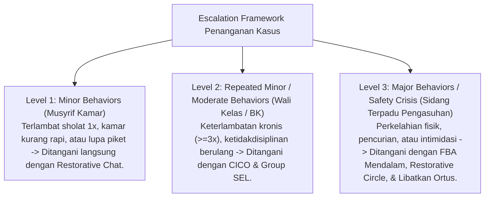

# P6-03: Aturan Keputusan dan Escalation Framework

## Status Dokumen
* **Status**: 🌟 **A+ (Tervalidasi & Siap Diimplementasikan)**
* **Sub-Domain**: `06 Intervention Framework / 03 Decision Rules`
* **Penanggung Jawab Keilmuan**: Dewan Keilmuan TUMBUH (*Pakar Arsitektur PBIS Restoratif & Pakar Bimbingan Konseling*)

---

## 1. Matrix Escalation Framework Penanganan Kasus

---

## 2. Decision Rules untuk Escalation

1. **Rule 3-Strikes Minor**: Apabila sebuah perilaku minor berulang lebih dari 3 kali dalam 2 pekan tanpa perbaikan, kasus secara otomatis di-eskalasi dari Tier 1 ke Tier 2 (Rujukan BK).
2. **Rule Immediate Tier 3**: Pelanggaran keselamatan fisik, kekerasan, atau tindakan asusila langsung di-eskalasi ke Tier 3 tanpa melalui Tier 1 atau Tier 2.
