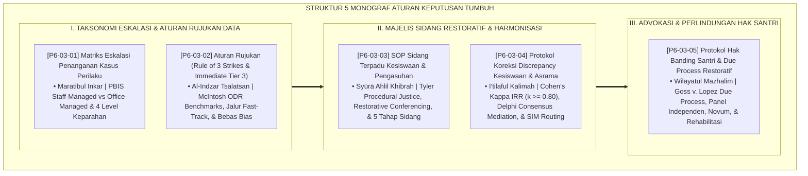

# P6-03: DOKUMEN INDUK ATURAN KEPUTUSAN DAN ESCALATION FRAMEWORK
## *Arsitektur dan Rekayasa Sistem Pengambilan Keputusan Pengasuhan, Matriks Eskalasi Insiden, Algoritma Rujukan Berbasis Data, Majelis Sidang Terpadu, Rekonsiliasi Discrepancy, Serta Protokol Hak Banding Santri (Matriks Eskalasi 4 Level Form MEP, Aturan Rujukan 3-Strikes Form ARU, SOP Sidang Terpadu Restoratif Form STP, Protokol Rekonsiliasi Discrepancy Form PKD, Serta Hak Banding Due Process Form HBS) di Ekosistem TUMBUH Pesantren*

**Nomor Identifikasi**: `P6-03/DOKUMEN-INDUK-ATURAN-KEPUTUSAN-ESKALASI/2026`  
**Domain**: `06 Intervention Framework` > `03 Decision Rules` (Gugus Sub-Domain 03: *Algorithmic Decision Rules, Incident Escalation Framework, Restorative Due Process, & Appellate Governance*)  
**Klasifikasi Naskah**: *Master Architecture & Navigation Monograph* (Dokumen Induk Peta Jalan Riset & Navigasi 5 Monograf Ilmiah Aturan Keputusan dan Kerangka Kerja Eskalasi Kasus)  
**Rumpun Disiplin Pengkaji**: Keadilan Prosedural & Konstitusional Pendidikan (*Procedural & Due Process Justice*), School-Wide PBIS Decision Rules, Fiqh Al-Qadha' wal Mazhalim  

---

> ### 💡 INTISARI EKSEKUTIF (EXECUTIVE SUMMARY)
>
> * **Kedudukan Strategis Gugus Aturan Keputusan dan Eskalasi Kasus:**  
>   Gugus *Decision Rules (Aturan Keputusan dan Escalation Framework)* merupakan sistem kemudi peradilan dan tata kelola disiplin (*The Judicial & Governance Engine of Behavioral Support*) dalam ekosistem TUMBUH. Gugus ini menghapus kesewenang-wenangan keputusan subjektif, mitos ketanpasalahan pengasuh, dan ego sektoral antar-divisi, menggantikannya dengan **Matriks Eskalasi 4 Tingkat Keparahan**, **Algoritma Rujukan Kuantitatif Modified 3-Strikes & Immediate Tier 3 Fast-Track**, **Majelis Sidang Terpadu Restoratif Lintas Komisi**, **Protokol Rekonsiliasi Discrepancy Madrasah-Asrama**, dan **Mahkamah Banding Independen (*Due Process of Law*)**.
> * **Integrasi Holistik Turats & Konsensus Sains Tata Kelola Keputusan:**  
>   Gugus riset ini memadukan khazanah agung Islam tentang penahapan pengingkaran (*Marātibul Inkār*), peringatan tiga kali (*Al-Indzār Tsalātsan*), adab peradilan adil (*Ādābul Qādhī*), penyatuan kata (*I'tilāful Kalimah*), dan mahkamah banding mazhalim (*Wilāyatul Mazhālim*) dengan konsensus sains dunia (*Sugai & Horner PBIS Decision Rules, McIntosh ODR Benchmarks, Tom Tyler Procedural Justice, Cohen's Kappa IRR, dan Goss v. Lopez Due Process*).
> * **Struktur Lengkap 5 Berkas Monograf Riset Ilmiah:**  
>   Dokumen induk ini memetakan dan menghubungkan 5 berkas monograf penelitian akademik komprehensif (~145 KB total riset) yang menyajikan pohon keputusan alur eskalasi, tiket rujukan kuantitatif otomatis, format berita acara sidang terpadu 3R, protokol mediasi Delphi, dan akta rehabilitasi nama baik santri.

---

## 📑 PETA NAVIGASI LIMA MONOGRAF RISET ATURAN KEPUTUSAN

Berikut adalah daftar lengkap 5 monograf riset akademik dalam gugus **`03 Decision Rules`**:

---

## 📚 DESKRIPSI RINGKAS 5 BERKAS MONOGRAF

1. **[P6-03-01: Matriks Eskalasi Penanganan Kasus Perilaku](file:///c:/xampp/htdocs/tumbuh/06%20Intervention%20Framework/03%20Decision%20Rules/P6-03-01-Matriks-Eskalasi-Penanganan-Kasus-Perilaku.md)**  
   *Membahas standarisasi 4 level keparahan pelanggaran, pembagian wewenang Staff-Managed vs Office-Managed, doktrin Maratibul Inkar, dan form Form MEP-Eskalasi.*
2. **[P6-03-02: Aturan Rujukan (Rule of 3 Strikes & Immediate Tier 3)](file:///c:/xampp/htdocs/tumbuh/06%20Intervention%20Framework/03%20Decision%20Rules/P6-03-02-Aturan-Rujukan-Rule-3-Strikes-dan-Immediate-Tier3.md)**  
   *Membahas aturan rujukan berbasis data frekuensi, doktrin Al-Indzar Tsalatsan, Modified 3-Strikes menuju Tier 2 CICO, jalur darurat Immediate Tier 3 Fast-Track, dan form Form ARU-Rujukan.*
3. **[P6-03-03: SOP Sidang Terpadu Kesiswaan dan Pengasuhan](file:///c:/xampp/htdocs/tumbuh/06%20Intervention%20Framework/03%20Decision%20Rules/P6-03-03-SOP-Sidang-Terpadu-Kesiswaan-dan-Pengasuhan.md)**  
   *Membahas standar operasional majelis musyawarah restoratif lintas komisi (Kesiswaan, Asrama, BK, Dokter), doktrin Syura Ahlil Khibrah & Adabul Qadhi, Tom Tyler Procedural Justice, dan berita acara Form STP-Sidang.*
4. **[P6-03-04: Protokol Koreksi Discrepancy Keputusan Kesiswaan dan Asrama](file:///c:/xampp/htdocs/tumbuh/06%20Intervention%20Framework/03%20Decision%20Rules/P6-03-04-Protokol-Koreksi-Discrepancy-Keputusan-Kesiswaan-Asrama.md)**  
   *Membahas harmonisasi dualisme putusan madrasah vs asrama, doktrin I'tilaful Kalimah, Inter-Rater Reliability (Cohen's Kappa k >= 0.80), mediasi Delphi 3 level, dan form Form PKD-Rekonsiliasi.*
5. **[P6-03-05: Protokol Hak Banding Santri dan Due Process Restoratif](file:///c:/xampp/htdocs/tumbuh/06%20Intervention%20Framework/03%20Decision%20Rules/P6-03-05-Protokol-Hak-Banding-Santri-dan-Due-Process-Restoratif.md)**  
   *Membahas mekanisme pengajuan banding santri 7 hari, doktrin Wilayatul Mazhalim salaf, standar Goss v. Lopez Due Process, pengujian bukti baru (Novum), perlindungan anti-retaliasi, dan form Form HBS-Banding.*

---

## 🎯 STANDAR PENJAMINAN MUTU ATURAN KEPUTUSAN

Penerapan gugus **Aturan Keputusan dan Escalation Framework (Decision Rules)** menjamin bahwa:
1. **Keputusan Pembinaan Bebas dari Kesewenang-wenangan dan Emosi (*100% Objective & Data-Driven Decisions*)**: Seluruh rujukan dan sanksi ditegakkan secara proporsional berdasarkan data faktual.
2. **Keadilan Prosedural Dirasakan Nyata oleh Santri dan Orang Tua (*High Procedural Trust*)**: Setiap santri memiliki hak bicara (*Voice*), hak diperlakukan terhormat (*Respect*), dan hak banding independen (*Appellate Guarantee*).
3. **Soliditas Kelembagaan 24 Jam Tanpa Friksi Sektoral (*Harmonious 24-Hour Governance*)**: Madrasah dan asrama melangkah serempak dengan satu bahasa tarbiyah yang kokoh, adil, dan penuh berkah.
