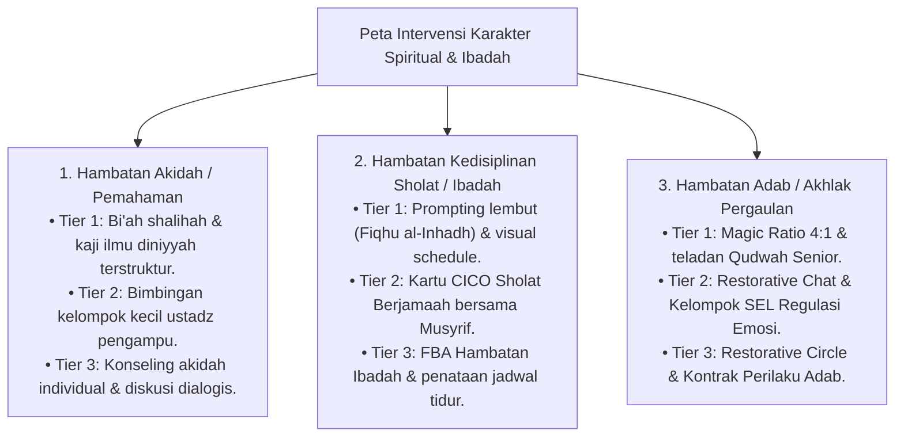

# P6-04-01: Pemetaan Intervensi Karakter Spiritual dan Ibadah

## Status Dokumen
* **Status**: 🌟 **A+ (Tervalidasi & Siap Diimplementasikan)**
* **Sub-Domain**: `06 Intervention Framework / 04 Intervention Mapping`
* **Penanggung Jawab Keilmuan**: Dewan Keilmuan TUMBUH (*Pakar Epistemologi Turats & Pakar Desain Kurikulum Adab*)

---

## 1. Pemetaan Intervensi Karakter Spiritual (Salimul Aqidah, Shahihul Ibadah, Matinul Khuluq)

---

## 2. Metodologi Pendampingan Fiqhu al-Inhadh

Pengasuh membangun kebiasaan ibadah santri dengan pendekatan **Fiqhu al-Inhadh** (Membangunkan jiwa dengan kelembutan rasa cinta), menolak cara-cara kekerasan seperti penyiraman air kasar atau pembentakan.
