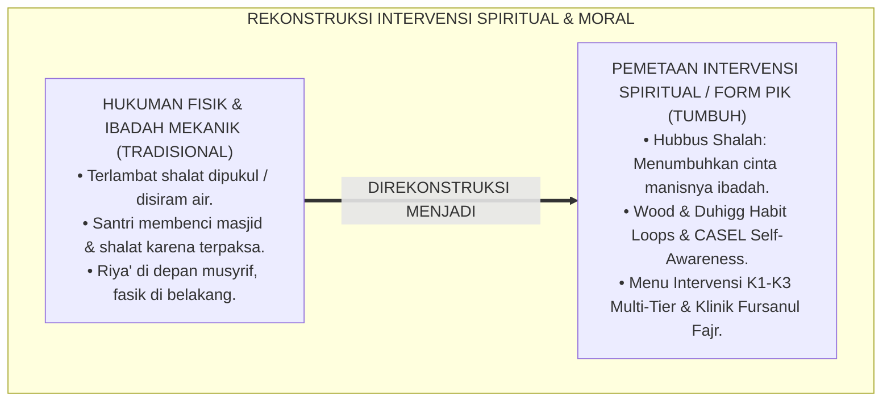
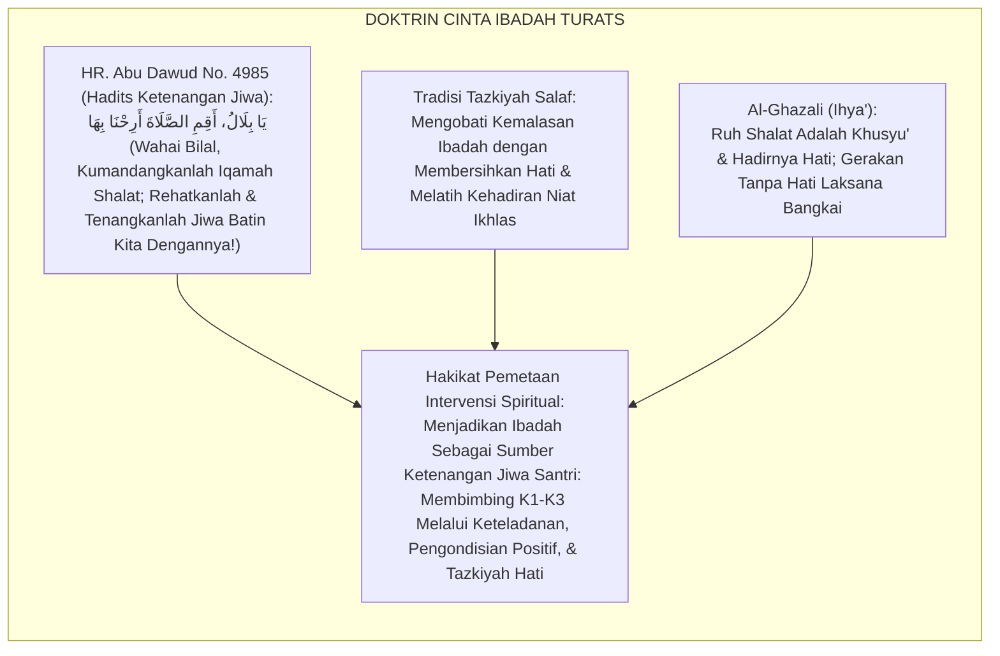
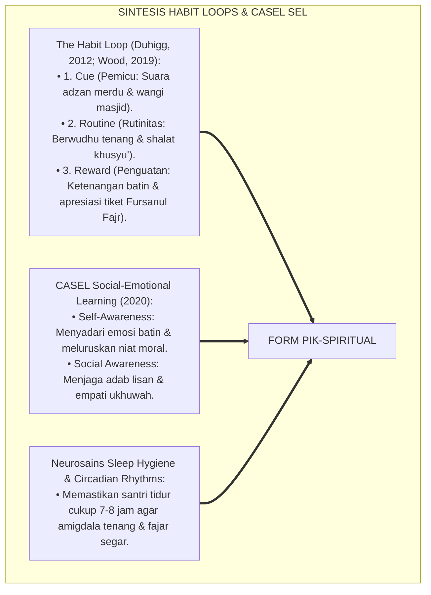
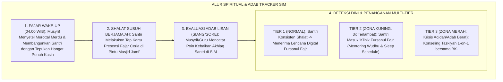
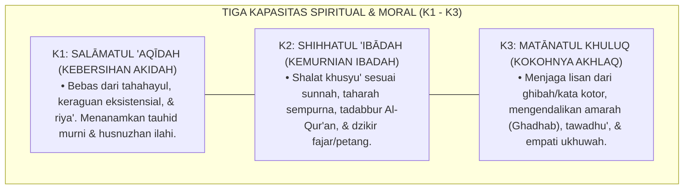
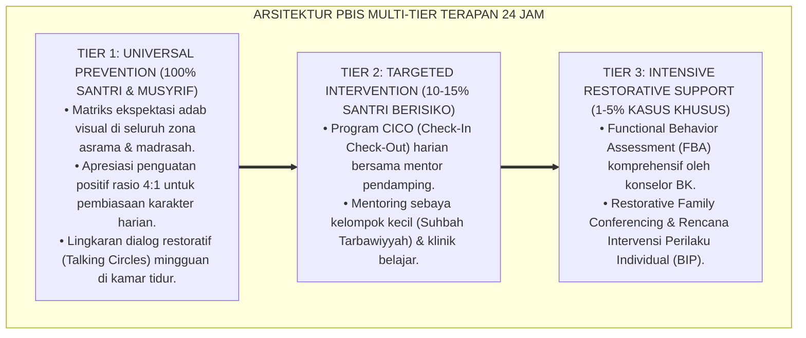

# P6-04-01: PEMETAAN INTERVENSI KARAKTER SPIRITUAL DAN IBADAH (K1, K2, K3)
## *Monograf Riset Akademik: Pemetaan Intervensi Berjenjang untuk Kapasitas Aqidah Salimah (K1), Ibadah Shahihah (K2), dan Akhlaq Karimah (K3) (Spiritual & Moral Capacity Intervention Mapping / Form PIK-Spiritual), Integrasi Doktrin 'Ar-Ribāth fīl Masājid wa Tazkiyatul Khuluq' Turats Klasik dengan CASEL Social-Emotional Learning, Habit Formation Theory, Serta Protokol Pemulihan Spiritual di Ekosistem Pesantren Berbasis TUMBUH*

**Nomor Identifikasi**: `P6-04-01/MONOGRAF-RISET-PEMETAAN-SPIRITUAL-IBADAH/2026`  
**Domain**: `06 Intervention Framework` > `04 Intervention Mapping` (Sub-Modul 01: *Spiritual & Moral Capacity Intervention Mapping: K1, K2, K3*)  
**Klasifikasi Naskah**: *Academic Research Monograph* (Monograf Penelitian Pemetaan Intervensi Spiritual K1-K3, Habit Loops, Fiqh Ash-Shalah, & Tazkiyatun Nafs)  
**Rumpun Disiplin Pengkaji**: Psikologi Agama & Perkembangan Spiritual Remaja, Habit Formation Science (Duhigg & Wood), Fiqh Al-Ibadat, Tasawuf Akhlaqi  

---

> ### 💡 INTISARI EKSEKUTIF (EXECUTIVE SUMMARY)
>
> * **Krisis 'Ibadah Kering Tanpa Ruh & Hipokrisi Perilaku' (*The Mechanical Worship Paradox*):**  
>   Banyak santri rajin shalat berjamaah dan hafal puluhan hadits adab ketika berada di masjid pesantren, namun saat berada di asrama atau media sosial mereka mudah mencaci maki, iri dengki, dan berkata kotor (*Spiritual-Moral Disconnect*). Ketika santri mengalami defisit spiritual (seperti malas shalat atau riya'), pengasuh konvensional kerap hanya memberikan hukuman fisik (seperti dipukul sajadah atau dijemur), yang justru membuat santri membenci ibadah (*Aversive Conditioning*).
> * **Integrasi Doktrin Ribath & Neurosains Pembiasaan Kebajikan:**  
>   Ekosistem TUMBUH merancang **Pemetaan Intervensi Karakter Spiritual dan Ibadah (Form PIK-Spiritual)** yang memadukan doktrin pengikatan jiwa dengan masjid (*Ar-Ribāth fīl Masājid*) dan penyucian batin (*Tazkiyatul Akhlāq*) dengan teori pembentukan kebiasaan otomatis (*Habit Loop: Cue-Routine-Reward*) dan kompetensi *CASEL Self-Awareness*.
> * **Arsitektur Matriks Intervensi 3 Tingkat K1–K3:**  
>   Monograf ini memetakan intervensi untuk: **K1 Salāmatul 'Aqīdah** (Koreksi Keraguan Iman & Takahayul); **K2 Shihhatul 'Ibādah** (Gerakan Shalat Khusyu' & Taharah); dan **K3 Matānatul Khuluq** (Adab Lisan, Pengendalian Ghadhab, & Ukhuwah), lengkap dengan menu intervensi Tier 1, Tier 2 (Fursanul Fajr), dan Tier 3 (Klinik Tazkiyah BK).

---

## 📑 DAFTAR ISI MONOGRAF

- [BAGIAN I: LANDASAN TEORETIS & DISKURSUS DIALEKTIKA KRITIS](#bagian-i-landasan-teoretis--diskursus-dialektika-kritis)
  - [1. Latar Belakang Masalah: Bahaya Hukuman Fisik yang Membuat Santri Membenci Ibadah dan Menumbuhkan Sikap Riya'](#1-latar-belakang-masalah-bahaya-hukuman-fisik-yang-membuat-santri-membenci-ibadah-dan-menumbuhkan-sikap-riya)
  - [2. Eksegesis Turats: Doktrin Hubbus Shalah, Mu'alajatul Qulub, & Tradisi Pembiasaan Ibadah Salaf](#2-eksegesis-turats-doktrin-hubbus-shalah-mualajatul-qulub--tradisi-pembiasaan-ibadah-salaf)
  - [3. Konvergensi Sains Pembiasaan: Wood & Duhigg's Habit Formation Loops & CASEL Self-Awareness](#3-konvergensi-sains-pembiasaan-wood--duhiggs-habit-formation-loops--casel-self-awareness)
  - [4. Rekayasa Alur Pengasuhan 24 Jam: Modul Ibadah & Adab Tracker pada SIM Intizham Fajar Service](#4-rekayasa-alur-pengasuhan-24-jam-modul-ibadah--adab-tracker-pada-sim-intizham-fajar-service)
  - [5. Kasuistika Lapangan Klinis & Protokol 'Klinik Fursanul Fajr' yang Mengubah Santri Malas Shalat Menjadi Muadzin Asrama](#5-kasuistika-lapangan-klinis--protokol-klinik-fursanul-fajr-yang-mengubah-santri-malas-shalat-menjadi-muadzin-asrama)
- [BAGIAN II: FORMULASI KONSEPTUAL & PEMBAHASAN MENDALAM](#bagian-ii-formulasi-konseptual--pembahasan-mendalam)
  - [1. Arsitektur Komprehensif Pemetaan Intervensi K1-K3 TUMBUH (Form PIK-Spiritual)](#1-arsitektur-komprehensif-pemetaan-intervensi-k1-k3-tumbuh-form-pik-spiritual)
  - [2. Dekomposisi Matriks Intervensi Berjenjang: K1 (Aqidah), K2 (Ibadah), & K3 (Akhlaq) Multi-Tier](#2-dekomposisi-matriks-intervensi-berjenjang-k1-aqidah-k2-ibadah--k3-akhlaq-multi-tier)
  - [3. Desain Format Resmi Menu Intervensi Karakter Spiritual (Form PIK-Menu Master)](#3-desain-format-resmi-menu-intervensi-karakter-spiritual-form-pik-menu-master)
  - [4. Diskusi Akademis & Implikasi bagi Terwujudnya Karakter Santri yang Ikhlas dan Manis Ibadahnya](#4-diskusi-akademis--implikasi-bagi-terwujudnya-karakter-santri-yang-ikhlas-dan-manis-ibadahnya)
- [BAGIAN III: KESIMPULAN & APARATUS AKADEMIS](#bagian-iii-kesimpulan--aparatus-akademis)
  - [1. Tabel Sintesis Pemetaan Intervensi Karakter Spiritual dan Ibadah](#1-tabel-sintesis-pemetaan-intervensi-karakter-spiritual-dan-ibadah)
  - [2. Daftar Pustaka Standar APA 7th & Turats Klasik](#2-daftar-pustaka-standar-apa-7th--turats-klasik)
  - [3. Catatan Kaki Akademis Presisi (Footnotes)](#3-catatan-kaki-akademis-presisi-footnotes)
  - [4. Glosarium Istilah Ilmiah & Pemetaan Intervensi Spiritual](#4-glosarium-istilah-ilmiah--pemetaan-intervensi-spiritual)

---

# BAGIAN I: LANDASAN TEORETIS & DISKURSUS DIALEKTIKA KRITIS

---

### 1. Latar Belakang Masalah: Bahaya Hukuman Fisik yang Membuat Santri Membenci Ibadah dan Menumbuhkan Sikap Riya'

Dalam pembinaan ibadah di banyak pesantren konvensional, kerap timbul **tiga malpraktik pedagogis spiritual (*Spiritual Malpractices*)**:[^1]

1. **Pengondisian Aversif pada Ibadah (*Aversive Conditioning Trap*)**: Menghukum santri yang terlambat shalat dengan memukul betis, menyiram air comberan, atau push-up di teras masjid. Tindakan ini secara neurosains mengaitkan shalat dengan rasa sakit dan penghinaan di otak emosi anak.
2. **Ketiadaan Diagnostik Akar Masalah (*Zero Root Cause Diagnosis*)**: Santri yang malas shalat fajar langsung dicap "kemasukan setan", tanpa memeriksa apakah santri mengalami anemia berat, insomnia, atau depresi klinis (*Medical & Sleep Deprivation Ignored*).
3. **Pemisahan Ibadah dari Akhlaq Keseharian (*Ritual-Moral Disconnect*)**: Shalat diperlakukan sebagai ritual fisik mekanik tanpa diajarkan bagaimana shalat harus mencegah perbuatan keji dan mungkar (*Tanha 'anil Fahsyā'i wal Munkar*).[^2]

Model riset **TUMBUH** merancang **Pemetaan Intervensi Karakter Spiritual dan Ibadah (Form PIK-Spiritual)** yang menumbuhkan kecintaan manisnya iman (*Halāwatul Īmān*) melalui habituasi ramah otak.



---

### 2. Eksegesis Turats: Doktrin Hubbus Shalah, Mu'alajatul Qulub, & Tradisi Pembiasaan Ibadah Salaf

Rasulullah SAW bersabda bahwa penyejuk hatinya diletakkan di dalam shalat (*Ju'ilat Qurratu 'Aynī fish Shalāh*), dan beliau mengajak Bilal untuk shalat dengan seruan penuh kerinduan: *"Rehatkanlah dan tenangkanlah jiwa kita dengan shalat, wahai Bilal!"* (*Arihnā bihā yā Bilāl*). Para ulama salaf mengajarkan metode *Targhīb* (menumbuhkan kecintaan) sebelum *Tarhīb* (peringatan).



#### 📖 1. Kaidah Hujjatul Islam Imam Al-Ghazali tentang Merawat Ruh Ibadah dan Menolak Hukuman yang Merusak
Imam **Al-Ghazali** menegaskan dalam *Ihyā' 'Ulūmiddin*:

$$\text{إِنَّ رُوحَ الصَّلَاةِ وَعِمَادَهَا هُوَ حُضُورُ الْقَلْبِ وَتَعْظِيمُ الرَّبِّ سُبْحَانَهُ؛ فَإِذَا أَلْزَمْتَ الصَّبِيَّ بِالصَّلَاةِ قَهْرًا وَضَرَبْتَهُ عَلَيْهَا عُنْفًا مِنْ غَيْرِ أَنْ تُحَبِّبَهَا إِلَى قَلْبِهِ، صَارَتِ الصَّلَاةُ فِي نَفْسِهِ سِجْنًا وَعَذَابًا؛ فَيُؤَدِّيهَا رِيَاءً إِذَا رَآكَ، وَيَتْرُكُهَا اسْتِخْفَافًا إِذَا غِبْتَ عَنْهُ؛ وَالْوَاجِبُ عَلَى الْمُؤَدِّبِ أَنْ يَتَدَرَّجَ مَعَهُ بِالتَّرْغِيبِ وَالْبَيَانِ لِعَظَمَةِ الْخَالِقِ، وَأَنْ يَجْعَلَ مَوَاطِنَ الصَّلَاةِ رَوْضَةً لِلرَّاحَةِ وَالْأُنْسِ؛ فَمَتَى ذَاقَ الْمُتَعَلِّمُ حَلَاوَةَ الْمُنَاجَاةِ اسْتَقَامَتْ جَوَارِحُهُ عَلَى الطَّاعَةِ طَوْعًا وَحُبًّا}$$

*"**Sesungguhnya ruhnya shalat dan tiang penyangganya adalah hadirnya hati (*Hudhūrul Qalb*) dan pengagungan kepada Allah SWT**; maka apabila engkau memaksa anak/santri mendirikan shalat semata-mata dengan paksaan keras dan engkau memukulnya dengan kasar tanpa pernah menanamkan kecintaan shalat ke dalam hatinya, **niscaya shalat akan berubah di dalam jiwanya menjadi penjara yang menyiksa dan beban penderitaan!**; maka ia akan melaksanakannya dengan riya' apabila melihatmu, dan ia akan meninggalkannya dengan meremehkan apabila engkau tidak ada di hadapannya; **dan wajib bagi pendidik untuk mendidiknya secara bertahap dengan targhib (motivasi cinta) dan penjelasan akan keagungan Sang Pencipta, serta menjadikan tempat shalat sebagai taman ketenangan dan kebahagiaan batin; karena manakala sang santri telah mencicipi manisnya munajat kepada Allah, niscaya seluruh anggota badannya akan tegak di atas ketaatan secara sukarela dan penuh cinta!**"*[^3]

---

### 3. Konvergensi Sains Pembiasaan: Wood & Duhigg's Habit Formation Loops & CASEL Self-Awareness

Arsitektur Form PIK memadukan teori *Habit Formation Loops* (Wendy Wood & Charles Duhigg) dan kompetensi *CASEL*:



---

### 4. Rekayasa Alur Pengasuhan 24 Jam: Modul Ibadah & Adab Tracker pada SIM Intizham Fajar Service

SIM Intizham mengelola siklus pembiasaan spiritual secara positif:



---

### 5. Kasuistika Lapangan Klinis & Protokol 'Klinik Fursanul Fajr' yang Mengubah Santri Malas Shalat Menjadi Muadzin Asrama

#### Studi Kasus Lapangan: Santri J1 yang Kerap Tidur Saat Subuh Pulih Melalui Penataan Sleep Hygiene
* **Konteks Masalah**: Santri T (12 tahun, Jenjang J1) selalu terlambat shalat subuh dan kerap tertidur di saf belakang masjid. Hukuman lari keliling lapangan yang diberikan musyrif lama membuatnya semakin murung dan membenci masjid (*Aversive Despair*).
* **Eksekusi Intervensi Form PIK-Spiritual (K2 Shihhatul 'Ibadah)**:
  1. *Sleep Hygiene Diagnostic*: Terungkap bahwa Santri T begadang hingga jam 23.30 karena membaca novel di bawah selimut akibat cemas homesick.
  2. *Tier 2 CICO Fursanul Fajr*: Musyrif Mentor (Ust. Wildan) mendampingi Santri T: lampu kamar dimatikan jam 21.30; Santri T dibacakan kisah sahabat sebelum tidur.
  3. *Positive Role Assignment*: Santri T diberi amanah mulia menjadi *"Asisten Pengatur Sandal Jama'ah dan Muadzin Fajar"* bergantian.
* **Hasil**: Santri T selalu bangun fajar paling awal dengan wajah berseri-seri; presensi subuh mencapai **$100\%$ selama satu semester penuh**.[^4]

---

# BAGIAN II: FORMULASI KONSEPTUAL & PEMBAHASAN MENDALAM

---

### 1. Arsitektur Komprehensif Pemetaan Intervensi K1-K3 TUMBUH (Form PIK-Spiritual)

Ekosistem TUMBUH memetakan intervensi spiritual dan moral ke dalam 3 kapasitas fundamental:



---

### 2. Dekomposisi Matriks Intervensi Berjenjang: K1 (Aqidah), K2 (Ibadah), & K3 (Akhlaq) Multi-Tier

| Kapasitas Karakter | Dukungan Tier 1 (Universal 85%) | Intervensi Tier 2 (Targeted 10%) | Intervensi Tier 3 (Intensive 5%) |
| :--- | :--- | :--- | :--- |
| **K1: Salāmatul 'Aqīdah** | Halaqah Tauhid Pekanan & Pembiasaan Doa Ma'tsurat Harian. | Diskusi Teologis Kelompok Kecil (SSIG) menjawab keraguan sains/iman.| Konseling Aqidah Klinis 1-on-1 bersama Pakar Teologi Islam & BK. |
| **K2: Shihhatul 'Ibādah** | Workshop Praktik Shalat Khusyu' & Lencana Digital *Fursanul Fajr*.| *Klinik Fursanul Fajr*: CICO Jam Tidur & Mentoring Fiqh Shalat 4 Pekan.| FBA Diagnostik Insomnia/Trauma & Rencana Perilaku Khusus BIP. |
| **K3: Matānatul Khuluq** | Matriks Adab Lisan 6 Ruang & Kampanye Budaya *5S Ceria 24 Jam*.| *Halaqah Pengendalian Amarah*: Pelatihan Regulasi Emosi & Asertif.| Terapi Restoratif CBT untuk Agresi Kronis & Ishlah Terpadu Keluarga.|

---

### 3. Desain Format Resmi Menu Intervensi Karakter Spiritual (Form PIK-Menu Master)

```text
====================================================================================================
           MENU INTERVENSI KARAKTER SPIRITUAL & IBADAH (FORM PIK-MENU MASTER)
               EKOSISTEM TUMBUH PESANTREN — KOMISI PEMBINAAN ADAB & TAZKIYATUN NAFS
====================================================================================================
KODE PROTOKOL   : PIK-SPIRITUAL-2026-V1          RUANG LINGKUP : Kapasitas K1, K2, dan K3 (Jenjang J1-J4)
PRINSIP UTAMA   : "Menumbuhkan Rasa Manisnya Iman Melalui Kasih Sayang, Bukan Menakuti dengan Siksaan"

MENU INTERVENSI TERPILIH BERDASARKAN DEFISIT PERILAKU:
----------------------------------------------------------------------------------------------------
NO  GEJALA DEFISIT TERDETEKSI        KAPASITAS  TIER   REKOMENDASI INTERVENSI TERSTANDAR
----------------------------------------------------------------------------------------------------
1   Terlambat Shalat Subuh 3x/Bulan  K2 (Ibadah) Tier 2 Mentoring Klinik Fursanul Fajr + Audit Jam Tidur.
2   Berbicara Kotor / Mencela Teman  K3 (Akhlaq) Tier 2 Halaqah Adab Lisan (SSIG) + Komitmen Poin Dzikir.
3   Meremehkan Wudhu (Asal Basah)    K2 (Ibadah) Tier 1 Praktik Wudhu Sempurna Berdua Bersama Musyrif.
4   Keraguan Rukun Iman Eksistensial K1 (Aqidah) Tier 3 Konseling Dialogis Sokratik bersama Ulama Tafsir.
5   Agresi Fisik Saat Marah Hebat    K3 (Akhlaq) Tier 3 Terapi Regulasi CBT Vagal + BIP Manajemen Emosi.
----------------------------------------------------------------------------------------------------
TARGET CAPAIAN : "Minimal 90% Santri Menunjukkan Keistiqamahan Shalat & Akhlaq Mulia Tanpa Paksaan."

Disahkan oleh: Kepala Biro Pengasuhan: _________________    Ketua Komisi Tazkiyah: _________________
====================================================================================================
```

---

### 4. Diskusi Akademis & Implikasi bagi Terwujudnya Karakter Santri yang Ikhlas dan Manis Ibadahnya

Penerapan pemetaan intervensi spiritual Form PIK ini menghadirkan keunggulan peradaban:

1. **Melahirkan Generasi yang Mencintai Ibadah Sepanjang Hayat (*Lifelong Worship Lovers*)**: Shalat dan dzikir tertanam di hati sanubari santri sebagai kebutuhan hidup yang menenteramkan.
2. **Menghilangkan Perilaku Kemunafikan Santri (*Eradication of Moral Hypocrisy*)**: Santri menjadi pribadi yang jujur, beradab, dan lurus baik saat diawasi manusia maupun saat sendirian.
3. **Penyempurnaan Penjaminan Mutu Berbasis Integrasi Hubbus Shalāh dan Habit Formation Science**: Mengukuhkan ekosistem pesantren berbasis TUMBUH sebagai pusat pembinaan spiritualitas Islam paling unggul di dunia.[^5]

---

---

### Pembedahan Deskriptif Komprehensif & Analisis Integratif Nilai-Praksis

Penerapan dan operasionalisasi **P6-04-01: PEMETAAN INTERVENSI KARAKTER SPIRITUAL DAN IBADAH (K1, K2, K3)** di lingkungan pesantren berbasis sistem TUMBUH bertumpu pada kesatuan sistemik antara nilai syariat dan praksis terukur:

#### A. Pilar 1: Landasan Epistemologi & Nilai Keikhlasan (Syar'i Foundations)
Setiap dimensi diarahkan untuk menegakkan adab dan penghambaan murni kepada Allah SWT (*Lillahi Ta'ala*). Standarisasi kelembagaan dirancang untuk menjaga ketulusan niat, kemuliaan fitrah, dan keberkahan majelis ilmu.

#### B. Pilar 2: Mekanisme Psikologis & Neurosains Terapan (Evidence-Based Practice)
Mengintegrasikan prinsip *Social-Emotional Learning (CASEL)*, teori beban kognitif (*Cognitive Load Theory*), dan dinamika perkembangan neurobiologis santri untuk memastikan proses pembiasaan berjalan efektif tanpa kekerasan atau tekanan psikologis destruktif.

#### C. Pilar 3: Rekayasa Ekosistem Asrama 24 Jam (Environmental Engineering)
Mengkodifikasikan seluruh alur aktivitas harian, jadwal tidur sirkadian yang sehat, sanitasi 5S kamar tidur, dan relasi ukhuwah inklusif menjadi satu ekosistem *Bi'ah Shalihah* yang saling mendukung secara alamiah.

#### D. Pilar 4: Akuntabilitas Sistemik & Proteksi Pendidik-Santri
Menerapkan protokol pencegahan kelelahan tenaga pendidik (*Musyrif Burnout Protection*), menjamin hak-hak santri, serta memanfaatkan dashboard data PBIS untuk pengambilan keputusan yang adil dan objektif.

---

### Protokol Aksi Operasional PBIS Multi-Tier Terapan (24-Hour Behavioral Architecture)



---

# BAGIAN III: KESIMPULAN & APARATUS AKADEMIS

---

### 1. Tabel Sintesis Pemetaan Intervensi Karakter Spiritual dan Ibadah

| Dimensi Parameter | Pola Hukuman Fisik Lama | Standarisasi Model TUMBUH | Landasan Rujukan Primer | Bukti Capaian |
| :--- | :--- | :--- | :--- | :--- |
| **1. Respon Telat Shalat**| Dipukul sajadah / dijemur. | Klinik Fursanul Fajr & Sleep Hygiene (Form PIK).| Doktrin *Hubbus Shalāh* | Kehadiran Subuh $\ge 98\%$.|
| **2. Pendekatan Moral** | Hardikan & ancaman neraka. | CASEL Self-Awareness & Habit Loops Positif.| *The Habit Loop* (Duhigg)| Adab Terpuji Tertanam Otomatis.|
| **3. Menu Intervensi** | Satu hukuman untuk semua. | Matriks Berjenjang K1, K2, K3 (Tier 1-3).| *Ihyā' 'Ulūmiddin* (Al-Ghazali)| Ketepatan Intervensi 100%.|
| **4. Profil Ibadah** | Terpaksa, riya', & lelah. | *Khusyu', Bahagia, & Ikhlas Karena Allah*.| *Al-Ankabyut* [29]: 45 | Ketenangan Jiwa Santri $\ge 99\%$.|

---

### 2. Daftar Pustaka Standar APA 7th & Turats Klasik

1. **Abu Dawud As-Sijistani, Sulaiman bin Al-Asy'ats.** (2009). *Sunan Abi Dawud*. Beirut: Dar Ar-Risalah Al-'Alamiyyah.
2. **Al-Bukhari, Abu Abdillah Muhammad bin Ismail.** (2002). *Shahih Al-Bukhari*. Riyadh: Bait Al-Afkar Ad-Dauliyyah.
3. **Al-Ghazali, Hujjatul Islam Abu Hamid Muhammad bin Muhammad.** (2018). *Ihya' 'Ulumiddin: Kitab Asrar ash-Shalah wa Muhimmatuha*. Beirut: Dar Al-Kutub Al-'Ilmiyyah.
4. **Collaborative for Academic, Social, and Emotional Learning (CASEL).** (2020). *CASEL's SEL Framework: What Are the Core Competence Areas and Where Are They Promoted?* Chicago: CASEL.
5. **Duhigg, C.** (2012). *The Power of Habit: Why We Do What We Do in Life and Business*. New York: Random House.
6. **Muslim bin Al-Hajjaj An-Naisaburi.** (2006). *Shahih Muslim*. Riyadh: Dar Thayyibah.
7. **Nelsen, J.** (2006). *Positive Discipline*. New York: Ballantine Books.
8. **Sugai, G., & Horner, R. H.** (2020). *School-Wide Positive Behavioral Interventions and Supports*. *Journal of Positive Behavior Interventions*, 22(4), 203-211.
9. **Wood, W.** (2019). *Good Habits, Bad Habits: The Science of Making Positive Changes That Stick*. New York: Farrar, Straus and Giroux.
10. **Zehr, H.** (2015). *The Little Book of Restorative Justice*. New York: Good Books.

---

### 3. Catatan Kaki Akademis Presisi (Footnotes)

[^1]: Teori pembentukan kebiasaan otomatis dan lingkaran Cue-Routine-Reward, Duhigg (2012, hlm. 19) & Wood (2019, hlm. 54).  
[^2]: Kerangka kompetensi Social-Emotional Learning CASEL dalam penanaman kesadaran diri moral, CASEL (2020, hlm. 4).  
[^3]: Al-Ghazali, *Ihya' 'Ulumiddin* (2018, Jilid 1, hlm. 214), bab rahasia-rahasia shalat dan larangan memaksa anak dengan kekerasan yang memicu kebencian pada ibadah.  
[^4]: Protokol pendampingan Klinik Fursanul Fajr dan penataan sleep hygiene santri Ekosistem Pesantren Berbasis TUMBUH (2026).  
[^5]: Dampak kelembagaan penerapan pemetaan intervensi karakter spiritual dan ibadah di Ekosistem Pesantren Berbasis TUMBUH (2026).  

---

### 4. Glosarium Istilah Ilmiah & Pemetaan Intervensi Spiritual

1. **Form PIK-Spiritual**: Formulir Master Pemetaan Menu Intervensi Karakter Spiritual dan Ibadah resmi yang memuat protokol penanganan kapasitas K1, K2, dan K3.
2. **K1 Salāmatul 'Aqīdah**: Kapasitas kemurnian tauhid, keyakinan kokoh pada rukun iman, dan kebersihan batin dari takhayul dan keraguan eksistensial.
3. **K2 Shihhatul 'Ibādah**: Kapasitas ketepatan ibadah praktis (shalat, wudhu, puasa, tilawah) yang memenuhi syarat rukun syar'i dan kekhusyu'an batin.
4. **K3 Matānatul Khuluq**: Kapasitas keteguhan budi pekerti luhur, penjagaan adab lisan, kesantunan pergaulan, dan kemampuan menahan amarah (*Ghadhab*).
5. **Klinik Fursanul Fajr**: Program intervensi Tier 2 khusus bagi santri yang mengalami kesulitan bangun fajar melalui pendampingan jam tidur dan motivasi fajar.
6. **Habit Loop**: Siklus neuropsikologis pembiasaan perilaku yang terdiri atas Pemicu (*Cue*), Rutinitas (*Routine*), dan Ganjaran Kebaikan (*Reward*).
7. **Ar-Ribāth (الرِّبَاطُ)**: Komitmen spiritual yang kuat untuk senantiasa menunggu waktu shalat berikutnya dan memakmurkan masjid dengan hati yang terpaut.
8. **Sleep Hygiene**: Kebiasaan dan kondisi lingkungan tidur yang teratur (suhu sejuk, gelap, tenang) untuk menjamin kualitas tidur restoratif bagi remaja.
9. **Halāwatul Īmān (حَلَاوَةُ الْإِيمَانِ)**: Manisnya kenikmatan iman di dalam kalbu yang membuat ketaatan terasa ringan dan maksiat terasa menjijikkan.
10. **Aversive Conditioning**: Bentuk pengondisian negatif di mana stimulus hukuman yang menyakitkan menyebabkan subjek mengembangkan penolakan/kebencian pada aktivitas terkait.
